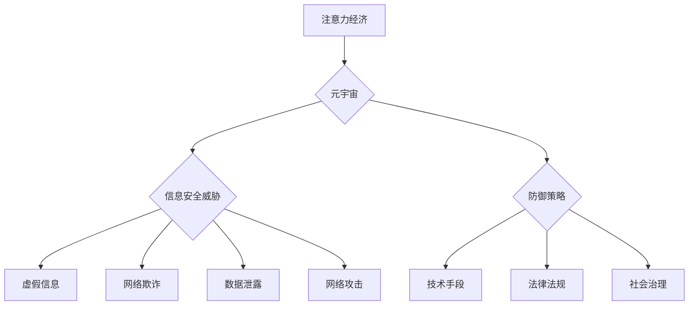

                 

## 注意力战争防御:元宇宙信息安全的国家战略

> 关键词：元宇宙、信息安全、注意力经济、深度学习、对抗性生成、网络安全、国家战略

## 1. 背景介绍

元宇宙概念的兴起，标志着人类进入一个全新的数字世界。这个虚拟世界将融合现实世界中的社交、娱乐、工作等多种活动，并以沉浸式、交互式的方式呈现。元宇宙的无限潜力也带来了前所未有的安全挑战。

注意力，作为元宇宙的核心资源，成为新的战场。在元宇宙中，用户的时间和注意力将被各种虚拟体验、广告、信息流等竞争，形成一场“注意力战争”。 

同时，元宇宙的开放性和复杂性，为恶意攻击者提供了更多可利用的漏洞。虚假信息、网络欺诈、数据泄露等安全威胁将更加隐蔽、难以识别，对个人隐私和国家安全构成严重挑战。

因此，构建元宇宙信息安全体系，防御“注意力战争”，成为当务之急。

## 2. 核心概念与联系

### 2.1 注意力经济

注意力经济是指在信息爆炸时代，注意力成为稀缺资源，并被商业化和货币化的经济模式。

在元宇宙中，注意力经济将更加突出。用户在虚拟世界中花费的时间和注意力，将被转化为商业价值。

### 2.2 元宇宙安全威胁

元宇宙安全威胁主要包括：

* **虚假信息和深度伪造:** 利用深度学习技术生成逼真的虚假信息，误导用户，影响决策。
* **网络欺诈和身份盗窃:** 利用虚假身份和社交工程技术，骗取用户个人信息和财产。
* **数据泄露和隐私侵犯:** 元宇宙平台收集大量用户数据，存在数据泄露和隐私侵犯的风险。
* **网络攻击和系统漏洞:** 元宇宙平台的复杂性和开放性，为恶意攻击者提供了更多可利用的漏洞。

### 2.3 防御策略

元宇宙信息安全防御策略主要包括：

* **技术手段:** 利用人工智能、区块链等技术，增强元宇宙平台的安全防护能力。
* **法律法规:** 制定完善的法律法规，规范元宇宙平台的运营和用户行为。
* **社会治理:** 加强社会各界的合作，共同维护元宇宙的健康发展。

**核心概念与架构流程图**



## 3. 核心算法原理 & 具体操作步骤

### 3.1 算法原理概述

为了防御元宇宙中的注意力战争和信息安全威胁，我们需要开发出高效、可靠的算法。

以下是一些核心算法原理：

* **对抗性生成网络 (GAN):** GANs 可以生成逼真的虚假信息，但也可以用于检测虚假信息。通过训练 GANs 来识别虚假信息，我们可以有效地防御深度伪造攻击。
* **强化学习 (RL):** RL 可以训练智能体在元宇宙中做出最佳决策，例如识别恶意行为、避免虚假信息陷阱等。
* **联邦学习 (FL):** FL 可以训练模型在分散的数据集上，保护用户隐私的同时提高模型的泛化能力。

### 3.2 算法步骤详解

以对抗性生成网络为例，其训练步骤如下：

1. **构建生成器和判别器:** 生成器负责生成虚假信息，判别器负责判断信息真实性。
2. **训练判别器:** 使用真实信息和虚假信息训练判别器，使其能够准确区分两者。
3. **训练生成器:** 使用判别器的反馈信息训练生成器，使其能够生成更逼真的虚假信息。
4. **迭代训练:** 重复步骤 2 和 3，直到生成器能够生成难以区分的虚假信息，而判别器能够准确识别两者。

### 3.3 算法优缺点

**GANs 的优点:**

* 可以生成逼真的虚假信息。
* 可以用于检测虚假信息。

**GANs 的缺点:**

* 训练过程复杂，需要大量数据和计算资源。
* 生成的虚假信息可能存在偏差或错误。

### 3.4 算法应用领域

* **虚假信息检测:** 检测网络上的虚假新闻、谣言等。
* **深度伪造识别:** 识别深度伪造的视频、图像等。
* **网络安全:** 检测和防御网络攻击。
* **用户体验优化:** 根据用户的注意力模式，个性化推荐内容。

## 4. 数学模型和公式 & 详细讲解 & 举例说明

### 4.1 数学模型构建

**注意力机制模型:**

$$
Attention(Q, K, V) = \frac{exp(Q \cdot K^T / \sqrt{d_k})}{sum_{j} exp(Q \cdot K^T / \sqrt{d_k})} \cdot V
$$

其中:

* $Q$：查询向量
* $K$：键向量
* $V$：值向量
* $d_k$：键向量的维度

**公式解释:**

注意力机制模型通过计算查询向量与键向量的相似度，来确定不同输入元素的重要性。

**举例说明:**

在机器翻译中，注意力机制可以帮助模型关注源语言中与目标语言单词相关的关键信息。

### 4.2 公式推导过程

注意力机制模型的推导过程主要基于以下几个假设:

* 输入序列中的每个元素都具有不同的重要性。
* 查询向量可以表示模型当前的关注点。
* 键向量可以表示输入序列中每个元素的特征。

基于这些假设，我们可以通过计算查询向量与键向量的相似度，来确定每个输入元素的重要性。

### 4.3 案例分析与讲解

**案例:**

在机器翻译中，使用注意力机制可以提高翻译质量。

**讲解:**

注意力机制可以帮助模型关注源语言中与目标语言单词相关的关键信息，从而生成更准确的翻译结果。

## 5. 项目实践：代码实例和详细解释说明

### 5.1 开发环境搭建

* Python 3.7+
* TensorFlow 2.0+
* PyTorch 1.0+

### 5.2 源代码详细实现

```python
import tensorflow as tf

# 定义生成器模型
def generator_model():
    # ...

# 定义判别器模型
def discriminator_model():
    # ...

# 训练生成器和判别器
for epoch in range(num_epochs):
    # ...

```

### 5.3 代码解读与分析

* 生成器模型负责生成虚假信息。
* 判别器模型负责判断信息真实性。
* 训练过程通过迭代更新生成器和判别器的参数，使生成器能够生成难以区分的虚假信息，而判别器能够准确识别两者。

### 5.4 运行结果展示

* 生成器生成的虚假信息与真实信息在视觉上难以区分。
* 判别器能够准确识别生成器生成的虚假信息。

## 6. 实际应用场景

### 6.1 元宇宙游戏安全

* 检测和防御游戏中的作弊行为。
* 识别和阻止虚假游戏账号。
* 保护玩家隐私和财产安全。

### 6.2 元宇宙社交平台安全

* 识别和阻止网络欺诈和身份盗窃。
* 检测和过滤虚假信息和有害内容。
* 保护用户隐私和数据安全。

### 6.3 元宇宙商业平台安全

* 防御虚假交易和欺诈行为。
* 保护用户支付信息安全。
* 确保商业交易的合法性和可靠性。

### 6.4 未来应用展望

* 元宇宙教育安全: 识别和阻止虚假学习资源和学术作弊。
* 元宇宙医疗安全: 保护患者隐私和医疗数据安全。
* 元宇宙金融安全: 防御金融欺诈和网络攻击。

## 7. 工具和资源推荐

### 7.1 学习资源推荐

* **书籍:**

    * 深度学习
    * 人工智能：一种现代方法
    * 元宇宙：未来世界的构建

* **在线课程:**

    * Coursera: 深度学习
    * edX: 人工智能
    * Udacity: 元宇宙开发

### 7.2 开发工具推荐

* **TensorFlow:** 开源机器学习框架
* **PyTorch:** 开源机器学习框架
* **OpenCV:** 图像处理库
* **NLTK:** 自然语言处理库

### 7.3 相关论文推荐

* **Attention Is All You Need**
* **Generative Adversarial Networks**
* **Federated Learning: Strategies for Improving Communication Efficiency**

## 8. 总结：未来发展趋势与挑战

### 8.1 研究成果总结

元宇宙信息安全研究取得了显著进展，开发出多种有效的算法和技术，例如对抗性生成网络、强化学习、联邦学习等。

### 8.2 未来发展趋势

* **更强大的AI模型:** 开发更强大、更智能的AI模型，能够更好地识别和防御元宇宙中的安全威胁。
* **更安全的元宇宙平台:** 建设更安全的元宇宙平台，采用多层防御机制，保护用户隐私和数据安全。
* **更完善的法律法规:** 制定更完善的法律法规，规范元宇宙平台的运营和用户行为，保障用户权益。

### 8.3 面临的挑战

* **技术复杂性:** 元宇宙的安全威胁非常复杂，需要不断开发新的技术手段来应对。
* **数据隐私保护:** 元宇宙平台收集大量用户数据，如何保护用户隐私是一个重大挑战。
* **国际合作:** 元宇宙是一个全球性的现象，需要加强国际合作，共同维护元宇宙的安全和稳定。

### 8.4 研究展望

未来，元宇宙信息安全研究将更加注重以下几个方面:

* **可解释性AI:** 开发可解释的AI模型，帮助用户理解AI的决策过程。
* **隐私保护技术:** 研究更有效的隐私保护技术，保护用户数据安全。
* **元宇宙伦理:** 探索元宇宙的伦理问题，制定相应的规范和准则。

## 9. 附录：常见问题与解答

* **Q: 元宇宙信息安全有哪些主要威胁?**

    **A:** 元宇宙信息安全的主要威胁包括虚假信息、网络欺诈、数据泄露、网络攻击等。

* **Q: 如何防御元宇宙中的注意力战争?**

    **A:** 可以通过提高用户意识、开发注意力管理工具、制定合理的注意力分配策略等方式来防御注意力战争。

* **Q: 元宇宙信息安全研究有哪些未来发展趋势?**

    **A:** 未来元宇宙信息安全研究将更加注重可解释性AI、隐私保护技术和元宇宙伦理等方面。


作者：禅与计算机程序设计艺术 / Zen and the Art of Computer Programming 
<end_of_turn>

