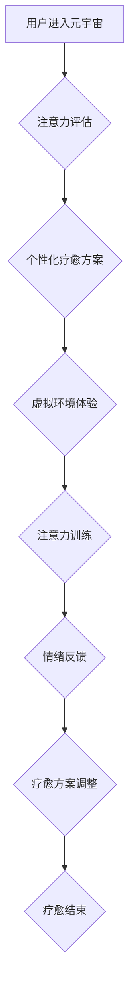

                 

## 注意力疗愈师认证:元宇宙心理健康服务的职业标准

> 关键词：元宇宙、心理健康、注意力疗愈、人工智能、虚拟现实、职业标准、认证体系

## 1. 背景介绍

随着科技的飞速发展，元宇宙概念逐渐从科幻小说走向现实。元宇宙，一个融合虚拟现实、增强现实和互联网的沉浸式数字世界，为人们提供了全新的交互体验和生活方式。然而，元宇宙的虚拟环境也可能带来新的挑战，例如社交压力、信息过载、虚拟现实依赖等，对人们的心理健康产生潜在影响。

心理健康问题在现实世界中已经十分普遍，而元宇宙的出现可能会加剧这些问题，也可能带来新的心理健康挑战。因此，在元宇宙蓬勃发展的同时，关注元宇宙对心理健康的潜在影响，并探索相应的解决方案，显得尤为重要。

注意力疗愈师作为一种新型的专业人才，在元宇宙中扮演着重要的角色。他们通过运用心理学、人工智能和虚拟现实技术，帮助用户在元宇宙环境中提升注意力、缓解压力、改善情绪，从而促进心理健康。

## 2. 核心概念与联系

### 2.1 元宇宙与心理健康

元宇宙是一个虚拟世界，用户可以通过虚拟身份在其中进行社交、娱乐、学习等活动。虽然元宇宙为人们提供了许多新的可能性，但也可能带来一些心理健康问题。

* **社交压力:** 元宇宙中的虚拟社交可能会加剧现实世界中的社交压力，例如用户需要维护虚拟形象、担心被他人评判等。
* **信息过载:** 元宇宙中信息量巨大，用户可能会感到信息过载，难以集中注意力，从而影响心理健康。
* **虚拟现实依赖:** 长时间沉浸在虚拟世界中可能会导致用户对现实世界的依赖减少，从而影响现实生活中的社交和工作。

### 2.2 注意力疗愈

注意力疗愈是一种通过训练和引导用户集中注意力，从而改善心理健康状态的方法。注意力疗愈师通过运用心理学知识和技巧，帮助用户识别和应对注意力分散的因素，提高注意力集中能力，从而缓解压力、焦虑、抑郁等心理问题。

### 2.3 元宇宙注意力疗愈

元宇宙注意力疗愈是指利用元宇宙的沉浸式体验和互动性，结合注意力疗愈的原理和方法，帮助用户在虚拟环境中提升注意力、缓解压力、改善情绪。

**元宇宙注意力疗愈流程图:**



## 3. 核心算法原理 & 具体操作步骤

### 3.1 算法原理概述

元宇宙注意力疗愈的核心算法原理基于以下几个方面：

* **注意力机制:** 借鉴深度学习中的注意力机制，识别用户在虚拟环境中的注意力焦点，并根据用户注意力分布动态调整虚拟环境内容和交互方式。
* **生物反馈技术:** 利用生物反馈技术，例如心率、脑电波等，监测用户的情绪和注意力状态，并根据反馈信息调整疗愈方案。
* **虚拟现实交互:** 利用虚拟现实技术，创造沉浸式的虚拟环境，引导用户进行注意力训练和情绪调节。

### 3.2 算法步骤详解

1. **用户注意力评估:** 利用眼动追踪、脑电波等技术，评估用户的注意力水平和注意力分布情况。
2. **个性化疗愈方案设计:** 根据用户的注意力评估结果，设计个性化的注意力疗愈方案，包括虚拟环境场景、交互任务、疗愈时长等。
3. **虚拟环境体验:** 用户进入虚拟环境，进行注意力训练和情绪调节。
4. **注意力训练:** 通过虚拟环境中的游戏、互动任务等，引导用户集中注意力，提高注意力集中能力。
5. **情绪反馈:** 利用生物反馈技术，监测用户的的情绪状态，并根据反馈信息调整虚拟环境内容和交互方式。
6. **疗愈方案调整:** 根据用户的注意力训练和情绪反馈情况，动态调整疗愈方案，确保疗愈效果。

### 3.3 算法优缺点

**优点:**

* **沉浸式体验:** 元宇宙的虚拟环境可以提供沉浸式的体验，提高用户参与度和疗愈效果。
* **个性化定制:** 算法可以根据用户的注意力评估结果和情绪反馈情况，个性化定制疗愈方案。
* **数据驱动:** 算法可以利用用户数据进行分析和优化，不断提升疗愈效果。

**缺点:**

* **技术复杂:** 元宇宙注意力疗愈算法的开发和应用需要复杂的技术支持。
* **数据隐私:** 用户数据收集和使用需要严格保护用户隐私。
* **伦理问题:** 元宇宙注意力疗愈的应用可能带来一些伦理问题，例如虚拟现实依赖、数据操控等。

### 3.4 算法应用领域

元宇宙注意力疗愈算法可以应用于以下领域:

* **心理健康治疗:** 帮助用户缓解压力、焦虑、抑郁等心理问题。
* **教育培训:** 提高学生的注意力集中能力和学习效率。
* **企业管理:** 帮助员工提升工作效率和专注力。
* **个人成长:** 帮助用户提升自我认知、情绪管理和注意力控制能力。

## 4. 数学模型和公式 & 详细讲解 & 举例说明

### 4.1 数学模型构建

元宇宙注意力疗愈算法的数学模型可以基于以下几个方面构建:

* **注意力分布模型:** 利用概率论和统计学，构建用户注意力分布模型，描述用户在虚拟环境中的注意力焦点。
* **情绪调节模型:** 利用心理学和神经科学，构建用户情绪调节模型，描述用户在虚拟环境中的情绪变化规律。
* **虚拟环境交互模型:** 利用人工智能和机器学习，构建虚拟环境与用户交互模型，根据用户注意力和情绪状态动态调整虚拟环境内容和交互方式。

### 4.2 公式推导过程

例如，可以利用贝叶斯定理推导用户注意力分布模型:

$$P(A_i|D) = \frac{P(D|A_i)P(A_i)}{P(D)}$$

其中:

* $P(A_i|D)$: 用户在虚拟环境中关注第 $i$ 个元素的概率，给定用户观察到的数据 $D$。
* $P(D|A_i)$: 给定用户关注第 $i$ 个元素，观察到数据 $D$ 的概率。
* $P(A_i)$: 用户关注第 $i$ 个元素的先验概率。
* $P(D)$: 观察到数据 $D$ 的概率。

### 4.3 案例分析与讲解

例如，假设用户在虚拟环境中观察到一个红色球，我们可以利用贝叶斯定理推导用户关注红色球的概率。如果用户之前对红色球有较高的关注度，那么 $P(A_i)$ 会较高，从而导致 $P(A_i|D)$ 也较高。

## 5. 项目实践：代码实例和详细解释说明

### 5.1 开发环境搭建

元宇宙注意力疗愈项目可以使用以下开发环境搭建:

* **操作系统:** Windows、macOS、Linux
* **编程语言:** Python、C++、Java
* **虚拟现实平台:** Unity、Unreal Engine
* **人工智能库:** TensorFlow、PyTorch
* **生物反馈设备:** EEG头戴式设备、心率监测器

### 5.2 源代码详细实现

以下是一个简单的Python代码示例，用于模拟用户注意力分布模型:

```python
import numpy as np

# 定义用户注意力分布模型
def attention_distribution(user_data):
  # 根据用户数据计算注意力分布
  # ...
  return attention_probs

# 示例用法
user_data = np.array([1, 2, 3, 4, 5])
attention_probs = attention_distribution(user_data)
print(attention_probs)
```

### 5.3 代码解读与分析

该代码示例定义了一个 `attention_distribution` 函数，用于根据用户数据计算注意力分布。具体实现细节需要根据实际应用场景进行调整。

### 5.4 运行结果展示

运行该代码示例后，会输出一个注意力分布向量，表示用户在不同元素上的注意力分配情况。

## 6. 实际应用场景

元宇宙注意力疗愈技术可以应用于以下实际场景:

* **虚拟现实心理治疗:** 利用虚拟现实技术，创造沉浸式的治疗环境，帮助用户克服恐惧、焦虑等心理问题。
* **注意力训练游戏:** 开发基于元宇宙的注意力训练游戏，通过游戏化方式提高用户的注意力集中能力。
* **元宇宙社交平台:** 在元宇宙社交平台中，提供注意力疗愈功能，帮助用户缓解社交压力和信息过载。

### 6.4 未来应用展望

未来，元宇宙注意力疗愈技术将朝着以下方向发展:

* **更精准的个性化疗愈:** 利用人工智能和机器学习技术，更加精准地分析用户的注意力和情绪状态，定制个性化的疗愈方案。
* **更沉浸式的虚拟体验:** 利用更先进的虚拟现实技术，创造更加逼真、沉浸式的虚拟环境，提升用户的疗愈体验。
* **更广泛的应用场景:** 元宇宙注意力疗愈技术将应用于更多领域，例如教育、企业管理、个人成长等。

## 7. 工具和资源推荐

### 7.1 学习资源推荐

* **书籍:** 《元宇宙：下一代互联网》
* **在线课程:** Coursera、edX上的元宇宙相关课程
* **技术博客:** 关注元宇宙技术领域的博客和论坛

### 7.2 开发工具推荐

* **虚拟现实平台:** Unity、Unreal Engine
* **人工智能库:** TensorFlow、PyTorch
* **生物反馈设备:** EEG头戴式设备、心率监测器

### 7.3 相关论文推荐

* **元宇宙与心理健康:** 《元宇宙与心理健康：机遇与挑战》
* **注意力疗愈:** 《注意力疗愈：原理、方法和应用》

## 8. 总结：未来发展趋势与挑战

### 8.1 研究成果总结

元宇宙注意力疗愈技术是一个新兴的领域，近年来取得了显著的进展。研究人员已经开发出一些基于元宇宙的注意力疗愈算法和应用场景，并取得了初步的疗效。

### 8.2 未来发展趋势

未来，元宇宙注意力疗愈技术将朝着以下方向发展:

* **更精准的个性化疗愈:** 利用人工智能和机器学习技术，更加精准地分析用户的注意力和情绪状态，定制个性化的疗愈方案。
* **更沉浸式的虚拟体验:** 利用更先进的虚拟现实技术，创造更加逼真、沉浸式的虚拟环境，提升用户的疗愈体验。
* **更广泛的应用场景:** 元宇宙注意力疗愈技术将应用于更多领域，例如教育、企业管理、个人成长等。

### 8.3 面临的挑战

元宇宙注意力疗愈技术也面临着一些挑战:

* **技术复杂性:** 元宇宙注意力疗愈算法的开发和应用需要复杂的技术支持。
* **数据隐私:** 用户数据收集和使用需要严格保护用户隐私。
* **伦理问题:** 元宇宙注意力疗愈的应用可能带来一些伦理问题，例如虚拟现实依赖、数据操控等。

### 8.4 研究展望

未来，需要进一步研究元宇宙注意力疗愈技术的有效性、安全性、伦理问题等方面，并制定相应的规范和标准，确保元宇宙注意力疗愈技术能够安全、有效地应用于现实生活。

## 9. 附录：常见问题与解答

**常见问题:**

* 元宇宙注意力疗愈技术真的有效吗?
* 元宇宙注意力疗愈技术有哪些风险?
* 如何选择合适的元宇宙注意力疗愈服务?

**解答:**

* 元宇宙注意力疗愈技术的有效性需要通过进一步的研究和实践来验证。
* 元宇宙注意力疗愈技术可能存在一些风险，例如虚拟现实依赖、数据隐私泄露等。
* 选择元宇宙注意力疗愈服务时，需要考虑服务提供商的资质、技术水平、服务内容等因素。


作者：禅与计算机程序设计艺术 / Zen and the Art of Computer Programming 
<end_of_turn>

