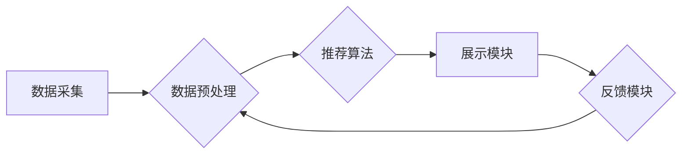

                 

##  注意力经济与 个性化推荐系统：为受众提供定制、有针对性的内容和体验

> 关键词：注意力经济、个性化推荐、推荐算法、深度学习、用户行为分析、内容过滤、协同过滤、矩阵分解、神经网络

### 1. 背景介绍

在当今信息爆炸的时代，人们每天面临着海量的信息涌入。如何有效地筛选和获取所需信息成为了一个巨大的挑战。注意力经济的概念应运而生，它强调了信息获取和处理的有限性，以及人们对信息的“注意力”资源的稀缺性。在这种背景下，个性化推荐系统应运而生，旨在根据用户的兴趣、偏好和行为，为其提供定制化的内容和体验，帮助用户有效地过滤信息噪音，找到真正感兴趣的内容。

个性化推荐系统已经广泛应用于各个领域，例如电商、社交媒体、视频平台、音乐流媒体等。它可以帮助用户发现新产品、新内容、新朋友，提高用户体验，并为平台带来更高的用户粘性和商业价值。

### 2. 核心概念与联系

#### 2.1 注意力经济

注意力经济是指在信息过载的时代，人们对信息的“注意力”资源是有限的，而获取和处理信息的成本越来越高。因此，如何有效地吸引和利用用户的注意力成为了一个重要的商业和社会问题。

#### 2.2 个性化推荐

个性化推荐是指根据用户的个人特征、行为模式和偏好，为其提供定制化的内容和服务。它旨在提高用户体验，帮助用户发现感兴趣的内容，并增强用户与平台的粘性。

#### 2.3 推荐系统架构

推荐系统通常由以下几个主要模块组成：

* **数据采集模块:** 收集用户行为数据、商品信息、内容标签等数据。
* **数据预处理模块:** 对收集到的数据进行清洗、转换、特征提取等处理，使其能够被推荐算法使用。
* **推荐算法模块:** 根据用户数据和商品信息，预测用户对商品的兴趣，并生成推荐列表。
* **展示模块:** 将推荐结果以用户友好的方式展示给用户。
* **反馈模块:** 收集用户对推荐结果的反馈，并将其用于算法的优化和改进。

**Mermaid 流程图**



### 3. 核心算法原理 & 具体操作步骤

#### 3.1 算法原理概述

个性化推荐系统常用的算法主要分为两大类：

* **内容过滤:** 基于用户对内容的喜好进行推荐。
* **协同过滤:** 基于用户之间的相似性进行推荐。

**内容过滤**算法根据用户的历史行为数据，例如用户喜欢的商品、浏览过的页面、评分过的内容等，分析这些内容的特征，并推荐与用户喜好相似的其他内容。

**协同过滤**算法根据用户的行为相似性进行推荐。它假设，如果用户A喜欢与用户B喜欢的商品相似，那么用户A也可能喜欢用户B喜欢的其他商品。

#### 3.2 算法步骤详解

**内容过滤算法步骤:**

1. **数据收集:** 收集用户对内容的评分、浏览记录、购买记录等数据。
2. **特征提取:** 从内容中提取特征，例如商品类别、作者、关键词、主题等。
3. **用户-内容矩阵构建:** 将用户和内容映射到一个矩阵中，其中每个元素表示用户对内容的评分或交互行为。
4. **相似性计算:** 计算用户之间或内容之间的相似性，例如余弦相似度、皮尔逊相关系数等。
5. **推荐生成:** 根据用户与内容的相似性，推荐用户可能感兴趣的内容。

**协同过滤算法步骤:**

1. **数据收集:** 收集用户对内容的评分、购买记录、浏览记录等数据。
2. **用户-用户矩阵构建:** 将用户映射到一个矩阵中，其中每个元素表示用户对其他用户的评分或交互行为。
3. **相似性计算:** 计算用户之间的相似性，例如余弦相似度、皮尔逊相关系数等。
4. **推荐生成:** 根据用户之间的相似性，推荐用户可能感兴趣的内容。

#### 3.3 算法优缺点

**内容过滤算法:**

* **优点:** 可以推荐与用户兴趣相似的个性化内容，不受用户行为数据稀疏性的影响。
* **缺点:** 容易陷入“冷启动”问题，即对于新用户或新内容，难以进行推荐。

**协同过滤算法:**

* **优点:** 可以发现用户之间的隐性关联，推荐用户可能没有直接交互过的内容。
* **缺点:** 容易受到数据稀疏性和“数据倾斜”问题的影响，推荐结果可能不够准确。

#### 3.4 算法应用领域

* **电商推荐:** 推荐商品、优惠券、促销活动等。
* **社交媒体推荐:** 推荐朋友、群组、话题等。
* **视频平台推荐:** 推荐视频、电视剧、电影等。
* **音乐流媒体推荐:** 推荐歌曲、专辑、艺术家等。

### 4. 数学模型和公式 & 详细讲解 & 举例说明

#### 4.1 数学模型构建

**协同过滤算法的数学模型:**

假设用户集合为U，物品集合为I，用户对物品的评分矩阵为R，其中R(u,i)表示用户u对物品i的评分。

协同过滤算法的目标是预测用户u对物品i的评分R(u,i)。

#### 4.2 公式推导过程

**基于矩阵分解的协同过滤算法:**

将评分矩阵R分解成两个低维矩阵：用户特征矩阵U和物品特征矩阵V。

* U ∈ R^(|U|×k)，其中k是隐特征维度。
* V ∈ R^(|I|×k)。

预测用户u对物品i的评分为：

R̂(u,i) = U(u,:) * V(i,:)^T

其中，*表示矩阵乘法。

#### 4.3 案例分析与讲解

**举例说明:**

假设有3个用户(u1, u2, u3)和3个物品(i1, i2, i3)，评分矩阵R如下：

```
R = [
    [5, 3, 4],
    [4, 5, 2],
    [3, 2, 5]
]
```

我们可以使用矩阵分解算法将R分解成U和V两个矩阵，例如：

* U = [
    [0.8, 0.6],
    [0.6, 0.8],
    [0.4, 0.6]
]
* V = [
    [0.8, 0.4],
    [0.6, 0.8],
    [0.4, 0.6]
]

然后，我们可以使用U和V矩阵来预测用户对物品的评分，例如，预测用户u1对物品i2的评分：

R̂(u1, i2) = U(u1,:) * V(i2,:)^T = [0.8, 0.6] * [0.6, 0.8]^T = 0.8*0.6 + 0.6*0.8 = 0.96

### 5. 项目实践：代码实例和详细解释说明

#### 5.1 开发环境搭建

* Python 3.x
* TensorFlow 或 PyTorch
* Jupyter Notebook

#### 5.2 源代码详细实现

```python
import tensorflow as tf

# 定义模型
model = tf.keras.Sequential([
    tf.keras.layers.Dense(64, activation='relu', input_shape=(n_users,)),
    tf.keras.layers.Dense(n_items)
])

# 编译模型
model.compile(optimizer='adam', loss='mse')

# 训练模型
model.fit(X_train, y_train, epochs=10)

# 预测评分
predictions = model.predict(X_test)
```

#### 5.3 代码解读与分析

* 首先，我们定义了一个简单的深度学习模型，包含两个全连接层。
* 然后，我们使用Adam优化器和均方误差损失函数对模型进行训练。
* 最后，我们使用训练好的模型对测试数据进行预测。

#### 5.4 运行结果展示

* 训练完成后，我们可以评估模型的性能，例如使用均方根误差(RMSE)来衡量预测评分与真实评分之间的差异。
* 我们可以将预测评分与真实评分进行比较，并分析模型的预测效果。

### 6. 实际应用场景

#### 6.1 电商推荐

* **商品推荐:** 根据用户的浏览历史、购买记录、收藏列表等数据，推荐用户可能感兴趣的商品。
* **个性化促销:** 根据用户的消费习惯和偏好，推送个性化的优惠券和促销活动。

#### 6.2 社交媒体推荐

* **朋友推荐:** 根据用户的兴趣爱好、社交关系等数据，推荐可能感兴趣的朋友。
* **群组推荐:** 根据用户的兴趣爱好、社交关系等数据，推荐可能感兴趣的群组。

#### 6.3 视频平台推荐

* **视频推荐:** 根据用户的观看历史、点赞记录、评论等数据，推荐用户可能感兴趣的视频。
* **电视剧、电影推荐:** 根据用户的观看历史、评分记录等数据，推荐用户可能感兴趣的电视剧和电影。

#### 6.4 未来应用展望

* **更精准的个性化推荐:** 利用更先进的机器学习算法和深度学习模型，实现更精准的个性化推荐。
* **跨平台推荐:** 将用户数据整合到不同的平台，实现跨平台的个性化推荐。
* **多模态推荐:** 利用文本、图像、音频等多模态数据，实现更丰富的个性化推荐。

### 7. 工具和资源推荐

#### 7.1 学习资源推荐

* **书籍:**
    * 《推荐系统实践》
    * 《机器学习》
    * 《深度学习》
* **在线课程:**
    * Coursera: Recommender Systems
    * Udacity: Machine Learning Engineer Nanodegree
* **博客和网站:**
    * Towards Data Science
    * Machine Learning Mastery

#### 7.2 开发工具推荐

* **Python:** 
    * TensorFlow
    * PyTorch
    * Scikit-learn
* **Spark:** 
    * Apache Spark MLlib
* **云平台:**
    * AWS SageMaker
    * Google Cloud AI Platform
    * Azure Machine Learning

#### 7.3 相关论文推荐

* **协同过滤:**
    * "Collaborative Filtering: A User-Based Approach"
    * "Memory-Based Collaborative Filtering"
* **内容过滤:**
    * "Content-Based Recommendation Systems"
    * "Personalized Recommendation Using Content-Based Filtering"
* **深度学习推荐:**
    * "Deep Learning for Recommender Systems"
    * "Neural Collaborative Filtering"

### 8. 总结：未来发展趋势与挑战

#### 8.1 研究成果总结

近年来，个性化推荐系统取得了显著的进展，从传统的基于规则的推荐到基于机器学习的推荐，再到基于深度学习的推荐，推荐系统的准确性和个性化程度不断提高。

#### 8.2 未来发展趋势

* **更精准的个性化推荐:** 利用更先进的机器学习算法和深度学习模型，实现更精准的个性化推荐。
* **跨平台推荐:** 将用户数据整合到不同的平台，实现跨平台的个性化推荐。
* **多模态推荐:** 利用文本、图像、音频等多模态数据，实现更丰富的个性化推荐。
* **解释性推荐:** 使推荐结果更加透明可解释，帮助用户理解推荐背后的逻辑。

#### 8.3 面临的挑战

* **数据稀疏性:** 用户行为数据往往是稀疏的，这使得推荐算法难以准确预测用户兴趣。
* **冷启动问题:** 对于新用户或新内容，难以进行推荐。
* **数据安全和隐私:** 个性化推荐需要收集和使用大量用户数据，如何保护用户数据安全和隐私是一个重要的挑战。
* **算法公平性:** 确保推荐算法公平公正，避免产生歧视性推荐。

#### 8.4 研究展望

未来，个性化推荐系统将朝着更精准、更智能、更公平的方向发展。研究者将继续探索新的算法和技术，以解决数据稀疏性、冷启动问题等挑战，并提高推荐系统的准确性和个性化程度。


### 9. 附录：常见问题与解答

**Q1: 什么是冷启动问题？**

A1: 冷启动问题是指在推荐系统中，对于新用户或新内容，由于缺乏历史数据，难以进行准确的推荐。

**Q2: 如何解决数据稀疏性问题？**

A2: 

* 使用协同过滤算法，利用用户之间的相似性进行推荐。
* 使用内容过滤算法，根据内容特征进行推荐。
* 使用混合推荐算法，结合协同过滤和内容过滤算法进行推荐。
* 使用矩阵分解技术，将稀疏的评分矩阵分解成低维矩阵，提高推荐的准确性。

**Q3: 如何保证推荐系统的公平性？**

A3: 

* 使用公平性算法，避免产生歧视性推荐。
* 定期评估推荐系统的公平性，并进行调整。
* 透明化推荐算法，让用户了解推荐背后的逻辑。


作者：禅与计算机程序设计艺术 / Zen and the Art of Computer Programming 
<end_of_turn>

