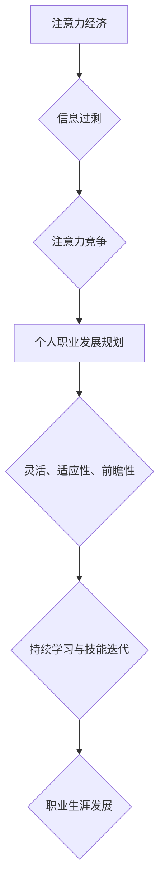

                 

## 注意力经济与个人职业发展规划的变化

> 关键词：注意力经济、个人职业发展、深度学习、AI辅助规划、可持续发展、终身学习、技能迭代

### 1. 背景介绍

在当今信息爆炸的时代，我们每个人都面临着来自各方面的注意力竞争。从社交媒体的推送通知到电子邮件的提醒，从新闻网站的滚动标题到同事的即时消息，无处不在的数字信息洪流正在不断侵蚀我们的专注力。这种现象被称为“注意力经济”，它深刻地影响着我们的生活方式、工作模式和个人职业发展规划。

传统的职业发展规划往往基于稳定的工作岗位和长期的职业路径。然而，随着科技的飞速发展，特别是深度学习和人工智能技术的兴起，传统的职业结构正在发生着根本性的变化。自动化、智能化正在取代大量重复性劳动，新的职业岗位不断涌现，而一些传统的职业则面临着消失的风险。在这种情况下，传统的职业发展规划模式已经显得越来越陈旧和不可取。

### 2. 核心概念与联系

**2.1 注意力经济**

注意力经济是指在信息过剩的时代，人们对注意力成为一种稀缺资源，而能够有效获取和利用注意力的人或组织将拥有更大的竞争优势。

**2.2 个人职业发展规划**

个人职业发展规划是指个人根据自身兴趣、能力、价值观和职业目标，制定的一系列行动计划，以实现职业生涯的持续发展和进步。

**2.3  深度学习与人工智能**

深度学习是一种机器学习的子领域，它利用多层神经网络来模拟人类大脑的学习过程，能够从海量数据中学习复杂的模式和知识。人工智能则是指通过计算机模拟人类智能的行为，包括学习、推理、决策和创造等。

**2.4  注意力经济与个人职业发展规划的联系**

在注意力经济时代，个人职业发展规划需要更加灵活、适应性和前瞻性。深度学习和人工智能技术的快速发展将对职业结构和技能需求产生深远的影响，个人需要不断学习和迭代技能，才能在竞争激烈的职场中保持优势。

**2.5  Mermaid 流程图**



### 3. 核心算法原理 & 具体操作步骤

**3.1 算法原理概述**

在注意力经济时代，个人职业发展规划需要结合深度学习和人工智能技术，实现个性化、智能化的规划。核心算法原理包括：

* **数据分析与预测:** 利用大数据分析技术，预测未来职业趋势、技能需求和市场机会。
* **个性化推荐:** 基于个人兴趣、能力、价值观和职业目标，推荐个性化的职业发展路径和学习资源。
* **技能评估与迭代:** 利用人工智能技术评估个人技能水平，并提供针对性的技能提升建议和学习计划。
* **职业生涯模拟:** 建立虚拟的职业生涯模拟模型，帮助个人探索不同的职业发展路径，并评估不同路径的风险和回报。

**3.2 算法步骤详解**

1. **数据收集:** 收集个人简历、教育背景、工作经历、技能证书、兴趣爱好、价值观等数据。
2. **数据预处理:** 对收集到的数据进行清洗、转换和标准化处理。
3. **特征提取:** 利用机器学习算法从数据中提取关键特征，例如技能、经验、学历、兴趣等。
4. **模型训练:** 利用深度学习算法训练预测模型，例如职业趋势预测模型、技能需求预测模型、个性化推荐模型等。
5. **结果输出:** 将模型预测结果以可视化图表、文字报告等形式呈现给用户，并提供个性化的职业发展建议和学习计划。

**3.3 算法优缺点**

* **优点:**

    * **个性化:** 能够根据个人的具体情况提供个性化的职业发展建议。
    * **智能化:** 利用人工智能技术，自动分析数据、预测趋势、推荐资源，提高规划效率。
    * **数据驱动:** 基于大数据分析，提供更准确、更可靠的职业发展预测。

* **缺点:**

    * **数据依赖:** 算法的准确性依赖于数据质量和数量。
    * **算法局限性:** 现有的算法还无法完全模拟人类的复杂决策过程。
    * **伦理风险:** 数据隐私保护和算法偏见等伦理问题需要得到重视。

**3.4 算法应用领域**

* **职业规划平台:** 为个人提供个性化的职业发展规划建议和学习资源。
* **教育机构:** 为学生提供职业探索和生涯规划指导。
* **企业招聘:** 为企业提供人才招聘和人才培养建议。
* **政府政策:** 为政府制定职业教育和就业政策提供数据支持。

### 4. 数学模型和公式 & 详细讲解 & 举例说明

**4.1 数学模型构建**

我们可以构建一个简单的数学模型来表示个人职业发展规划中的技能迭代过程。

假设：

* $S_t$ 表示个人在时间 $t$ 的技能水平。
* $L_t$ 表示个人在时间 $t$ 学习的技能数量。
* $E_t$ 表示个人在时间 $t$ 的工作经验。
* $P_t$ 表示个人在时间 $t$ 的职业发展水平。

则可以构建以下数学模型：

$$P_t = f(S_t, L_t, E_t)$$

其中，$f$ 是一个非线性函数，表示技能水平、学习数量和工作经验对职业发展水平的影响。

**4.2 公式推导过程**

我们可以进一步推导 $f$ 函数的具体形式，例如：

$$P_t = \alpha S_t + \beta L_t + \gamma E_t$$

其中，$\alpha$, $\beta$, $\gamma$ 是权重系数，表示不同因素对职业发展水平的影响程度。

**4.3 案例分析与讲解**

例如，假设一个程序员想要提高其职业发展水平。

* 他的技能水平 $S_t$ 为 70。
* 他在一年内学习了 5 个新的技能 $L_t = 5$。
* 他积累了 3 年的工作经验 $E_t = 3$。

如果我们假设权重系数 $\alpha = 0.6$, $\beta = 0.3$, $\gamma = 0.1$，则他的职业发展水平 $P_t$ 为：

$$P_t = 0.6 \times 70 + 0.3 \times 5 + 0.1 \times 3 = 42 + 1.5 + 0.3 = 43.8$$

### 5. 项目实践：代码实例和详细解释说明

**5.1 开发环境搭建**

* Python 3.x
* Jupyter Notebook
* scikit-learn
* TensorFlow/PyTorch

**5.2 源代码详细实现**

```python
import pandas as pd
from sklearn.model_selection import train_test_split
from sklearn.linear_model import LinearRegression

# 数据加载
data = pd.read_csv('career_data.csv')

# 特征选择
features = ['skills', 'experience', 'education']
target = 'career_level'

# 数据分割
X_train, X_test, y_train, y_test = train_test_split(data[features], data[target], test_size=0.2)

# 模型训练
model = LinearRegression()
model.fit(X_train, y_train)

# 模型评估
score = model.score(X_test, y_test)
print('模型准确率:', score)

# 预测
new_data = pd.DataFrame({'skills': [80], 'experience': [4], 'education': [16]})
prediction = model.predict(new_data)
print('预测职业发展水平:', prediction)
```

**5.3 代码解读与分析**

* 代码首先加载数据，并选择相关特征和目标变量。
* 然后使用 scikit-learn 库将数据分割为训练集和测试集。
* 训练一个线性回归模型，并使用测试集评估模型的准确率。
* 最后，使用训练好的模型预测新的数据点的职业发展水平。

**5.4 运行结果展示**

运行结果将显示模型的准确率和对新数据点的预测结果。

### 6. 实际应用场景

**6.1 个人职业发展规划平台**

个人职业发展规划平台可以利用深度学习和人工智能技术，为用户提供个性化的职业发展建议和学习资源。例如，用户可以输入自己的兴趣、能力、职业目标等信息，平台会根据大数据分析和算法预测，推荐适合用户的职业发展路径、学习课程和就业机会。

**6.2 教育机构的生涯规划指导**

教育机构可以利用 AI 辅助生涯规划工具，帮助学生探索不同的职业方向，并制定个性化的学习计划。例如，学生可以通过填写问卷、参加职业测评等方式，获得 AI 系统的职业推荐和学习建议。

**6.3 企业人才招聘和培养**

企业可以利用 AI 技术分析人才市场趋势和技能需求，制定更精准的人才招聘和培养策略。例如，企业可以利用 AI 系统分析简历数据，筛选符合岗位要求的候选人，并根据员工技能水平和职业目标，提供个性化的培训计划。

**6.4 政府政策制定**

政府可以利用 AI 技术分析职业发展趋势和人才需求，制定更有效的职业教育和就业政策。例如，政府可以利用 AI 系统预测未来职业市场需求，引导职业教育资源配置，并制定针对不同职业群体的就业政策。

**6.5 未来应用展望**

随着深度学习和人工智能技术的不断发展，AI 辅助职业发展规划将更加智能化、个性化和精准化。未来，AI 系统将能够更加深入地理解个人的兴趣、能力、价值观和职业目标，并提供更加个性化的职业发展建议和学习资源。

### 7. 工具和资源推荐

**7.1 学习资源推荐**

* **在线课程:** Coursera, edX, Udacity
* **书籍:** 《深度学习》、《人工智能简史》
* **博客和论坛:** Towards Data Science, Machine Learning Mastery

**7.2 开发工具推荐**

* **Python:** 
* **Jupyter Notebook:** 
* **scikit-learn:** 
* **TensorFlow/PyTorch:** 

**7.3 相关论文推荐**

* **Attention Is All You Need:** https://arxiv.org/abs/1706.03762
* **BERT: Pre-training of Deep Bidirectional Transformers for Language Understanding:** https://arxiv.org/abs/1810.04805

### 8. 总结：未来发展趋势与挑战

**8.1 研究成果总结**

在注意力经济时代，深度学习和人工智能技术为个人职业发展规划提供了新的机遇和挑战。AI 辅助职业发展规划能够帮助个人更有效地规划职业生涯，提高职业发展效率。

**8.2 未来发展趋势**

* **更加个性化和精准化的职业发展建议:** AI 系统将能够更加深入地理解个人的兴趣、能力、价值观和职业目标，并提供更加个性化的职业发展建议和学习资源。
* **更加智能化的职业生涯模拟:** AI 系统将能够更加逼真地模拟职业生涯发展路径，帮助个人探索不同的职业方向，并评估不同路径的风险和回报。
* **更加融合的学习和工作体验:** AI 系统将能够将学习和工作更加融合，提供更加灵活、高效的学习方式，帮助个人不断提升技能和适应不断变化的职业市场。

**8.3 面临的挑战**

* **数据隐私保护:** AI 辅助职业发展规划需要收集和分析大量个人数据，因此数据隐私保护是一个重要的挑战。
* **算法偏见:** AI 系统的训练数据可能存在偏见，导致算法输出结果存在偏差，需要采取措施避免算法偏见的影响。
* **技术可访问性:** AI 技术的应用需要一定的技术门槛，如何让 AI 辅助职业发展规划工具更加易于使用，提高大众的接受度是一个重要的挑战。

**8.4 研究展望**

未来，研究者将继续探索 AI 辅助职业发展规划的新的应用场景和技术方法，以更好地帮助个人应对注意力经济时代带来的挑战，实现职业生涯的持续发展和进步。

### 9. 附录：常见问题与解答

**9.1 如何选择适合自己的职业发展路径？**

AI 辅助职业发展规划平台可以根据你的兴趣、能力、价值观和职业目标，推荐适合你的职业发展路径。

**9.2 如何利用 AI 系统提升我的技能水平？**

AI 系统可以根据你的技能水平和职业目标，推荐适合你的学习课程和培训计划。

**9.3 AI 辅助职业发展规划是否会取代人类职业规划师？**

AI 辅助职业发展规划可以帮助人类职业规划师更高效地工作，但它并不会完全取代人类职业规划师。人类职业规划师仍然需要提供个性化的指导和支持，帮助个人解决复杂的问题和做出重要的决策。


作者：禅与计算机程序设计艺术 / Zen and the Art of Computer Programming 
<end_of_turn>

