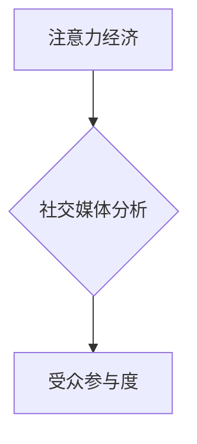

                 

##  注意力经济与社交媒体分析洞见：了解受众参与度的秘密

> 关键词：注意力经济、社交媒体分析、受众参与度、算法原理、数据挖掘、机器学习、深度学习、自然语言处理

## 1. 背景介绍

在当今数字时代，信息爆炸式增长，人们面临着前所未有的信息过载。如何有效地获取和利用信息，成为了一个至关重要的挑战。在这种背景下，“注意力经济”应运而生，它强调了注意力作为一种稀缺资源，并探讨了如何有效地获取和利用注意力。

社交媒体作为信息传播和用户互动的重要平台，在注意力经济中扮演着举足轻重的角色。用户在社交媒体上花费大量时间，平台也通过各种方式争夺用户的注意力。因此，了解用户在社交媒体上的行为模式，以及影响用户参与度的因素，对于社交媒体平台运营、内容创作和广告投放都具有重要意义。

## 2. 核心概念与联系

### 2.1 注意力经济

注意力经济是指在信息过载的时代，注意力成为一种稀缺资源，而获取和利用注意力是企业和个人竞争的关键。

* **注意力：** 指的是人们对特定信息或事件的集中和持续的关注。
* **稀缺性：** 指的是注意力资源有限，人们无法同时关注所有信息。
* **竞争：** 指的是各种信息和平台都在争夺用户的注意力。

### 2.2 社交媒体分析

社交媒体分析是指利用数据挖掘、机器学习等技术，从社交媒体平台上收集和分析用户数据，以了解用户行为、兴趣和偏好，并为平台运营、内容创作和广告投放提供决策支持。

* **数据收集：** 从社交媒体平台上收集用户数据，例如用户行为、帖子内容、评论和点赞等。
* **数据清洗：** 对收集到的数据进行清洗和预处理，去除噪声和无效数据。
* **数据分析：** 利用数据挖掘、机器学习等技术，对数据进行分析，提取有价值的信息。
* **洞察和决策：** 基于分析结果，为平台运营、内容创作和广告投放提供决策支持。

### 2.3 受众参与度

受众参与度是指用户对社交媒体内容的互动程度，例如点赞、评论、转发、分享等行为。

* **点赞：** 用户对内容表示认可或赞同。
* **评论：** 用户对内容发表意见或看法。
* **转发：** 用户将内容分享给其他用户。
* **分享：** 用户将内容发布到其他平台。

**核心概念联系：**

注意力经济强调了注意力资源的稀缺性，而社交媒体分析旨在通过数据挖掘和机器学习技术，了解用户行为和兴趣，从而有效地获取和利用用户的注意力。受众参与度则是衡量用户对社交媒体内容的关注和互动程度，也是注意力经济中重要的指标。



## 3. 核心算法原理 & 具体操作步骤

### 3.1 算法原理概述

受众参与度分析通常涉及以下核心算法：

* **文本分类：** 用于识别用户评论和帖子中的情感倾向，例如正面、负面或中性。
* **主题建模：** 用于从大量文本数据中提取主题，了解用户关注的话题和兴趣。
* **网络分析：** 用于分析用户之间的关系和互动，识别影响力用户和传播路径。
* **推荐算法：** 用于根据用户的兴趣和行为，推荐相关的内容和用户。

### 3.2 算法步骤详解

以文本分类为例，其具体操作步骤如下：

1. **数据收集：** 从社交媒体平台上收集用户评论和帖子数据。
2. **数据预处理：** 对数据进行清洗、去停用词、词干化等处理，以便于后续算法训练。
3. **特征提取：** 使用词袋模型、TF-IDF等方法，将文本数据转换为数值特征。
4. **模型训练：** 使用机器学习算法，例如支持向量机、朴素贝叶斯、深度学习等，对特征进行训练，建立文本分类模型。
5. **模型评估：** 使用测试数据对模型进行评估，并调整模型参数以提高准确率。
6. **模型部署：** 将训练好的模型部署到生产环境中，用于实时分析用户评论和帖子情感倾向。

### 3.3 算法优缺点

**优点：**

* 可以自动识别用户情感倾向，帮助平台运营者了解用户对内容的反馈。
* 可以帮助内容创作者创作更符合用户兴趣的内容。
* 可以帮助广告商精准投放广告，提高广告效果。

**缺点：**

* 文本分类算法对数据质量要求较高，数据清洗和预处理环节至关重要。
* 算法的准确率受限于训练数据，需要不断更新和完善训练数据。
* 算法无法完全理解用户的情感和意图，存在一定的误判风险。

### 3.4 算法应用领域

文本分类算法广泛应用于以下领域：

* **社交媒体分析：** 识别用户评论和帖子情感倾向，了解用户对品牌、产品和事件的看法。
* **客户服务：** 自动分类客户服务请求，提高服务效率。
* **市场调研：** 分析用户对产品和服务的评价，了解市场趋势。
* **舆情监测：** 监测网络舆情，及时发现负面信息。

## 4. 数学模型和公式 & 详细讲解 & 举例说明

### 4.1 数学模型构建

受众参与度模型可以构建为一个多变量回归模型，其中参与度作为因变量，用户特征、内容特征和平台特征作为自变量。

例如，一个简单的受众参与度模型可以表示为：

$$
\text{参与度} = \beta_0 + \beta_1 \cdot \text{用户年龄} + \beta_2 \cdot \text{内容长度} + \beta_3 \cdot \text{平台活跃度} + \epsilon
$$

其中：

* $\text{参与度}$：用户对内容的参与度，例如点赞数、评论数、转发数等。
* $\text{用户年龄}$：用户的年龄。
* $\text{内容长度}$：内容的长度。
* $\text{平台活跃度}$：平台的活跃度，例如用户数量、日活跃用户数等。
* $\beta_0$、$\beta_1$、$\beta_2$、$\beta_3$：模型参数。
* $\epsilon$：随机误差项。

### 4.2 公式推导过程

模型参数的估计可以通过最小二乘法等方法进行。最小二乘法旨在找到一组参数，使得模型预测值与实际值之间的误差平方和最小。

### 4.3 案例分析与讲解

假设我们收集了1000条用户数据，并使用最小二乘法估计模型参数，得到以下结果：

* $\beta_0 = 10$
* $\beta_1 = -0.1$
* $\beta_2 = 0.5$
* $\beta_3 = 2$

这意味着：

* 当用户年龄为0时，参与度为10。
* 用户年龄每增加1岁，参与度减少0.1。
* 内容长度每增加1个单位，参与度增加0.5。
* 平台活跃度每增加1个单位，参与度增加2。

## 5. 项目实践：代码实例和详细解释说明

### 5.1 开发环境搭建

* Python 3.x
* Jupyter Notebook
* pandas
* scikit-learn
* matplotlib

### 5.2 源代码详细实现

```python
import pandas as pd
from sklearn.linear_model import LinearRegression

# 加载数据
data = pd.read_csv('social_media_data.csv')

# 准备特征和目标变量
X = data[['用户年龄', '内容长度', '平台活跃度']]
y = data['参与度']

# 创建线性回归模型
model = LinearRegression()

# 训练模型
model.fit(X, y)

# 预测参与度
predictions = model.predict(X)

# 可视化结果
import matplotlib.pyplot as plt
plt.scatter(y, predictions)
plt.xlabel('实际参与度')
plt.ylabel('预测参与度')
plt.show()
```

### 5.3 代码解读与分析

* 代码首先加载社交媒体数据，并准备特征和目标变量。
* 然后创建线性回归模型，并使用训练数据训练模型。
* 训练完成后，可以使用模型预测新的参与度值。
* 最后，使用 matplotlib 库可视化预测结果与实际结果之间的关系。

### 5.4 运行结果展示

运行代码后，会生成一个散点图，展示预测参与度与实际参与度之间的关系。

## 6. 实际应用场景

### 6.1 内容创作

* 了解用户对不同类型内容的偏好，例如视频、图片、文字等。
* 分析用户对不同主题内容的兴趣，例如新闻、娱乐、科技等。
* 根据用户年龄、性别、地域等特征，定制化内容推荐。

### 6.2 平台运营

* 优化平台算法，提高用户参与度和留存率。
* 识别和培养影响力用户，引导用户互动和传播。
* 分析用户行为趋势，预测未来用户需求。

### 6.3 广告投放

* 根据用户兴趣和行为，精准投放广告，提高广告效果。
* 分析广告内容的受众参与度，优化广告创意和投放策略。
* 评估广告投放效果，优化广告预算分配。

### 6.4 未来应用展望

随着人工智能技术的不断发展，社交媒体分析将更加智能化和个性化。未来，我们可以期待以下应用场景：

* 基于深度学习的文本理解和情感分析，更准确地识别用户意图和情感。
* 基于用户行为轨迹的个性化内容推荐，提供更精准和有效的推荐服务。
* 基于虚拟现实和增强现实技术的沉浸式社交体验，提升用户参与度和互动性。

## 7. 工具和资源推荐

### 7.1 学习资源推荐

* **书籍：**
    * 《社交媒体分析》
    * 《数据挖掘实战》
    * 《机器学习》
* **在线课程：**
    * Coursera: 数据科学
    * edX: 机器学习
    * Udemy: 社交媒体分析

### 7.2 开发工具推荐

* **Python:** 强大的数据分析和机器学习库，例如 pandas, scikit-learn, TensorFlow 等。
* **R:** 专注于统计分析和数据可视化的语言。
* **Tableau:** 数据可视化工具，用于创建交互式报表和仪表盘。

### 7.3 相关论文推荐

* **Attention Is All You Need:** https://arxiv.org/abs/1706.03762
* **BERT: Pre-training of Deep Bidirectional Transformers for Language Understanding:** https://arxiv.org/abs/1810.04805
* **Social Media Analytics: A Survey:** https://www.researchgate.net/publication/329681514_Social_Media_Analytics_A_Survey

## 8. 总结：未来发展趋势与挑战

### 8.1 研究成果总结

注意力经济与社交媒体分析已经取得了显著成果，例如：

* 能够更准确地识别用户情感倾向和兴趣。
* 能够提供更精准的个性化内容推荐。
* 能够帮助平台运营者优化平台算法和广告投放策略。

### 8.2 未来发展趋势

未来，注意力经济与社交媒体分析将朝着以下方向发展：

* **更智能化：** 利用深度学习等人工智能技术，实现更智能的文本理解、情感分析和用户画像。
* **更个性化：** 基于用户行为轨迹和偏好，提供更精准的个性化内容推荐和服务。
* **更跨平台：** 将注意力经济和社交媒体分析应用于更多平台，例如电商平台、游戏平台等。

### 8.3 面临的挑战

注意力经济与社交媒体分析也面临着一些挑战：

* **数据隐私：** 如何保护用户数据隐私，是社交媒体分析面临的重要挑战。
* **算法公平性：** 算法的训练数据可能存在偏差，导致算法结果不公平。
* **用户信任：** 如何建立用户对社交媒体分析技术的信任，是未来需要解决的关键问题。

### 8.4 研究展望

未来，我们需要继续探索注意力经济和社交媒体分析的本质，开发更智能、更公平、更可信的分析技术，并将其应用于更多领域，为社会带来更多价值。

## 9. 附录：常见问题与解答

**Q1：如何提高社交媒体分析的准确率？**

**A1：** 提高社交媒体分析的准确率可以通过以下方式：

* 使用高质量的数据进行训练。
* 使用更先进的算法模型。
* 结合多种数据源进行分析。
* 定期更新和完善训练数据。

**Q2：如何保护用户数据隐私？**

**A2：** 保护用户数据隐私可以通过以下方式：

* 采用匿名化技术，去除用户个人信息。
* 加密用户数据，防止数据泄露。
* 获得用户同意，明确使用数据范围。
* 遵守相关数据隐私法规。


作者：禅与计算机程序设计艺术 / Zen and the Art of Computer Programming 
<end_of_turn>

