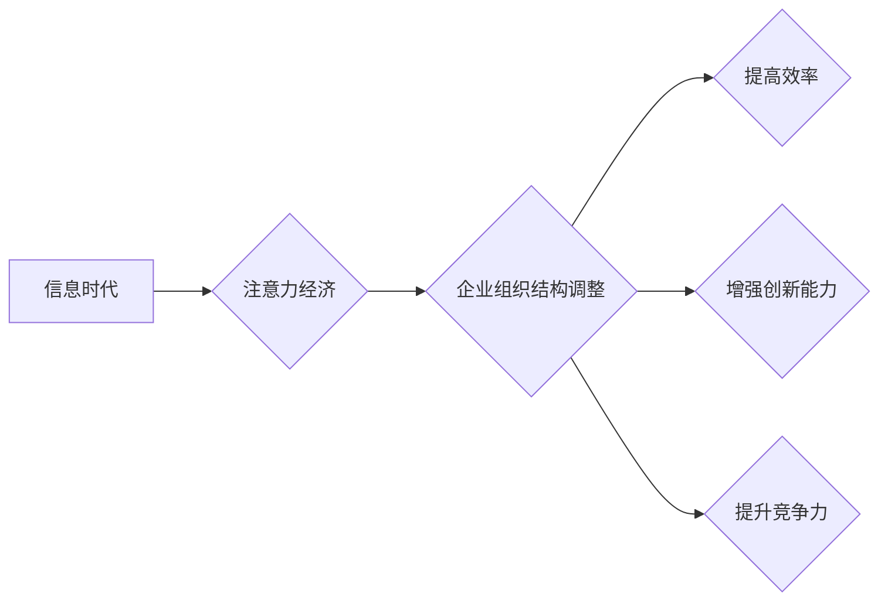

                 

## 1. 背景介绍

在当今信息爆炸的时代，人们面临着前所未有的信息过载。如何有效地获取、处理和利用信息，成为了企业和个人都面临的重大挑战。注意力经济应运而生，它强调了注意力作为一种稀缺资源的重要性，并提出了如何有效地管理和利用注意力的策略。

注意力经济的兴起，深刻地改变了人们的工作方式和生活方式。企业也开始意识到，在竞争激烈的市场环境中，如何有效地吸引和留住用户的注意力，成为了决定企业成功与否的关键因素。

## 2. 核心概念与联系

### 2.1 注意力经济的概念

注意力经济是指在信息时代，注意力作为一种稀缺资源，被商业化和交易的经济模式。它认为，人们的注意力是有限的，而信息竞争者则争夺着这有限的注意力。

### 2.2 企业组织结构与注意力经济的关系

企业组织结构是企业内部人员、部门和资源的配置方式，它直接影响着企业的效率、创新能力和竞争力。注意力经济的兴起，对企业组织结构提出了新的挑战和机遇。

**Mermaid 流程图:**



**2.3 企业组织结构调整的必要性**

在注意力经济时代，企业组织结构需要进行调整，以适应新的环境和挑战。主要调整方向包括：

* **扁平化组织结构:** 减少层级，提高决策效率，增强组织的灵活性。
* **敏捷化组织结构:** 采用迭代开发和快速响应机制，适应快速变化的市场需求。
* **跨部门协作:** 打破部门壁垒，促进信息共享和协同创新。
* **数据驱动型组织结构:** 利用数据分析和人工智能技术，提高决策的科学性和准确性。

## 3. 核心算法原理 & 具体操作步骤

### 3.1 算法原理概述

注意力机制是一种模仿人类注意力机制的算法，它能够学习到输入数据中最重要的部分，并对这些部分给予更多的关注。

注意力机制的核心思想是，在处理信息时，人类会根据自身的需求和目标，选择性地关注某些信息，而忽略其他信息。注意力机制的算法原理就是模拟这种选择性关注的过程。

### 3.2 算法步骤详解

1. **输入数据:** 将输入数据（例如文本、图像、音频等）转换为向量表示。
2. **计算注意力权重:** 使用注意力函数计算每个输入元素的注意力权重，权重表示该元素的重要性。
3. **加权求和:** 根据注意力权重，对输入元素进行加权求和，得到最终的输出向量。

### 3.3 算法优缺点

**优点:**

* **提高模型性能:** 注意力机制能够帮助模型学习到输入数据中最重要的部分，从而提高模型的性能。
* **解释性强:** 注意力权重可以直观地反映模型对输入数据的关注程度，提高模型的解释性。
* **适用于多种任务:** 注意力机制可以应用于多种自然语言处理任务，例如机器翻译、文本摘要、问答系统等。

**缺点:**

* **计算复杂度高:** 注意力机制的计算复杂度较高，需要更多的计算资源。
* **参数量大:** 注意力机制的参数量较大，需要更多的训练数据。

### 3.4 算法应用领域

注意力机制在自然语言处理、计算机视觉、语音识别等领域都有广泛的应用。

* **自然语言处理:** 机器翻译、文本摘要、问答系统、情感分析等。
* **计算机视觉:** 图像分类、目标检测、图像分割等。
* **语音识别:** 语音转文本、语音合成等。

## 4. 数学模型和公式 & 详细讲解 & 举例说明

### 4.1 数学模型构建

注意力机制的数学模型可以表示为一个注意力函数，该函数将输入数据映射到一个注意力权重向量。

**注意力函数:**

$$
\text{Attention}(Q, K, V) = \text{softmax}\left(\frac{Q K^T}{\sqrt{d_k}}\right) V
$$

其中：

* $Q$：查询向量
* $K$：键向量
* $V$：值向量
* $d_k$：键向量的维度
* $\text{softmax}$：softmax函数

### 4.2 公式推导过程

注意力函数的推导过程如下：

1. 计算查询向量 $Q$ 和键向量 $K$ 的点积，并除以 $\sqrt{d_k}$。
2. 应用 softmax 函数对点积结果进行归一化，得到注意力权重向量。
3. 将注意力权重向量与值向量 $V$ 进行加权求和，得到最终的输出向量。

### 4.3 案例分析与讲解

**举例说明:**

假设我们有一个句子 "The cat sat on the mat"，我们想要计算每个单词的注意力权重。

1. 将每个单词转换为向量表示。
2. 计算每个单词的查询向量和键向量的点积。
3. 应用 softmax 函数对点积结果进行归一化，得到每个单词的注意力权重。
4. 将注意力权重与每个单词的值向量进行加权求和，得到最终的输出向量。

## 5. 项目实践：代码实例和详细解释说明

### 5.1 开发环境搭建

* Python 3.6+
* TensorFlow 2.0+
* PyTorch 1.0+

### 5.2 源代码详细实现

```python
import tensorflow as tf

# 定义注意力机制
def attention_mechanism(query, keys, values, mask=None):
    # 计算查询向量和键向量的点积
    scores = tf.matmul(query, keys, transpose_b=True)

    # 应用 softmax 函数对点积结果进行归一化
    attention_weights = tf.nn.softmax(scores, axis=-1)

    # 将注意力权重与值向量进行加权求和
    context_vector = tf.matmul(attention_weights, values)

    return context_vector, attention_weights

# 示例代码
query = tf.constant([[1, 2, 3], [4, 5, 6]])
keys = tf.constant([[7, 8, 9], [10, 11, 12]])
values = tf.constant([[13, 14, 15], [16, 17, 18]])

context_vector, attention_weights = attention_mechanism(query, keys, values)

print("Context Vector:", context_vector)
print("Attention Weights:", attention_weights)
```

### 5.3 代码解读与分析

* `attention_mechanism` 函数实现了注意力机制的核心逻辑。
* `scores` 计算了查询向量和键向量的点积，表示每个键向量与查询向量的相关性。
* `attention_weights` 使用 softmax 函数对 `scores` 进行归一化，得到每个键向量的注意力权重。
* `context_vector` 将注意力权重与值向量进行加权求和，得到最终的输出向量。

### 5.4 运行结果展示

运行上述代码，会输出 `Context Vector` 和 `Attention Weights`。

* `Context Vector` 是注意力机制的输出向量，它包含了查询向量与所有键向量的加权平均值。
* `Attention Weights` 是每个键向量的注意力权重，它表示每个键向量对输出向量的影响程度。

## 6. 实际应用场景

### 6.1  企业组织结构调整

注意力经济的兴起，对企业组织结构提出了新的挑战和机遇。企业需要根据自身情况，调整组织结构，以适应新的环境和挑战。

* **扁平化组织结构:** 减少层级，提高决策效率，增强组织的灵活性。
* **敏捷化组织结构:** 采用迭代开发和快速响应机制，适应快速变化的市场需求。
* **跨部门协作:** 打破部门壁垒，促进信息共享和协同创新。
* **数据驱动型组织结构:** 利用数据分析和人工智能技术，提高决策的科学性和准确性。

### 6.2  员工培训与发展

注意力经济时代，员工的学习方式和培训需求也发生了变化。企业需要采用更有效的培训方法，帮助员工提高注意力集中能力和学习效率。

* **个性化学习:** 根据员工的学习风格和需求，提供个性化的学习内容和培训方案。
* **沉浸式体验:** 利用虚拟现实、增强现实等技术，创造沉浸式的学习体验，提高员工的学习兴趣和效果。
* **微学习:** 将学习内容分解成小块，方便员工碎片化时间学习。

### 6.3  产品设计与开发

注意力经济时代，产品设计和开发需要更加注重用户体验和注意力引导。企业需要设计出能够吸引用户注意力、引导用户行为的产品。

* **简洁明了的界面:** 避免信息过载，突出重点信息。
* **交互式设计:** 利用游戏化、互动性等元素，提高用户参与度和注意力。
* **个性化推荐:** 根据用户的兴趣和行为，提供个性化的产品推荐。

### 6.4  未来应用展望

注意力经济对企业的影响将更加深远。未来，企业将更加注重注意力管理，并将注意力机制应用于更多领域，例如：

* **营销推广:** 利用注意力机制，精准地推送广告，提高广告效果。
* **客户服务:** 利用注意力机制，识别客户的需求，提供更精准的客户服务。
* **人力资源管理:** 利用注意力机制，评估员工的注意力集中能力，提高员工的招聘和培训效率。


## 7. 工具和资源推荐

### 7.1 学习资源推荐

* **书籍:**
    * 《深度学习》
    * 《Attention Is All You Need》
* **在线课程:**
    * Coursera: 深度学习
    * Udacity: 自然语言处理
* **博客:**
    * TensorFlow Blog
    * PyTorch Blog

### 7.2 开发工具推荐

* **TensorFlow:** 开源深度学习框架
* **PyTorch:** 开源深度学习框架
* **Keras:** 高级深度学习API

### 7.3 相关论文推荐

* **Attention Is All You Need:** https://arxiv.org/abs/1706.03762
* **BERT: Pre-training of Deep Bidirectional Transformers for Language Understanding:** https://arxiv.org/abs/1810.04805

## 8. 总结：未来发展趋势与挑战

### 8.1 研究成果总结

注意力机制在自然语言处理、计算机视觉等领域取得了显著的成果，提高了模型的性能和解释性。

### 8.2 未来发展趋势

* **更强大的注意力机制:** 研究更有效的注意力机制，例如自注意力机制、多头注意力机制等。
* **注意力机制的应用扩展:** 将注意力机制应用于更多领域，例如时间序列分析、推荐系统等。
* **注意力机制的理论研究:** 深入研究注意力机制的原理和机制，提高对注意力机制的理解。

### 8.3 面临的挑战

* **计算复杂度:** 注意力机制的计算复杂度较高，需要更多的计算资源。
* **参数量:** 注意力机制的参数量较大，需要更多的训练数据。
* **解释性:** 尽管注意力机制的解释性比传统模型强，但仍然需要进一步提高。

### 8.4 研究展望

未来，注意力机制将继续发展，并应用于更多领域。研究者将致力于解决注意力机制面临的挑战，并开发出更强大、更有效的注意力机制。

## 9. 附录：常见问题与解答

**问题 1:** 注意力机制和传统模型有什么区别？

**答案:** 传统模型通常是基于固定结构的，而注意力机制能够学习到输入数据中最重要的部分，并对这些部分给予更多的关注。

**问题 2:** 注意力机制的应用场景有哪些？

**答案:** 注意力机制可以应用于自然语言处理、计算机视觉、语音识别等领域。

**问题 3:** 如何评估注意力机制的性能？

**答案:** 可以使用准确率、召回率、F1-score等指标来评估注意力机制的性能。

**问题 4:** 注意力机制的计算复杂度如何？

**答案:** 注意力机制的计算复杂度较高，需要更多的计算资源。

**问题 5:** 注意力机制的参数量如何？

**答案:** 注意力机制的参数量较大，需要更多的训练数据。


作者：禅与计算机程序设计艺术 / Zen and the Art of Computer Programming 
<end_of_turn>

