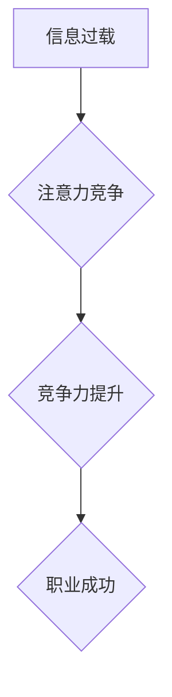

                 

## 1. 背景介绍

在当今信息爆炸的时代，人们每天面临着海量的资讯和信息流。如何有效地获取、处理和利用这些信息，成为了决定个人和组织竞争力的关键因素。注意力，作为人类认知的核心能力之一，在信息时代显得尤为重要。

注意力经济的概念源于心理学家和经济学家对人类认知机制和信息消费行为的研究。它指出，在信息过载的时代，人们的注意力成为了稀缺资源，而能够有效地获取和利用注意力的人或组织，将拥有巨大的竞争优势。

职场竞争力，是指在职场中能够胜任工作、获得成功和发展所需的综合能力。它包括知识技能、职业素养、心理素质、人际关系等多个方面。

随着信息技术的快速发展和互联网的普及，注意力经济对职场竞争力的影响日益显著。

## 2. 核心概念与联系

### 2.1 注意力经济

注意力经济的核心概念是：注意力是稀缺资源，而能够有效地获取和利用注意力的人或组织，将拥有巨大的竞争优势。

在信息时代，人们每天面临着海量的资讯和信息流，注意力成为了稀缺资源。人们需要花费时间和精力来筛选、过滤和处理这些信息，才能找到真正有价值的信息。

注意力经济认为，那些能够有效地获取和利用注意力的人或组织，将能够在竞争中脱颖而出。

### 2.2  职场竞争力

职场竞争力是指在职场中能够胜任工作、获得成功和发展所需的综合能力。它包括知识技能、职业素养、心理素质、人际关系等多个方面。

在注意力经济时代，注意力成为了决定职场竞争力的关键因素。

**Mermaid 流程图**



## 3. 核心算法原理 & 具体操作步骤

### 3.1  算法原理概述

注意力机制是一种模仿人类注意力机制的算法，它能够帮助模型专注于输入数据中最重要的部分，从而提高模型的性能。

注意力机制的核心思想是：在处理输入数据时，模型会为每个数据元素分配一个权重，权重高的数据元素会被模型更加关注，权重低的则会被忽略。

### 3.2  算法步骤详解

1. **计算注意力权重:** 对于每个输入数据元素，模型会计算一个注意力权重，该权重表示该数据元素的重要性。
2. **加权求和:** 将注意力权重与输入数据元素相乘，然后对所有数据元素进行加权求和，得到一个新的表示。
3. **输出结果:** 使用新的表示作为模型的输出。

### 3.3  算法优缺点

**优点:**

* 能够提高模型的性能，尤其是在处理长序列数据时。
* 可以帮助模型理解输入数据中的语义关系。
* 可以解释模型的决策过程。

**缺点:**

* 计算复杂度较高。
* 需要大量的训练数据。

### 3.4  算法应用领域

注意力机制在自然语言处理、计算机视觉、机器翻译等领域都有广泛的应用。

## 4. 数学模型和公式 & 详细讲解 & 举例说明

### 4.1  数学模型构建

注意力机制的数学模型可以表示为：

$$
\text{Attention}(Q, K, V) = \text{softmax}\left(\frac{Q K^T}{\sqrt{d_k}}\right) V
$$

其中：

* $Q$：查询矩阵
* $K$：键矩阵
* $V$：值矩阵
* $d_k$：键向量的维度
* $\text{softmax}$：softmax函数

### 4.2  公式推导过程

注意力机制的公式推导过程可以分为以下几个步骤：

1. 计算查询向量 $Q$ 和键向量 $K$ 的点积。
2. 对点积结果进行归一化，得到注意力权重。
3. 将注意力权重与值向量 $V$ 进行加权求和，得到最终的注意力输出。

### 4.3  案例分析与讲解

例如，在机器翻译任务中，可以使用注意力机制来帮助模型关注源语言句子中与目标语言句子相关的词语。

## 5. 项目实践：代码实例和详细解释说明

### 5.1  开发环境搭建

使用 Python 语言和 TensorFlow 或 PyTorch 深度学习框架进行开发。

### 5.2  源代码详细实现

```python
import tensorflow as tf

# 定义注意力机制层
class AttentionLayer(tf.keras.layers.Layer):
    def __init__(self, units):
        super(AttentionLayer, self).__init__()
        self.Wq = tf.keras.layers.Dense(units)
        self.Wk = tf.keras.layers.Dense(units)
        self.Wv = tf.keras.layers.Dense(units)
        self.fc = tf.keras.layers.Dense(units)

    def call(self, inputs):
        Q = self.Wq(inputs[0])
        K = self.Wk(inputs[1])
        V = self.Wv(inputs[2])
        attention_scores = tf.matmul(Q, K, transpose_b=True) / tf.math.sqrt(tf.cast(tf.shape(Q)[-1], tf.float32))
        attention_weights = tf.nn.softmax(attention_scores, axis=-1)
        context_vector = tf.matmul(attention_weights, V)
        output = self.fc(context_vector)
        return output

# 使用注意力机制层
model = tf.keras.Sequential([
    tf.keras.layers.Embedding(input_dim=10000, output_dim=128),
    AttentionLayer(units=128),
    tf.keras.layers.Dense(units=10, activation='softmax')
])
```

### 5.3  代码解读与分析

代码中定义了一个 `AttentionLayer` 类，该类实现了注意力机制层。

该层接受三个输入：查询矩阵 $Q$、键矩阵 $K$ 和值矩阵 $V$。

首先，将输入矩阵分别通过三个全连接层进行变换，得到新的查询、键和值向量。

然后，计算查询向量和键向量的点积，并进行归一化，得到注意力权重。

最后，将注意力权重与值向量进行加权求和，得到最终的注意力输出。

### 5.4  运行结果展示

使用训练数据训练模型，并评估模型的性能。

## 6. 实际应用场景

### 6.1  招聘筛选

注意力机制可以用于分析求职者的简历和面试表现，识别出最具潜力的候选人。

### 6.2  员工培训

注意力机制可以用于个性化员工培训，根据员工的学习进度和需求，推荐合适的培训内容。

### 6.3  客户服务

注意力机制可以用于分析客户的咨询内容，识别出客户的需求，并提供更精准的解决方案。

### 6.4  未来应用展望

注意力经济对职场竞争力的影响将越来越显著，注意力机制将在更多领域得到应用，例如：

* **智能办公:** 利用注意力机制，帮助员工更高效地完成工作，减少信息干扰。
* **远程协作:** 利用注意力机制，帮助团队成员更好地沟通和协作。
* **人才管理:** 利用注意力机制，帮助企业更好地发现、培养和管理人才。

## 7. 工具和资源推荐

### 7.1  学习资源推荐

* **书籍:**
    * 《深度学习》
    * 《自然语言处理》
* **在线课程:**
    * Coursera
    * edX
* **博客:**
    * TensorFlow Blog
    * PyTorch Blog

### 7.2  开发工具推荐

* **TensorFlow:** 开源深度学习框架
* **PyTorch:** 开源深度学习框架
* **Jupyter Notebook:** 用于深度学习开发的交互式笔记本

### 7.3  相关论文推荐

* **Attention Is All You Need:** https://arxiv.org/abs/1706.03762
* **BERT: Pre-training of Deep Bidirectional Transformers for Language Understanding:** https://arxiv.org/abs/1810.04805

## 8. 总结：未来发展趋势与挑战

### 8.1  研究成果总结

注意力机制在信息处理领域取得了显著的成果，在自然语言处理、计算机视觉等领域取得了突破性的进展。

### 8.2  未来发展趋势

未来，注意力机制将朝着以下几个方向发展：

* **更强大的注意力机制:** 研究更有效的注意力机制，提高模型的性能和效率。
* **多模态注意力机制:** 研究能够处理多种模态数据的注意力机制，例如文本、图像、音频等。
* **可解释性注意力机制:** 研究能够解释模型决策过程的注意力机制，提高模型的可解释性。

### 8.3  面临的挑战

注意力机制也面临着一些挑战：

* **计算复杂度:** 现有的注意力机制计算复杂度较高，难以应用于大规模数据处理。
* **数据依赖性:** 注意力机制需要大量的训练数据，难以应用于数据稀缺的领域。
* **可解释性:** 目前注意力机制的决策过程难以解释，难以被人类理解和信任。

### 8.4  研究展望

未来，需要进一步研究注意力机制的理论基础、算法设计和应用场景，以克服其面临的挑战，并将其应用于更多领域，推动人工智能技术的发展。

## 9. 附录：常见问题与解答

### 9.1  Q: 注意力机制与深度学习的关系是什么？

### 9.2  A: 注意力机制是一种深度学习中的重要技术，它能够帮助模型关注输入数据中最重要的部分，从而提高模型的性能。

### 9.3  Q: 注意力机制有哪些应用场景？

### 9.4  A: 注意力机制在自然语言处理、计算机视觉、机器翻译等领域都有广泛的应用。

### 9.5  Q: 如何选择合适的注意力机制？

### 9.6  A: 选择合适的注意力机制需要根据具体应用场景和数据特点进行选择。


作者：禅与计算机程序设计艺术 / Zen and the Art of Computer Programming 
<end_of_turn>

