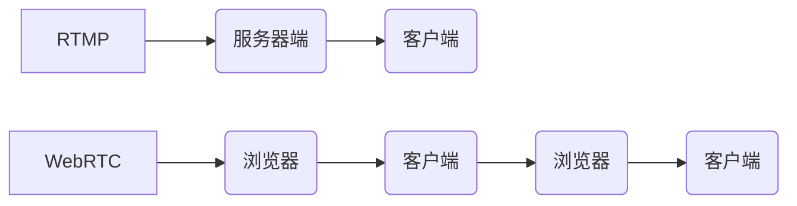

                 

## 流媒体技术栈：从RTMP到WebRTC

> 关键词：流媒体、RTMP、WebRTC、视频传输、音频编码、数据传输、网络协议、实时通信

### 1. 背景介绍

随着互联网技术的飞速发展，流媒体技术已成为现代生活不可或缺的一部分。从视频点播到直播，从在线游戏到远程会议，流媒体技术无处不在，为我们带来了丰富的娱乐体验和便捷的沟通方式。

传统的流媒体技术主要依赖于服务器端推流和客户端拉流的模式，例如RTMP协议。然而，随着移动设备的普及和对实时交互体验的提升需求，传统的流媒体架构面临着新的挑战。

WebRTC（Web Real-Time Communication）技术应运而生，它基于浏览器原生API，实现了点对点（P2P）实时通信，无需插件或第三方软件，为流媒体技术带来了新的可能性。

本文将深入探讨流媒体技术栈，从RTMP协议到WebRTC技术，分析其原理、架构、算法和应用场景，并展望未来发展趋势。

### 2. 核心概念与联系

#### 2.1 RTMP 协议

RTMP（Real Time Messaging Protocol）是一种实时消息传输协议，由Adobe公司开发，广泛应用于视频直播和点播。

RTMP协议基于TCP协议，采用客户端-服务器架构，数据传输过程如下：

1. **连接建立:** 客户端连接到服务器，建立RTMP连接。
2. **消息发送:** 客户端发送视频、音频和控制消息到服务器。
3. **消息转发:** 服务器转发消息到目标客户端。
4. **消息接收:** 客户端接收消息并进行解码和播放。

#### 2.2 WebRTC 技术

WebRTC（Web Real-Time Communication）是一种开源的实时通信技术，基于浏览器原生API，实现了点对点（P2P）实时通信，无需插件或第三方软件。

WebRTC技术主要包含以下核心组件：

* **数据通道:** 用于传输实时数据，例如视频、音频和控制信息。
* **音视频编码器/解码器:** 用于将音视频数据编码和解码。
* **网络连接管理:** 用于管理网络连接，例如NAT穿透和ICE候选人协商。

#### 2.3 关系图



### 3. 核心算法原理 & 具体操作步骤

#### 3.1 算法原理概述

流媒体技术的核心算法主要涉及以下几个方面：

* **视频编码:** 将视频数据压缩成更小的数据包，以便高效传输。常见的视频编码算法包括H.264、H.265和VP9。
* **音频编码:** 将音频数据压缩成更小的数据包，以便高效传输。常见的音频编码算法包括AAC、MP3和Opus。
* **数据传输:** 将编码后的视频和音频数据传输到客户端。常见的传输协议包括RTMP、HTTP Live Streaming（HLS）和WebRTC。
* **数据解码:** 将接收到的数据包解码成原始视频和音频数据，以便播放。

#### 3.2 算法步骤详解

**视频编码步骤:**

1. **帧分割:** 将视频画面分割成多个帧。
2. **帧差分:** 计算相邻帧之间的差异。
3. **数据量化:** 将帧差分数据量化，减少数据量。
4. **熵编码:** 使用熵编码算法进一步压缩数据。

**音频编码步骤:**

1. **信号采样:** 将音频信号采样成数字信号。
2. **信号分析:** 对音频信号进行分析，提取其特征。
3. **数据量化:** 将音频信号数据量化，减少数据量。
4. **熵编码:** 使用熵编码算法进一步压缩数据。

**数据传输步骤:**

1. **数据打包:** 将编码后的视频和音频数据打包成数据包。
2. **数据传输:** 使用传输协议将数据包发送到客户端。
3. **数据接收:** 客户端接收数据包。

**数据解码步骤:**

1. **数据解包:** 解包接收到的数据包。
2. **数据反量化:** 将量化后的数据反量化。
3. **数据解码:** 使用逆熵编码算法解码数据。
4. **数据重构:** 将解码后的数据重构成原始视频和音频数据。

#### 3.3 算法优缺点

**视频编码算法:**

* **H.264:** 广泛应用，压缩效率高，但专利费用较高。
* **H.265:** 压缩效率更高，但计算复杂度更高。
* **VP9:** 开源算法，压缩效率接近H.265，但支持度较低。

**音频编码算法:**

* **AAC:** 广泛应用，压缩效率高，音质较好。
* **MP3:** 历史悠久，压缩效率高，但音质不如AAC。
* **Opus:** 开源算法，压缩效率高，支持多种音频格式。

#### 3.4 算法应用领域

流媒体技术广泛应用于以下领域：

* **视频点播:** Netflix、YouTube等平台提供视频点播服务。
* **视频直播:** Twitch、Douyu等平台提供视频直播服务。
* **在线游戏:** Steam、Epic Games Store等平台提供在线游戏服务。
* **远程会议:** Zoom、Google Meet等平台提供远程会议服务。

### 4. 数学模型和公式 & 详细讲解 & 举例说明

#### 4.1 数学模型构建

流媒体传输过程中，需要考虑以下数学模型：

* **数据传输速率:**  $R = \frac{B}{T}$，其中$R$为数据传输速率，$B$为数据量，$T$为传输时间。
* **视频比特率:** $BR = \frac{B_v}{T}$，其中$BR$为视频比特率，$B_v$为视频数据量，$T$为视频播放时间。
* **音频比特率:** $AR = \frac{B_a}{T}$，其中$AR$为音频比特率，$B_a$为音频数据量，$T$为音频播放时间。

#### 4.2 公式推导过程

* **数据传输延迟:** $D = \frac{L}{R}$，其中$D$为数据传输延迟，$L$为数据包大小，$R$为数据传输速率。
* **视频质量:** 视频质量与比特率、帧率和分辨率相关。

#### 4.3 案例分析与讲解

假设一个视频文件大小为1GB，播放时间为1小时，则视频比特率为：

$BR = \frac{1GB}{1小时} = 17.6Mbps$

如果数据传输速率为10Mbps，则数据传输延迟为：

$D = \frac{1024KB}{10Mbps} = 0.1024秒$

### 5. 项目实践：代码实例和详细解释说明

#### 5.1 开发环境搭建

* **操作系统:** Linux、macOS或Windows
* **编程语言:** JavaScript、Python或C++
* **开发工具:** WebStorm、VS Code或Atom

#### 5.2 源代码详细实现

以下是一个使用WebRTC实现点对点视频通话的简单代码示例：

```javascript
// 客户端代码
const peerConnection = new RTCPeerConnection();

// 设置本地视频流
navigator.mediaDevices.getUserMedia({ video: true, audio: true })
  .then(stream => {
    // 添加本地视频流到RTCPeerConnection
    stream.getTracks().forEach(track => peerConnection.addTrack(track, stream));
  });

// 设置远端视频流
peerConnection.ontrack = event => {
  // 添加远端视频流到DOM元素
  const videoElement = document.createElement('video');
  videoElement.srcObject = event.streams[0];
  document.body.appendChild(videoElement);
};

// 创建offer
peerConnection.createOffer()
  .then(offer => {
    // 发送offer到服务器
    // ...
  });

// 接收answer
peerConnection.setRemoteDescription(answer => {
  // ...
});

// 服务器代码
// ...
```

#### 5.3 代码解读与分析

* **RTCPeerConnection:** WebRTC的核心API，用于建立和管理点对点连接。
* **getUserMedia:** 获取用户的媒体流，例如视频和音频。
* **addTrack:** 将媒体流添加到RTCPeerConnection。
* **ontrack:** 当收到远端媒体流时触发。
* **createOffer:** 创建一个offer，用于发起连接。
* **setRemoteDescription:** 设置远端描述符，用于接受连接。

#### 5.4 运行结果展示

运行上述代码后，客户端将能够与服务器建立连接，并进行点对点视频通话。

### 6. 实际应用场景

#### 6.1 视频点播

* **Netflix:** 使用HLS协议提供视频点播服务，支持多种设备播放。
* **YouTube:** 使用HLS和DASH协议提供视频点播服务，支持多种设备播放。

#### 6.2 视频直播

* **Twitch:** 使用RTMP协议提供视频直播服务，支持高画质和低延迟直播。
* **Douyu:** 使用RTMP协议提供视频直播服务，支持弹幕和互动功能。

#### 6.3 在线游戏

* **Steam:** 使用WebRTC技术提供在线游戏服务，支持低延迟和高质量的语音和视频通信。
* **Epic Games Store:** 使用WebRTC技术提供在线游戏服务，支持低延迟和高质量的语音和视频通信。

#### 6.4 未来应用展望

* **虚拟现实（VR）和增强现实（AR）:** WebRTC技术可以用于VR和AR应用，实现实时多人交互。
* **物联网（IoT）:** WebRTC技术可以用于IoT设备之间的实时通信，实现远程控制和数据传输。
* **远程医疗:** WebRTC技术可以用于远程医疗，实现医生与患者之间的实时视频和语音通信。

### 7. 工具和资源推荐

#### 7.1 学习资源推荐

* **WebRTC官网:** https://webrtc.org/
* **WebRTC教程:** https://developer.mozilla.org/en-US/docs/Web/API/WebRTC_API
* **WebRTC书籍:** "WebRTC in Action" by  Adam Barth

#### 7.2 开发工具推荐

* **WebRTC.js:** https://webrtc.github.io/samples/
* **PeerJS:** https://peerjs.com/
* **SimpleWebRTC:** https://github.com/muaz-khan/SimpleWebRTC

#### 7.3 相关论文推荐

* **WebRTC: Real-Time Communication for the Web:** https://www.usenix.org/system/files/conference/hotoshop13/hotoshop13-paper-bousquet.pdf
* **A Survey of WebRTC Applications:** https://ieeexplore.ieee.org/document/8604702

### 8. 总结：未来发展趋势与挑战

#### 8.1 研究成果总结

WebRTC技术的发展为实时通信带来了新的可能性，它简化了开发流程，降低了成本，并为用户提供了更流畅的体验。

#### 8.2 未来发展趋势

* **更低延迟:** 随着网络技术的进步，WebRTC技术将实现更低的延迟，满足对实时交互体验更高要求的应用场景。
* **更广泛的应用:** WebRTC技术将应用于更多领域，例如教育、医疗、工业控制等。
* **更强大的功能:** WebRTC技术将支持更多功能，例如屏幕共享、文件传输、多人协作等。

#### 8.3 面临的挑战

* **浏览器兼容性:** 不同浏览器对WebRTC的支持程度不同，需要进行兼容性测试和优化。
* **网络环境:** WebRTC技术对网络环境要求较高，需要解决网络波动、丢包等问题。
* **安全性和隐私:** WebRTC技术需要解决安全性和隐私问题，例如数据加密、身份验证等。

#### 8.4 研究展望

未来，WebRTC技术将继续发展，并与其他技术融合，例如人工智能、区块链等，为我们带来更丰富的应用体验。

### 9. 附录：常见问题与解答

#### 9.1 为什么WebRTC延迟高？

WebRTC延迟受多种因素影响，例如网络环境、设备性能、服务器负载等。

#### 9.2 如何解决WebRTC网络问题？

可以使用网络优化工具，例如CDN、NAT穿透等，来解决WebRTC网络问题。

#### 9.3 如何保证WebRTC的安全性和隐私？

可以使用数据加密、身份验证等技术，来保证WebRTC的安全性和隐私。


作者：禅与计算机程序设计艺术 / Zen and the Art of Computer Programming<end_of_turn>

