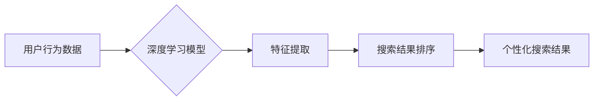

                 

## 深度学习驱动的个性化搜索结果排序

> 关键词：深度学习、个性化搜索、搜索结果排序、推荐系统、用户行为分析、自然语言处理、机器学习

## 1. 背景介绍

在信息爆炸的时代，海量数据和信息涌现，传统的基于关键词匹配的搜索引擎已经难以满足用户日益增长的个性化需求。用户希望搜索结果能够更加精准、相关，并能够根据用户的兴趣、偏好、历史行为等因素进行个性化定制。深度学习技术的兴起为个性化搜索结果排序提供了新的思路和方法。

深度学习算法能够从海量数据中学习用户行为模式和搜索意图，并根据这些模式进行预测和排序。相比于传统的机器学习算法，深度学习算法具有更强的学习能力和表达能力，能够更好地捕捉用户行为的复杂性和多样性。

## 2. 核心概念与联系

### 2.1 个性化搜索

个性化搜索是指根据用户的个人特征、兴趣、偏好等因素，定制化搜索结果，以满足用户的特定需求。个性化搜索的核心目标是提高用户搜索体验，并增强用户对搜索引擎的粘性。

### 2.2 搜索结果排序

搜索结果排序是指根据一定的规则和算法，对搜索结果进行排名，并将排名靠前的结果展示给用户。搜索结果排序是搜索引擎的核心功能之一，直接影响着用户搜索体验和搜索结果的有效性。

### 2.3 深度学习

深度学习是一种机器学习的子领域，它利用多层神经网络来模拟人类大脑的学习过程。深度学习算法能够从海量数据中自动学习特征和模式，并进行预测和分类。

**核心概念与联系流程图**



## 3. 核心算法原理 & 具体操作步骤

### 3.1 算法原理概述

深度学习驱动的个性化搜索结果排序主要利用深度神经网络来学习用户行为模式和搜索意图，并根据这些模式对搜索结果进行排序。常用的深度学习算法包括：

* **多层感知机 (MLP):**  一种简单的深度神经网络，能够学习输入数据之间的非线性关系。
* **卷积神经网络 (CNN):**  擅长处理图像数据，也可以用于文本数据处理，能够学习文本中的特征和模式。
* **循环神经网络 (RNN):**  能够处理序列数据，例如文本和时间序列数据，能够学习文本中的上下文信息和依赖关系。
* **Transformer:**  一种新型的深度神经网络，能够处理长文本序列，并具有强大的文本理解能力。

### 3.2 算法步骤详解

1. **数据收集和预处理:** 收集用户行为数据，例如搜索历史、点击记录、浏览记录、评分等，并进行清洗、转换和特征工程。
2. **模型构建:** 选择合适的深度学习算法，并构建相应的模型架构。
3. **模型训练:** 使用训练数据训练深度学习模型，并通过优化算法调整模型参数，使模型能够准确地预测用户行为和搜索意图。
4. **模型评估:** 使用测试数据评估模型的性能，并进行调优和改进。
5. **部署和上线:** 将训练好的模型部署到生产环境中，并实时对搜索结果进行排序。

### 3.3 算法优缺点

**优点:**

* **学习能力强:** 深度学习算法能够从海量数据中自动学习特征和模式，并进行预测和分类。
* **表达能力强:** 深度神经网络具有强大的表达能力，能够捕捉用户行为的复杂性和多样性。
* **个性化程度高:** 深度学习算法能够根据用户的个人特征和行为模式进行个性化定制。

**缺点:**

* **数据依赖性强:** 深度学习算法需要大量的训练数据才能达到较好的性能。
* **训练成本高:** 训练深度学习模型需要大量的计算资源和时间。
* **可解释性差:** 深度学习模型的内部工作机制比较复杂，难以解释其决策过程。

### 3.4 算法应用领域

深度学习驱动的个性化搜索结果排序在以下领域具有广泛的应用前景:

* **搜索引擎:** 提供更加精准、相关和个性化的搜索结果。
* **电商平台:** 推荐更加符合用户兴趣和需求的商品。
* **社交媒体:** 推荐更加相关的新闻、内容和好友。
* **内容平台:** 推荐更加符合用户兴趣的视频、文章和音频。

## 4. 数学模型和公式 & 详细讲解 & 举例说明

### 4.1 数学模型构建

深度学习驱动的个性化搜索结果排序通常采用以下数学模型:

* **用户嵌入:** 将用户特征转换为低维向量，表示用户的兴趣和偏好。
* **文档嵌入:** 将文档内容转换为低维向量，表示文档的主题和内容。
* **相似度计算:** 计算用户嵌入向量和文档嵌入向量的相似度，作为排序的依据。

### 4.2 公式推导过程

**用户嵌入:**

$$
u = f(x_u)
$$

其中，$x_u$ 是用户的特征向量，$f$ 是一个神经网络函数，用于将用户特征转换为低维向量 $u$。

**文档嵌入:**

$$
d = g(x_d)
$$

其中，$x_d$ 是文档内容的特征向量，$g$ 是一个神经网络函数，用于将文档内容转换为低维向量 $d$。

**相似度计算:**

$$
score(u, d) = \frac{u \cdot d}{||u|| ||d||}
$$

其中，$u \cdot d$ 是用户嵌入向量和文档嵌入向量的点积，$||u||$ 和 $||d||$ 分别是用户嵌入向量和文档嵌入向量的模长。

### 4.3 案例分析与讲解

假设我们有一个电商平台，需要推荐商品给用户。我们可以使用深度学习算法构建一个个性化推荐模型。

1. **用户特征:** 收集用户的购买历史、浏览记录、评分等数据，构建用户的特征向量 $x_u$。
2. **商品特征:** 收集商品的标题、描述、类别、价格等数据，构建商品的特征向量 $x_d$。
3. **模型训练:** 使用深度学习算法训练模型，学习用户嵌入 $u$ 和商品嵌入 $d$。
4. **推荐:** 根据用户的特征向量 $x_u$ 计算用户嵌入 $u$，并与所有商品的嵌入向量 $d$ 进行相似度计算，将相似度最高的商品推荐给用户。

## 5. 项目实践：代码实例和详细解释说明

### 5.1 开发环境搭建

* **操作系统:** Linux 或 macOS
* **编程语言:** Python
* **深度学习框架:** TensorFlow 或 PyTorch
* **其他工具:** Jupyter Notebook、Git

### 5.2 源代码详细实现

```python
import tensorflow as tf

# 定义用户嵌入层
user_embedding = tf.keras.layers.Embedding(input_dim=1000, output_dim=64)

# 定义商品嵌入层
item_embedding = tf.keras.layers.Embedding(input_dim=10000, output_dim=64)

# 定义相似度计算层
similarity_layer = tf.keras.layers.Dot(axes=1)

# 定义模型
model = tf.keras.Sequential([
    user_embedding,
    item_embedding,
    similarity_layer
])

# 编译模型
model.compile(optimizer='adam', loss='mse')

# 训练模型
model.fit(x_train, y_train, epochs=10)

# 预测相似度
predictions = model.predict(x_test)
```

### 5.3 代码解读与分析

* **用户嵌入层和商品嵌入层:** 将用户特征和商品特征转换为低维向量。
* **相似度计算层:** 计算用户嵌入向量和商品嵌入向量的点积，作为相似度的度量。
* **模型编译和训练:** 使用 Adam 优化器和均方误差损失函数训练模型。
* **模型预测:** 使用训练好的模型预测用户和商品之间的相似度。

### 5.4 运行结果展示

训练完成后，可以使用测试数据评估模型的性能，例如计算平均准确率、召回率等指标。

## 6. 实际应用场景

### 6.1 搜索引擎

深度学习驱动的个性化搜索结果排序可以提高搜索引擎的精准度和相关性，例如：

* **Google:** 使用深度学习算法来学习用户的搜索历史和行为模式，并根据这些模式对搜索结果进行排序。
* **Bing:** 使用深度学习算法来理解用户的搜索意图，并提供更加相关的搜索结果。

### 6.2 电商平台

深度学习驱动的个性化推荐系统可以帮助电商平台推荐更加符合用户兴趣和需求的商品，例如：

* **Amazon:** 使用深度学习算法来推荐商品给用户，并根据用户的购买历史和浏览记录进行个性化定制。
* **淘宝:** 使用深度学习算法来推荐商品给用户，并根据用户的兴趣标签和购买偏好进行个性化定制。

### 6.3 社交媒体

深度学习驱动的个性化内容推荐系统可以帮助社交媒体平台推荐更加相关的新闻、内容和好友，例如：

* **Facebook:** 使用深度学习算法来推荐新闻、视频和好友给用户，并根据用户的兴趣和行为模式进行个性化定制。
* **Twitter:** 使用深度学习算法来推荐话题和用户给用户，并根据用户的兴趣和关注者进行个性化定制。

### 6.4 未来应用展望

深度学习驱动的个性化搜索结果排序在未来将有更广泛的应用场景，例如：

* **医疗保健:** 推荐个性化的医疗建议和治疗方案。
* **教育:** 推荐个性化的学习资源和课程。
* **金融:** 提供个性化的理财建议和投资方案。

## 7. 工具和资源推荐

### 7.1 学习资源推荐

* **书籍:**
    * Deep Learning by Ian Goodfellow, Yoshua Bengio, and Aaron Courville
    * Hands-On Machine Learning with Scikit-Learn, Keras & TensorFlow by Aurélien Géron
* **在线课程:**
    * Deep Learning Specialization by Andrew Ng (Coursera)
    * Fast.ai Deep Learning Course
* **博客和网站:**
    * Towards Data Science
    * Machine Learning Mastery

### 7.2 开发工具推荐

* **深度学习框架:** TensorFlow, PyTorch, Keras
* **数据处理工具:** Pandas, NumPy
* **可视化工具:** Matplotlib, Seaborn

### 7.3 相关论文推荐

* **BERT: Pre-training of Deep Bidirectional Transformers for Language Understanding**
* **Attention Is All You Need**
* **Recurrent Neural Network for Sequence Learning**

## 8. 总结：未来发展趋势与挑战

### 8.1 研究成果总结

深度学习驱动的个性化搜索结果排序取得了显著的成果，能够提供更加精准、相关和个性化的搜索体验。

### 8.2 未来发展趋势

* **更强大的模型架构:** 研究更强大的深度学习模型架构，例如 Transformer 和 Graph Neural Networks，以更好地捕捉用户行为模式和搜索意图。
* **多模态搜索:** 将文本、图像、音频等多模态数据融合到搜索结果排序中，提供更加丰富的搜索体验。
* **联邦学习:** 利用联邦学习技术，在保护用户隐私的前提下进行个性化搜索结果排序。

### 8.3 面临的挑战

* **数据隐私:** 如何保护用户数据隐私，同时实现个性化搜索结果排序是一个重要的挑战。
* **模型解释性:** 深度学习模型的内部工作机制比较复杂，难以解释其决策过程，这可能会导致用户对搜索结果的信任度降低。
* **公平性:** 个性化搜索结果排序可能会导致信息茧房效应，用户只看到自己感兴趣的信息，而忽略其他重要的信息。

### 8.4 研究展望

未来，深度学习驱动的个性化搜索结果排序将继续朝着更加精准、个性化、公平的方向发展，并与其他人工智能技术融合，为用户提供更加智能、便捷的搜索体验。

## 9. 附录：常见问题与解答

**Q1: 深度学习驱动的个性化搜索结果排序与传统的基于关键词匹配的搜索引擎相比有什么优势？**

**A1:** 深度学习驱动的个性化搜索结果排序能够更好地理解用户的搜索意图，并根据用户的个人特征和行为模式进行个性化定制，从而提供更加精准、相关和个性化的搜索体验。

**Q2: 深度学习驱动的个性化搜索结果排序需要多少数据才能训练？**

**A2:** 深度学习算法需要大量的训练数据才能达到较好的性能，通常需要百万甚至数十亿条数据。

**Q3: 如何解决深度学习驱动的个性化搜索结果排序中的数据隐私问题？**

**A3:** 可以使用联邦学习技术，在保护用户隐私的前提下进行个性化搜索结果排序。

**作者：禅与计算机程序设计艺术 / Zen and the Art of Computer Programming**<end_of_turn>

