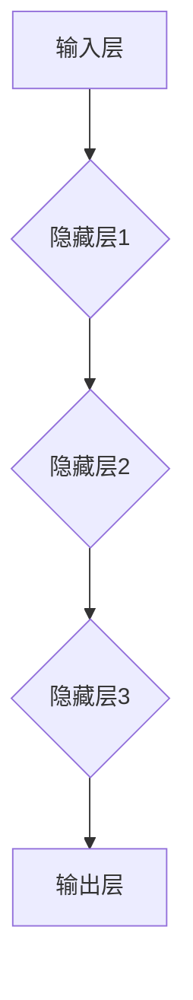

                 

## 理解的深度：从表面现象到本质规律的洞察

> 关键词：深度学习、神经网络、机器学习、算法原理、数学模型、实际应用

### 1. 背景介绍

在当今数据爆炸的时代，人工智能（AI）正以惊人的速度发展，深度学习作为其核心驱动力，在图像识别、自然语言处理、语音识别等领域取得了突破性的进展。然而，深度学习的成功并非偶然，它背后蕴含着深刻的数学原理和算法设计，以及对数据本质的深刻理解。

传统的机器学习方法依赖于人工特征工程，需要人类专家耗费大量时间和精力来提取数据的特征。而深度学习则通过多层神经网络自动学习数据特征，无需人工干预，能够从海量数据中发现隐藏的模式和规律。

### 2. 核心概念与联系

深度学习的核心概念是**人工神经网络（ANN）**。ANN由多个相互连接的神经元组成，每个神经元接收来自其他神经元的输入信号，并根据一定的激活函数进行处理，输出到下一个神经元。

神经网络的结构可以分为**输入层、隐藏层和输出层**。输入层接收原始数据，隐藏层对数据进行特征提取和转换，输出层输出最终结果。

深度学习的关键在于**隐藏层的深度**。深度神经网络拥有多层隐藏层，能够学习更复杂的特征表示，从而提高模型的表达能力和泛化能力。

**Mermaid 流程图**



### 3. 核心算法原理 & 具体操作步骤

#### 3.1 算法原理概述

深度学习算法的核心是**反向传播算法（Backpropagation）**。反向传播算法通过计算误差，并根据误差反向调整神经网络的权重和偏置，从而使模型的预测结果越来越接近真实值。

#### 3.2 算法步骤详解

1. **前向传播：** 将输入数据传递到神经网络，计算每个神经元的输出值。
2. **误差计算：** 将神经网络的输出值与真实值进行比较，计算误差。
3. **反向传播：** 将误差反向传播到每个神经元，计算每个神经元的梯度。
4. **权重更新：** 根据梯度更新神经网络的权重和偏置，使模型的预测结果越来越接近真实值。

#### 3.3 算法优缺点

**优点：**

* 自动学习特征，无需人工特征工程。
* 表达能力强，能够学习复杂的数据模式。
* 泛化能力强，能够应用于不同的数据场景。

**缺点：**

* 训练时间长，需要大量的计算资源。
* 容易过拟合，需要进行正则化和交叉验证等技术来避免。
* 对数据质量要求高，需要大量的干净、高质量的数据进行训练。

#### 3.4 算法应用领域

深度学习算法广泛应用于以下领域：

* **图像识别：** 人脸识别、物体检测、图像分类等。
* **自然语言处理：** 机器翻译、文本摘要、情感分析等。
* **语音识别：** 语音转文本、语音助手等。
* **推荐系统：** 商品推荐、内容推荐等。
* **医疗诊断：** 疾病诊断、影像分析等。

### 4. 数学模型和公式 & 详细讲解 & 举例说明

#### 4.1 数学模型构建

深度学习模型的数学基础是**线性代数**和**微积分**。

* **线性代数**用于表示神经网络的权重、偏置和激活函数。
* **微积分**用于计算误差梯度，并更新神经网络的权重和偏置。

#### 4.2 公式推导过程

反向传播算法的核心公式是**链式法则**。链式法则用于计算误差对每个神经元的权重和偏置的导数。

$$
\frac{\partial E}{\partial w_i} = \frac{\partial E}{\partial a_j} \cdot \frac{\partial a_j}{\partial w_i}
$$

其中：

* $E$ 是误差函数。
* $w_i$ 是第 $i$ 个权重。
* $a_j$ 是第 $j$ 个神经元的输出值。

#### 4.3 案例分析与讲解

假设我们有一个简单的深度学习模型，包含一个输入层、一个隐藏层和一个输出层。隐藏层包含两个神经元。

我们可以使用链式法则计算误差对每个权重的导数，并根据这些导数更新权重。

### 5. 项目实践：代码实例和详细解释说明

#### 5.1 开发环境搭建

为了实现深度学习模型，我们需要搭建一个开发环境。常用的开发环境包括：

* **Python**：深度学习的编程语言。
* **TensorFlow** 或 **PyTorch**：深度学习框架。
* **GPU**：加速深度学习训练。

#### 5.2 源代码详细实现

以下是一个使用 TensorFlow 实现简单的深度学习模型的代码示例：

```python
import tensorflow as tf

# 定义模型结构
model = tf.keras.models.Sequential([
  tf.keras.layers.Dense(128, activation='relu', input_shape=(784,)),
  tf.keras.layers.Dense(10, activation='softmax')
])

# 编译模型
model.compile(optimizer='adam',
              loss='sparse_categorical_crossentropy',
              metrics=['accuracy'])

# 训练模型
model.fit(x_train, y_train, epochs=10)

# 评估模型
loss, accuracy = model.evaluate(x_test, y_test)
print('Test loss:', loss)
print('Test accuracy:', accuracy)
```

#### 5.3 代码解读与分析

这段代码定义了一个简单的深度学习模型，包含两个全连接层。

* 第一个全连接层有 128 个神经元，使用 ReLU 激活函数。
* 第二个全连接层有 10 个神经元，使用 softmax 激活函数。

模型使用 Adam 优化器，损失函数为 sparse_categorical_crossentropy，评估指标为准确率。

#### 5.4 运行结果展示

训练完成后，我们可以使用测试数据评估模型的性能。

### 6. 实际应用场景

深度学习在各个领域都有广泛的应用场景：

#### 6.1 图像识别

* **人脸识别：** 用于解锁手机、身份验证等。
* **物体检测：** 用于自动驾驶、安防监控等。
* **图像分类：** 用于医学影像诊断、产品分类等。

#### 6.2 自然语言处理

* **机器翻译：** 将一种语言翻译成另一种语言。
* **文本摘要：** 自动生成文本的摘要。
* **情感分析：** 分析文本的情感倾向。

#### 6.3 语音识别

* **语音转文本：** 将语音转换为文本。
* **语音助手：** 例如 Siri、Alexa 等。

#### 6.4 其他应用场景

* **推荐系统：** 推荐商品、内容等。
* **医疗诊断：** 辅助医生进行疾病诊断。
* **金融预测：** 预测股票价格、风险评估等。

#### 6.5 未来应用展望

随着深度学习技术的不断发展，其应用场景将更加广泛，例如：

* **个性化教育：** 根据学生的学习情况提供个性化的学习方案。
* **智能医疗：** 辅助医生进行更精准的诊断和治疗。
* **自动驾驶：** 实现更安全、更智能的自动驾驶。

### 7. 工具和资源推荐

#### 7.1 学习资源推荐

* **书籍：**
    * 《深度学习》
    * 《神经网络与深度学习》
    * 《机器学习》
* **在线课程：**
    * Coursera 上的深度学习课程
    * Udacity 上的深度学习课程
    * fast.ai 上的深度学习课程

#### 7.2 开发工具推荐

* **TensorFlow：** Google 开发的开源深度学习框架。
* **PyTorch：** Facebook 开发的开源深度学习框架。
* **Keras：** TensorFlow 上的深度学习 API。

#### 7.3 相关论文推荐

* **AlexNet：** 《ImageNet Classification with Deep Convolutional Neural Networks》
* **VGGNet：** 《Very Deep Convolutional Networks for Large-Scale Image Recognition》
* **ResNet：** 《Deep Residual Learning for Image Recognition》

### 8. 总结：未来发展趋势与挑战

#### 8.1 研究成果总结

深度学习在过去几年取得了显著的进展，在图像识别、自然语言处理等领域取得了突破性的成果。

#### 8.2 未来发展趋势

* **模型更深、更复杂：** 研究更深层次、更复杂的深度学习模型。
* **数据更丰富、更多样化：** 利用更多类型的数据进行训练，提高模型的泛化能力。
* **算法更高效、更鲁棒：** 研究更有效的训练算法，提高模型的训练效率和鲁棒性。
* **解释性更强：** 研究如何解释深度学习模型的决策过程，提高模型的可解释性。

#### 8.3 面临的挑战

* **数据隐私和安全：** 深度学习模型需要大量的训练数据，如何保护数据隐私和安全是一个重要的挑战。
* **模型可解释性：** 深度学习模型的决策过程往往是复杂的，如何解释模型的决策过程是一个重要的挑战。
* **公平性和偏见：** 深度学习模型可能存在公平性和偏见问题，需要研究如何解决这些问题。

#### 8.4 研究展望

未来，深度学习将继续发展，并在更多领域发挥重要作用。我们需要不断探索新的算法、新的模型、新的应用场景，并解决深度学习面临的挑战，推动深度学习技术向更安全、更可靠、更可解释的方向发展。

### 9. 附录：常见问题与解答

#### 9.1 什么是深度学习？

深度学习是一种机器学习的子领域，它使用多层神经网络来学习数据特征。

#### 9.2 深度学习有哪些应用场景？

深度学习在各个领域都有广泛的应用场景，例如图像识别、自然语言处理、语音识别等。

#### 9.3 如何学习深度学习？

可以通过阅读书籍、参加在线课程、学习开源框架等方式学习深度学习。

#### 9.4 深度学习有哪些挑战？

深度学习面临着数据隐私和安全、模型可解释性、公平性和偏见等挑战。


作者：禅与计算机程序设计艺术 / Zen and the Art of Computer Programming 
<end_of_turn>

