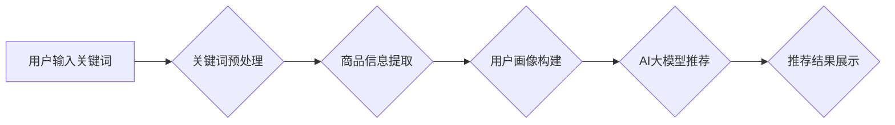

                 

## 电商平台的AI 大模型实践：以搜索推荐系统为核心的转型

> 关键词：电商平台、AI大模型、搜索推荐系统、Transformer、自然语言处理、深度学习、个性化推荐

## 1. 背景介绍

在当今数据爆炸的时代，电商平台面临着日益激烈的竞争。用户需求日益多元化，商品种类繁多，如何精准地将用户与心仪的商品连接起来，成为了电商平台的核心挑战。传统基于规则的搜索推荐系统已经难以满足用户个性化需求，而AI大模型的出现为电商平台转型升级提供了新的机遇。

AI大模型，特别是基于Transformer架构的模型，在自然语言处理领域取得了突破性的进展，展现出强大的文本理解和生成能力。这些能力可以有效地应用于电商平台的搜索推荐系统，提升用户体验，提高转化率。

## 2. 核心概念与联系

### 2.1  搜索推荐系统

搜索推荐系统是电商平台的核心功能之一，旨在帮助用户快速找到所需商品。传统的搜索推荐系统主要依赖于关键词匹配和商品属性分析，但这种方法难以捕捉用户隐性的需求和兴趣。

### 2.2  AI大模型

AI大模型是指具有海量参数和强大的学习能力的深度学习模型。这些模型通过训练海量数据，能够学习到复杂的模式和关系，从而实现对文本、图像、音频等多种数据类型的理解和生成。

### 2.3  Transformer架构

Transformer是一种新型的深度学习架构，其核心是注意力机制。注意力机制能够让模型关注输入序列中最重要的部分，从而提高模型的理解能力和表达能力。

**Mermaid 流程图**



## 3. 核心算法原理 & 具体操作步骤

### 3.1  算法原理概述

基于Transformer架构的搜索推荐系统，主要利用以下核心算法：

* **词嵌入:** 将关键词和商品描述转化为向量表示，以便模型进行理解和比较。
* **注意力机制:** 允许模型关注输入序列中最重要的部分，从而提高推荐的准确性。
* **多头注意力:** 使用多个注意力头，可以捕捉到不同层次的语义信息。
* **前馈网络:** 对注意力机制输出进行进一步的处理，生成最终的推荐结果。

### 3.2  算法步骤详解

1. **数据预处理:** 收集用户行为数据、商品信息数据等，并进行清洗、格式化等处理。
2. **词嵌入:** 使用Word2Vec、GloVe等词嵌入模型，将关键词和商品描述转化为向量表示。
3. **构建Transformer模型:** 根据具体需求，选择合适的Transformer模型架构，并进行参数调整。
4. **模型训练:** 使用训练数据，训练Transformer模型，使其能够学习到用户需求和商品特征之间的关系。
5. **模型评估:** 使用测试数据，评估模型的性能，并进行调参优化。
6. **部署上线:** 将训练好的模型部署到线上环境，实现实时推荐。

### 3.3  算法优缺点

**优点:**

* 能够捕捉到用户隐性的需求和兴趣。
* 推荐结果更加个性化和精准。
* 能够处理海量数据，并进行实时推荐。

**缺点:**

* 模型训练需要大量的计算资源和时间。
* 模型参数众多，需要进行细致的调参。
* 模型解释性较差，难以理解模型的推荐决策。

### 3.4  算法应用领域

* **电商平台搜索推荐:** 帮助用户快速找到心仪的商品。
* **内容推荐:** 为用户推荐个性化的新闻、视频、文章等内容。
* **广告推荐:** 为用户推荐相关的广告信息。
* **金融领域:** 为用户推荐理财产品、贷款服务等。

## 4. 数学模型和公式 & 详细讲解 & 举例说明

### 4.1  数学模型构建

Transformer模型的核心是注意力机制，其数学模型可以表示为：

$$
Attention(Q, K, V) = softmax(\frac{QK^T}{\sqrt{d_k}})V
$$

其中：

* $Q$：查询矩阵
* $K$：键矩阵
* $V$：值矩阵
* $d_k$：键向量的维度
* $softmax$：softmax函数

### 4.2  公式推导过程

注意力机制的目的是计算查询向量 $Q$ 与键向量 $K$ 之间的相似度，并根据相似度对值向量 $V$ 进行加权求和。

* $QK^T$：计算查询向量与键向量的点积，得到一个得分矩阵。
* $\frac{QK^T}{\sqrt{d_k}}$：对得分矩阵进行归一化，使得每个元素的范围在0到1之间。
* $softmax$：对归一化后的得分矩阵进行softmax操作，得到每个键向量的权重。
* $V$：使用权重对值向量进行加权求和，得到最终的注意力输出。

### 4.3  案例分析与讲解

假设我们有一个句子 "我爱吃苹果"，我们要计算 "吃" 这个词与整个句子的相关性。

* $Q$：将 "吃" 这个词作为查询向量。
* $K$：将句子的每个词作为键向量。
* $V$：将句子的每个词作为值向量。

通过计算注意力机制，我们可以得到 "吃" 这个词与每个词的相似度，并根据相似度对句子的每个词进行加权求和，最终得到 "吃" 这个词与整个句子的相关性。

## 5. 项目实践：代码实例和详细解释说明

### 5.1  开发环境搭建

* Python 3.6+
* TensorFlow/PyTorch
* CUDA/cuDNN

### 5.2  源代码详细实现

```python
# 导入必要的库
import tensorflow as tf

# 定义Transformer模型
class Transformer(tf.keras.Model):
    def __init__(self, vocab_size, embedding_dim, num_heads, num_layers):
        super(Transformer, self).__init__()
        self.embedding = tf.keras.layers.Embedding(vocab_size, embedding_dim)
        self.transformer_layers = tf.keras.layers.StackedRNNCells([
            tf.keras.layers.MultiHeadAttention(num_heads=num_heads, key_dim=embedding_dim)
            for _ in range(num_layers)
        ])

    def call(self, inputs):
        # 将输入转换为嵌入向量
        embedded_inputs = self.embedding(inputs)
        # 通过Transformer层进行处理
        outputs = self.transformer_layers(embedded_inputs)
        return outputs

# 实例化Transformer模型
model = Transformer(vocab_size=10000, embedding_dim=128, num_heads=8, num_layers=6)

# 训练模型
model.compile(optimizer='adam', loss='mse')
model.fit(x_train, y_train, epochs=10)
```

### 5.3  代码解读与分析

* **模型定义:** 定义了一个Transformer模型，包含嵌入层、多头注意力层和前馈网络层。
* **嵌入层:** 将输入的词语转换为向量表示。
* **多头注意力层:** 允许模型关注输入序列中最重要的部分。
* **前馈网络层:** 对注意力机制输出进行进一步的处理。
* **模型训练:** 使用训练数据训练模型，并使用均方误差作为损失函数。

### 5.4  运行结果展示

训练完成后，可以使用测试数据评估模型的性能，并根据需要进行调参优化。

## 6. 实际应用场景

### 6.1  电商平台搜索推荐

基于Transformer架构的搜索推荐系统，能够根据用户的搜索历史、浏览记录、购买行为等信息，精准推荐用户感兴趣的商品。

### 6.2  个性化推荐

电商平台可以利用用户画像数据，为用户提供个性化的商品推荐，例如推荐用户可能喜欢的品牌、风格、价格等。

### 6.3  内容推荐

电商平台可以利用用户浏览记录、点赞记录等信息，推荐用户可能感兴趣的商品资讯、视频、文章等内容。

### 6.4  未来应用展望

随着AI技术的不断发展，电商平台的搜索推荐系统将更加智能化、个性化和精准化。未来，我们可以期待看到以下应用场景：

* **多模态推荐:** 将文本、图像、视频等多种数据类型融合在一起，提供更加丰富的推荐体验。
* **实时推荐:** 基于用户的实时行为，提供更加精准的推荐。
* **协同推荐:** 利用用户之间的关系，提供更加个性化的推荐。

## 7. 工具和资源推荐

### 7.1  学习资源推荐

* **书籍:**
    * 《深度学习》
    * 《Transformer模型详解》
* **在线课程:**
    * Coursera: 深度学习
    * Udacity: 自然语言处理
* **博客:**
    * Jay Alammar's Blog
    * The Gradient

### 7.2  开发工具推荐

* **TensorFlow:** 开源深度学习框架
* **PyTorch:** 开源深度学习框架
* **Hugging Face Transformers:** 预训练Transformer模型库

### 7.3  相关论文推荐

* **Attention Is All You Need:** https://arxiv.org/abs/1706.03762
* **BERT: Pre-training of Deep Bidirectional Transformers for Language Understanding:** https://arxiv.org/abs/1810.04805

## 8. 总结：未来发展趋势与挑战

### 8.1  研究成果总结

基于Transformer架构的搜索推荐系统，在电商平台的应用中取得了显著的成果，能够有效地提升用户体验和转化率。

### 8.2  未来发展趋势

* **多模态推荐:** 将文本、图像、视频等多种数据类型融合在一起，提供更加丰富的推荐体验。
* **实时推荐:** 基于用户的实时行为，提供更加精准的推荐。
* **协同推荐:** 利用用户之间的关系，提供更加个性化的推荐。

### 8.3  面临的挑战

* **模型解释性:** Transformer模型的内部机制较为复杂，难以理解模型的推荐决策。
* **数据隐私:** 电商平台需要收集大量的用户数据，如何保护用户隐私是一个重要的挑战。
* **模型可维护性:** Transformer模型参数众多，模型更新和维护较为复杂。

### 8.4  研究展望

未来，我们需要继续研究Transformer模型的解释性、数据隐私保护和模型可维护性等问题，并探索新的应用场景，推动电商平台的搜索推荐系统朝着更加智能化、个性化和精准化的方向发展。

## 9. 附录：常见问题与解答

**Q1: Transformer模型的训练需要大量的计算资源，如何降低训练成本？**

**A1:** 可以使用预训练模型，例如BERT、GPT等，并进行微调，降低训练成本。

**Q2: 如何评估Transformer模型的性能？**

**A2:** 可以使用准确率、召回率、F1-score等指标评估模型的性能。

**Q3: 如何解决Transformer模型的过拟合问题？**

**A3:** 可以使用正则化技术、Dropout等方法，防止模型过拟合。


作者：禅与计算机程序设计艺术 / Zen and the Art of Computer Programming 
<end_of_turn>

