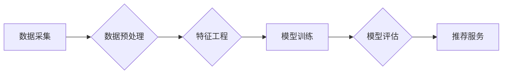

                 

## 电商平台的AI 大模型实践：搜索推荐系统是核心，数据质量控制是关键

> 关键词：电商平台、AI大模型、搜索推荐系统、数据质量控制、深度学习、自然语言处理、推荐算法、模型训练、数据清洗、数据标注

## 1. 背景介绍

随着电商平台的蓬勃发展，用户对商品搜索和推荐的需求日益增长。传统的基于规则的搜索推荐系统已经难以满足用户个性化、精准化的需求。因此，人工智能（AI）大模型的应用成为电商平台提升用户体验和商业效益的关键驱动力。

AI大模型，特别是基于深度学习的模型，能够从海量数据中学习用户行为、商品特征等复杂模式，从而实现更精准、更个性化的搜索和推荐。例如，BERT、GPT等自然语言处理（NLP）模型可以理解用户搜索意图，推荐更相关的商品；协同过滤、深度神经网络等推荐算法可以根据用户的历史行为和商品属性，预测用户对商品的兴趣，并提供个性化的推荐。

然而，AI大模型的应用也面临着诸多挑战，其中数据质量控制尤为重要。AI模型的训练效果直接取决于训练数据的质量，而电商平台的数据往往存在着噪声、缺失、不一致等问题，这些问题会直接影响模型的准确性和可靠性。

## 2. 核心概念与联系

### 2.1 搜索推荐系统架构

电商平台的搜索推荐系统通常由以下几个核心模块组成：

* **数据采集模块:** 收集用户行为数据、商品信息数据等各种数据源。
* **数据预处理模块:** 对采集到的数据进行清洗、转换、格式化等处理，使其符合模型训练要求。
* **特征工程模块:** 从原始数据中提取特征，例如用户性别、年龄、购买历史、商品类别、价格等，这些特征将作为模型训练的输入。
* **模型训练模块:** 使用深度学习算法训练模型，例如BERT、GPT、协同过滤、深度神经网络等，以学习用户行为和商品特征之间的关系。
* **模型评估模块:** 对训练好的模型进行评估，例如准确率、召回率、点击率等指标，以衡量模型的性能。
* **推荐服务模块:** 将训练好的模型部署到线上环境，根据用户的查询或浏览行为，实时生成商品推荐结果。

**Mermaid 流程图:**



### 2.2 数据质量控制的重要性

数据质量直接影响AI模型的训练效果和最终的推荐结果。电商平台的数据往往存在以下问题：

* **噪声数据:** 数据中包含错误、重复、不完整等信息。
* **缺失数据:** 部分数据字段缺失，导致模型训练不充分。
* **不一致数据:** 同一商品信息在不同数据源中存在差异。
* **数据偏差:** 数据样本不均衡，导致模型对某些用户或商品的推荐效果较差。

这些问题会导致模型训练不稳定，推荐结果不准确，甚至产生负面影响，例如推荐不相关的商品、推荐虚假信息等。因此，数据质量控制是AI大模型应用的关键环节。

## 3. 核心算法原理 & 具体操作步骤

### 3.1 算法原理概述

电商平台的搜索推荐系统通常采用以下几种核心算法：

* **协同过滤:** 基于用户的历史行为和商品的购买记录，预测用户对商品的兴趣。
* **基于内容的推荐:** 基于商品的属性和用户偏好，推荐相关的商品。
* **深度学习推荐:** 使用深度神经网络模型，学习用户行为和商品特征之间的复杂关系，实现更精准的推荐。

### 3.2 算法步骤详解

**协同过滤算法:**

1. **用户-商品矩阵构建:** 将用户和商品信息存储在一个矩阵中，每个元素表示用户对商品的评分或购买行为。
2. **相似用户/商品计算:** 使用余弦相似度等算法计算用户之间的相似度或商品之间的相似度。
3. **推荐生成:** 根据用户的相似用户或商品，推荐用户可能感兴趣的商品。

**基于内容的推荐算法:**

1. **商品特征提取:** 从商品信息中提取特征，例如商品类别、价格、品牌等。
2. **用户偏好建模:** 根据用户的历史行为，构建用户偏好的模型，例如用户对不同商品类别的偏好。
3. **推荐生成:** 根据商品特征和用户偏好，推荐用户可能感兴趣的商品。

**深度学习推荐算法:**

1. **数据预处理:** 对数据进行清洗、转换、格式化等处理。
2. **模型构建:** 使用深度神经网络模型，例如多层感知机（MLP）、卷积神经网络（CNN）、循环神经网络（RNN）等，构建推荐模型。
3. **模型训练:** 使用训练数据训练模型，优化模型参数。
4. **模型评估:** 使用测试数据评估模型性能，例如准确率、召回率、点击率等指标。
5. **推荐生成:** 将训练好的模型部署到线上环境，根据用户的查询或浏览行为，实时生成商品推荐结果。

### 3.3 算法优缺点

| 算法类型 | 优点 | 缺点 |
|---|---|---|
| 协同过滤 | 能够发现用户之间的隐性关系，推荐个性化商品 | 需要大量用户数据，对冷启动问题敏感 |
| 基于内容的推荐 | 不需要大量用户数据，能够推荐相关商品 | 容易陷入内容孤岛，推荐结果单一 |
| 深度学习推荐 | 能够学习用户行为和商品特征之间的复杂关系，推荐效果更精准 | 需要大量数据和计算资源，模型训练复杂 |

### 3.4 算法应用领域

* **电商平台:** 商品推荐、搜索结果排序、用户画像分析等。
* **社交媒体:** 内容推荐、用户匹配、广告投放等。
* **音乐平台:** 音乐推荐、用户个性化播放列表等。
* **视频平台:** 视频推荐、用户兴趣分析等。

## 4. 数学模型和公式 & 详细讲解 & 举例说明

### 4.1 数学模型构建

协同过滤算法的数学模型通常使用矩阵分解技术，将用户-商品矩阵分解成两个低维矩阵，分别表示用户特征和商品特征。

假设用户集合为U，商品集合为I，用户-商品矩阵为R，其中R(u,i)表示用户u对商品i的评分或购买行为。

则可以将R分解成两个低维矩阵：

* **用户特征矩阵:** P，其中P(u,:)表示用户u的特征向量。
* **商品特征矩阵:** Q，其中Q(i,:)表示商品i的特征向量。

则用户u对商品i的评分可以表示为：

R(u,i) ≈ P(u,:) * Q(i,:)

### 4.2 公式推导过程

矩阵分解的目标是找到最优的P和Q矩阵，使得预测评分与实际评分之间的误差最小。

常用的损失函数是均方误差（MSE）：

MSE = ∑_(u∈U) ∑_(i∈I) (R(u,i) - P(u,:) * Q(i,:))²

可以使用梯度下降算法优化P和Q矩阵，最小化MSE。

### 4.3 案例分析与讲解

假设有一个用户-商品矩阵，其中R(1,1) = 5表示用户1对商品1的评分为5，R(2,2) = 4表示用户2对商品2的评分为4。

可以使用矩阵分解技术将这个矩阵分解成两个低维矩阵，例如：

* P = [[0.8, 0.2], [0.5, 0.7]]
* Q = [[0.6, 0.4], [0.3, 0.9]]

则可以预测用户1对商品2的评分：

P(1,:) * Q(2,:) ≈ 0.8 * 0.3 + 0.2 * 0.9 ≈ 0.39

## 5. 项目实践：代码实例和详细解释说明

### 5.1 开发环境搭建

* Python 3.x
* TensorFlow/PyTorch 等深度学习框架
* Scikit-learn 等机器学习库
* Jupyter Notebook 等开发环境

### 5.2 源代码详细实现

```python
# 导入必要的库
import tensorflow as tf

# 定义用户-商品矩阵
R = tf.constant([[5, 0], [0, 4], [3, 2]])

# 定义用户特征矩阵和商品特征矩阵
P = tf.Variable(tf.random.normal([3, 2]))
Q = tf.Variable(tf.random.normal([2, 2]))

# 定义预测评分函数
def predict_rating(u, i):
  return tf.reduce_sum(P[u, :] * Q[i, :])

# 定义损失函数
def loss_function(R, P, Q):
  predictions = predict_rating(tf.range(R.shape[0]), tf.range(R.shape[1]))
  return tf.reduce_mean(tf.square(predictions - R))

# 定义优化器
optimizer = tf.keras.optimizers.Adam()

# 训练模型
for epoch in range(100):
  with tf.GradientTape() as tape:
    loss = loss_function(R, P, Q)
  gradients = tape.gradient(loss, [P, Q])
  optimizer.apply_gradients(zip(gradients, [P, Q]))

# 打印训练结果
print(loss)
```

### 5.3 代码解读与分析

* 代码首先定义了用户-商品矩阵R，以及用户特征矩阵P和商品特征矩阵Q。
* 然后定义了预测评分函数predict_rating，计算用户对商品的评分。
* 损失函数loss_function计算预测评分与实际评分之间的误差。
* 使用Adam优化器优化模型参数P和Q，最小化损失函数。
* 最后打印训练结果，即损失函数的值。

### 5.4 运行结果展示

训练完成后，可以将训练好的P和Q矩阵用于预测用户对商品的评分。

## 6. 实际应用场景

### 6.1 电商平台商品推荐

电商平台可以利用AI大模型的搜索推荐系统，根据用户的浏览历史、购买记录、兴趣偏好等信息，推荐用户可能感兴趣的商品。

### 6.2 搜索结果排序

AI大模型可以学习用户搜索意图，对搜索结果进行排序，将更相关的商品排在前面，提升用户搜索体验。

### 6.3 个性化营销

AI大模型可以分析用户的行为数据，构建用户画像，为用户提供个性化的营销服务，例如推荐优惠活动、推送个性化广告等。

### 6.4 未来应用展望

* **多模态推荐:** 将文本、图像、视频等多模态数据融合到推荐系统中，实现更精准、更丰富的推荐。
* **实时推荐:** 利用实时数据流，实现对用户行为的实时分析和推荐。
* **跨平台推荐:** 将用户数据和商品信息整合到多个平台，实现跨平台的个性化推荐。

## 7. 工具和资源推荐

### 7.1 学习资源推荐

* **书籍:**
    * Deep Learning by Ian Goodfellow
    * Hands-On Machine Learning with Scikit-Learn, Keras & TensorFlow by Aurélien Géron
* **在线课程:**
    * Coursera: Deep Learning Specialization
    * Udacity: Deep Learning Nanodegree
* **博客和网站:**
    * Towards Data Science
    * Machine Learning Mastery

### 7.2 开发工具推荐

* **深度学习框架:** TensorFlow, PyTorch, Keras
* **机器学习库:** Scikit-learn, XGBoost
* **数据处理工具:** Pandas, NumPy

### 7.3 相关论文推荐

* **BERT:** Devlin et al., BERT: Pre-training of Deep Bidirectional Transformers for Language Understanding
* **GPT:** Radford et al., Language Models are Few-Shot Learners
* **协同过滤:** Goldberg, D. (1992). Collaborative filtering for personalized recommendations.

## 8. 总结：未来发展趋势与挑战

### 8.1 研究成果总结

AI大模型在电商平台的搜索推荐系统中取得了显著的成果，能够实现更精准、更个性化的推荐，提升用户体验和商业效益。

### 8.2 未来发展趋势

* **模型规模和能力的提升:** 未来AI大模型将更加庞大，拥有更强的学习能力，能够处理更复杂的数据和任务。
* **多模态融合:** 将文本、图像、视频等多模态数据融合到推荐系统中，实现更丰富的推荐体验。
* **个性化和场景化推荐:** 根据用户的不同场景和需求，提供更个性化的推荐服务。
* **可解释性和透明性:** 提升AI模型的可解释性和透明性，帮助用户理解推荐结果背后的逻辑。

### 8.3 面临的挑战

* **数据质量控制:** AI模型的训练效果直接取决于数据质量，数据噪声、缺失、不一致等问题会影响模型性能。
* **模型训练成本:** 训练大型AI模型需要大量的计算资源和时间，成本较高。
* **隐私保护:** AI模型的训练和应用可能会涉及用户隐私数据，需要采取有效的隐私保护措施。
* **公平性和偏见:** AI模型可能会存在公平性和偏见问题，需要进行充分的测试和评估，确保模型的公平性。

### 8.4 研究展望

未来，AI大模型在电商平台的应用将更加广泛，更加智能化。研究者将继续探索新的模型架构、训练方法和应用场景，推动AI技术在电商领域的创新发展。

## 9. 附录：常见问题与解答

* **Q: 如何解决数据质量问题？**

A: 数据质量控制是一个持续的过程，需要从数据采集、预处理、存储、使用等各个环节进行控制。可以采用数据清洗、数据标准化、数据验证等方法，提高数据质量。

* **Q: 如何选择合适的AI模型？**

A: 选择合适的AI模型需要根据具体应用场景和数据特点进行选择。例如，协同过滤算法适用于用户行为数据丰富的场景，基于内容的推荐算法适用于商品信息丰富的场景，深度学习推荐算法适用于数据量大、特征复杂的情况。

* **Q: 如何评估AI模型的性能？**

A: 可以使用准确率、召回率、点击率等指标评估AI模型的性能。

* **Q: 如何保证AI模型的公平性和透明性？**

A: 可以采用公平性评估指标、可解释性模型等方法，提高AI模型的公平性和透明性。


作者：禅与计算机程序设计艺术 / Zen and the Art of Computer Programming<end_of_turn>

