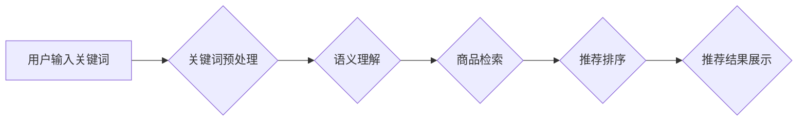

                 

## 电商平台的AI 大模型战略：以搜索推荐系统为核心驱动业务增长

> 关键词：电商平台、AI大模型、搜索推荐系统、业务增长、深度学习、Transformer、个性化推荐、模型训练、数据处理

## 1. 背景介绍

在当今数据爆炸的时代，电商平台面临着激烈的竞争压力。如何精准地抓住用户需求，提供个性化的商品推荐，提升用户体验，成为电商平台发展的重要课题。传统基于规则的推荐系统难以适应用户行为的多样性和复杂性，而AI大模型凭借其强大的学习能力和泛化能力，为电商平台带来了新的机遇。

AI大模型，特别是基于Transformer架构的模型，在自然语言处理、图像识别等领域取得了突破性进展。其强大的语义理解和模式识别能力，为构建更精准、更智能的搜索推荐系统提供了强有力的技术支撑。

## 2. 核心概念与联系

### 2.1  AI大模型

AI大模型是指在海量数据上训练，拥有庞大参数规模的深度学习模型。其特点是：

* **规模庞大:** 参数数量通常在数十亿甚至数千亿级别。
* **泛化能力强:** 能够应用于多种任务，例如文本分类、机器翻译、图像识别等。
* **学习能力强:** 可以从海量数据中学习复杂的模式和关系。

### 2.2  搜索推荐系统

搜索推荐系统是电商平台的核心功能之一，旨在帮助用户快速找到所需商品。其主要功能包括：

* **商品搜索:** 根据用户输入的关键词，返回相关商品列表。
* **商品推荐:** 根据用户的历史浏览记录、购买行为等信息，推荐用户可能感兴趣的商品。

### 2.3  AI大模型与搜索推荐系统的结合

AI大模型可以显著提升搜索推荐系统的性能，主要体现在以下几个方面：

* **更精准的商品搜索:** AI大模型可以理解用户搜索意图，即使用户输入的关键词不完整或模糊，也能返回更精准的搜索结果。
* **更个性化的商品推荐:** AI大模型可以学习用户的兴趣偏好，并根据用户的行为轨迹，推荐更符合用户需求的商品。
* **更丰富的推荐内容:** AI大模型可以挖掘商品之间的关联关系，推荐用户可能没有想到的商品组合。

**Mermaid 流程图:**



## 3. 核心算法原理 & 具体操作步骤

### 3.1  算法原理概述

在电商平台的搜索推荐系统中，常用的AI大模型算法包括：

* **深度神经网络:** 能够学习复杂的非线性关系，用于商品搜索和推荐排序。
* **Transformer:** 能够捕捉文本序列中的长距离依赖关系，用于理解用户搜索意图和商品描述。
* **协同过滤:** 基于用户的历史行为数据，预测用户对商品的评分或购买意愿。

### 3.2  算法步骤详解

以Transformer模型为例，其在电商平台搜索推荐系统中的具体操作步骤如下：

1. **数据预处理:** 将用户搜索词、商品描述等文本数据进行清洗、分词、词向量化等处理。
2. **模型训练:** 使用预处理后的数据训练Transformer模型，使其能够学习用户搜索意图和商品特征之间的关系。
3. **模型预测:** 将用户新的搜索词输入到训练好的模型中，模型会输出商品的排序结果。
4. **结果展示:** 将排序结果展示给用户，帮助用户快速找到所需商品。

### 3.3  算法优缺点

**Transformer模型的优点:**

* 能够捕捉文本序列中的长距离依赖关系，提高搜索结果的精准度。
* 泛化能力强，可以应用于多种电商场景。

**Transformer模型的缺点:**

* 模型参数量大，训练成本高。
* 对训练数据质量要求高，需要大量高质量的文本数据进行训练。

### 3.4  算法应用领域

Transformer模型在电商平台搜索推荐系统中的应用领域广泛，包括：

* **商品搜索:** 根据用户输入的关键词，返回相关商品列表。
* **商品推荐:** 根据用户的历史浏览记录、购买行为等信息，推荐用户可能感兴趣的商品。
* **个性化推荐:** 根据用户的兴趣偏好，提供个性化的商品推荐。
* **跨境电商:** 跨语言搜索和推荐。

## 4. 数学模型和公式 & 详细讲解 & 举例说明

### 4.1  数学模型构建

Transformer模型的核心是注意力机制，其数学模型可以表示为：

$$
Attention(Q, K, V) = softmax(\frac{QK^T}{\sqrt{d_k}})V
$$

其中：

* $Q$：查询矩阵
* $K$：键矩阵
* $V$：值矩阵
* $d_k$：键向量的维度
* $softmax$：softmax函数

### 4.2  公式推导过程

注意力机制的目的是计算查询向量与键向量的相关性，并根据相关性对值向量进行加权求和。

* $QK^T$：计算查询向量与键向量的点积，得到一个得分矩阵。
* $\frac{QK^T}{\sqrt{d_k}}$：对得分矩阵进行归一化，使得每个元素的范围在0到1之间。
* $softmax$：对归一化后的得分矩阵进行softmax操作，得到每个键向量的权重。
* $V$：将权重与值向量相乘，得到最终的输出向量。

### 4.3  案例分析与讲解

假设用户搜索关键词为“智能手机”，电商平台的商品描述数据包含以下信息：

* 商品A：华为P50 Pro，搭载麒麟9000芯片，支持5G网络。
* 商品B：小米12 Pro，搭载骁龙8Gen1芯片，支持120Hz高刷新率屏幕。

Transformer模型会将“智能手机”作为查询向量，将商品A和商品B的描述信息作为键向量和值向量。通过注意力机制计算，模型会发现“智能手机”与商品A和商品B的描述信息都相关，并根据相关性分配权重。最终输出的向量会包含商品A和商品B的信息，并根据权重进行加权求和，得到最终的推荐结果。

## 5. 项目实践：代码实例和详细解释说明

### 5.1  开发环境搭建

* Python 3.7+
* TensorFlow/PyTorch
* CUDA Toolkit
* GPU

### 5.2  源代码详细实现

```python
# 使用TensorFlow构建Transformer模型
import tensorflow as tf

# 定义Transformer模型
class Transformer(tf.keras.Model):
    def __init__(self, vocab_size, embedding_dim, num_heads, num_layers):
        super(Transformer, self).__init__()
        self.embedding = tf.keras.layers.Embedding(vocab_size, embedding_dim)
        self.transformer_layers = tf.keras.layers.StackedRNNCells([
            tf.keras.layers.TransformerLayer(num_heads, embedding_dim)
            for _ in range(num_layers)
        ])

    def call(self, inputs):
        embedded = self.embedding(inputs)
        output = self.transformer_layers(embedded)
        return output

# 实例化Transformer模型
model = Transformer(vocab_size=10000, embedding_dim=128, num_heads=8, num_layers=6)

# 训练模型
model.compile(optimizer='adam', loss='mse')
model.fit(train_data, train_labels, epochs=10)

```

### 5.3  代码解读与分析

* 代码首先定义了一个Transformer模型类，包含嵌入层、Transformer层等组件。
* 嵌入层将输入的词语转换为词向量。
* Transformer层负责学习文本序列中的长距离依赖关系。
* 代码实例化了一个Transformer模型，并使用Adam优化器和均方误差损失函数进行训练。

### 5.4  运行结果展示

训练完成后，可以使用模型对新的用户搜索词进行预测，并返回商品的排序结果。

## 6. 实际应用场景

### 6.1  商品搜索

AI大模型可以理解用户搜索意图，即使用户输入的关键词不完整或模糊，也能返回更精准的搜索结果。例如，用户搜索“运动鞋”，AI大模型可以根据用户的历史浏览记录和购买行为，推荐用户可能感兴趣的特定品牌、款式、尺码的运动鞋。

### 6.2  商品推荐

AI大模型可以学习用户的兴趣偏好，并根据用户的行为轨迹，推荐用户可能感兴趣的商品。例如，用户浏览了智能手机，AI大模型可以推荐用户可能感兴趣的手机配件、手机壳、手机保护膜等商品。

### 6.3  个性化推荐

AI大模型可以根据用户的兴趣偏好，提供个性化的商品推荐。例如，用户喜欢阅读小说，AI大模型可以推荐用户可能感兴趣的电子书、书籍、文学杂志等商品。

### 6.4  未来应用展望

随着AI技术的不断发展，AI大模型在电商平台搜索推荐系统中的应用场景将更加广泛，例如：

* **多模态推荐:** 将文本、图像、视频等多种数据类型融合，提供更丰富的商品推荐。
* **实时推荐:** 基于用户的实时行为数据，提供更精准的实时商品推荐。
* **场景化推荐:** 根据用户的购物场景，提供更精准的商品推荐。

## 7. 工具和资源推荐

### 7.1  学习资源推荐

* **书籍:**
    * 《深度学习》
    * 《自然语言处理》
    * 《Transformer模型》
* **在线课程:**
    * Coursera
    * edX
    * Udacity

### 7.2  开发工具推荐

* **TensorFlow:** 开源深度学习框架
* **PyTorch:** 开源深度学习框架
* **HuggingFace:** 提供预训练的Transformer模型和工具

### 7.3  相关论文推荐

* 《Attention Is All You Need》
* 《BERT: Pre-training of Deep Bidirectional Transformers for Language Understanding》
* 《GPT-3: Language Models are Few-Shot Learners》

## 8. 总结：未来发展趋势与挑战

### 8.1  研究成果总结

AI大模型在电商平台搜索推荐系统中的应用取得了显著成果，能够提升搜索结果的精准度、个性化程度和丰富度。

### 8.2  未来发展趋势

未来，AI大模型在电商平台搜索推荐系统中的应用将朝着以下方向发展：

* **模型规模更大:** 模型参数量将进一步增加，提升模型的学习能力和泛化能力。
* **多模态融合:** 将文本、图像、视频等多种数据类型融合，提供更丰富的商品推荐。
* **实时推荐:** 基于用户的实时行为数据，提供更精准的实时商品推荐。
* **场景化推荐:** 根据用户的购物场景，提供更精准的商品推荐。

### 8.3  面临的挑战

AI大模型在电商平台搜索推荐系统中的应用也面临着一些挑战：

* **数据质量:** AI大模型对训练数据质量要求高，需要大量高质量的文本数据进行训练。
* **模型训练成本:** 模型参数量大，训练成本高。
* **模型解释性:** AI大模型的决策过程难以解释，难以获得用户的信任。

### 8.4  研究展望

未来，需要进一步研究以下问题：

* 如何提高AI大模型对低质量数据的鲁棒性。
* 如何降低AI大模型的训练成本。
* 如何提高AI大模型的解释性，增强用户信任。


## 9. 附录：常见问题与解答

**Q1: AI大模型的训练需要多少数据？**

**A1:** AI大模型的训练数据量取决于模型的规模和复杂度。一般来说，需要至少百万级甚至亿级的数据进行训练。

**Q2: 如何评估AI大模型的性能？**

**A2:** 可以使用多种指标来评估AI大模型的性能，例如准确率、召回率、F1-score等。

**Q3: 如何部署AI大模型？**

**A3:** 可以使用云平台或本地服务器部署AI大模型。

**Q4: AI大模型的安全性如何保证？**

**A4:** 需要采取措施防止数据泄露、模型攻击等安全风险。


作者：禅与计算机程序设计艺术 / Zen and the Art of Computer Programming 
<end_of_turn>

