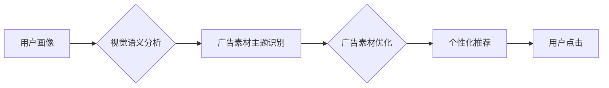

                 

##  电商广告素材中的视觉语义分析与优化技术

> 关键词：视觉语义分析、电商广告、图像识别、深度学习、自然语言处理、素材优化、推荐系统

## 1. 背景介绍

在当今数据爆炸的时代，电商平台的竞争日益激烈。吸引用户眼球、提升转化率成为电商平台的重中之重。广告素材作为电商平台的重要营销工具，其视觉效果和语义表达直接影响着用户点击率和购买意愿。因此，如何有效分析和优化电商广告素材的视觉语义，提升广告效果，成为电商平台亟需解决的关键问题。

传统的广告素材优化主要依赖人工经验，效率低下且难以保证效果。随着深度学习技术的快速发展，视觉语义分析技术取得了长足进步，为电商广告素材的智能化优化提供了新的思路和方法。

## 2. 核心概念与联系

### 2.1 视觉语义分析

视觉语义分析是指利用计算机视觉和自然语言处理技术，从图像中提取语义信息，并将其转换为可理解的文本描述的过程。它旨在理解图像的含义，而不是仅仅识别图像中的物体。

### 2.2 电商广告素材

电商广告素材是指用于在电商平台上展示的广告图片、视频等多媒体内容。这些素材需要能够吸引用户注意力，传达产品信息，并引导用户进行购买行为。

### 2.3 联系

视觉语义分析技术可以帮助电商平台对广告素材进行智能化分析，提取素材中的关键信息，例如产品类别、品牌、颜色、风格等，并将其与用户画像、购买行为等数据进行关联分析，从而实现以下目标：

* **自动识别素材主题:**  自动识别素材中所展示的产品类别、场景、风格等，为广告投放提供更精准的目标用户群体。
* **生成语义描述:**  为广告素材生成文本描述，方便用户理解和搜索。
* **优化素材质量:**  根据视觉语义分析结果，对素材进行优化，例如调整色彩、布局、文案等，提升素材的吸引力和转化率。
* **个性化推荐:**  根据用户的兴趣偏好和购买历史，推荐更符合用户需求的广告素材。

**Mermaid 流程图**



## 3. 核心算法原理 & 具体操作步骤

### 3.1 算法原理概述

电商广告素材的视觉语义分析主要依赖于深度学习技术，特别是卷积神经网络（CNN）和循环神经网络（RNN）。

* **CNN:**  擅长提取图像特征，例如边缘、纹理、形状等。
* **RNN:**  擅长处理序列数据，例如文本描述。

通过将CNN和RNN结合起来，可以实现从图像中提取语义信息，并将其转换为文本描述。

### 3.2 算法步骤详解

1. **图像预处理:**  对广告素材进行尺寸调整、色彩规范化等预处理，以提高算法的精度。
2. **特征提取:**  利用CNN提取图像特征，例如物体检测、场景识别、风格分析等。
3. **语义编码:**  将提取的图像特征编码为向量表示，并利用RNN生成文本描述。
4. **语义匹配:**  将生成的文本描述与电商平台的产品信息、用户画像等数据进行匹配，提取关键信息。
5. **优化建议:**  根据语义匹配结果，为广告素材提供优化建议，例如调整色彩、布局、文案等。

### 3.3 算法优缺点

**优点:**

* **自动化程度高:**  可以自动分析和优化广告素材，提高效率。
* **精准度高:**  深度学习算法能够提取图像的细微特征，提高语义分析的精准度。
* **可扩展性强:**  可以根据不同的需求，添加新的语义分析模块。

**缺点:**

* **计算资源需求高:**  深度学习算法训练和推理需要大量的计算资源。
* **数据依赖性强:**  算法的性能取决于训练数据的质量和数量。
* **解释性弱:**  深度学习算法的决策过程难以解释，难以进行调试和优化。

### 3.4 算法应用领域

* **电商广告素材优化:**  自动识别素材主题、生成语义描述、优化素材质量、个性化推荐。
* **图像搜索:**  根据图像内容进行精准搜索。
* **内容推荐:**  根据用户兴趣和行为，推荐相关内容。
* **视觉问答:**  根据图像内容回答用户的问题。

## 4. 数学模型和公式 & 详细讲解 & 举例说明

### 4.1 数学模型构建

视觉语义分析模型通常采用编码器-解码器结构，其中编码器负责提取图像特征，解码器负责生成文本描述。

* **编码器:**  通常采用CNN网络，将图像输入到网络中，提取图像特征。
* **解码器:**  通常采用RNN网络，将编码器输出的特征向量作为输入，生成文本描述。

### 4.2 公式推导过程

由于篇幅限制，这里只列举部分关键公式，详细推导过程可以参考相关文献。

* **CNN特征提取:**  CNN网络通过卷积层、池化层和全连接层，将图像特征提取为高维向量表示。

* **RNN文本生成:**  RNN网络通过循环层，将编码器输出的特征向量作为输入，生成文本描述。

### 4.3 案例分析与讲解

假设我们有一个电商广告素材，展示了一款运动鞋。

* **CNN特征提取:**  CNN网络可以提取出运动鞋的形状、颜色、品牌logo等特征。
* **RNN文本生成:**  RNN网络可以根据提取的特征，生成文本描述，例如“新款运动鞋，舒适耐穿，适合跑步和健身”。

## 5. 项目实践：代码实例和详细解释说明

### 5.1 开发环境搭建

* **操作系统:**  Linux/Windows/macOS
* **编程语言:**  Python
* **深度学习框架:**  TensorFlow/PyTorch
* **其他工具:**  Git、Jupyter Notebook

### 5.2 源代码详细实现

由于篇幅限制，这里只提供部分代码示例，完整的代码实现可以参考开源项目或相关文献。

```python
# 使用TensorFlow搭建CNN模型
model = tf.keras.models.Sequential([
    tf.keras.layers.Conv2D(32, (3, 3), activation='relu', input_shape=(224, 224, 3)),
    tf.keras.layers.MaxPooling2D((2, 2)),
    tf.keras.layers.Conv2D(64, (3, 3), activation='relu'),
    tf.keras.layers.MaxPooling2D((2, 2)),
    tf.keras.layers.Flatten(),
    tf.keras.layers.Dense(128, activation='relu'),
    tf.keras.layers.Dense(num_classes, activation='softmax')
])

# 使用TensorFlow训练模型
model.compile(optimizer='adam',
              loss='categorical_crossentropy',
              metrics=['accuracy'])
model.fit(train_images, train_labels, epochs=10)

# 使用预训练模型进行语义编码
encoder = tf.keras.applications.ResNet50(weights='imagenet', include_top=False)
encoded_features = encoder.predict(image)

# 使用RNN生成文本描述
decoder = tf.keras.models.Sequential([
    tf.keras.layers.LSTM(128),
    tf.keras.layers.Dense(vocab_size, activation='softmax')
])
decoder.compile(optimizer='adam', loss='sparse_categorical_crossentropy')
decoder.fit(encoded_features, target_texts, epochs=10)

# 生成文本描述
generated_text = decoder.predict(encoded_features)
```

### 5.3 代码解读与分析

* **CNN模型:**  使用ResNet50预训练模型提取图像特征。
* **RNN模型:**  使用LSTM网络生成文本描述。
* **训练过程:**  使用训练数据训练CNN和RNN模型。
* **预测过程:**  将新的广告素材输入到模型中，提取特征并生成文本描述。

### 5.4 运行结果展示

运行结果将展示生成的文本描述，例如“新款运动鞋，舒适耐穿，适合跑步和健身”。

## 6. 实际应用场景

### 6.1 广告素材主题识别

电商平台可以利用视觉语义分析技术，自动识别广告素材的主题，例如服装、电子产品、食品等，并根据主题进行精准投放。

### 6.2 广告素材优化建议

根据视觉语义分析结果，电商平台可以为广告素材提供优化建议，例如调整色彩、布局、文案等，提升素材的吸引力和转化率。

### 6.3 个性化推荐

电商平台可以根据用户的兴趣偏好和购买历史，推荐更符合用户需求的广告素材。

### 6.4 未来应用展望

随着深度学习技术的不断发展，视觉语义分析技术将在电商广告领域得到更广泛的应用，例如：

* **多模态广告素材分析:**  结合图像、视频、文本等多模态数据进行分析，提升广告效果。
* **动态广告素材生成:**  根据用户行为和场景，动态生成个性化的广告素材。
* **跨语言广告素材分析:**  突破语言障碍，实现跨语言的广告素材分析和优化。

## 7. 工具和资源推荐

### 7.1 学习资源推荐

* **书籍:**  《深度学习》
* **在线课程:**  Coursera、edX、Udacity
* **博客:**  机器之心、AI科技大本营

### 7.2 开发工具推荐

* **深度学习框架:**  TensorFlow、PyTorch
* **图像处理库:**  OpenCV
* **自然语言处理库:**  NLTK、spaCy

### 7.3 相关论文推荐

* **ImageNet Classification with Deep Convolutional Neural Networks**
* **Attention Is All You Need**
* **BERT: Pre-training of Deep Bidirectional Transformers for Language Understanding**

## 8. 总结：未来发展趋势与挑战

### 8.1 研究成果总结

视觉语义分析技术在电商广告领域取得了显著进展，能够有效分析和优化广告素材，提升广告效果。

### 8.2 未来发展趋势

* **多模态分析:**  结合图像、视频、文本等多模态数据进行分析，提升广告效果。
* **动态生成:**  根据用户行为和场景，动态生成个性化的广告素材。
* **跨语言分析:**  突破语言障碍，实现跨语言的广告素材分析和优化。

### 8.3 面临的挑战

* **数据标注:**  高质量的视觉语义标注数据是训练深度学习模型的关键，但标注成本高昂。
* **模型解释性:**  深度学习模型的决策过程难以解释，难以进行调试和优化。
* **伦理问题:**  视觉语义分析技术可能被用于用户隐私的侵犯，需要关注伦理问题。

### 8.4 研究展望

未来，视觉语义分析技术将继续发展，为电商广告领域带来更多创新和应用。

## 9. 附录：常见问题与解答

* **Q1: 视觉语义分析技术与传统广告素材优化有什么区别？**

* **A1:** 传统的广告素材优化主要依赖人工经验，效率低下且难以保证效果。视觉语义分析技术可以自动分析和优化广告素材，提高效率和精准度。

* **Q2: 视觉语义分析技术需要哪些数据？**

* **A2:** 视觉语义分析技术需要图像数据和文本数据。图像数据用于训练模型提取图像特征，文本数据用于训练模型生成文本描述。

* **Q3: 视觉语义分析技术有哪些应用场景？**

* **A3:** 视觉语义分析技术在电商广告领域有广泛的应用场景，例如广告素材主题识别、广告素材优化建议、个性化推荐等。


作者：禅与计算机程序设计艺术 / Zen and the Art of Computer Programming 
<end_of_turn>

