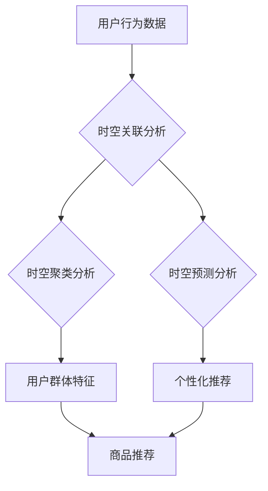

                 

## 电商搜索中的AI时空数据挖掘

> 关键词：电商搜索、时空数据挖掘、AI推荐、用户行为分析、个性化推荐、机器学习、深度学习、自然语言处理

## 1. 背景介绍

电商平台作为现代商业的重要组成部分，其搜索引擎扮演着至关重要的角色。用户通过搜索引擎查找心仪商品，而精准的搜索结果直接影响着用户的购物体验和平台的商业效益。传统的电商搜索引擎主要依赖于关键词匹配和商品属性分析，但随着用户行为的复杂化和商品信息的爆炸式增长，传统的搜索方式已难以满足用户需求。

时空数据挖掘技术应运而生，它能够从海量用户行为数据中挖掘出时间和空间维度下的潜在模式和规律，为电商搜索提供更精准、更个性化的推荐服务。

## 2. 核心概念与联系

时空数据挖掘的核心概念包括：

* **时空数据:** 指包含时间和空间信息的数据，例如用户搜索历史、浏览记录、购买行为、商品位置信息等。
* **时空关联分析:** 通过分析时空数据之间的关联性，发现用户在不同时间和地点的行为模式，例如用户在特定时间段更倾向于购买哪些商品，用户在不同地理位置的搜索偏好等。
* **时空聚类分析:** 将用户行为数据按照时间和空间特征进行聚类，识别不同类型的用户群体，例如经常在晚上购物的用户、喜欢购买特定类目商品的用户等。
* **时空预测分析:** 基于时空数据历史信息，预测用户未来的行为，例如预测用户在未来一段时间内可能购买的商品、用户可能前往的店铺等。

**核心概念架构图:**



## 3. 核心算法原理 & 具体操作步骤

### 3.1  算法原理概述

时空数据挖掘算法主要包括以下几种：

* **基于距离的算法:** 
    *  例如k-最近邻算法、DBSCAN算法等，根据用户行为数据的时间和空间距离进行聚类和预测。
* **基于时间序列的算法:** 
    * 例如ARIMA模型、LSTM模型等，分析用户行为数据的时间序列特征，预测未来的行为趋势。
* **基于图的算法:** 
    * 例如PageRank算法、Graph Neural Networks等，将用户行为数据表示为图结构，挖掘用户之间的关系和商品之间的关联性。

### 3.2  算法步骤详解

以基于距离的k-最近邻算法为例，其具体操作步骤如下：

1. **数据预处理:** 对用户行为数据进行清洗、转换和特征提取，例如将时间信息转换为时间戳，将地理位置信息转换为经纬度坐标等。
2. **距离计算:** 使用距离度量函数计算用户行为数据之间的距离，例如欧氏距离、曼哈顿距离等。
3. **k-最近邻查找:** 对于给定的用户行为数据，找到其k个最近邻的数据点。
4. **预测或聚类:** 根据k个最近邻的数据点，对给定的用户行为数据进行预测或聚类。例如，预测用户未来的行为，或将用户行为数据聚类到不同的用户群体。

### 3.3  算法优缺点

**优点:**

* 算法简单易懂，易于实现。
* 能够有效地挖掘用户行为数据中的时空关联性。

**缺点:**

* 距离度量函数的选择对算法性能有很大影响。
* 难以处理高维数据和复杂的数据分布。

### 3.4  算法应用领域

基于距离的k-最近邻算法广泛应用于以下领域：

* **电商搜索推荐:** 根据用户的历史搜索记录和购买行为，推荐用户可能感兴趣的商品。
* **位置服务:** 根据用户的地理位置信息，推荐附近的商家、餐厅、景点等。
* **用户画像分析:** 根据用户的时空行为数据，构建用户画像，了解用户的兴趣爱好、消费习惯等。

## 4. 数学模型和公式 & 详细讲解 & 举例说明

### 4.1  数学模型构建

时空数据挖掘模型通常基于以下数学模型构建：

* **距离度量:** 使用欧氏距离、曼哈顿距离等度量用户行为数据之间的时空距离。
* **聚类算法:** 使用k-means算法、DBSCAN算法等聚类用户行为数据，识别不同类型的用户群体。
* **预测模型:** 使用ARIMA模型、LSTM模型等预测用户未来的行为。

### 4.2  公式推导过程

以欧氏距离为例，其公式如下：

$$
d(x,y) = \sqrt{(x_1 - y_1)^2 + (x_2 - y_2)^2 + ... + (x_n - y_n)^2}
$$

其中：

* $x = (x_1, x_2, ..., x_n)$ 和 $y = (y_1, y_2, ..., y_n)$ 分别表示两个用户行为数据点。
* $n$ 表示数据点的维度。

### 4.3  案例分析与讲解

假设有两个用户行为数据点：

* $x = (2023-03-01, 116.4051, 39.9042)$，表示用户在2023年3月1日，11时40分51秒，位于北京市海淀区。
* $y = (2023-03-02, 116.3951, 39.9142)$，表示用户在2023年3月2日，11时39分51秒，位于北京市西城区。

使用欧氏距离计算这两个数据点之间的距离：

$$
d(x,y) = \sqrt{(2023-03-01 - 2023-03-02)^2 + (116.4051 - 116.3951)^2 + (39.9042 - 39.9142)^2}
$$

计算结果为：

$$
d(x,y) \approx 0.0017
$$

## 5. 项目实践：代码实例和详细解释说明

### 5.1  开发环境搭建

* **操作系统:** Ubuntu 20.04 LTS
* **编程语言:** Python 3.8
* **开发工具:** Jupyter Notebook
* **库依赖:** pandas, numpy, scikit-learn, geopandas

### 5.2  源代码详细实现

```python
import pandas as pd
from sklearn.cluster import KMeans

# 加载用户行为数据
data = pd.read_csv('user_behavior_data.csv')

# 数据预处理
# ...

# 训练K-Means聚类模型
kmeans = KMeans(n_clusters=5)
data['cluster'] = kmeans.fit_predict(data[['timestamp', 'longitude', 'latitude']])

# 分析聚类结果
# ...
```

### 5.3  代码解读与分析

* **数据加载:** 使用pandas库加载用户行为数据。
* **数据预处理:** 对数据进行清洗、转换和特征提取，例如将时间信息转换为时间戳，将地理位置信息转换为经纬度坐标等。
* **模型训练:** 使用scikit-learn库的KMeans算法训练聚类模型，将用户行为数据聚类到不同的用户群体。
* **结果分析:** 分析聚类结果，例如查看每个聚类的用户特征、用户行为模式等。

### 5.4  运行结果展示

运行代码后，会得到用户行为数据的聚类结果，每个用户被分配到一个特定的用户群体。

## 6. 实际应用场景

时空数据挖掘技术在电商搜索领域有广泛的应用场景：

* **个性化商品推荐:** 根据用户的时空行为数据，推荐用户可能感兴趣的商品。
* **精准广告投放:** 根据用户的时空行为数据，精准投放广告，提高广告效果。
* **店铺位置优化:** 根据用户的时空行为数据，优化店铺的位置，提高店铺的流量和销售额。
* **用户行为分析:** 分析用户的时空行为数据，了解用户的兴趣爱好、消费习惯等，为产品开发和市场营销提供决策依据。

### 6.4  未来应用展望

随着人工智能技术的不断发展，时空数据挖掘技术将在电商搜索领域发挥更重要的作用。未来，时空数据挖掘技术将与其他人工智能技术，例如自然语言处理、计算机视觉等相结合，实现更精准、更智能的电商搜索服务。

## 7. 工具和资源推荐

### 7.1  学习资源推荐

* **书籍:**
    * 《时空数据挖掘》
    * 《机器学习》
* **在线课程:**
    * Coursera: Machine Learning
    * edX: Introduction to Data Science

### 7.2  开发工具推荐

* **Python:** 
    * pandas
    * numpy
    * scikit-learn
    * geopandas
* **Hadoop:** 
    * HBase
    * Spark

### 7.3  相关论文推荐

* **时空数据挖掘综述:**
    * "A Survey on Spatiotemporal Data Mining"
* **基于深度学习的时空数据挖掘:**
    * "Deep Learning for Spatiotemporal Data Mining"

## 8. 总结：未来发展趋势与挑战

### 8.1  研究成果总结

时空数据挖掘技术在电商搜索领域取得了显著的成果，能够有效地提升搜索结果的精准度和个性化程度。

### 8.2  未来发展趋势

* **融合多源数据:** 将时空数据与其他数据源，例如用户画像、商品信息等融合，构建更全面的用户行为模型。
* **深度学习应用:** 利用深度学习技术，挖掘时空数据中的更深层次的模式和规律。
* **实时分析:** 实现对实时用户行为数据的分析，提供更及时、更精准的搜索服务。

### 8.3  面临的挑战

* **数据质量:** 时空数据往往存在噪声、缺失值等问题，需要进行有效的清洗和处理。
* **算法复杂度:** 时空数据挖掘算法往往具有较高的复杂度，需要进行优化和改进。
* **隐私保护:** 时空数据包含用户的隐私信息，需要采取有效的措施保护用户隐私。

### 8.4  研究展望

未来，时空数据挖掘技术将继续朝着更智能、更精准、更安全的方向发展，为电商搜索提供更强大的支持。


## 9. 附录：常见问题与解答

* **Q1: 时空数据挖掘与传统数据挖掘有什么区别？**

* **A1:** 传统数据挖掘主要关注数据本身的特征，而时空数据挖掘则考虑了数据的时空维度，能够挖掘出传统数据挖掘无法发现的模式和规律。

* **Q2: 如何选择合适的时空数据挖掘算法？**

* **A2:** 选择合适的算法需要根据具体的数据特点和应用场景进行选择。例如，对于离散的时空数据，可以使用基于距离的算法；对于连续的时空数据，可以使用基于时间序列的算法。

* **Q3: 时空数据挖掘技术有哪些应用场景？**

* **A3:** 时空数据挖掘技术广泛应用于交通运输、城市规划、环境监测、电商搜索等领域。


作者：禅与计算机程序设计艺术 / Zen and the Art of Computer Programming 
<end_of_turn>

