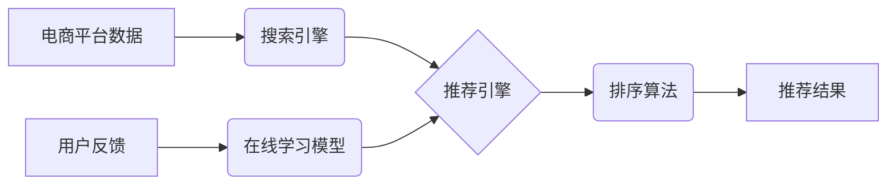

                 

## 电商搜索推荐效果优化中的AI大模型在线学习技术

> 关键词：电商搜索、推荐系统、AI大模型、在线学习、效果优化、模型更新、数据流

## 1. 背景介绍

电商平台的搜索推荐系统是用户获取商品信息和完成购买的重要入口，其效果直接影响着用户体验和平台商业价值。传统的搜索推荐系统通常依赖于离线训练的机器学习模型，但随着电商平台数据规模的不断增长和用户行为的日益复杂，这些模型难以适应快速变化的市场环境，其推荐效果逐渐下降。

为了解决这一问题，近年来，AI大模型在线学习技术逐渐成为电商搜索推荐效果优化的热门研究方向。在线学习技术能够实时更新模型参数，并根据用户反馈进行模型调整，从而实现对推荐系统的持续优化。

## 2. 核心概念与联系

### 2.1  电商搜索推荐系统

电商搜索推荐系统旨在根据用户的搜索词、浏览历史、购买记录等信息，推荐与用户需求相匹配的商品。其核心功能包括：

* **搜索引擎:** 处理用户搜索词，并返回相关商品列表。
* **推荐引擎:** 基于用户行为数据，推荐个性化商品列表。
* **排序算法:** 对推荐结果进行排序，将最相关的商品排在前面。

### 2.2  AI大模型

AI大模型是指参数规模庞大、训练数据海量的人工智能模型，通常采用深度学习技术训练。其强大的学习能力能够捕捉复杂的数据模式，并生成高质量的推荐结果。

### 2.3  在线学习

在线学习是一种模型训练方法，其特点是：

* **数据流式更新:** 模型参数在训练过程中不断更新，并根据新数据进行调整。
* **实时反馈:** 模型性能可以通过实时用户反馈进行评估，并及时进行模型优化。

### 2.4  核心概念架构



## 3. 核心算法原理 & 具体操作步骤

### 3.1  算法原理概述

在线学习算法的核心思想是利用数据流中的新数据不断更新模型参数，从而实现模型的持续优化。常见的在线学习算法包括：

* **梯度下降法:** 通过计算模型参数的梯度，逐步调整参数方向，使模型损失函数最小化。
* **随机梯度下降法:** 对梯度下降法进行随机采样，提高训练效率。
* **牛顿法:** 利用二阶导数信息，加速模型参数更新。

### 3.2  算法步骤详解

1. **初始化模型参数:** 将模型参数随机初始化。
2. **数据流处理:** 从数据流中获取新数据。
3. **模型预测:** 使用当前模型参数对新数据进行预测。
4. **损失函数计算:** 计算模型预测结果与真实值的差异，即损失函数值。
5. **梯度计算:** 计算模型参数的梯度，即损失函数对模型参数的偏导数。
6. **模型参数更新:** 根据梯度信息，更新模型参数。
7. **重复步骤2-6:** 持续处理新数据，更新模型参数，直到模型性能达到预期目标。

### 3.3  算法优缺点

**优点:**

* **实时更新:** 模型参数可以实时更新，适应数据变化。
* **高效学习:** 仅需要处理少量数据即可更新模型参数，提高训练效率。
* **持续优化:** 模型性能可以持续优化，保持推荐效果的领先性。

**缺点:**

* **数据质量要求高:** 数据流中的数据质量直接影响模型性能。
* **模型稳定性:** 模型参数更新过于频繁可能导致模型不稳定。
* **算法复杂度:** 一些在线学习算法的复杂度较高，需要强大的计算资源。

### 3.4  算法应用领域

在线学习算法广泛应用于各种场景，例如：

* **电商搜索推荐:** 实时更新模型参数，提高推荐效果。
* **广告投放:** 根据用户行为数据，优化广告投放策略。
* **欺诈检测:** 识别异常行为，及时阻止欺诈行为。
* **自然语言处理:** 持续学习新词语和语法规则，提高语言理解能力。

## 4. 数学模型和公式 & 详细讲解 & 举例说明

### 4.1  数学模型构建

假设我们有一个电商平台的搜索推荐系统，其目标是根据用户的搜索词和浏览历史，推荐与用户需求相匹配的商品。我们可以构建一个基于用户行为数据的数学模型，来表示用户对商品的兴趣程度。

**用户兴趣模型:**

$$
p(i|u) = \frac{e^{w_i \cdot h_u}}{\sum_{j=1}^{N} e^{w_j \cdot h_u}}
$$

其中：

* $p(i|u)$ 表示用户 $u$ 对商品 $i$ 的兴趣概率。
* $w_i$ 表示商品 $i$ 的特征向量。
* $h_u$ 表示用户 $u$ 的特征向量。
* $N$ 表示商品总数。

### 4.2  公式推导过程

该公式基于softmax函数，将商品的特征向量与用户的特征向量进行点积，并通过softmax函数归一化，得到每个商品的兴趣概率。

**梯度下降法:**

$$
w_i = w_i - \alpha \frac{\partial L}{\partial w_i}
$$

其中：

* $w_i$ 表示商品 $i$ 的特征向量。
* $\alpha$ 表示学习率。
* $L$ 表示损失函数。

### 4.3  案例分析与讲解

假设我们有一个电商平台，用户 $u$ 搜索了商品 $i$，并点击了该商品。我们可以将用户的点击行为作为正样本，并将其他商品的点击行为作为负样本。

损失函数可以定义为交叉熵损失函数：

$$
L = -\sum_{i=1}^{N} y_i \log(p(i|u))
$$

其中：

* $y_i$ 表示商品 $i$ 是否被点击的标签，为1表示点击，为0表示未点击。

通过梯度下降法，我们可以更新商品特征向量 $w_i$，使模型预测结果与真实标签更加一致。

## 5. 项目实践：代码实例和详细解释说明

### 5.1  开发环境搭建

* **操作系统:** Linux
* **编程语言:** Python
* **深度学习框架:** TensorFlow 或 PyTorch
* **数据存储:** MySQL 或 MongoDB

### 5.2  源代码详细实现

```python
import tensorflow as tf

# 定义用户兴趣模型
class UserInterestModel(tf.keras.Model):
    def __init__(self, embedding_dim):
        super(UserInterestModel, self).__init__()
        self.embedding_dim = embedding_dim
        self.user_embedding = tf.keras.layers.Embedding(input_dim=num_users, output_dim=embedding_dim)
        self.item_embedding = tf.keras.layers.Embedding(input_dim=num_items, output_dim=embedding_dim)
        self.dense = tf.keras.layers.Dense(1)

    def call(self, user_id, item_id):
        user_embedding = self.user_embedding(user_id)
        item_embedding = self.item_embedding(item_id)
        combined_embedding = user_embedding + item_embedding
        output = self.dense(combined_embedding)
        return output

# 定义损失函数和优化器
loss_fn = tf.keras.losses.BinaryCrossentropy()
optimizer = tf.keras.optimizers.Adam(learning_rate=0.001)

# 训练模型
for epoch in range(num_epochs):
    for batch in data_loader:
        user_ids, item_ids, labels = batch
        with tf.GradientTape() as tape:
            predictions = model(user_ids, item_ids)
            loss = loss_fn(labels, predictions)
        gradients = tape.gradient(loss, model.trainable_variables)
        optimizer.apply_gradients(zip(gradients, model.trainable_variables))

# 保存模型
model.save("user_interest_model.h5")
```

### 5.3  代码解读与分析

* **用户兴趣模型:** 使用深度学习框架构建了一个用户兴趣模型，该模型将用户特征向量和商品特征向量进行拼接，并通过全连接层输出商品的兴趣概率。
* **损失函数和优化器:** 使用交叉熵损失函数和Adam优化器进行模型训练。
* **训练模型:** 使用数据流进行模型训练，并不断更新模型参数。
* **保存模型:** 将训练好的模型保存为文件，以便后续使用。

### 5.4  运行结果展示

训练完成后，我们可以使用训练好的模型对新数据进行预测，并评估模型性能。常用的评估指标包括准确率、召回率、F1-score等。

## 6. 实际应用场景

### 6.1  电商搜索推荐效果优化

在线学习技术可以实时更新电商平台的搜索推荐模型，根据用户反馈进行模型调整，从而提高推荐效果。例如，当用户点击了某个商品后，模型可以将该商品的权重提高，并推荐更多与该商品相关的商品。

### 6.2  个性化推荐

在线学习技术可以根据用户的历史行为数据，构建个性化的推荐模型，并根据用户的实时行为进行模型更新，从而提供更精准的个性化推荐。

### 6.3  广告投放优化

在线学习技术可以根据用户的点击行为和转化率数据，优化广告投放策略，提高广告的点击率和转化率。

### 6.4  未来应用展望

随着数据量的不断增长和计算能力的提升，在线学习技术将在更多领域得到应用，例如：

* **医疗诊断:** 基于患者的病历数据和医疗影像数据，实时更新医疗诊断模型，提高诊断准确率。
* **金融风险控制:** 基于用户的交易数据和信用评分数据，实时更新金融风险控制模型，降低金融风险。
* **自动驾驶:** 基于车辆的传感器数据和驾驶行为数据，实时更新自动驾驶模型，提高驾驶安全性。

## 7. 工具和资源推荐

### 7.1  学习资源推荐

* **书籍:**
    * 《深度学习》
    * 《机器学习》
* **在线课程:**
    * Coursera
    * edX
    * Udacity

### 7.2  开发工具推荐

* **深度学习框架:** TensorFlow, PyTorch
* **数据处理工具:** Pandas, NumPy
* **云计算平台:** AWS, Azure, GCP

### 7.3  相关论文推荐

* **在线学习算法:**
    * 《Online Learning: A Survey》
    * 《Stochastic Gradient Descent: A Comprehensive Review》
* **电商搜索推荐:**
    * 《Collaborative Filtering for Recommender Systems》
    * 《Deep Learning for Recommender Systems》

## 8. 总结：未来发展趋势与挑战

### 8.1  研究成果总结

在线学习技术在电商搜索推荐效果优化方面取得了显著成果，能够实时更新模型参数，提高推荐效果。

### 8.2  未来发展趋势

* **模型架构创新:** 研究更有效的在线学习模型架构，提高模型性能和效率。
* **数据处理技术:** 开发更先进的数据处理技术，处理海量数据并提取更丰富的特征信息。
* **联邦学习:** 研究联邦学习技术，在保护用户隐私的前提下进行模型训练和更新。

### 8.3  面临的挑战

* **数据质量:** 在线学习算法对数据质量要求较高，需要保证数据准确性和完整性。
* **模型稳定性:** 模型参数更新过于频繁可能导致模型不稳定，需要研究模型稳定性优化方法。
* **计算资源:** 一些在线学习算法的复杂度较高，需要强大的计算资源支持。

### 8.4  研究展望

未来，在线学习技术将继续发展，并应用于更多领域。研究人员将继续探索更有效的在线学习算法，并解决其面临的挑战，推动人工智能技术的发展。

## 9. 附录：常见问题与解答

**Q1: 在线学习和离线学习有什么区别？**

**A1:** 在线学习是在数据流中不断更新模型参数，而离线学习是在离线数据上训练模型，然后部署到生产环境中。

**Q2: 在线学习算法有哪些？**

**A2:** 常见的在线学习算法包括梯度下降法、随机梯度下降法、牛顿法等。

**Q3: 在线学习技术有哪些应用场景？**

**A3:** 在线学习技术广泛应用于电商搜索推荐、个性化推荐、广告投放优化等场景。

作者：禅与计算机程序设计艺术 / Zen and the Art of Computer Programming


<end_of_turn>

