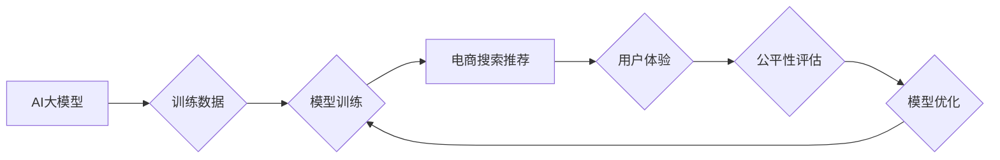

                 

## 电商搜索推荐效果评估中的AI大模型公平性评估工具选型

> 关键词：AI大模型、公平性评估、电商搜索推荐、偏见检测、算法解释、可解释AI、伦理AI

## 1. 背景介绍

随着人工智能（AI）技术的飞速发展，AI大模型在电商搜索推荐领域扮演着越来越重要的角色。这些模型能够根据用户的历史行为、偏好和上下文信息，精准推荐商品，提升用户体验和商业转化率。然而，AI大模型的训练数据往往存在偏差，导致模型输出结果可能带有不可察觉的偏见，从而影响推荐结果的公平性，甚至可能加剧社会不平等。

例如，一个电商平台的搜索推荐模型可能因为训练数据中性别比例不均衡，导致女性用户在搜索某些特定商品时，推荐结果偏向男性用户，从而造成性别歧视。类似的偏见可能出现在种族、年龄、地域等其他方面。

因此，在部署AI大模型进行电商搜索推荐时，公平性评估显得尤为重要。我们需要开发有效的工具和方法，能够识别和缓解模型中的潜在偏见，确保推荐结果公平公正，造福所有用户。

## 2. 核心概念与联系

### 2.1  AI大模型

AI大模型是指参数量巨大、训练数据海量的人工智能模型。这些模型通常采用深度学习技术，能够学习复杂的模式和关系，在自然语言处理、图像识别、语音合成等领域展现出强大的能力。

### 2.2  公平性评估

公平性评估是指评估人工智能模型输出结果是否公平公正，即模型对不同群体（例如性别、种族、年龄等）的预测结果是否一致。

### 2.3  电商搜索推荐

电商搜索推荐是指根据用户的搜索历史、浏览记录、购买行为等信息，推荐用户可能感兴趣的商品。

**核心概念与联系流程图**



## 3. 核心算法原理 & 具体操作步骤

### 3.1  算法原理概述

公平性评估算法旨在识别和量化AI模型中的潜在偏见。常见的算法包括：

* **差分公平性算法：** 评估模型对不同群体预测结果的差异，目标是使不同群体的预测结果差异最小化。
* **群体公平性算法：** 评估模型对不同群体的整体预测性能，目标是使不同群体的预测性能差异最小化。
* **因果公平性算法：** 评估模型是否在预测结果中考虑了敏感属性（例如性别、种族）的影响，目标是确保模型的预测结果与敏感属性无关。

### 3.2  算法步骤详解

1. **数据准备：** 收集包含敏感属性（例如性别、种族）和目标变量（例如推荐结果）的数据。
2. **模型训练：** 使用收集到的数据训练AI模型。
3. **公平性评估：** 使用公平性评估算法评估模型的公平性，例如计算不同群体的预测结果差异或预测性能差异。
4. **模型优化：** 根据公平性评估结果，调整模型参数或训练数据，以减轻模型中的偏见。

### 3.3  算法优缺点

| 算法类型 | 优点 | 缺点 |
|---|---|---|
| 差分公平性算法 | 易于理解和实现，能够有效地减轻模型对敏感属性的直接依赖 | 可能导致模型性能下降，难以处理复杂的多重敏感属性场景 |
| 群体公平性算法 | 能够考虑不同群体的整体预测性能，更全面地评估模型的公平性 | 可能导致模型对某些群体过于偏好，难以解释模型的决策过程 |
| 因果公平性算法 | 能够识别和缓解模型中隐含的偏见，更符合公平性的本质 | 算法复杂度较高，需要更深入的因果关系分析 |

### 3.4  算法应用领域

公平性评估算法广泛应用于各种领域，例如：

* **金融领域：** 评估贷款审批、信用卡授信等模型的公平性，避免歧视性决策。
* **医疗领域：** 评估疾病诊断、治疗方案推荐等模型的公平性，确保所有患者都能获得公平的医疗服务。
* **教育领域：** 评估招生录取、学习资源分配等模型的公平性，促进教育公平。

## 4. 数学模型和公式 & 详细讲解 & 举例说明

### 4.1  数学模型构建

假设我们有一个电商搜索推荐模型，其目标是预测用户对商品的点击率。模型的输入包括用户的历史行为、商品的特征等信息，输出为用户点击商品的概率。

我们使用敏感属性 $S$ 来表示用户的敏感属性，例如性别、年龄等。我们希望评估模型在不同敏感属性群体中的预测性能是否公平。

我们可以构建一个数学模型来衡量模型的公平性，例如使用差分公平性指标：

$$
\Delta(S) = \frac{1}{|S_1|} \sum_{u \in S_1} (P(Click|u, S_1) - P(Click|u, S_2))
$$

其中：

* $\Delta(S)$ 表示模型在敏感属性 $S$ 下的公平性指标。
* $|S_1|$ 表示敏感属性 $S$ 的第一组的样本数量。
* $P(Click|u, S_1)$ 表示用户 $u$ 在敏感属性 $S$ 的第一组中点击商品的概率。
* $P(Click|u, S_2)$ 表示用户 $u$ 在敏感属性 $S$ 的第二组中点击商品的概率。

### 4.2  公式推导过程

差分公平性指标的推导过程如下：

1. 我们假设模型的预测结果是公平的，即不同敏感属性群体的预测结果相同。
2. 因此，我们期望模型在不同敏感属性群体中的点击概率相等，即 $P(Click|u, S_1) = P(Click|u, S_2)$。
3. 当模型的预测结果不公平时，$P(Click|u, S_1)$ 和 $P(Click|u, S_2)$ 会存在差异。
4. 我们使用差分公平性指标来量化这种差异，即 $\Delta(S) = \frac{1}{|S_1|} \sum_{u \in S_1} (P(Click|u, S_1) - P(Click|u, S_2))$。

### 4.3  案例分析与讲解

假设我们有一个电商平台的搜索推荐模型，其目标是预测用户对服装商品的点击率。我们发现模型在男性用户和女性用户中的预测结果存在差异，男性用户的点击概率明显高于女性用户。

我们可以使用差分公平性指标来量化这种差异。假设男性用户组 $S_1$ 和女性用户组 $S_2$ 的样本数量分别为 1000 和 1000，并且男性用户的平均点击概率为 0.25，女性用户的平均点击概率为 0.15。

则模型在性别敏感属性下的差分公平性指标为：

$$
\Delta(Gender) = \frac{1}{1000} \sum_{u \in S_1} (0.25 - 0.15) = 0.1
$$

该指标值表明模型在性别敏感属性下存在一定的偏见，男性用户的点击概率比女性用户高 0.1。

## 5. 项目实践：代码实例和详细解释说明

### 5.1  开发环境搭建

为了实现公平性评估工具，我们需要搭建一个开发环境，包括：

* **编程语言：** Python 是一个常用的编程语言，拥有丰富的机器学习库和工具。
* **机器学习库：** Scikit-learn 是一个常用的机器学习库，提供各种算法和评估指标。
* **数据处理库：** Pandas 是一个用于数据分析和处理的库，可以方便地处理和分析数据。

### 5.2  源代码详细实现

以下是一个使用 Python 和 Scikit-learn 实现差分公平性评估的代码示例：

```python
import pandas as pd
from sklearn.linear_model import LogisticRegression
from sklearn.model_selection import train_test_split
from sklearn.metrics import accuracy_score

# 加载数据
data = pd.read_csv('ecommerce_data.csv')

# 分割数据
X = data.drop(['click', 'gender'], axis=1)
y = data['click']
gender = data['gender']

X_train, X_test, y_train, y_test, gender_train, gender_test = train_test_split(X, y, gender, test_size=0.2, random_state=42)

# 训练模型
model = LogisticRegression()
model.fit(X_train, y_train)

# 预测结果
y_pred = model.predict(X_test)

# 计算准确率
accuracy = accuracy_score(y_test, y_pred)
print(f'模型准确率: {accuracy}')

# 计算差分公平性指标
group1_accuracy = accuracy_score(y_test[gender_test == 'male'], y_pred[gender_test == 'male'])
group2_accuracy = accuracy_score(y_test[gender_test == 'female'], y_pred[gender_test == 'female'])
delta = group1_accuracy - group2_accuracy
print(f'差分公平性指标: {delta}')
```

### 5.3  代码解读与分析

该代码首先加载电商数据，然后将数据分割为训练集和测试集。接着，使用逻辑回归模型训练模型，并预测测试集的点击结果。最后，计算模型的准确率和差分公平性指标。

### 5.4  运行结果展示

运行该代码后，会输出模型的准确率和差分公平性指标。如果差分公平性指标为正值，则表明模型对男性用户更偏好；如果差分公平性指标为负值，则表明模型对女性用户更偏好。

## 6. 实际应用场景

### 6.1  电商平台推荐系统

电商平台的搜索推荐系统需要确保推荐结果公平公正，避免对特定用户群体造成歧视。例如，一个电商平台的推荐系统可能因为训练数据中女性用户购买化妆品比例较高，导致女性用户在搜索其他商品时，推荐结果偏向化妆品，从而造成性别歧视。

使用公平性评估工具可以帮助电商平台识别和缓解推荐系统中的潜在偏见，确保所有用户都能获得公平的推荐服务。

### 6.2  金融机构贷款审批系统

金融机构的贷款审批系统需要确保贷款审批结果公平公正，避免对特定用户群体造成歧视。例如，一个银行的贷款审批系统可能因为训练数据中男性用户的贷款申请比例较高，导致男性用户的贷款审批通过率高于女性用户，从而造成性别歧视。

使用公平性评估工具可以帮助金融机构识别和缓解贷款审批系统中的潜在偏见，确保所有用户都能获得公平的贷款服务。

### 6.3  医疗机构疾病诊断系统

医疗机构的疾病诊断系统需要确保诊断结果公平公正，避免对特定用户群体造成歧视。例如，一个医院的疾病诊断系统可能因为训练数据中特定种族人群的疾病数据较少，导致该种族人群的疾病诊断准确率低于其他种族人群，从而造成种族歧视。

使用公平性评估工具可以帮助医疗机构识别和缓解疾病诊断系统中的潜在偏见，确保所有患者都能获得公平的医疗服务。

### 6.4  未来应用展望

随着AI技术的不断发展，公平性评估工具将在更多领域得到应用，例如：

* **教育领域：** 评估招生录取、学习资源分配等模型的公平性，促进教育公平。
* **司法领域：** 评估犯罪风险评估、判刑建议等模型的公平性，确保司法公正。
* **自动驾驶领域：** 评估自动驾驶系统的决策结果公平性，避免对特定人群造成伤害。

## 7. 工具和资源推荐

### 7.1  学习资源推荐

* **书籍：**
    * 《Fairness and Machine Learning》 by  Virginia Eubanks
    * 《Algorithmic Justice League》 by Joy Buolamwini
* **在线课程：**
    * Coursera: Fairness in Machine Learning
    * edX: AI Ethics

### 7.2  开发工具推荐

* **Scikit-learn:** Python机器学习库，提供各种公平性评估算法。
* **AIF360:** 开源工具包，用于公平性评估和解释AI模型。
* **Fairlearn:** Python库，用于公平性评估和缓解。

### 7.3  相关论文推荐

* **"On the Dangers of Stochastic Parrots: Can Language Models Be Too Big?"** by Emily M. Bender, Timnit Gebru, Angelina McMillan-Major, and Margaret Mitchell
* **"Mitigating Bias in Machine Learning"** by  Arvind Narayanan and  Vitaly Shmatikov

## 8. 总结：未来发展趋势与挑战

### 8.1  研究成果总结

近年来，公平性评估在AI领域取得了显著进展，涌现出多种算法和工具，能够有效地识别和缓解模型中的潜在偏见。

### 8.2  未来发展趋势

未来，公平性评估的研究将朝着以下方向发展：

* **更深入的理论研究：** 探索更有效的公平性评估指标和算法，并深入研究不同类型偏见的影响机制。
* **更强大的解释性：** 开发更强大的模型解释技术，能够解释模型的决策过程，帮助人类理解模型中的偏见。
* **更广泛的应用场景：** 将公平性评估技术应用到更多领域，例如自动驾驶、医疗诊断、司法判决等，确保AI技术的公平公正应用。

### 8.3  面临的挑战

公平性评估仍然面临着一些挑战：

* **定义公平性：** 不同领域和应用场景对公平性的定义可能不同，需要根据具体情况进行调整。
* **数据偏差：** 训练数据本身可能存在偏差，导致模型输出结果不公平。
* **算法复杂度：** 一些公平性评估算法的计算复杂度较高，难以在实际应用中部署。

### 8.4  研究展望

未来，我们需要继续努力，克服这些挑战，推动公平性评估技术的发展，确保AI技术造福人类社会。


## 9. 附录：常见问题与解答

**1. 什么是公平性评估？**

公平性评估是指评估人工智能模型输出结果是否公平公正，即模型对不同群体（例如性别、种族、年龄等）的预测结果是否一致。

**2. 为什么需要进行公平性评估？**

因为AI模型的训练数据可能存在偏差，导致模型输出结果带有不可察觉的偏见，从而影响推荐结果的公平性，甚至可能加剧社会不平等。

**3. 如何进行公平性评估？**

常用的公平性评估算法包括差分公平性算法、群体公平性算法和因果公平性算法。

**4. 如何缓解模型中的偏见？**

可以通过以下方法缓解模型中的偏见：

* 使用更公平的训练数据。
* 使用公平性约束的机器学习算法。
* 使用公平性评估工具进行模型监控和调整。


作者：禅与计算机程序设计艺术 / Zen and the Art of Computer Programming<end_of_turn>

