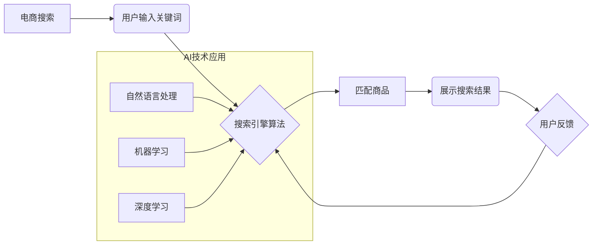

                 

## 电商搜索的AI+跨境电商的机遇与挑战

> 关键词：电商搜索、人工智能、跨境电商、推荐系统、自然语言处理、机器学习、深度学习、搜索引擎优化

## 1. 背景介绍

随着互联网的普及和移动设备的广泛应用，电商行业蓬勃发展，跨境电商作为电商的重要组成部分，也呈现出强劲的增长势头。然而，跨境电商面临着独特的挑战，其中之一就是搜索体验。传统的搜索引擎难以满足跨境电商用户的个性化需求，例如语言差异、文化差异、商品信息不完整等。

人工智能（AI）技术的快速发展为跨境电商搜索带来了新的机遇。AI能够通过分析海量数据，理解用户需求，并提供更精准、更个性化的搜索结果。例如，自然语言处理（NLP）技术可以帮助理解用户搜索的意图，机器学习（ML）技术可以根据用户的历史搜索记录和购买行为，推荐更符合用户需求的商品。

## 2. 核心概念与联系

### 2.1 电商搜索

电商搜索是指在电商平台上，用户输入关键词或商品信息，系统根据算法匹配并返回相关商品的搜索结果。

### 2.2 跨境电商

跨境电商是指跨越国家或地区的电子商务交易，包括跨境商品销售、跨境支付、跨境物流等环节。

### 2.3 人工智能（AI）

人工智能是指模拟人类智能行为的计算机系统，包括学习、推理、决策、感知等能力。

### 2.4 核心概念架构



## 3. 核心算法原理 & 具体操作步骤

### 3.1 算法原理概述

电商搜索的AI算法主要基于机器学习和深度学习技术，通过训练模型，学习用户行为和商品特征，实现精准推荐和个性化搜索。

### 3.2 算法步骤详解

1. **数据收集与预处理:** 收集用户搜索历史、商品信息、购买行为等数据，并进行清洗、转换、格式化等预处理操作。
2. **特征工程:** 从原始数据中提取特征，例如关键词、商品类别、价格、品牌、用户评分等，并进行编码和转换。
3. **模型训练:** 选择合适的机器学习模型，例如协同过滤、内容过滤、深度神经网络等，并使用训练数据进行模型训练。
4. **模型评估:** 使用测试数据评估模型的性能，例如准确率、召回率、F1-score等指标。
5. **模型部署:** 将训练好的模型部署到线上环境，用于处理用户搜索请求。
6. **结果展示:** 根据模型预测结果，将相关商品展示给用户。

### 3.3 算法优缺点

**优点:**

* **精准推荐:** 基于用户行为和商品特征，能够提供更精准的商品推荐。
* **个性化搜索:** 能够根据用户的搜索历史和偏好，提供个性化的搜索结果。
* **自动优化:** 模型能够不断学习和优化，提升搜索效果。

**缺点:**

* **数据依赖:** 需要大量的数据进行训练，否则模型效果会下降。
* **算法复杂:** 训练和部署AI模型需要一定的技术难度。
* **解释性差:** 一些深度学习模型的决策过程难以解释。

### 3.4 算法应用领域

* **电商搜索推荐:** 为用户推荐相关商品。
* **内容推荐:** 为用户推荐相关文章、视频、音乐等内容。
* **广告推荐:** 为用户推荐相关广告。
* **个性化服务:** 为用户提供个性化的服务体验。

## 4. 数学模型和公式 & 详细讲解 & 举例说明

### 4.1 数学模型构建

电商搜索的AI算法通常使用协同过滤模型，该模型基于用户的历史行为和商品的相似度进行推荐。

**用户-商品交互矩阵:**

$$
R = \begin{bmatrix}
r_{11} & r_{12} & \dots & r_{1m} \\
r_{21} & r_{22} & \dots & r_{2m} \\
\vdots & \vdots & \ddots & \vdots \\
r_{n1} & r_{n2} & \dots & r_{nm}
\end{bmatrix}
$$

其中，$r_{ij}$ 表示用户$i$对商品$j$的评分或交互行为，$n$为用户数量，$m$为商品数量。

### 4.2 公式推导过程

协同过滤模型的目标是预测用户对未交互过的商品的评分或行为。常用的算法包括基于用户的协同过滤和基于物品的协同过滤。

**基于用户的协同过滤:**

$$
\hat{r}_{ui} = \bar{r}_u + \frac{\sum_{j \in N(u)} (r_{uj} - \bar{r}_u) \cdot s_{ij}}{\sum_{j \in N(u)} s_{ij}}
$$

其中，$\hat{r}_{ui}$ 为预测用户$u$对商品$i$的评分，$\bar{r}_u$ 为用户$u$的平均评分，$N(u)$ 为用户$u$交互过的商品集合，$s_{ij}$ 为用户$u$和用户$v$在商品$j$上的相似度。

**基于物品的协同过滤:**

$$
\hat{r}_{ui} = \bar{r}_i + \frac{\sum_{v \in N(i)} (r_{uv} - \bar{r}_i) \cdot s_{uv}}{\sum_{v \in N(i)} s_{uv}}
$$

其中，$\hat{r}_{ui}$ 为预测用户$u$对商品$i$的评分，$\bar{r}_i$ 为商品$i$的平均评分，$N(i)$ 为与商品$i$交互过的用户集合，$s_{uv}$ 为商品$i$和商品$j$之间的相似度。

### 4.3 案例分析与讲解

假设有一个电商平台，用户A喜欢购买运动鞋，用户B喜欢购买服装。如果用户A购买了某款运动鞋，并且用户B也购买了该款运动鞋，那么我们可以认为这两个用户在口味上有一定的相似性。基于用户的协同过滤模型可以预测，如果用户A对其他运动鞋感兴趣，那么用户B也可能对这些运动鞋感兴趣。

## 5. 项目实践：代码实例和详细解释说明

### 5.1 开发环境搭建

* Python 3.x
* TensorFlow/PyTorch
* Scikit-learn
* Pandas
* Numpy

### 5.2 源代码详细实现

```python
# 导入必要的库
import pandas as pd
from sklearn.metrics.pairwise import cosine_similarity

# 加载用户-商品交互数据
data = pd.read_csv('user_item_data.csv')

# 计算用户-用户相似度矩阵
user_similarity = cosine_similarity(data.T)

# 预测用户对商品的评分
def predict_rating(user_id, item_id):
    # 获取用户交互过的商品
    user_items = data[data.user_id == user_id].item_id.tolist()
    # 计算用户与其他用户的相似度
    similarities = user_similarity[user_id]
    # 预测用户对商品的评分
    predicted_rating = sum(
        similarities[i] * data.loc[i, item_id] for i in range(len(similarities))
        if data.loc[i, item_id] is not None
    ) / sum(similarities[i] for i in range(len(similarities)) if data.loc[i, item_id] is not None)
    return predicted_rating

# 示例
user_id = 1
item_id = 5
predicted_rating = predict_rating(user_id, item_id)
print(f'用户 {user_id} 对商品 {item_id} 的预测评分: {predicted_rating}')
```

### 5.3 代码解读与分析

该代码实现了一个基于用户的协同过滤模型，用于预测用户对商品的评分。

* 首先，加载用户-商品交互数据，并计算用户-用户相似度矩阵。
* 然后，定义一个`predict_rating`函数，用于预测用户对商品的评分。该函数根据用户的交互历史和与其他用户的相似度，计算出预测评分。
* 最后，使用示例数据演示了代码的运行过程。

### 5.4 运行结果展示

运行结果将显示用户对特定商品的预测评分。

## 6. 实际应用场景

### 6.1 电商搜索推荐

AI驱动的电商搜索推荐可以根据用户的搜索历史、浏览记录、购买行为等信息，推荐更符合用户需求的商品，提升用户体验和转化率。

### 6.2 个性化商品展示

AI可以根据用户的个人喜好、年龄、性别、地理位置等信息，个性化展示商品，提高用户兴趣和购买意愿。

### 6.3 跨境电商物流优化

AI可以分析物流数据，优化跨境电商物流路线和配送时间，降低物流成本，提高用户满意度。

### 6.4 未来应用展望

* **多模态搜索:** 将文本、图像、语音等多种数据类型融合到搜索引擎中，提供更丰富的搜索体验。
* **个性化营销:** 利用AI分析用户行为，进行精准的个性化营销，提高营销效果。
* **智能客服:** 利用AI技术开发智能客服机器人，为用户提供24小时在线服务。

## 7. 工具和资源推荐

### 7.1 学习资源推荐

* **书籍:**
    * 《深度学习》
    * 《机器学习实战》
    * 《自然语言处理入门》
* **在线课程:**
    * Coursera
    * edX
    * Udacity

### 7.2 开发工具推荐

* **Python:** 
    * TensorFlow
    * PyTorch
    * Scikit-learn
* **云平台:**
    * AWS
    * Azure
    * Google Cloud

### 7.3 相关论文推荐

* **BERT:** Devlin, J., Chang, M. W., Lee, K., & Toutanova, K. (2018). BERT: Pre-training of deep bidirectional transformers for language understanding. arXiv preprint arXiv:1810.04805.
* **Transformer:** Vaswani, A., Shazeer, N., Parmar, N., Uszkoreit, J., Jones, L., Gomez, A. N., ... & Polosukhin, I. (2017). Attention is all you need. In Advances in neural information processing systems (pp. 5998-6008).

## 8. 总结：未来发展趋势与挑战

### 8.1 研究成果总结

AI技术在电商搜索领域取得了显著成果，例如精准推荐、个性化搜索、智能客服等。

### 8.2 未来发展趋势

* **多模态搜索:** 将文本、图像、语音等多种数据类型融合到搜索引擎中，提供更丰富的搜索体验。
* **个性化营销:** 利用AI分析用户行为，进行精准的个性化营销，提高营销效果。
* **跨境电商物流优化:** 利用AI分析物流数据，优化跨境电商物流路线和配送时间，降低物流成本，提高用户满意度。

### 8.3 面临的挑战

* **数据质量:** AI模型的性能依赖于数据的质量，跨境电商数据往往存在异构、不完整等问题。
* **算法解释性:** 一些深度学习模型的决策过程难以解释，这可能会导致用户对搜索结果的信任度下降。
* **跨文化理解:** AI模型需要能够理解不同文化的语言和行为模式，这对于跨境电商搜索来说是一个挑战。

### 8.4 研究展望

未来，需要进一步研究如何提高跨境电商数据的质量，开发更易解释的AI算法，以及如何更好地理解跨文化差异，以推动跨境电商搜索的进一步发展。

## 9. 附录：常见问题与解答

**Q1: 如何提高跨境电商数据的质量？**

**A1:** 可以通过以下方法提高跨境电商数据的质量：

* 数据清洗：去除数据中的噪声、重复数据和错误数据。
* 数据标准化：将不同格式的数据统一到一个标准格式。
* 数据丰富：通过补充用户画像、商品信息等数据，提高数据的丰富度。

**Q2: 如何开发更易解释的AI算法？**

**A2:** 可以通过以下方法开发更易解释的AI算法：

* 使用可解释性模型：例如线性回归、决策树等模型，其决策过程更容易理解。
* 使用模型解释技术：例如LIME、SHAP等技术，可以解释模型的决策过程。
* 开发可视化工具：可以帮助用户直观地理解模型的决策过程。


作者：禅与计算机程序设计艺术 / Zen and the Art of Computer Programming 
<end_of_turn>

