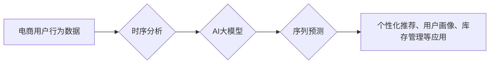

                 

## 电商用户行为序列预测：AI大模型的时序分析

> 关键词：电商用户行为，序列预测，AI大模型，时序分析，深度学习，Transformer，Recurrent Neural Networks

## 1. 背景介绍

在当今数据爆炸的时代，电商平台积累了海量用户行为数据，这些数据蕴含着丰富的商业价值。例如，用户浏览历史、购买记录、评价行为等，都能够为电商平台提供洞察用户需求、优化商品推荐、提升转化率等方面的宝贵信息。

用户行为序列预测是指根据用户历史行为数据，预测用户未来行为的一种技术。它在电商领域有着广泛的应用场景，例如：

* **个性化商品推荐:** 根据用户的浏览历史和购买记录，预测用户可能感兴趣的商品，提高推荐精准度和转化率。
* **用户画像分析:** 通过分析用户的行为序列，构建用户画像，了解用户的消费习惯、偏好和需求，为精准营销提供支持。
* **库存管理:** 预测用户未来对特定商品的需求，帮助电商平台优化库存管理，避免缺货或积压。
* **促銷活動預測:** 預測用户对特定促销活动的参与度，帮助电商平台制定更有效的营销策略。

传统的电商用户行为序列预测方法主要依赖于规则引擎和统计模型，但这些方法难以捕捉用户行为的复杂性和动态性。随着深度学习技术的快速发展，基于AI大模型的时序分析方法逐渐成为主流，能够更有效地挖掘用户行为序列中的潜在模式和规律。

## 2. 核心概念与联系

### 2.1  时序分析

时序分析是指对时间序列数据进行分析和预测的技术。电商用户行为序列数据具有明显的时序特征，因此时序分析方法在电商领域具有重要的应用价值。

### 2.2  AI大模型

AI大模型是指在海量数据上训练的深度学习模型，具有强大的学习和泛化能力。近年来，Transformer模型的出现，为时序分析领域带来了革命性的变革。

### 2.3  序列预测

序列预测是指根据历史数据预测未来数据的一种任务。在电商领域，用户行为序列预测就是一种典型的序列预测任务。

**核心概念与联系流程图:**



## 3. 核心算法原理 & 具体操作步骤

### 3.1  算法原理概述

Transformer模型是一种基于注意力机制的深度学习模型，能够有效地捕捉序列数据中的长距离依赖关系。在电商用户行为序列预测任务中，Transformer模型可以将用户的历史行为序列作为输入，学习用户行为的潜在模式和规律，并预测用户的未来行为。

### 3.2  算法步骤详解

1. **数据预处理:** 将用户行为序列数据进行清洗、转换和编码，使其能够被Transformer模型输入。
2. **模型构建:** 根据具体的应用场景，选择合适的Transformer模型架构，并进行参数设置。
3. **模型训练:** 使用训练数据训练Transformer模型，优化模型参数，使其能够准确地预测用户行为序列。
4. **模型评估:** 使用测试数据评估模型的预测性能，并进行调参优化。
5. **模型部署:** 将训练好的模型部署到生产环境中，用于实时预测用户行为序列。

### 3.3  算法优缺点

**优点:**

* 能够有效地捕捉序列数据中的长距离依赖关系。
* 训练速度快，预测精度高。
* 可扩展性强，能够处理海量数据。

**缺点:**

* 模型参数量大，需要大量的计算资源进行训练。
* 对训练数据的质量要求较高。

### 3.4  算法应用领域

Transformer模型在电商用户行为序列预测领域有着广泛的应用，例如：

* **个性化商品推荐:** 根据用户的浏览历史和购买记录，预测用户可能感兴趣的商品，提高推荐精准度和转化率。
* **用户画像分析:** 通过分析用户的行为序列，构建用户画像，了解用户的消费习惯、偏好和需求，为精准营销提供支持。
* **库存管理:** 预测用户未来对特定商品的需求，帮助电商平台优化库存管理，避免缺货或积压。
* **促銷活動預測:** 預測用户对特定促销活动的参与度，帮助电商平台制定更有效的营销策略。

## 4. 数学模型和公式 & 详细讲解 & 举例说明

### 4.1  数学模型构建

Transformer模型的核心是注意力机制，它能够学习序列数据中不同元素之间的关系。在电商用户行为序列预测任务中，我们可以将用户的历史行为序列作为输入，并使用注意力机制学习用户行为之间的依赖关系。

### 4.2  公式推导过程

Transformer模型的注意力机制使用以下公式计算每个元素的权重：

$$
Attention(Q, K, V) = softmax(\frac{QK^T}{\sqrt{d_k}})V
$$

其中：

* $Q$：查询矩阵
* $K$：键矩阵
* $V$：值矩阵
* $d_k$：键向量的维度
* $softmax$：softmax函数

### 4.3  案例分析与讲解

假设我们有一个用户行为序列数据，包含用户的浏览历史和购买记录。我们可以将这些数据表示为一个矩阵，其中每一行代表一个用户，每一列代表一个商品。

使用Transformer模型的注意力机制，我们可以计算每个商品对用户行为的影响权重。例如，如果一个用户经常浏览某个商品，那么这个商品对用户的行为影响权重就会更高。

通过学习这些权重，Transformer模型能够更好地理解用户的行为模式，并预测用户的未来行为。

## 5. 项目实践：代码实例和详细解释说明

### 5.1  开发环境搭建

* Python 3.6+
* TensorFlow/PyTorch
* Jupyter Notebook

### 5.2  源代码详细实现

```python
import tensorflow as tf

# 定义Transformer模型
class Transformer(tf.keras.Model):
    def __init__(self, vocab_size, embedding_dim, num_heads, num_layers):
        super(Transformer, self).__init__()
        self.embedding = tf.keras.layers.Embedding(vocab_size, embedding_dim)
        self.transformer_layers = tf.keras.layers.StackedRNNCells([
            tf.keras.layers.MultiHeadAttention(num_heads=num_heads, key_dim=embedding_dim)
            for _ in range(num_layers)
        ])
        self.dense = tf.keras.layers.Dense(vocab_size)

    def call(self, inputs):
        x = self.embedding(inputs)
        x = self.transformer_layers(x)
        x = self.dense(x)
        return x

# 训练模型
model = Transformer(vocab_size=10000, embedding_dim=128, num_heads=8, num_layers=6)
model.compile(optimizer='adam', loss='sparse_categorical_crossentropy', metrics=['accuracy'])
model.fit(train_data, train_labels, epochs=10)

```

### 5.3  代码解读与分析

* **模型定义:** 代码定义了一个Transformer模型，包含嵌入层、多头注意力层和全连接层。
* **模型训练:** 使用训练数据训练模型，并使用Adam优化器、交叉熵损失函数和准确率作为评估指标。

### 5.4  运行结果展示

训练完成后，可以使用测试数据评估模型的预测性能。

## 6. 实际应用场景

### 6.1  个性化商品推荐

基于Transformer模型的用户行为序列预测可以为电商平台提供更精准的商品推荐。例如，可以根据用户的浏览历史和购买记录，预测用户可能感兴趣的商品，并将其推荐给用户。

### 6.2  用户画像分析

通过分析用户的行为序列，可以构建用户画像，了解用户的消费习惯、偏好和需求。例如，可以分析用户的购买频率、购买金额、购买商品类别等信息，构建用户的消费画像。

### 6.3  库存管理

预测用户未来对特定商品的需求，可以帮助电商平台优化库存管理，避免缺货或积压。例如，可以预测用户对特定季节商品的需求，提前做好库存准备。

### 6.4  未来应用展望

随着AI技术的不断发展，电商用户行为序列预测将会有更广泛的应用场景。例如，可以用于预测用户的退货率、评价行为、忠诚度等，为电商平台提供更全面的用户洞察。

## 7. 工具和资源推荐

### 7.1  学习资源推荐

* **书籍:**
    * Deep Learning by Ian Goodfellow, Yoshua Bengio, and Aaron Courville
    * Attention Is All You Need by Vaswani et al.
* **在线课程:**
    * TensorFlow Tutorials
    * PyTorch Tutorials

### 7.2  开发工具推荐

* **TensorFlow:** 开源深度学习框架
* **PyTorch:** 开源深度学习框架
* **Jupyter Notebook:** 交互式编程环境

### 7.3  相关论文推荐

* **Attention Is All You Need:** https://arxiv.org/abs/1706.03762
* **BERT: Pre-training of Deep Bidirectional Transformers for Language Understanding:** https://arxiv.org/abs/1810.04805

## 8. 总结：未来发展趋势与挑战

### 8.1  研究成果总结

基于AI大模型的电商用户行为序列预测技术取得了显著的成果，能够有效地提升推荐精准度、用户画像分析能力和库存管理效率。

### 8.2  未来发展趋势

* **模型架构创新:** 探索更强大的Transformer模型架构，例如多模态Transformer模型，能够融合文本、图像、视频等多类型数据，提升预测精度。
* **数据增强:** 开发新的数据增强技术，例如文本生成、数据合成等，提升训练数据的质量和多样性。
* **解释性分析:** 研究Transformer模型的决策机制，提高模型的解释性，帮助用户理解模型的预测结果。

### 8.3  面临的挑战

* **数据隐私保护:** 电商用户行为数据具有敏感性，需要采取有效的措施保护用户隐私。
* **模型可解释性:** Transformer模型的复杂性使得其决策机制难以理解，需要研究更有效的解释性分析方法。
* **计算资源需求:** Transformer模型的训练需要大量的计算资源，需要探索更有效的训练方法，降低计算成本。

### 8.4  研究展望

未来，电商用户行为序列预测技术将继续朝着更精准、更智能、更可解释的方向发展，为电商平台提供更强大的数据驱动决策支持。

## 9. 附录：常见问题与解答

* **Q: Transformer模型的训练需要多长时间？**

A: Transformer模型的训练时间取决于模型规模、数据集大小和硬件资源等因素。一般来说，训练一个中等规模的Transformer模型需要几天到几周的时间。

* **Q: 如何评估Transformer模型的预测性能？**

A: 可以使用准确率、召回率、F1-score等指标评估Transformer模型的预测性能。

* **Q: 如何处理缺失数据？**

A: 可以使用填充值、删除缺失数据或使用其他缺失数据处理方法来处理缺失数据。


作者：禅与计算机程序设计艺术 / Zen and the Art of Computer Programming 
<end_of_turn>

