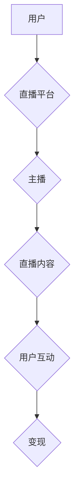

                 

## 直播经济：注意力变现的新方式

> 关键词：直播经济、注意力经济、变现模式、实时互动、数据分析、人工智能、用户体验

### 1. 背景介绍

近年来，互联网技术的发展日新月异，移动互联网的普及更是催生了一系列新的商业模式。其中，直播经济作为一种新兴的商业模式，以其实时互动、沉浸式体验和高效变现的特点，迅速崛起，成为互联网发展的新热点。

直播经济的核心在于“注意力”，它通过实时视频直播的方式，将用户注意力集中在主播身上，并通过各种互动方式，例如弹幕、点赞、礼物等，增强用户参与感和粘性。这种模式的出现，标志着互联网商业模式从“内容生产”向“注意力运营”的转变。

### 2. 核心概念与联系

直播经济的核心概念包括：

* **直播平台：** 提供直播服务的平台，例如抖音、快手、B站等。
* **主播：** 通过直播平台进行内容输出和与用户互动的人。
* **观众：** 通过直播平台观看主播内容的用户。
* **互动机制：** 直播平台提供的各种互动功能，例如弹幕、点赞、礼物等。
* **变现模式：** 主播通过直播平台获得收益的方式，例如广告分成、礼物打赏、带货等。

直播经济的运作模式可以概括为以下流程：



### 3. 核心算法原理 & 具体操作步骤

#### 3.1  算法原理概述

直播经济的核心算法原理主要围绕用户匹配、内容推荐和互动分析三个方面。

* **用户匹配：** 通过分析用户的观看历史、兴趣偏好、行为数据等，将用户与匹配的主播和内容进行连接。
* **内容推荐：** 根据用户的观看习惯和平台数据，推荐用户感兴趣的主播和内容。
* **互动分析：** 分析用户的互动行为，例如点赞、评论、礼物打赏等，了解用户对内容的喜好和参与度，并反馈给主播和平台进行优化。

#### 3.2  算法步骤详解

**用户匹配算法：**

1. 收集用户数据：包括用户基本信息、观看历史、点赞记录、评论内容等。
2. 数据预处理：对收集到的数据进行清洗、转换和特征提取。
3. 建立用户画像：根据用户数据，构建用户兴趣偏好、观看习惯等方面的画像。
4. 计算用户相似度：利用机器学习算法，计算用户之间的相似度。
5. 推荐匹配主播：根据用户画像和相似度，推荐用户匹配的主播。

**内容推荐算法：**

1. 收集内容数据：包括内容标题、描述、标签、观看时长、点赞数、评论数等。
2. 数据预处理：对收集到的内容数据进行清洗、转换和特征提取。
3. 建立内容特征：根据内容数据，构建内容主题、风格、类型等方面的特征。
4. 计算内容相似度：利用机器学习算法，计算内容之间的相似度。
5. 推荐匹配内容：根据用户画像和内容相似度，推荐用户匹配的内容。

**互动分析算法：**

1. 收集互动数据：包括用户点赞、评论、礼物打赏等行为数据。
2. 数据预处理：对收集到的互动数据进行清洗、转换和特征提取。
3. 分析互动模式：利用数据挖掘和机器学习算法，分析用户的互动模式和行为特征。
4. 识别用户情绪：通过分析用户评论和弹幕内容，识别用户的积极、消极或中性情绪。
5. 提供反馈：将分析结果反馈给主播和平台，帮助他们优化内容和互动方式。

#### 3.3  算法优缺点

**优点：**

* **精准匹配：** 通过算法分析，可以精准匹配用户和内容，提高用户体验和留存率。
* **个性化推荐：** 根据用户的兴趣偏好，提供个性化的内容推荐，增强用户粘性。
* **实时互动：** 直播平台的互动机制，可以增强用户参与感和互动体验。
* **高效变现：** 直播平台的变现模式，可以为主播和平台带来可观的收益。

**缺点：**

* **数据依赖：** 算法的准确性依赖于数据的质量和数量。
* **算法偏差：** 算法本身可能存在偏差，导致推荐结果不准确或不公平。
* **用户隐私：** 数据收集和分析可能会涉及用户隐私问题。
* **内容质量：** 直播平台上存在大量低质量内容，需要平台和用户共同努力提高内容质量。

#### 3.4  算法应用领域

直播经济的核心算法原理和技术可以应用于以下领域：

* **电商直播：** 通过直播平台，商家可以展示产品、进行促销活动，并与用户实时互动。
* **教育直播：** 通过直播平台，老师可以进行线上教学，与学生实时互动，提高教学效果。
* **娱乐直播：** 通过直播平台，主播可以进行游戏直播、唱歌直播、舞蹈直播等，与观众互动娱乐。
* **社交直播：** 通过直播平台，用户可以进行实时视频聊天、分享生活，增强社交互动。

### 4. 数学模型和公式 & 详细讲解 & 举例说明

#### 4.1  数学模型构建

直播经济的变现模式可以抽象为一个数学模型，其中涉及用户参与度、内容质量和平台分成等因素。

假设：

* $U$ 为用户参与度，例如点赞数、评论数、礼物打赏金额等。
* $C$ 为内容质量，例如观看时长、互动率、用户评价等。
* $P$ 为平台分成比例。

则主播的收益 $R$ 可以表示为：

$$R = P \cdot U \cdot C$$

#### 4.2  公式推导过程

该公式表明，主播的收益取决于用户参与度、内容质量和平台分成比例的乘积。

* 用户参与度越高，收益越高。
* 内容质量越高，收益越高。
* 平台分成比例越高，主播收益越低。

#### 4.3  案例分析与讲解

例如，假设一个主播的直播内容质量为 $C = 5$，平台分成比例为 $P = 0.2$，用户参与度为 $U = 100$，则该主播的收益为：

$$R = 0.2 \cdot 100 \cdot 5 = 100$$

如果用户参与度提高到 $U = 200$，则收益将提高到：

$$R = 0.2 \cdot 200 \cdot 5 = 200$$

### 5. 项目实践：代码实例和详细解释说明

#### 5.1  开发环境搭建

直播经济项目开发环境搭建需要以下软件和工具：

* **操作系统：** Windows、macOS、Linux 等。
* **编程语言：** Python、Java、Go 等。
* **开发框架：** Flask、Django、Spring Boot 等。
* **数据库：** MySQL、MongoDB、Redis 等。
* **直播平台 SDK：** 抖音、快手、B站等平台提供的 SDK。

#### 5.2  源代码详细实现

以下是一个简单的 Python 代码示例，演示如何使用 Flask 框架构建一个简单的直播平台：

```python
from flask import Flask, render_template

app = Flask(__name__)

@app.route('/')
def index():
    return render_template('index.html')

if __name__ == '__main__':
    app.run(debug=True)
```

这个代码示例创建一个简单的 Flask 应用，提供一个首页。

#### 5.3  代码解读与分析

* `from flask import Flask, render_template`: 导入 Flask 框架和模板渲染功能。
* `app = Flask(__name__)`: 创建一个 Flask 应用实例。
* `@app.route('/')`: 定义一个路由规则，当访问根路径 '/' 时，执行 `index()` 函数。
* `def index()`: 定义一个函数，返回一个名为 `index.html` 的模板文件。
* `if __name__ == '__main__':`: 确保代码只在脚本执行时运行。
* `app.run(debug=True)`: 启动 Flask 应用，并开启调试模式。

#### 5.4  运行结果展示

运行上述代码后，访问 `http://127.0.0.1:5000/`，即可看到一个简单的网页。

### 6. 实际应用场景

直播经济的应用场景非常广泛，例如：

* **电商直播：** 直播带货成为电商行业的新趋势，商家可以通过直播平台展示产品、进行促销活动，并与用户实时互动，提高转化率。
* **教育直播：** 线上教育平台可以通过直播方式进行课程教学，与学生实时互动，提高教学效果。
* **娱乐直播：** 游戏直播、唱歌直播、舞蹈直播等娱乐直播内容，可以满足用户对娱乐的需求，并为主播带来收益。
* **社交直播：** 用户可以通过直播平台进行实时视频聊天、分享生活，增强社交互动。

### 6.4  未来应用展望

未来，直播经济将朝着以下方向发展：

* **更智能化：** 利用人工智能技术，实现更精准的用户匹配、内容推荐和互动分析。
* **更沉浸式：** 利用虚拟现实、增强现实等技术，打造更沉浸式的直播体验。
* **更多元化：** 直播内容将更加多元化，涵盖更多领域和主题。
* **更融合化：** 直播经济将与其他互联网产业更加融合，例如电商、教育、娱乐等。

### 7. 工具和资源推荐

#### 7.1  学习资源推荐

* **书籍：** 《直播经济》、《注意力经济》
* **在线课程：** Coursera、Udemy 等平台上的直播经济相关课程
* **博客文章：** 关注直播经济领域的知名博客和技术网站

#### 7.2  开发工具推荐

* **直播平台 SDK：** 抖音、快手、B站等平台提供的 SDK
* **开发框架：** Flask、Django、Spring Boot 等
* **数据库：** MySQL、MongoDB、Redis 等

#### 7.3  相关论文推荐

* **直播经济的现状与发展趋势**
* **直播平台用户行为分析**
* **直播内容推荐算法研究**

### 8. 总结：未来发展趋势与挑战

#### 8.1  研究成果总结

直播经济作为一种新兴的商业模式，已经取得了显著的成果，为用户提供了新的娱乐、购物和学习方式，也为主播和平台带来了新的收益模式。

#### 8.2  未来发展趋势

未来，直播经济将朝着更智能化、更沉浸式、更多元化、更融合化的方向发展。

#### 8.3  面临的挑战

直播经济也面临着一些挑战，例如：

* **内容质量问题：** 直播平台上存在大量低质量内容，需要平台和用户共同努力提高内容质量。
* **用户隐私问题：** 数据收集和分析可能会涉及用户隐私问题，需要平台加强隐私保护措施。
* **监管问题：** 直播经济的快速发展也带来了监管问题，需要政府制定相关政策规范直播行业发展。

#### 8.4  研究展望

未来，需要进一步研究直播经济的商业模式、用户行为、内容推荐算法等方面，并探索直播经济与其他互联网产业的融合发展模式。

### 9. 附录：常见问题与解答

* **什么是直播经济？** 直播经济是指通过实时视频直播的方式，为用户提供娱乐、购物、学习等服务，并通过广告分成、礼物打赏、带货等方式实现变现的商业模式。
* **直播经济的优势是什么？** 直播经济的优势在于实时互动、沉浸式体验和高效变现。
* **直播经济的未来发展趋势是什么？** 未来，直播经济将朝着更智能化、更沉浸式、更多元化、更融合化的方向发展。


作者：禅与计算机程序设计艺术 / Zen and the Art of Computer Programming 
<end_of_turn>

