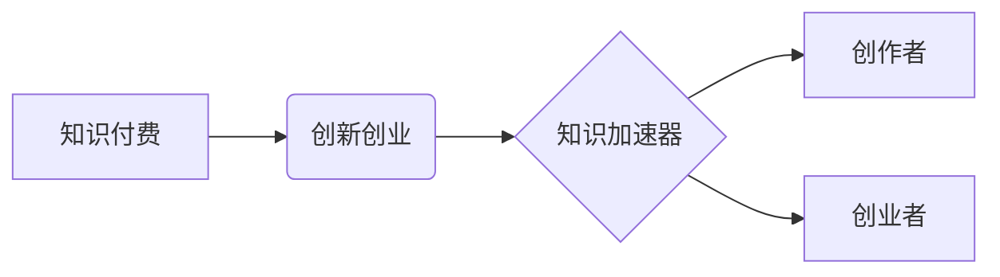

                 

## 知识付费与创新创业相结合的知识加速器

> 关键词：知识付费、创新创业、知识加速器、在线教育、技术赋能、知识共享、商业模式、未来趋势

## 1. 背景介绍

在当今信息爆炸的时代，知识已成为最宝贵的资源。创新创业作为推动经济发展和社会进步的引擎，对知识的获取和应用有着越来越高的需求。知识付费作为一种新型的知识传播模式，以其便捷、高效、个性化的特点，正在成为知识获取和创新创业的重要途径。

传统教育模式的局限性在于其相对的封闭性和被动性，难以满足快速变化的市场需求和个人个性化学习需求。而知识付费则打破了传统的知识壁垒，通过线上平台提供多元化的知识产品和服务，让用户可以根据自己的需求和节奏进行学习，并与创作者和同行进行互动交流。

另一方面，创新创业者往往面临着资源有限、信息获取困难等挑战。知识付费平台可以为他们提供丰富的行业资讯、技术指导和商业案例，帮助他们快速提升专业技能、拓展商业视野，并降低创业风险。

## 2. 核心概念与联系

**2.1 知识付费**

知识付费是指通过付费的方式获取知识、技能和服务的商业模式。它涵盖了各种形式的知识产品和服务，例如在线课程、电子书、付费咨询、会员服务等。

**2.2 创新创业**

创新创业是指以创新为驱动力，通过创业活动创造新的价值，并将其转化为经济效益和社会效益的过程。它包括技术创新、商业模式创新、产品创新等多个方面。

**2.3 知识加速器**

知识加速器是指利用知识付费平台和技术手段，帮助创作者和创业者快速获取知识、提升技能、拓展资源、加速创新创业进程的系统性解决方案。

**2.4 核心概念关系图**



## 3. 核心算法原理 & 具体操作步骤

**3.1 算法原理概述**

知识加速器的核心算法原理基于知识图谱、推荐算法和个性化学习路径构建。

* **知识图谱:** 将知识点、概念、案例等信息以图谱的形式进行组织和连接，构建知识网络，方便用户进行知识导航和探索。
* **推荐算法:** 基于用户的学习行为、兴趣偏好和知识需求，推荐相关知识产品和服务，提高用户学习效率和满意度。
* **个性化学习路径:** 根据用户的学习目标、进度和能力水平，构建个性化的学习路径，提供定制化的学习体验。

**3.2 算法步骤详解**

1. **知识数据采集和构建知识图谱:** 收集来自各种来源的知识数据，例如书籍、论文、课程、案例等，并将其转化为知识图谱的形式。
2. **用户行为分析和建模:** 分析用户的学习行为、兴趣偏好和知识需求，构建用户模型，以便进行个性化推荐和学习路径规划。
3. **推荐算法训练和优化:** 利用机器学习算法，训练推荐模型，并根据用户反馈进行模型优化，提高推荐准确性和个性化程度。
4. **个性化学习路径生成:** 根据用户的学习目标、进度和能力水平，生成个性化的学习路径，并提供相应的学习资源和指导。
5. **学习效果评估和反馈:** 定期评估用户的学习效果，并收集用户反馈，不断改进知识加速器的算法模型和服务内容。

**3.3 算法优缺点**

* **优点:**
    * 提高知识获取效率和学习体验
    * 个性化学习，满足不同用户的需求
    * 促进知识共享和传播
    * 降低创业门槛，加速创新创业进程
* **缺点:**
    * 知识数据质量和知识图谱构建难度
    * 推荐算法的准确性和个性化程度
    * 用户隐私保护和数据安全

**3.4 算法应用领域**

* 在线教育平台
* 创业孵化器
* 企业培训体系
* 个人知识管理

## 4. 数学模型和公式 & 详细讲解 & 举例说明

**4.1 数学模型构建**

知识加速器的核心算法模型可以抽象为一个推荐系统模型，其目标是根据用户的历史行为和知识需求，预测用户对特定知识产品的兴趣和点击率。

**4.2 公式推导过程**

常用的推荐算法模型包括协同过滤、内容过滤和混合推荐等。

* **协同过滤:** 基于用户的历史行为数据，预测用户对未接触过的知识产品的兴趣。

$$
P(u, i) = \frac{\sum_{j \in N(u)} \operatorname{sim}(u, j) \cdot r(j, i)}{\sum_{j \in N(u)} \operatorname{sim}(u, j)}
$$

其中：

* $P(u, i)$ 表示用户 $u$ 对知识产品 $i$ 的预测评分
* $N(u)$ 表示与用户 $u$ 具有相似行为的用户集合
* $\operatorname{sim}(u, j)$ 表示用户 $u$ 和用户 $j$ 之间的相似度
* $r(j, i)$ 表示用户 $j$ 对知识产品 $i$ 的实际评分

* **内容过滤:** 基于知识产品的特征和用户偏好，预测用户对知识产品的兴趣。

$$
P(u, i) = \operatorname{sim}(c(i), p(u))
$$

其中：

* $c(i)$ 表示知识产品 $i$ 的特征向量
* $p(u)$ 表示用户 $u$ 的偏好向量
* $\operatorname{sim}(c(i), p(u))$ 表示知识产品 $i$ 的特征向量和用户 $u$ 的偏好向量之间的相似度

**4.3 案例分析与讲解**

假设一个在线教育平台，用户 $A$ 之前学习过编程课程，并对人工智能感兴趣。平台可以使用协同过滤算法，找到与用户 $A$ 兴趣相似的用户，并推荐他们学习过的关于人工智能的课程。

## 5. 项目实践：代码实例和详细解释说明

**5.1 开发环境搭建**

* Python 3.x
* TensorFlow 或 PyTorch
* Jupyter Notebook

**5.2 源代码详细实现**

```python
# 协同过滤推荐算法示例

import numpy as np

# 用户-物品交互矩阵
ratings = np.array([
    [5, 4, 3, 2, 1],
    [4, 5, 2, 1, 3],
    [3, 2, 5, 4, 1],
    [2, 1, 4, 5, 3],
    [1, 3, 1, 3, 5]
])

# 计算用户相似度
def cosine_similarity(u1, u2):
    return np.dot(u1, u2) / (np.linalg.norm(u1) * np.linalg.norm(u2))

# 获取用户相似度矩阵
similarity_matrix = np.zeros((ratings.shape[0], ratings.shape[0]))
for i in range(ratings.shape[0]):
    for j in range(i + 1, ratings.shape[0]):
        similarity_matrix[i, j] = cosine_similarity(ratings[i], ratings[j])
        similarity_matrix[j, i] = similarity_matrix[i, j]

# 预测用户对物品的评分
def predict_rating(user_id, item_id):
    similar_users = np.argsort(similarity_matrix[user_id])[::-1][1:]
    weighted_sum = 0
    for similar_user in similar_users:
        weighted_sum += similarity_matrix[user_id, similar_user] * ratings[similar_user, item_id]
    return weighted_sum / np.sum(similarity_matrix[user_id, similar_users])

# 预测用户 A 对物品 3 的评分
user_A_id = 0
item_3_id = 2
predicted_rating = predict_rating(user_A_id, item_3_id)
print(f"用户 A 对物品 3 的预测评分: {predicted_rating}")
```

**5.3 代码解读与分析**

* 该代码示例实现了基于协同过滤算法的推荐系统。
* 首先定义了用户-物品交互矩阵，表示用户对不同物品的评分。
* 然后计算用户之间的相似度，并构建用户相似度矩阵。
* 最后，根据用户相似度和历史评分，预测用户对特定物品的评分。

**5.4 运行结果展示**

运行该代码后，会输出用户 A 对物品 3 的预测评分。

## 6. 实际应用场景

**6.1 在线教育平台**

知识付费平台可以提供个性化的学习路径、推荐相关课程和学习资源，帮助用户提升学习效率和学习体验。

**6.2 创业孵化器**

知识加速器可以为创业者提供创业指导、商业案例分析、行业资讯和资源连接，帮助他们加速创业进程。

**6.3 企业培训体系**

企业可以利用知识加速器构建内部培训体系，提供员工所需的专业技能培训和知识更新，提升员工素质和企业竞争力。

**6.4 个人知识管理**

个人用户可以利用知识加速器进行知识积累、技能提升和兴趣探索，实现个人知识管理和成长。

**6.5 未来应用展望**

随着人工智能、大数据和云计算技术的不断发展，知识加速器的应用场景将更加广泛，并呈现以下趋势：

* **更精准的个性化推荐:** 利用深度学习算法和用户行为分析，提供更加精准的知识推荐，满足用户个性化需求。
* **更丰富的知识内容:** 知识加速器将整合更多类型的知识资源，包括视频、音频、文本、案例等，提供更加丰富的学习体验。
* **更智能的学习辅助:** 利用人工智能技术，提供智能化的学习辅助功能，例如自动生成学习计划、智能答疑、个性化学习反馈等。
* **更广泛的应用场景:** 知识加速器将应用于更多领域，例如医疗、金融、法律等，帮助专业人士提升技能和知识水平。

## 7. 工具和资源推荐

**7.1 学习资源推荐**

* **在线课程平台:** Coursera, edX, Udemy
* **技术博客和论坛:** Hacker News, Stack Overflow, Medium
* **开源项目:** GitHub, GitLab

**7.2 开发工具推荐**

* **Python:** TensorFlow, PyTorch, Scikit-learn
* **数据存储和处理:** MongoDB, Redis, Hadoop
* **云计算平台:** AWS, Azure, Google Cloud

**7.3 相关论文推荐**

* **协同过滤推荐算法:** "Collaborative Filtering for Implicit Feedback Datasets"
* **内容过滤推荐算法:** "Content-Based Recommendation Systems"
* **混合推荐算法:** "Hybrid Recommender Systems: A Survey"

## 8. 总结：未来发展趋势与挑战

**8.1 研究成果总结**

知识加速器作为一种新型的知识传播和创新创业模式，在推动知识共享、提升学习效率、加速创新创业方面具有重要意义。

**8.2 未来发展趋势**

未来，知识加速器将朝着更加智能化、个性化、融合化方向发展，并应用于更多领域。

**8.3 面临的挑战**

知识加速器的发展也面临着一些挑战，例如知识数据质量、算法模型的准确性和个性化程度、用户隐私保护和数据安全等。

**8.4 研究展望**

未来研究将重点关注以下几个方面：

* 开发更加精准的推荐算法，提高推荐准确性和个性化程度。
* 构建更加丰富的知识图谱，整合更多类型的知识资源。
* 利用人工智能技术，提供更加智能化的学习辅助功能。
* 加强知识加速器的安全性、可靠性和可扩展性。

## 9. 附录：常见问题与解答

**9.1 如何选择合适的知识加速器？**

选择知识加速器时，需要考虑以下因素：

* **知识内容:** 确保知识加速器提供与用户需求相关的知识内容。
* **学习体验:** 选择提供便捷、高效、个性化的学习体验的知识加速器。
* **价格:** 选择价格合理、性价比高的知识加速器。
* **口碑:** 选择口碑良好、用户评价高的知识加速器。

**9.2 如何保护知识加速器平台上的个人隐私？**

知识加速器平台通常会收集用户的个人信息，例如姓名、邮箱地址、学习行为等。用户可以采取以下措施保护个人隐私：

* 阅读平台的隐私政策，了解平台如何收集、使用和保护用户数据。
* 设置合理的隐私设置，控制个人信息的可见范围。
* 使用安全的密码和双重身份验证，防止账号被盗用。
* 谨慎分享个人信息，避免泄露敏感信息。


作者：禅与计算机程序设计艺术 / Zen and the Art of Computer Programming 
<end_of_turn>

