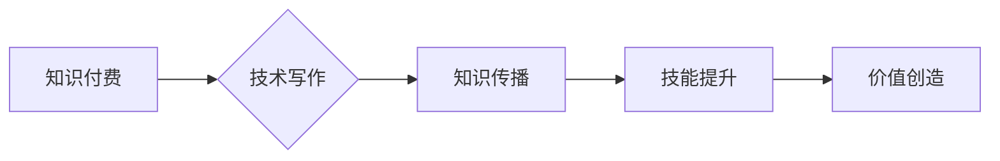

                 

## 1. 背景介绍

在当今数字时代，知识已成为最宝贵的资源之一。随着互联网的普及和信息爆炸，获取知识变得更加便捷，但也更加碎片化和分散。在这种背景下，知识付费模式应运而生，它以付费的方式提供专业知识和技能的学习机会，逐渐成为一种重要的知识传播和商业模式。

技术写作作为一种专门的知识传播方式，在知识付费领域扮演着至关重要的角色。技术文档、教程、博客文章、电子书等技术写作形式，能够以清晰、准确、易懂的方式将复杂的技术知识传递给读者，帮助他们理解和掌握技术技能。

## 2. 核心概念与联系

**2.1 知识付费**

知识付费是指通过付费的方式获取知识和技能的商业模式。它涵盖了各种形式的知识产品，例如在线课程、付费博客、电子书、咨询服务等。

**2.2 技术写作**

技术写作是指以清晰、准确、易懂的方式将技术知识传递给特定受众的技术性写作。它包括各种形式的文档，例如技术规范、用户手册、API 文档、博客文章、教程等。

**2.3 协同效应**

协同效应是指两个或多个因素共同作用时，产生的效果大于各自单独作用的效果的现象。

**2.4 协同效应原理图**



**2.5 协同效应分析**

知识付费和技术写作的协同效应体现在以下几个方面：

* **提升知识价值:** 技术写作能够将知识转化为易于理解和应用的形式，提升知识的价值和吸引力。
* **扩大知识传播:** 知识付费平台能够为技术写作提供更广泛的传播渠道，帮助技术内容触达更多受众。
* **促进技能提升:** 技术写作能够提供系统化的学习路径和实践指导，帮助读者有效提升技术技能。
* **创造经济价值:** 知识付费模式能够为技术作者提供收入来源，激励他们持续创作高质量的技术内容。

## 3. 核心算法原理 & 具体操作步骤

**3.1 算法原理概述**

知识付费与技术写作的协同效应可以看作是一种信息传递和价值创造的算法。该算法的核心原理是将知识转化为易于理解和应用的形式，并通过付费机制将其传播给需要的人，从而实现知识价值的放大和技能提升。

**3.2 算法步骤详解**

1. **知识识别和筛选:** 首先需要识别和筛选出具有价值和市场需求的技术知识。
2. **内容创作:** 将筛选出的知识转化为易于理解和应用的技术文档、教程、博客文章、电子书等形式。
3. **平台搭建:** 建立知识付费平台，提供知识产品发布、销售和学习服务。
4. **用户获取:** 通过线上线下推广等方式吸引目标用户。
5. **付费购买:** 用户通过平台付费购买知识产品。
6. **知识学习:** 用户学习和掌握知识技能。
7. **价值反馈:** 用户通过评论、分享等方式反馈知识价值，帮助平台改进和优化。

**3.3 算法优缺点**

**优点:**

* 能够有效提升知识价值和传播效率。
* 能够为技术作者提供收入来源，激励他们持续创作。
* 能够帮助用户快速提升技术技能，实现个人价值提升。

**缺点:**

* 需要投入一定的成本和时间进行知识筛选、内容创作和平台搭建。
* 需要不断优化平台运营和用户体验，才能保持用户粘性和收入增长。
* 知识付费模式的成功依赖于知识产品的质量和用户需求的匹配。

**3.4 算法应用领域**

知识付费与技术写作的协同效应广泛应用于以下领域:

* **软件开发:** 提供编程语言学习、框架教程、项目实战等技术内容。
* **数据科学:** 提供数据分析、机器学习、深度学习等技术课程和资料。
* **网络安全:** 提供网络安全知识、漏洞分析、安全测试等技术培训。
* **云计算:** 提供云平台架构、运维管理、应用开发等技术文档和教程。

## 4. 数学模型和公式 & 详细讲解 & 举例说明

**4.1 数学模型构建**

我们可以用一个简单的数学模型来描述知识付费与技术写作的协同效应:

$$
Value = Content \times Platform \times User
$$

其中:

* **Value:** 知识价值，指知识对用户带来的实际效益。
* **Content:** 技术内容的质量和价值，包括知识的深度、广度、实用性和易懂性。
* **Platform:** 知识付费平台的质量和影响力，包括平台的品牌、用户规模、推广能力和服务水平。
* **User:** 用户的学习能力、需求和付费意愿。

**4.2 公式推导过程**

该模型表明，知识价值的产生是技术内容、知识付费平台和用户三者共同作用的结果。

* **技术内容**是知识付费的核心，高质量的技术内容能够吸引用户并提供价值。
* **知识付费平台**是知识传播的载体，优质的平台能够帮助技术内容触达更多用户。
* **用户**是知识价值的最终受益者，用户的学习能力、需求和付费意愿决定了知识价值的实现。

**4.3 案例分析与讲解**

例如，一个优秀的编程语言教程，如果发布在知名技术社区的付费平台上，并吸引了大量编程爱好者付费学习，那么该教程的知识价值就会得到充分体现。反之，如果该教程内容质量不高，平台影响力不足，或者用户对该语言没有学习需求，那么该教程的知识价值就会难以实现。

## 5. 项目实践：代码实例和详细解释说明

**5.1 开发环境搭建**

为了实现知识付费与技术写作的协同效应，我们可以搭建一个简单的知识付费平台。

**所需技术栈:**

* 前端: React.js
* 后端: Node.js
* 数据库: MongoDB

**搭建步骤:**

1. 安装 Node.js 和 npm。
2. 创建项目文件夹并初始化项目。
3. 安装依赖包。
4. 创建前端和后端代码。
5. 配置数据库连接。
6. 部署到云服务器。

**5.2 源代码详细实现**

由于篇幅限制，这里只提供部分代码示例。

**前端代码示例 (React.js):**

```javascript
import React, { useState } from 'react';

function CourseCard(props) {
  const [isPurchased, setIsPurchased] = useState(false);

  const handlePurchase = () => {
    setIsPurchased(true);
    // 调用后端接口进行购买操作
  };

  return (
    <div className="course-card">
      <h3>{props.title}</h3>
      <p>{props.description}</p>
      {isPurchased ? (
        <button disabled>已购买</button>
      ) : (
        <button onClick={handlePurchase}>购买</button>
      )}
    </div>
  );
}
```

**后端代码示例 (Node.js):**

```javascript
const express = require('express');
const app = express();

app.get('/courses', (req, res) => {
  // 查询数据库获取课程列表
  res.json(courses);
});

app.post('/purchase', (req, res) => {
  // 处理购买操作
  res.send('购买成功');
});

app.listen(3000, () => {
  console.log('Server listening on port 3000');
});
```

**5.3 代码解读与分析**

* 前端代码示例展示了课程卡片的展示逻辑，包括课程标题、描述和购买按钮。
* 后端代码示例展示了获取课程列表和处理购买操作的逻辑。

**5.4 运行结果展示**

运行上述代码，即可搭建一个简单的知识付费平台。用户可以通过平台浏览课程列表，并选择付费购买感兴趣的课程。

## 6. 实际应用场景

**6.1 在线教育平台**

在线教育平台可以利用知识付费与技术写作的协同效应，提供高质量的技术课程和培训服务。例如，Coursera、Udemy、edX 等平台都提供大量的技术课程，并采用付费模式进行销售。

**6.2 技术博客和网站**

技术博客和网站可以利用知识付费模式，为读者提供付费订阅服务，获取更深入的技术内容和独家资源。例如，Hacker News、Stack Overflow 等平台都提供付费订阅服务。

**6.3 技术社区和论坛**

技术社区和论坛可以利用知识付费模式，为专家提供收入来源，鼓励他们分享技术经验和知识。例如，GitHub、GitLab 等平台都提供付费订阅服务，为开源项目贡献者提供收入支持。

**6.4 企业内部培训**

企业可以利用知识付费模式，为员工提供内部技术培训，提升员工技能和工作效率。例如，Google、Microsoft 等科技巨头都拥有内部知识付费平台，为员工提供技术培训和技能提升服务。

**6.5 未来应用展望**

随着人工智能、虚拟现实等技术的不断发展，知识付费与技术写作的协同效应将更加广泛地应用于各个领域。例如，我们可以期待看到：

* 基于人工智能的个性化学习推荐系统，能够根据用户的学习需求和进度，推荐最合适的技术内容。
* 基于虚拟现实技术的沉浸式技术培训，能够提供更加生动的学习体验。
* 基于区块链技术的知识版权保护机制，能够保障知识创作者的权益。

## 7. 工具和资源推荐

**7.1 学习资源推荐**

* **在线课程平台:** Coursera、Udemy、edX、Khan Academy
* **技术博客和网站:** Hacker News、Stack Overflow、Medium、Dev.to
* **技术社区和论坛:** GitHub、GitLab、Reddit、Discord

**7.2 开发工具推荐**

* **前端框架:** React.js、Vue.js、Angular
* **后端框架:** Node.js、Express.js、Django、Flask
* **数据库:** MongoDB、MySQL、PostgreSQL
* **云服务器:** AWS、Azure、Google Cloud

**7.3 相关论文推荐**

* **The Economics of Online Education**
* **The Impact of Online Learning on Student Outcomes**
* **The Future of Work: How Technology Will Transform the Workplace**

## 8. 总结：未来发展趋势与挑战

**8.1 研究成果总结**

知识付费与技术写作的协同效应是一种有效的知识传播和价值创造模式，它能够帮助技术作者获得收入，帮助用户提升技能，并推动技术进步。

**8.2 未来发展趋势**

未来，知识付费与技术写作的协同效应将更加深入地融入到教育、培训、企业发展等各个领域，并随着人工智能、虚拟现实等技术的进步，呈现出更加智能化、个性化和沉浸式的形态。

**8.3 面临的挑战**

知识付费与技术写作的协同效应也面临着一些挑战，例如：

* **知识质量控制:** 确保知识产品的质量和权威性，避免低质量内容的泛滥。
* **用户体验优化:** 提升平台的用户体验，吸引更多用户参与。
* **商业模式创新:** 探索新的商业模式，实现可持续发展。

**8.4 研究展望**

未来研究可以关注以下几个方面:

* **人工智能在知识付费与技术写作中的应用:** 如何利用人工智能技术，提高知识内容的质量和效率，个性化推荐学习资源。
* **虚拟现实技术在技术培训中的应用:** 如何利用虚拟现实技术，提供更加生动和沉浸式的技术培训体验。
* **区块链技术在知识版权保护中的应用:** 如何利用区块链技术，保障知识创作者的权益，促进知识共享。


## 9. 附录：常见问题与解答

**9.1 如何选择合适的知识付费平台？**

选择知识付费平台时，需要考虑以下因素:

* 平台的品牌和信誉
* 平台的用户规模和活跃度
* 平台的课程质量和丰富度
* 平台的收费标准和服务内容

**9.2 如何提高知识付费平台的吸引力？**

提高知识付费平台的吸引力，可以从以下几个方面入手:

* 提供高质量、有价值的知识内容
* 优化平台的用户体验
* 推广平台的品牌和服务
* 建立良好的用户社区

**9.3 如何保护知识产权？**

知识创作者可以采取以下措施保护知识产权:

* 申请知识产权专利
* 使用版权声明和许可协议
* 利用区块链技术进行知识版权登记和管理


作者：禅与计算机程序设计艺术 / Zen and the Art of Computer Programming 
<end_of_turn>

