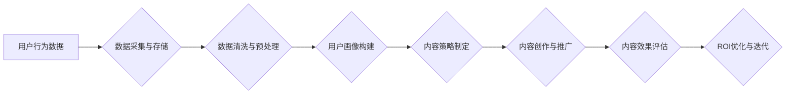

                 

## 知识付费创业中的内容营销ROI优化

> 关键词：知识付费、内容营销、ROI优化、算法模型、数据分析、用户画像

## 1. 背景介绍

知识付费行业近年来蓬勃发展，涌现出众多优秀的内容创作者和平台。然而，在竞争日益激烈的市场环境下，如何有效提升内容营销的ROI（投资回报率）成为知识付费创业者面临的重大挑战。传统的营销方式难以精准触达目标用户，内容推广成本高昂，难以保证营销效果。

随着人工智能、大数据等技术的快速发展，数据驱动的内容营销策略逐渐成为行业趋势。通过对用户行为、内容偏好等数据的深度分析，可以精准定位目标用户，优化内容创作和推广策略，从而提升内容营销的ROI。

## 2. 核心概念与联系

### 2.1 内容营销ROI

内容营销ROI是指通过内容营销活动所带来的收益与投入成本的比值。它衡量了内容营销活动的效率和价值，是评估内容营销策略成功与否的关键指标。

### 2.2 数据驱动内容营销

数据驱动内容营销是指利用数据分析和人工智能技术，对用户行为、内容偏好等进行深度挖掘，从而优化内容创作、推广和运营策略。

### 2.3 用户画像

用户画像是指对目标用户的行为、兴趣、需求等进行分析和总结，形成一个详细的用户描述模型。用户画像是数据驱动内容营销的基础，可以帮助企业精准定位目标用户，创作更符合用户需求的内容。

**Mermaid 流程图**



## 3. 核心算法原理 & 具体操作步骤

### 3.1 算法原理概述

数据驱动内容营销的核心算法原理基于机器学习和深度学习技术。通过训练模型，可以预测用户对不同类型内容的兴趣，从而优化内容创作和推广策略。常见的算法模型包括：

* **推荐算法**: 基于用户历史行为和内容特征，预测用户对特定内容的兴趣。
* **分类算法**: 将内容进行分类，例如新闻分类、博客分类等，帮助用户快速找到感兴趣的内容。
* **聚类算法**: 将用户进行分组，例如兴趣爱好、消费习惯等，帮助企业精准定位目标用户。

### 3.2 算法步骤详解

1. **数据采集与存储**: 收集用户行为数据，例如浏览记录、点击记录、购买记录等，并将其存储在数据库中。
2. **数据清洗与预处理**: 对收集到的数据进行清洗和预处理，例如去除重复数据、缺失值处理等，确保数据质量。
3. **特征工程**: 从原始数据中提取特征，例如用户年龄、性别、兴趣爱好、内容主题、关键词等，为模型训练提供数据。
4. **模型训练**: 选择合适的算法模型，并利用训练数据进行模型训练，例如使用梯度下降算法训练推荐算法模型。
5. **模型评估**: 使用测试数据对模型进行评估，例如计算准确率、召回率等指标，评估模型的性能。
6. **模型部署**: 将训练好的模型部署到生产环境中，用于实时预测用户行为和内容兴趣。

### 3.3 算法优缺点

**优点**:

* **精准定位**: 通过数据分析，可以精准定位目标用户，提高内容营销的效率。
* **个性化推荐**: 根据用户兴趣，推荐个性化内容，提升用户体验。
* **数据驱动**: 基于数据分析，可以不断优化内容策略，提升ROI。

**缺点**:

* **数据依赖**: 数据驱动内容营销依赖于海量数据，数据质量直接影响模型效果。
* **算法复杂**: 算法模型的训练和部署需要一定的技术门槛。
* **隐私问题**: 数据收集和使用需要考虑用户隐私问题。

### 3.4 算法应用领域

数据驱动内容营销算法广泛应用于以下领域：

* **知识付费平台**: 推荐课程、文章、直播等内容，提高用户转化率。
* **电商平台**: 推荐商品、优惠券等，提升用户购买意愿。
* **新闻媒体**: 推荐新闻文章、视频等，提高用户阅读量和互动率。
* **社交媒体**: 推荐好友、话题、活动等，提高用户活跃度。

## 4. 数学模型和公式 & 详细讲解 & 举例说明

### 4.1 数学模型构建

**推荐算法模型**:

假设用户 $u$ 对物品 $i$ 的评分为 $r_{ui}$，则推荐算法模型的目标是预测用户 $u$ 对物品 $i$ 的评分。常用的推荐算法模型包括协同过滤模型和内容过滤模型。

**协同过滤模型**:

协同过滤模型基于用户的历史行为数据，预测用户对物品的评分。例如，如果用户 $u$ 和用户 $v$ 对相似的物品评分较高，则用户 $u$ 可能会对用户 $v$ 喜欢的物品评分较高。

**内容过滤模型**:

内容过滤模型基于物品的特征数据，预测用户对物品的评分。例如，如果用户 $u$ 喜欢阅读科技类文章，则用户 $u$ 可能会对科技类文章评分较高。

### 4.2 公式推导过程

**协同过滤模型**:

常用的协同过滤模型包括基于用户的协同过滤和基于物品的协同过滤。

**基于用户的协同过滤**:

预测用户 $u$ 对物品 $i$ 的评分为：

$$
r_{ui} = \bar{r}_u + \frac{\sum_{v \in N(u)} (r_{v i} - \bar{r}_v) \cdot sim(u, v)}{\sum_{v \in N(u)} sim(u, v)}
$$

其中：

* $\bar{r}_u$ 是用户 $u$ 的平均评分。
* $N(u)$ 是与用户 $u$ 相似的用户集合。
* $sim(u, v)$ 是用户 $u$ 和用户 $v$ 的相似度。

**基于物品的协同过滤**:

预测用户 $u$ 对物品 $i$ 的评分为：

$$
r_{ui} = \bar{r}_i + \frac{\sum_{v \in N(i)} (r_{uv} - \bar{r}_v) \cdot sim(i, v)}{\sum_{v \in N(i)} sim(i, v)}
$$

其中：

* $\bar{r}_i$ 是物品 $i$ 的平均评分。
* $N(i)$ 是与物品 $i$ 相似的物品集合。
* $sim(i, v)$ 是物品 $i$ 和物品 $v$ 的相似度。

### 4.3 案例分析与讲解

**案例**: 假设一个知识付费平台想要推荐课程给用户。

**数据**: 平台拥有用户浏览记录、购买记录、课程评分等数据。

**算法**: 使用基于用户的协同过滤模型，预测用户对课程的评分。

**步骤**:

1. 计算用户之间的相似度，例如使用余弦相似度。
2. 预测用户对课程的评分，例如使用公式 (1) 或公式 (2)。
3. 将预测评分排序，推荐给用户评分最高的课程。

**结果**: 通过数据驱动内容营销，平台可以提高用户对课程的兴趣，提升用户转化率。

## 5. 项目实践：代码实例和详细解释说明

### 5.1 开发环境搭建

* **操作系统**: Linux/macOS/Windows
* **编程语言**: Python
* **库依赖**: pandas, numpy, scikit-learn, tensorflow 等

### 5.2 源代码详细实现

```python
# 导入必要的库
import pandas as pd
from sklearn.metrics.pairwise import cosine_similarity

# 加载用户行为数据
data = pd.read_csv('user_behavior.csv')

# 计算用户之间的相似度
user_similarity = cosine_similarity(data.pivot_table(index='user_id', columns='item_id', values='rating').fillna(0))

# 预测用户对课程的评分
def predict_rating(user_id, item_id):
    # 获取用户相似用户
    similar_users = user_similarity[user_id].argsort()[:-10:-1]
    # 计算预测评分
    predicted_rating = (
        data.loc[data['user_id'].isin(similar_users), 'rating'].mean()
    )
    return predicted_rating

# 运行代码
user_id = 1
item_id = 10
predicted_rating = predict_rating(user_id, item_id)
print(f'用户 {user_id} 对课程 {item_id} 的预测评分为: {predicted_rating}')
```

### 5.3 代码解读与分析

* 代码首先导入必要的库，例如 pandas 用于数据处理，scikit-learn 用于计算相似度。
* 然后加载用户行为数据，并使用 pivot_table 函数将数据转换为用户-物品评分矩阵。
* 使用 cosine_similarity 函数计算用户之间的相似度。
* 定义 predict_rating 函数，用于预测用户对课程的评分。
* 最后运行代码，预测用户 1 对课程 10 的评分。

### 5.4 运行结果展示

运行代码后，会输出用户 1 对课程 10 的预测评分。

## 6. 实际应用场景

### 6.1 知识付费平台

* **课程推荐**: 根据用户的学习历史、兴趣爱好等数据，推荐个性化的课程。
* **用户画像**: 建立用户画像，了解用户的学习习惯、偏好课程类型等信息，为内容创作提供参考。
* **内容运营**: 分析用户对不同内容的反馈，优化内容创作和推广策略。

### 6.2 电商平台

* **商品推荐**: 根据用户的购买历史、浏览记录等数据，推荐个性化的商品。
* **用户分群**: 将用户进行分群，针对不同用户群体的需求进行精准营销。
* **促销活动**: 分析用户行为数据，制定更有效的促销活动策略。

### 6.3 新闻媒体

* **新闻推荐**: 根据用户的阅读历史、兴趣爱好等数据，推荐个性化的新闻文章。
* **用户互动**: 分析用户对新闻的评论、点赞等行为，提升用户互动率。
* **内容运营**: 分析用户对不同新闻类型的反馈，优化内容创作和推广策略。

### 6.4 未来应用展望

随着人工智能、大数据等技术的不断发展，数据驱动内容营销将更加智能化、个性化。未来，数据驱动内容营销将应用于更多领域，例如教育、医疗、金融等，为用户提供更精准、更有效的服务。

## 7. 工具和资源推荐

### 7.1 学习资源推荐

* **书籍**:
    * 《Python数据科学手册》
    * 《机器学习实战》
    * 《深度学习》
* **在线课程**:
    * Coursera
    * edX
    * Udemy

### 7.2 开发工具推荐

* **Python**: 
    * Jupyter Notebook
    * PyCharm
* **数据分析工具**:
    * pandas
    * numpy
    * scikit-learn
* **机器学习框架**:
    * TensorFlow
    * PyTorch

### 7.3 相关论文推荐

* **推荐系统**:
    * Collaborative Filtering for Implicit Feedback Datasets
    * Matrix Factorization Techniques for Recommender Systems
* **内容过滤**:
    * Content-Based Recommendation Systems: A Survey
    * Hybrid Recommender Systems: Methods and Challenges

## 8. 总结：未来发展趋势与挑战

### 8.1 研究成果总结

数据驱动内容营销已经取得了显著的成果，例如提高了用户转化率、提升了用户体验等。

### 8.2 未来发展趋势

* **更精准的个性化推荐**: 利用更先进的算法模型，例如深度学习模型，实现更精准的个性化推荐。
* **多模态内容分析**: 将文本、图像、音频等多模态内容进行分析，提供更丰富的用户体验。
* **实时内容推荐**: 利用实时数据流，实现对用户行为的实时分析和内容推荐。

### 8.3 面临的挑战

* **数据质量**: 数据驱动内容营销依赖于高质量的数据，数据清洗和预处理是一个重要的挑战。
* **算法复杂度**: 训练和部署复杂的算法模型需要一定的技术门槛。
* **隐私问题**: 数据收集和使用需要考虑用户隐私问题，需要制定相应的隐私保护机制。

### 8.4 研究展望

未来，数据驱动内容营销的研究将更加注重以下方面：

* **更有效的算法模型**: 开发更有效的算法模型，提高推荐精度和个性化程度。
* **多源数据融合**: 将来自不同来源的数据进行融合，构建更全面的用户画像。
* **隐私保护**: 研究隐私保护技术，保障用户数据安全。

## 9. 附录：常见问题与解答

**问题**: 如何评估数据驱动内容营销的ROI？

**解答**: 可以通过以下指标评估数据驱动内容营销的ROI：

* **转化率**: 衡量用户点击广告或购买产品的比例。
* **用户生命周期价值 (CLTV)**: 衡量用户在整个生命周期内为企业带来的价值。
* **成本效益**: 衡量营销活动投入成本与带来的收益的比值。

**问题**: 如何解决数据质量问题？

**解答**: 可以通过以下方法解决数据质量问题：

* **数据清洗**: 去除重复数据、缺失值等异常数据。
* **数据标准化**: 将数据格式统一，确保数据一致性。
* **数据验证**: 对数据进行验证，确保数据准确性。


作者：禅与计算机程序设计艺术 / Zen and the Art of Computer Programming 
<end_of_turn>

