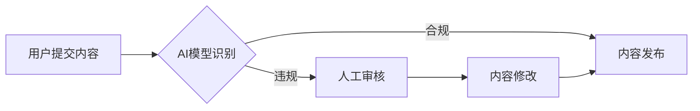

                 

## 知识付费创业中的内容质量把控

> 关键词：知识付费、内容质量、算法模型、内容审核、用户反馈、数据分析、AI技术

## 1. 背景介绍

知识付费行业近年来蓬勃发展，成为互联网经济的重要组成部分。从在线课程、直播带货到付费咨询，人们越来越愿意为优质知识付费。然而，知识付费市场竞争激烈，内容质量成为企业能否持续发展的关键因素。如何有效把控内容质量，提升用户体验，是知识付费创业者面临的重大挑战。

传统的内容质量把控主要依靠人工审核，效率低下，成本高昂，且难以保证审核的客观性和一致性。随着人工智能技术的快速发展，AI技术在知识付费内容质量把控方面展现出巨大的潜力。

## 2. 核心概念与联系

**2.1 内容质量评估**

内容质量评估是指对知识付费内容进行客观、全面的评价，以判断其价值、准确性、实用性和吸引力等方面。

**2.2 AI技术在内容质量把控中的应用**

AI技术可以应用于各个环节的内容质量把控，包括：

* **内容生成：** 利用AI生成高质量的学习内容，例如自动生成课程大纲、学习笔记、习题等。
* **内容审核：** 利用AI识别违规内容，例如抄袭、低俗、虚假信息等，提高审核效率和准确性。
* **内容推荐：** 根据用户的学习兴趣和需求，利用AI推荐个性化的学习内容，提升用户体验。
* **内容优化：** 利用AI分析用户反馈，对内容进行优化，例如修改语言风格、调整内容结构等。

**2.3  Mermaid 流程图**



## 3. 核心算法原理 & 具体操作步骤

**3.1 算法原理概述**

AI技术在内容质量把控中的应用主要基于以下算法原理：

* **自然语言处理 (NLP)：** 用于理解和分析文本内容，例如文本分类、情感分析、关键词提取等。
* **机器学习 (ML)：** 利用历史数据训练模型，识别和预测内容质量特征。
* **深度学习 (DL)：** 利用多层神经网络，学习更复杂的文本特征，提高内容质量评估的准确性。

**3.2 算法步骤详解**

1. **数据收集和预处理：** 收集大量高质量和低质量的知识付费内容，并进行预处理，例如文本清洗、分词、词向量化等。
2. **特征提取：** 利用NLP算法提取文本内容的特征，例如语法结构、词汇搭配、情感倾向等。
3. **模型训练：** 利用ML或DL算法，训练模型，将特征与内容质量标签关联起来。
4. **模型评估：** 利用测试数据评估模型的性能，例如准确率、召回率、F1-score等。
5. **模型部署：** 将训练好的模型部署到生产环境中，用于实时内容质量评估。

**3.3 算法优缺点**

**优点：**

* **自动化：** 可以自动识别和评估内容质量，提高效率。
* **客观性：** 可以减少人工主观判断的影响，提高评估的客观性。
* **可扩展性：** 可以处理海量数据，满足知识付费平台的快速发展需求。

**缺点：**

* **数据依赖：** 模型的性能取决于训练数据的质量和数量。
* **算法复杂性：** 训练和部署AI模型需要一定的技术门槛。
* **解释性：** AI模型的决策过程往往难以解释，难以获得用户的信任。

**3.4 算法应用领域**

AI技术在知识付费内容质量把控方面的应用领域广泛，包括：

* **在线课程平台：** 自动审核课程内容，识别抄袭和低俗内容，提高课程质量。
* **直播平台：** 实时识别直播内容中的违规信息，例如色情、暴力等，保障直播环境的健康。
* **付费咨询平台：** 自动评估咨询师的专业水平和服务质量，提升用户对咨询服务的信任。

## 4. 数学模型和公式 & 详细讲解 & 举例说明

**4.1 数学模型构建**

内容质量评估可以构建一个多分类模型，将内容分为不同的质量等级，例如优秀、良好、一般、差等。

**4.2 公式推导过程**

可以使用支持向量机 (SVM) 或深度神经网络 (DNN) 等算法构建内容质量评估模型。

* **SVM模型：**

SVM模型的目标是找到一个超平面，将不同质量等级的内容分开。

* **DNN模型：**

DNN模型利用多层神经网络学习更复杂的文本特征，可以实现更精细的内容质量评估。

**4.3 案例分析与讲解**

假设我们构建了一个基于DNN的在线课程内容质量评估模型，模型的输入是课程内容的文本，输出是课程质量等级的概率分布。

我们可以使用交叉验证方法评估模型的性能，例如将数据分为训练集、验证集和测试集，在训练集上训练模型，在验证集上调参，在测试集上评估模型的最终性能。

## 5. 项目实践：代码实例和详细解释说明

**5.1 开发环境搭建**

* Python 3.x
* TensorFlow 或 PyTorch 深度学习框架
* NLTK 自然语言处理库
* Scikit-learn 机器学习库

**5.2 源代码详细实现**

```python
# 导入必要的库
import tensorflow as tf
from tensorflow.keras.models import Sequential
from tensorflow.keras.layers import Embedding, LSTM, Dense

# 数据预处理
# ...

# 构建DNN模型
model = Sequential()
model.add(Embedding(input_dim=vocab_size, output_dim=embedding_dim, input_length=max_length))
model.add(LSTM(units=128))
model.add(Dense(units=num_classes, activation='softmax'))

# 编译模型
model.compile(optimizer='adam', loss='categorical_crossentropy', metrics=['accuracy'])

# 训练模型
model.fit(X_train, y_train, epochs=10, batch_size=32)

# 评估模型
loss, accuracy = model.evaluate(X_test, y_test)
print('Loss:', loss)
print('Accuracy:', accuracy)

# 保存模型
model.save('content_quality_model.h5')
```

**5.3 代码解读与分析**

* 代码首先导入必要的库。
* 然后进行数据预处理，例如将文本转换为数字向量。
* 接着构建一个DNN模型，包含Embedding、LSTM和Dense层。
* 模型使用Adam优化器，交叉熵损失函数和准确率指标进行训练。
* 最后评估模型性能并保存模型。

**5.4 运行结果展示**

运行结果展示模型的训练损失、准确率以及测试集上的损失和准确率。

## 6. 实际应用场景

**6.1 在线课程平台**

* 自动审核课程内容，识别抄袭和低俗内容。
* 根据课程质量推荐优质课程给用户。
* 提供个性化学习建议，提升用户学习体验。

**6.2 直播平台**

* 实时识别直播内容中的违规信息，例如色情、暴力等。
* 对直播内容进行质量评估，推荐优质直播内容给用户。
* 提供直播内容的智能字幕和翻译功能。

**6.3 付费咨询平台**

* 自动评估咨询师的专业水平和服务质量。
* 根据用户需求推荐合适的咨询师。
* 提供咨询服务的智能问答功能。

**6.4 未来应用展望**

* 利用AI技术生成更优质的知识付费内容。
* 实现更精准的内容推荐和个性化学习。
* 打造更智能、更便捷的知识付费平台。

## 7. 工具和资源推荐

**7.1 学习资源推荐**

* **书籍：**
    * 《深度学习》
    * 《自然语言处理》
* **在线课程：**
    * Coursera
    * edX
    * Udacity

**7.2 开发工具推荐**

* **Python:** 
    * TensorFlow
    * PyTorch
* **自然语言处理库:**
    * NLTK
    * SpaCy
* **机器学习库:**
    * Scikit-learn

**7.3 相关论文推荐**

* **BERT：** Devlin, J., Chang, M. W., Lee, K., & Toutanova, K. (2018). BERT: Pre-training of deep bidirectional transformers for language understanding. arXiv preprint arXiv:1810.04805.
* **GPT-3：** Brown, T. B., Mann, B., Ryder, N., Subbiah, M., Kaplan, J., Dhariwal, P., ... & Amodei, D. (2020). Language models are few-shot learners. arXiv preprint arXiv:2005.14165.

## 8. 总结：未来发展趋势与挑战

**8.1 研究成果总结**

AI技术在知识付费内容质量把控方面取得了显著进展，例如自动审核、内容推荐、个性化学习等功能已经得到广泛应用。

**8.2 未来发展趋势**

* **更精准的内容质量评估：** 利用更先进的AI算法和更丰富的训练数据，实现更精准的内容质量评估。
* **更智能的内容生成：** 利用AI技术生成更优质、更符合用户需求的知识付费内容。
* **更个性化的学习体验：** 根据用户的学习兴趣和需求，提供更个性化的学习建议和学习内容。

**8.3 面临的挑战**

* **数据质量问题：** AI模型的性能取决于训练数据的质量和数量，高质量的训练数据难以获取。
* **算法解释性问题：** AI模型的决策过程往往难以解释，难以获得用户的信任。
* **伦理问题：** AI技术在知识付费领域的应用可能引发一些伦理问题，例如内容审查的公平性、用户隐私保护等。

**8.4 研究展望**

未来研究将重点关注以下几个方面：

* 开发更鲁棒、更解释性的AI算法。
* 构建更丰富的知识付费内容数据集。
* 研究AI技术在知识付费领域的伦理问题。


## 9. 附录：常见问题与解答

**9.1 如何评估AI模型的性能？**

可以使用准确率、召回率、F1-score等指标评估AI模型的性能。

**9.2 如何解决数据质量问题？**

可以采用数据清洗、数据增强等方法提高数据质量。

**9.3 如何提高AI模型的解释性？**

可以使用可解释AI (XAI) 技术提高AI模型的解释性。


作者：禅与计算机程序设计艺术 / Zen and the Art of Computer Programming 
<end_of_turn>

