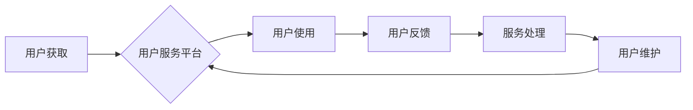

                 

## 知识付费创业中的用户服务体系搭建

> 关键词：知识付费、用户服务、体系搭建、用户体验、运营策略、技术架构、数据分析

### 1. 背景介绍

知识付费行业近年来发展迅速，从在线课程、直播带货到付费咨询，各种知识付费模式层出不穷。然而，用户服务体系的建设往往成为知识付费企业发展瓶颈。用户对知识付费产品的期望值不断提升，对服务体验的要求也越来越高。如何构建完善的用户服务体系，提升用户粘性和复购率，成为知识付费企业持续发展的关键。

### 2. 核心概念与联系

用户服务体系的核心在于为用户提供全方位、个性化的服务体验，提升用户满意度和忠诚度。它涵盖了用户获取、使用、反馈、维护等各个环节，并通过技术手段和运营策略的结合，实现高效、智能的服务。

**用户服务体系架构**



**核心概念原理和联系:**

* **用户获取:** 通过多种渠道吸引目标用户，例如搜索引擎优化、社交媒体推广、内容营销等。
* **用户服务平台:**  提供用户注册、登录、课程购买、学习进度追踪、在线咨询等功能的平台。
* **用户使用:** 用户在平台上学习课程、参与互动、获取知识和技能。
* **用户反馈:** 用户可以通过评论、问答、意见反馈等方式表达需求和建议。
* **服务处理:** 平台根据用户反馈及时处理问题、提供解决方案，并进行数据分析，优化服务流程。
* **用户维护:**  通过会员制度、个性化推荐、社区互动等方式，提升用户粘性和复购率。

### 3. 核心算法原理 & 具体操作步骤

**3.1 算法原理概述**

用户服务体系的建设需要结合多种算法原理，例如推荐算法、自然语言处理算法、机器学习算法等，实现个性化服务、智能化处理和数据驱动决策。

* **推荐算法:**  根据用户的学习历史、兴趣偏好、行为数据等，推荐相关课程、学习资源和互动活动。
* **自然语言处理算法:**  用于处理用户反馈，例如评论、问答、意见反馈等，识别用户需求、情绪和意图，并提供精准的回复。
* **机器学习算法:**  用于分析用户行为数据，预测用户需求、学习进度和潜在问题，并根据预测结果，提供个性化服务和预警提示。

**3.2 算法步骤详解**

* **数据收集:** 收集用户注册信息、学习行为数据、反馈信息等，构建用户画像和行为模型。
* **数据预处理:** 清洗、转换、整合数据，使其符合算法模型的输入要求。
* **模型训练:**  选择合适的算法模型，利用训练数据进行模型训练，并评估模型性能。
* **模型部署:** 将训练好的模型部署到用户服务平台，实现个性化推荐、智能客服等功能。
* **模型优化:**  持续监控模型性能，根据用户反馈和数据变化，对模型进行调整和优化。

**3.3 算法优缺点**

* **优点:**  能够实现个性化服务、智能化处理、数据驱动决策，提升用户体验和服务效率。
* **缺点:**  算法模型的构建和训练需要专业技术，数据安全和隐私保护需要引起重视。

**3.4 算法应用领域**

* **个性化课程推荐:** 根据用户的学习目标、兴趣偏好、学习进度等，推荐合适的课程和学习资源。
* **智能客服:**  利用自然语言处理算法，自动回复用户常见问题，提供快速、便捷的服务。
* **用户行为分析:**  分析用户学习行为数据，预测用户需求、学习进度和潜在问题，并提供个性化服务和预警提示。
* **内容创作推荐:**  根据用户反馈和数据分析，推荐热门话题和内容方向，帮助内容创作者创作更受欢迎的内容。

### 4. 数学模型和公式 & 详细讲解 & 举例说明

**4.1 数学模型构建**

用户服务体系的构建可以基于用户行为分析模型，例如：

* **用户活跃度模型:**  通过用户登录频率、学习时长、课程参与度等指标，计算用户活跃度，并将其作为用户价值评估的指标。
* **用户留存模型:**  通过分析用户在不同时间段内的留存率，预测用户长期粘性，并制定相应的留存策略。
* **用户转化模型:**  通过分析用户从注册到付费、从付费到复购的转化率，优化用户转化路径，提升收入。

**4.2 公式推导过程**

* **用户活跃度模型:**

$$
活跃度 = \frac{登录次数 + 学习时长 + 课程参与度}{总用户数}
$$

* **用户留存模型:**

$$
留存率 = \frac{在特定时间段内仍然活跃的用户数}{在该时间段开始时活跃的用户数}
$$

* **用户转化模型:**

$$
转化率 = \frac{完成特定行为的用户数}{接触特定行为的用户数}
$$

**4.3 案例分析与讲解**

假设一个知识付费平台，通过用户活跃度模型分析发现，用户学习时长超过 30 分钟的用户活跃度较高，平台可以制定策略，鼓励用户学习更长时间，例如提供时长奖励、课程进度追踪等功能。

通过用户留存模型分析发现，用户在第一个月留存率较低，平台可以制定策略，例如提供新手引导、社区互动、专属客服等服务，提升用户早期留存率。

通过用户转化模型分析发现，用户在购买课程后，复购率较低，平台可以制定策略，例如提供会员制度、个性化推荐、课程优惠等，提升用户复购率。

### 5. 项目实践：代码实例和详细解释说明

**5.1 开发环境搭建**

* **操作系统:**  Linux 或 Windows
* **编程语言:**  Python
* **框架:**  Django 或 Flask
* **数据库:**  MySQL 或 PostgreSQL
* **云服务:**  AWS、Azure 或 Google Cloud

**5.2 源代码详细实现**

以下是一个简单的用户服务平台代码示例，使用 Python 和 Flask 框架实现用户注册功能：

```python
from flask import Flask, render_template, request, redirect, url_for

app = Flask(__name__)

# 数据库连接配置

@app.route('/register', methods=['GET', 'POST'])
def register():
    if request.method == 'POST':
        username = request.form['username']
        password = request.form['password']
        # 数据验证和存储逻辑
        return redirect(url_for('index'))
    else:
        return render_template('register.html')

if __name__ == '__main__':
    app.run(debug=True)
```

**5.3 代码解读与分析**

*  `Flask` 框架用于构建 Web 应用。
*  `render_template` 函数用于渲染 HTML 模板。
*  `request` 对象用于获取用户提交的数据。
*  `redirect` 函数用于重定向到其他页面。
*  `url_for` 函数用于生成 URL 路径。

**5.4 运行结果展示**

运行代码后，访问 `http://127.0.0.1:5000/register`，即可看到用户注册页面。用户填写用户名和密码，提交注册信息后，系统会进行数据验证和存储，并重定向到首页。

### 6. 实际应用场景

**6.1 在线教育平台**

*  个性化课程推荐
*  智能客服解答用户疑问
*  用户行为分析优化教学内容

**6.2 知识付费社区**

*  用户兴趣匹配和社区推荐
*  内容创作和分享激励机制
*  用户互动和反馈分析

**6.3 付费咨询服务**

*  专家匹配和预约服务
*  咨询记录和进度追踪
*  用户满意度调查和反馈

**6.4 未来应用展望**

*  人工智能驱动的个性化学习路径
*  虚拟现实和增强现实技术融入用户服务
*  区块链技术保障知识产权和数据安全

### 7. 工具和资源推荐

**7.1 学习资源推荐**

*  **书籍:**  《用户体验设计》、《数据分析实战》、《机器学习入门》
*  **在线课程:**  Coursera、edX、Udemy
*  **技术博客:**  Medium、Hacker News

**7.2 开发工具推荐**

*  **编程语言:**  Python、Java、JavaScript
*  **框架:**  Django、Flask、Spring Boot
*  **数据库:**  MySQL、PostgreSQL、MongoDB

**7.3 相关论文推荐**

*  《Recommender Systems: A Survey》
*  《Natural Language Processing with Deep Learning》
*  《Machine Learning for User Behavior Prediction》

### 8. 总结：未来发展趋势与挑战

**8.1 研究成果总结**

知识付费创业中的用户服务体系建设取得了显著进展，人工智能、数据分析、云计算等技术为用户服务提供了强大的支撑。

**8.2 未来发展趋势**

*  更加个性化、智能化的服务体验
*  融合多模态交互，例如语音、视频、文本
*  基于区块链技术的信任机制和数据安全保障

**8.3 面临的挑战**

*  数据隐私和安全保护
*  算法模型的公平性和可解释性
*  用户体验的持续优化和迭代

**8.4 研究展望**

未来，知识付费创业中的用户服务体系将更加注重用户体验、个性化和智能化，并探索新的技术应用场景，为用户提供更优质、更便捷的知识付费服务。

### 9. 附录：常见问题与解答

*  **如何保障用户数据安全？**

    知识付费平台应采取严格的数据安全措施，例如加密传输、数据脱敏、访问控制等，确保用户数据的安全性和隐私性。

*  **如何提升用户体验？**

    平台应不断优化用户界面、服务流程和交互体验，并根据用户反馈进行改进，提升用户满意度和粘性。

*  **如何评估用户服务体系的有效性？**

    可以通过用户留存率、复购率、用户满意度调查等指标，评估用户服务体系的有效性，并进行持续优化和改进。


作者：禅与计算机程序设计艺术 / Zen and the Art of Computer Programming 
<end_of_turn>

