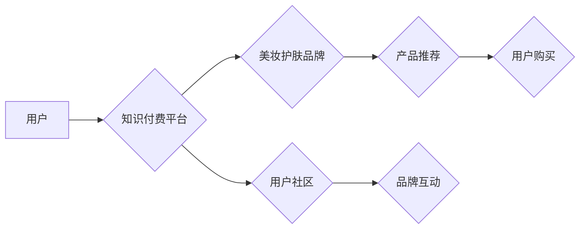

                 

## 关键词：知识付费、跨界营销、美妆护肤、人工智能、数据分析、用户画像、个性化推荐

## 1. 背景介绍

近年来，知识付费市场蓬勃发展，成为新兴的商业模式。人们越来越重视自我提升和学习，愿意为优质的知识和服务付费。与此同时，美妆护肤行业竞争日益激烈，品牌们寻求新的营销方式来突破市场瓶颈。知识付费与美妆护肤的跨界融合，为双方带来了新的机遇。

**1.1 知识付费市场现状**

知识付费市场规模持续增长，涵盖了各个领域，从专业技能培训到兴趣爱好课程，从投资理财到健康养生。在线教育平台、直播平台、付费订阅服务等成为知识付费的主要载体。

**1.2 美妆护肤行业挑战**

美妆护肤行业面临着以下挑战：

* **市场竞争激烈:**  众多品牌涌入市场，产品同质化严重，消费者选择困难。
* **用户需求多元化:**  消费者对产品功能、成分、体验等方面要求越来越高。
* **营销成本上升:**  传统广告投放成本高，效果难以精准评估。

## 2. 核心概念与联系

知识付费与美妆护肤的跨界营销，本质上是将知识作为产品或服务的一部分，与美妆护肤产品相结合，为用户提供更全面的价值。

**2.1 知识付费模式**

知识付费模式主要包括：

* **在线课程:**  提供专业的化妆技巧、护肤知识、产品测评等课程。
* **直播带货:**  通过直播平台，分享美妆护肤经验，并进行产品推荐和销售。
* **付费订阅:**  提供会员服务，用户可以获得专属内容、折扣优惠等。

**2.2 美妆护肤行业与知识付费的结合点**

* **用户需求:**  消费者不仅需要美妆护肤产品，更需要相关知识和技能来提升自我形象和健康。
* **品牌差异化:**  通过知识付费，美妆护肤品牌可以打造独特的价值主张，提升品牌形象和用户粘性。
* **营销精准化:**  知识付费可以帮助品牌精准定位目标用户，提供个性化的产品推荐和服务。

**2.3 跨界营销架构**



## 3. 核心算法原理 & 具体操作步骤

**3.1 算法原理概述**

知识付费与美妆护肤跨界营销的核心算法原理是基于用户画像和个性化推荐。通过数据分析，构建用户画像，了解用户的兴趣爱好、消费习惯、皮肤类型等信息，然后根据用户的画像，推荐相关的知识付费内容和美妆护肤产品。

**3.2 算法步骤详解**

1. **数据收集:** 收集用户行为数据，包括浏览记录、购买记录、评论反馈等。
2. **数据清洗:** 对收集到的数据进行清洗和处理，去除无效数据和重复数据。
3. **用户画像构建:** 利用机器学习算法，对用户数据进行分析，构建用户画像，包括用户兴趣、消费偏好、皮肤类型等特征。
4. **知识付费内容推荐:** 根据用户的画像，推荐相关的知识付费内容，例如化妆技巧课程、护肤知识分享等。
5. **美妆护肤产品推荐:** 根据用户的画像，推荐相关的美妆护肤产品，例如适合用户肤质的护肤品、符合用户需求的化妆品等。
6. **个性化营销:** 根据用户的画像和行为反馈，进行个性化的营销推送，例如发送优惠券、推荐新品等。

**3.3 算法优缺点**

**优点:**

* **精准推荐:**  根据用户画像，推荐更符合用户需求的内容和产品。
* **提升用户体验:**  提供个性化的服务，提升用户体验和满意度。
* **提高转化率:**  精准推荐可以提高用户购买意愿，提升转化率。

**缺点:**

* **数据依赖:**  算法需要大量的数据支持，数据质量直接影响推荐效果。
* **算法复杂:**  用户画像构建和推荐算法需要复杂的机器学习模型，开发和维护成本较高。
* **隐私安全:**  用户数据收集和使用需要考虑隐私安全问题。

**3.4 算法应用领域**

* **电商平台:**  推荐商品、个性化营销。
* **社交媒体:**  推荐内容、精准广告投放。
* **在线教育:**  推荐课程、个性化学习路径。
* **医疗健康:**  推荐医疗服务、个性化健康方案。

## 4. 数学模型和公式 & 详细讲解 & 举例说明

**4.1 数学模型构建**

用户画像构建可以利用机器学习算法，例如K-Means聚类算法，将用户分为不同的群体，每个群体具有相似的特征。

**4.2 公式推导过程**

K-Means聚类算法的目标是将数据点划分为K个簇，每个簇的中心点称为聚类中心。算法迭代执行以下步骤：

1. **随机初始化K个聚类中心。**
2. **计算每个数据点到每个聚类中心的距离。**
3. **将每个数据点分配到距离最近的聚类中心。**
4. **重新计算每个聚类中心的坐标。**
5. **重复步骤2-4，直到聚类中心不再移动或达到最大迭代次数。**

**4.3 案例分析与讲解**

假设我们有100个用户数据，想要将其分为3个簇。我们可以使用K-Means算法，将用户根据年龄、性别、消费习惯等特征进行聚类。最终得到3个用户群体，例如：

* **年轻群体:**  年龄在18-25岁之间，喜欢尝试新产品，消费水平较高。
* **成熟群体:**  年龄在26-40岁之间，注重产品质量和性价比，消费稳定。
* **老年群体:**  年龄在40岁以上，注重健康和养生，消费需求相对简单。

## 5. 项目实践：代码实例和详细解释说明

**5.1 开发环境搭建**

* Python 3.x
* Jupyter Notebook
* scikit-learn

**5.2 源代码详细实现**

```python
from sklearn.cluster import KMeans
import pandas as pd

# 加载用户数据
data = pd.read_csv('user_data.csv')

# 选择特征变量
features = ['age', 'gender', 'consumption']

# 实例化KMeans模型
kmeans = KMeans(n_clusters=3)

# 训练模型
kmeans.fit(data[features])

# 获取聚类标签
labels = kmeans.labels_

# 将聚类标签添加到数据中
data['cluster'] = labels

# 查看聚类结果
print(data.groupby('cluster').mean())
```

**5.3 代码解读与分析**

* 首先，我们加载用户数据，并选择需要进行聚类的特征变量。
* 然后，我们实例化KMeans模型，并设置聚类数量为3。
* 接着，我们训练模型，并将聚类标签添加到数据中。
* 最后，我们查看聚类结果，可以观察到每个聚类群体的特征差异。

**5.4 运行结果展示**

运行代码后，会输出每个聚类群体的平均特征值，例如年龄、性别、消费水平等。通过分析这些特征值，我们可以了解每个聚类群体的特点，并进行相应的营销策略。

## 6. 实际应用场景

**6.1 美妆护肤品牌案例**

某美妆护肤品牌通过知识付费平台，推出化妆技巧课程和护肤知识分享，吸引了大量用户关注。同时，品牌根据用户的画像，推荐相关的产品，并进行个性化营销，例如发送优惠券、推荐新品等。

**6.2 线上电商平台案例**

某电商平台利用用户画像和个性化推荐算法，推荐美妆护肤产品，并根据用户的购买记录和浏览历史，推送相关的知识付费内容，例如产品测评、使用技巧等。

**6.3 社交媒体平台案例**

某社交媒体平台利用用户画像和兴趣标签，推荐美妆护肤品牌和产品，并根据用户的互动行为，推送相关的知识付费内容，例如直播带货、产品测评等。

**6.4 未来应用展望**

随着人工智能技术的不断发展，知识付费与美妆护肤跨界营销将更加智能化和个性化。未来，我们可以看到：

* **更精准的用户画像:**  利用大数据分析和机器学习算法，构建更精准的用户画像，了解用户的细微需求。
* **更个性化的产品推荐:**  根据用户的画像和行为反馈，提供更个性化的产品推荐，提升用户体验和转化率。
* **更丰富的知识付费内容:**  提供更丰富、更专业的知识付费内容，例如定制化课程、一对一指导等。
* **更智能化的营销互动:**  利用人工智能技术，实现更智能化的营销互动，例如聊天机器人、虚拟形象等。

## 7. 工具和资源推荐

**7.1 学习资源推荐**

* **书籍:**  《Python机器学习实战》、《深度学习》
* **在线课程:**  Coursera、edX、Udacity
* **博客:**  机器之心、AI科技大本营

**7.2 开发工具推荐**

* **Python:**  Python是一种常用的编程语言，广泛应用于数据分析和机器学习。
* **Jupyter Notebook:**  Jupyter Notebook是一种交互式编程环境，方便进行数据分析和模型开发。
* **scikit-learn:**  scikit-learn是一个机器学习库，提供各种算法和工具。

**7.3 相关论文推荐**

* **K-Means聚类算法:**  MacQueen, J. (1967). Some methods for classification and analysis of multivariate observations.
* **用户画像构建:**  Chen, Y., & Liu, Y. (2018). User profiling for personalized recommendation.

## 8. 总结：未来发展趋势与挑战

**8.1 研究成果总结**

知识付费与美妆护肤跨界营销的研究成果表明，通过数据分析和机器学习算法，可以构建精准的用户画像，并提供个性化的产品推荐和服务，提升用户体验和转化率。

**8.2 未来发展趋势**

未来，知识付费与美妆护肤跨界营销将朝着以下方向发展：

* **更智能化:**  利用人工智能技术，实现更智能化的营销互动和个性化服务。
* **更沉浸式:**  利用虚拟现实和增强现实技术，打造更沉浸式的用户体验。
* **更生态化:**  构建更完整的知识付费生态系统，整合更多资源和服务。

**8.3 面临的挑战**

知识付费与美妆护肤跨界营销也面临着一些挑战：

* **数据隐私:**  用户数据收集和使用需要考虑隐私安全问题。
* **算法可解释性:**  机器学习算法的决策过程难以解释，需要提高算法的可解释性。
* **用户信任:**  用户需要对知识付费内容和品牌进行信任评估。

**8.4 研究展望**

未来，我们需要继续研究以下问题：

* 如何构建更精准、更全面的用户画像？
* 如何提高算法的可解释性和透明度？
* 如何提升用户对知识付费内容和品牌的信任？


## 9. 附录：常见问题与解答

**9.1 如何构建用户画像？**

用户画像的构建需要收集用户数据，并利用机器学习算法进行分析。常用的方法包括：

* **K-Means聚类算法:**  将用户根据特征相似度进行分组。
* **决策树算法:**  根据用户特征构建决策树，预测用户的行为。
* **深度学习算法:**  利用深度神经网络，学习用户特征的复杂关系。

**9.2 如何推荐知识付费内容？**

知识付费内容的推荐可以根据用户的画像，推荐相关的课程、文章、视频等。常用的推荐算法包括：

* **协同过滤算法:**  根据用户的历史行为，推荐与之相似用户的喜好内容。
* **内容基准算法:**  根据用户的兴趣标签，推荐相关的知识付费内容。
* **深度学习推荐算法:**  利用深度神经网络，学习用户和内容之间的关系，进行个性化推荐。

**9.3 如何提高用户对知识付费内容的信任？**

提高用户对知识付费内容的信任需要以下措施：

* **提供高质量的内容:**  确保知识付费内容的准确性、实用性和价值。
* **建立权威的品牌形象:**  通过口碑传播、媒体报道等方式，提升品牌形象和用户信任。
* **提供良好的用户体验:**  提供便捷的学习平台、完善的售后服务等，提升用户体验。


作者：禅与计算机程序设计艺术 / Zen and the Art of Computer Programming 
<end_of_turn>

