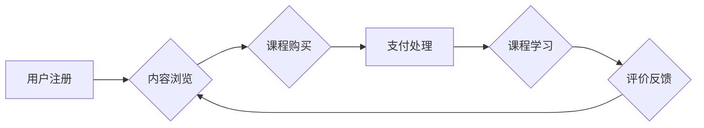

                 

## 知识付费平台搭建指南：程序员创业必读

> 关键词：知识付费、平台搭建、程序员创业、技术架构、数据库设计、前端开发、支付接口、用户管理、内容管理、营销推广

### 1. 背景介绍

近年来，随着互联网技术的快速发展和知识经济的兴起，知识付费行业蓬勃发展，成为众多程序员创业的新方向。知识付费平台是指提供付费学习内容的在线平台，涵盖了各种领域，如编程、设计、写作、管理等。

对于程序员来说，搭建知识付费平台不仅可以将自身的技术经验和知识转化为收益，还可以建立个人品牌，扩大影响力。然而，搭建一个成功的知识付费平台并非易事，需要考虑多个方面，包括技术架构、数据库设计、前端开发、支付接口、用户管理、内容管理、营销推广等。

### 2. 核心概念与联系

知识付费平台的核心概念包括：

* **内容提供者:**  拥有知识和技能的人，例如程序员、设计师、作家等，他们为平台提供付费学习内容。
* **平台方:**  搭建和运营知识付费平台的企业或个人，负责平台的技术架构、用户管理、内容管理、支付处理等。
* **付费用户:**  购买和学习知识付费内容的用户，他们希望通过付费获得更优质的学习资源和服务。

**平台架构流程图:**



### 3. 核心算法原理 & 具体操作步骤

#### 3.1  算法原理概述

知识付费平台的核心算法主要涉及用户推荐、内容推荐、支付处理等方面。

* **用户推荐算法:**  根据用户的学习历史、兴趣偏好等信息，推荐与用户相关的课程和内容。常用的算法包括协同过滤、内容过滤、深度学习等。
* **内容推荐算法:**  根据用户的学习行为、课程标签、评论等信息，推荐与用户相关的课程和内容。常用的算法包括协同过滤、内容过滤、深度学习等。
* **支付处理算法:**  确保支付安全、高效，处理用户支付信息、订单生成、退款等操作。常用的算法包括加密算法、安全协议、支付接口集成等。

#### 3.2  算法步骤详解

* **用户推荐算法:**
    1. 收集用户学习历史、兴趣偏好、课程评价等数据。
    2. 使用协同过滤算法，根据用户的学习行为与其他用户的相似度，推荐相关课程。
    3. 使用内容过滤算法，根据用户的兴趣偏好与课程标签的匹配度，推荐相关课程。
    4. 使用深度学习算法，构建用户画像，并根据用户画像推荐个性化课程。
* **内容推荐算法:**
    1. 收集课程标签、学习人数、评论等数据。
    2. 使用协同过滤算法，根据用户对课程的评价和学习行为，推荐相似课程。
    3. 使用内容过滤算法，根据用户的兴趣偏好与课程标签的匹配度，推荐相关课程。
    4. 使用深度学习算法，构建课程特征，并根据用户特征推荐相关课程。
* **支付处理算法:**
    1. 用户发起支付请求，平台验证用户身份和支付信息。
    2. 使用加密算法对支付信息进行加密，确保支付安全。
    3. 调用第三方支付接口，处理支付流程。
    4. 生成订单信息，并通知用户支付成功。

#### 3.3  算法优缺点

* **协同过滤算法:**
    * 优点: 可以推荐用户可能感兴趣但未接触过的课程。
    * 缺点: 数据稀疏性问题，新用户推荐效果较差。
* **内容过滤算法:**
    * 优点: 可以根据用户的兴趣偏好精准推荐课程。
    * 缺点: 容易陷入“信息茧房”，缺乏多样性推荐。
* **深度学习算法:**
    * 优点: 可以学习用户和课程的复杂特征，推荐效果更精准。
    * 缺点: 需要大量数据训练，模型复杂度高。

#### 3.4  算法应用领域

* **电子商务:**  商品推荐、用户画像分析。
* **社交媒体:**  内容推荐、用户兴趣匹配。
* **教育行业:**  课程推荐、个性化学习路径。
* **医疗行业:**  疾病诊断、药物推荐。

### 4. 数学模型和公式 & 详细讲解 & 举例说明

#### 4.1  数学模型构建

知识付费平台的推荐算法通常基于协同过滤和内容过滤的数学模型。

* **协同过滤模型:**  基于用户-物品交互矩阵，计算用户之间和物品之间相似度，推荐用户可能感兴趣的物品。
* **内容过滤模型:**  基于物品的特征向量，计算用户和物品之间的相似度，推荐用户可能感兴趣的物品。

#### 4.2  公式推导过程

* **协同过滤模型:**  常用的协同过滤算法包括基于用户的协同过滤和基于物品的协同过滤。

    * **基于用户的协同过滤:**  计算用户之间的相似度，推荐用户喜欢的物品。相似度计算公式：

    $$
    Sim(u_i, u_j) = \frac{\sum_{k=1}^{n} r_{i,k} * r_{j,k}}{\sqrt{\sum_{k=1}^{n} r_{i,k}^2} * \sqrt{\sum_{k=1}^{n} r_{j,k}^2}}
    $$

    其中：

    * $u_i$ 和 $u_j$ 表示两个用户。
    * $r_{i,k}$ 和 $r_{j,k}$ 表示用户 $u_i$ 和 $u_j$ 对物品 $k$ 的评分。
    * $n$ 表示物品总数。

    * **基于物品的协同过滤:**  计算物品之间的相似度，推荐用户可能喜欢的物品。相似度计算公式：

    $$
    Sim(i, j) = \frac{\sum_{u=1}^{m} r_{u,i} * r_{u,j}}{\sqrt{\sum_{u=1}^{m} r_{u,i}^2} * \sqrt{\sum_{u=1}^{m} r_{u,j}^2}}
    $$

    其中：

    * $i$ 和 $j$ 表示两个物品。
    * $r_{u,i}$ 和 $r_{u,j}$ 表示用户 $u$ 对物品 $i$ 和 $j$ 的评分。
    * $m$ 表示用户总数。

* **内容过滤模型:**  常用的内容过滤算法包括基于关键词的过滤和基于向量空间的过滤。

    * **基于关键词的过滤:**  根据用户对关键词的兴趣偏好，推荐包含相关关键词的物品。
    * **基于向量空间的过滤:**  将用户和物品表示为向量，计算向量之间的余弦相似度，推荐用户可能感兴趣的物品。

#### 4.3  案例分析与讲解

* **协同过滤模型案例:**  假设有一个电影推荐系统，用户对电影的评分信息如下：

    | 用户 | 电影 A | 电影 B | 电影 C |
    |---|---|---|---|
    | 用户 1 | 5 | 3 | 4 |
    | 用户 2 | 4 | 5 | 2 |
    | 用户 3 | 3 | 4 | 5 |

    可以使用基于用户的协同过滤算法，计算用户之间的相似度，并推荐用户可能感兴趣的电影。

* **内容过滤模型案例:**  假设有一个音乐推荐系统，用户对音乐的标签信息如下：

    | 用户 | 标签 1 | 标签 2 | 标签 3 |
    |---|---|---|---|
    | 用户 1 |  √ |  √ |  |
    | 用户 2 |  √ |  |  √ |
    | 用户 3 |  |  √ |  √ |

    可以使用基于关键词的过滤算法，推荐用户可能感兴趣的音乐。

### 5. 项目实践：代码实例和详细解释说明

#### 5.1  开发环境搭建

* **操作系统:**  Linux/macOS/Windows
* **编程语言:**  Python
* **框架:**  Django/Flask
* **数据库:**  MySQL/PostgreSQL
* **工具:**  Git、Docker、Nginx

#### 5.2  源代码详细实现

```python
# views.py
from django.shortcuts import render

def index(request):
    # 获取热门课程数据
    hot_courses = Course.objects.filter(is_hot=True)[:5]
    # 传递数据到模板
    context = {'hot_courses': hot_courses}
    return render(request, 'index.html', context)
```

#### 5.3  代码解读与分析

* **views.py:**  这是Django项目的视图文件，负责处理用户请求并返回响应。
* **index(request):**  这是首页视图函数，负责渲染首页模板。
* **Course.objects.filter(is_hot=True):**  这是查询数据库中标记为热门课程的数据。
* **[:5]:**  这是截取前5条数据。
* **context = {'hot_courses': hot_courses}:**  这是将数据传递到模板中。
* **render(request, 'index.html', context):**  这是渲染模板并返回响应。

#### 5.4  运行结果展示

* 运行代码后，访问网站首页，将显示热门课程列表。

### 6. 实际应用场景

* **在线教育平台:**  提供编程、设计、写作等领域的付费课程。
* **技能培训平台:**  提供职业技能培训课程，帮助用户提升职场竞争力。
* **个人知识分享平台:**  个人开发者或专家分享技术经验和知识。

#### 6.4  未来应用展望

* **人工智能驱动的个性化推荐:**  利用深度学习算法，提供更精准的课程推荐。
* **虚拟现实/增强现实学习体验:**  打造沉浸式的学习体验，提高学习效率。
* **区块链技术保障知识产权:**  利用区块链技术，保障知识产权，提升平台信任度。

### 7. 工具和资源推荐

#### 7.1  学习资源推荐

* **书籍:**  《Python Web开发实战》、《Django权威指南》、《Flask Web开发入门》
* **在线课程:**  Coursera、Udemy、edX
* **博客:**  Django官方博客、Flask官方博客

#### 7.2  开发工具推荐

* **代码编辑器:**  VS Code、Sublime Text、Atom
* **数据库管理工具:**  MySQL Workbench、PostgreSQL pgAdmin
* **版本控制工具:**  Git

#### 7.3  相关论文推荐

* **协同过滤算法:**  "Collaborative Filtering: A User-Based Approach"
* **内容过滤算法:**  "Content-Based Recommendation Systems"
* **深度学习推荐算法:**  "Deep Learning for Recommender Systems"

### 8. 总结：未来发展趋势与挑战

#### 8.1  研究成果总结

* 知识付费平台搭建技术不断成熟，算法模型不断优化，用户体验不断提升。
* 知识付费行业发展迅速，市场规模不断扩大，竞争日益激烈。

#### 8.2  未来发展趋势

* **人工智能驱动的个性化推荐:**  利用深度学习算法，提供更精准的课程推荐。
* **虚拟现实/增强现实学习体验:**  打造沉浸式的学习体验，提高学习效率。
* **区块链技术保障知识产权:**  利用区块链技术，保障知识产权，提升平台信任度。

#### 8.3  面临的挑战

* **内容质量控制:**  保证平台内容的质量和原创性。
* **用户隐私保护:**  妥善处理用户数据，保障用户隐私安全。
* **商业模式创新:**  探索新的商业模式，实现平台可持续发展。

#### 8.4  研究展望

* **更精准的推荐算法:**  研究更先进的推荐算法，提高推荐精准度。
* **更丰富的学习体验:**  探索新的学习方式，打造更丰富的学习体验。
* **更安全的知识付费平台:**  研究更完善的安全机制，保障平台安全稳定运行。

### 9. 附录：常见问题与解答

* **如何选择合适的数据库?**  根据平台需求和数据量选择合适的数据库。
* **如何实现支付功能?**  集成第三方支付接口，实现安全、高效的支付处理。
* **如何进行用户管理?**  建立用户注册、登录、密码重置等功能，保障用户账号安全。


作者：禅与计算机程序设计艺术 / Zen and the Art of Computer Programming 
<end_of_turn>

