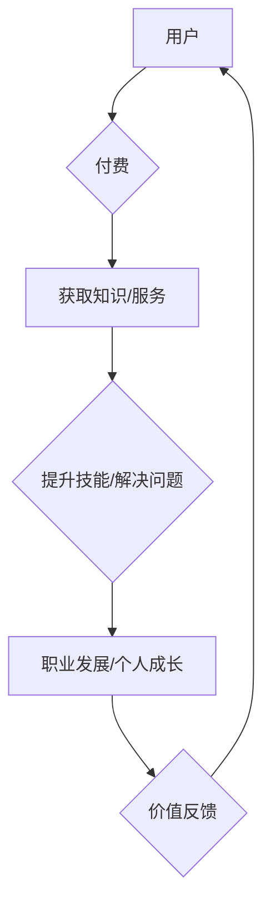

                 

## 知识付费让程序员实现职业理想

> 关键词：程序员、知识付费、职业发展、技术技能、在线学习、编程社区、职业规划、软件开发、人工智能

### 1. 背景介绍

在当今科技飞速发展的时代，程序员作为数字时代的核心力量，备受瞩目。然而，软件开发领域瞬息万变，新技术层出不穷，程序员需要不断学习和提升自身技能才能保持竞争力。传统的教育模式难以满足程序员快速学习和进阶的需求，知识付费模式应运而生，为程序员提供了更灵活、高效、个性化的学习途径。

知识付费是指通过付费获取知识、技能和服务的商业模式。在程序员领域，知识付费主要体现在以下几个方面：

* **在线课程:** 知名程序员和专家开发的在线课程，涵盖各种编程语言、框架、技术和工具，提供理论知识和实践操作指导。
* **付费博客和文章:** 优秀的程序员分享技术经验、项目案例和行业 insights，通过付费订阅的方式提供更深入的学习内容。
* **技术社区和论坛:** 提供付费会员服务，享受更优质的交流平台、技术支持和资源共享。
* **一对一指导和咨询:** 经验丰富的程序员提供个性化的技术指导和职业规划建议。

### 2. 核心概念与联系

知识付费模式的核心在于通过价值交换，为用户提供有价值的知识和服务，并获得相应的经济回报。

**知识付费模式的架构**



**知识付费模式的价值链**

* **用户端:** 获取高质量的知识和服务，提升技能，实现职业发展和个人成长。
* **内容创作者:** 通过知识付费平台分享知识，获得经济回报，建立个人品牌。
* **知识付费平台:** 提供平台服务，连接用户和内容创作者，从中获取佣金或订阅费用。

### 3. 核心算法原理 & 具体操作步骤

知识付费模式的成功离不开算法的支撑，例如推荐算法、支付算法、内容分发算法等。

**3.1 算法原理概述**

推荐算法的核心是根据用户的历史行为、偏好和兴趣，预测用户可能感兴趣的内容，并将其推荐给用户。常见的推荐算法包括：

* **协同过滤:** 基于用户之间的相似性或物品之间的相似性进行推荐。
* **内容过滤:** 基于内容的特征和标签进行推荐。
* **混合推荐:** 结合协同过滤和内容过滤算法进行推荐。

**3.2 算法步骤详解**

以协同过滤算法为例，其步骤如下：

1. **数据收集:** 收集用户行为数据，例如用户浏览记录、购买记录、评分记录等。
2. **用户相似度计算:** 计算用户之间的相似度，可以使用余弦相似度、皮尔逊相关系数等方法。
3. **物品相似度计算:** 计算物品之间的相似度，可以使用余弦相似度、Jaccard 指数等方法。
4. **推荐生成:** 根据用户相似度和物品相似度，预测用户可能感兴趣的物品，并将其推荐给用户。

**3.3 算法优缺点**

* **优点:** 可以推荐个性化、精准的内容，提高用户体验。
* **缺点:** 需要大量的用户数据才能训练模型，容易出现冷启动问题，即对于新用户或新物品难以进行推荐。

**3.4 算法应用领域**

推荐算法广泛应用于电商、视频网站、音乐平台、社交媒体等领域，例如商品推荐、视频推荐、音乐推荐、好友推荐等。

### 4. 数学模型和公式 & 详细讲解 & 举例说明

**4.1 数学模型构建**

协同过滤算法的数学模型可以表示为：

$$
r_{ui} = \sum_{j=1}^{N} s_{uj} \cdot r_{uj}
$$

其中：

* $r_{ui}$ 表示用户 $u$ 对物品 $i$ 的评分。
* $s_{uj}$ 表示用户 $u$ 和用户 $j$ 的相似度。
* $r_{uj}$ 表示用户 $j$ 对物品 $i$ 的评分。
* $N$ 表示用户总数。

**4.2 公式推导过程**

该公式基于以下假设：

* 用户对物品的评分具有某种规律性。
* 用户之间的评分偏好存在相似性。

通过计算用户之间的相似度和物品之间的相似度，可以预测用户对物品的评分。

**4.3 案例分析与讲解**

假设有两个用户 $A$ 和 $B$，他们都对电影 $X$ 和 $Y$ 进行了评分，如下表所示：

| 用户 | 电影 X | 电影 Y |
|---|---|---|
| A | 5 | 3 |
| B | 4 | 4 |

我们可以计算用户 $A$ 和 $B$ 的相似度，例如使用皮尔逊相关系数：

$$
s_{AB} = \frac{\sum_{i=1}^{2} (r_{Ai} - \bar{r}_A)(r_{Bi} - \bar{r}_B)}{\sqrt{\sum_{i=1}^{2} (r_{Ai} - \bar{r}_A)^2} \sqrt{\sum_{i=1}^{2} (r_{Bi} - \bar{r}_B)^2}}
$$

其中：

* $r_{Ai}$ 和 $r_{Bi}$ 分别表示用户 $A$ 和 $B$ 对电影 $i$ 的评分。
* $\bar{r}_A$ 和 $\bar{r}_B$ 分别表示用户 $A$ 和 $B$ 的平均评分。

计算得到 $s_{AB}$ 的值，可以判断用户 $A$ 和 $B$ 的相似度。

### 5. 项目实践：代码实例和详细解释说明

**5.1 开发环境搭建**

* Python 3.x 环境
* TensorFlow 或 PyTorch 深度学习框架
* Jupyter Notebook 或 VS Code 代码编辑器

**5.2 源代码详细实现**

```python
import numpy as np
from sklearn.metrics.pairwise import cosine_similarity

# 用户评分数据
ratings = np.array([
    [5, 3, 0],
    [4, 4, 0],
    [0, 5, 2],
    [3, 0, 4]
])

# 计算用户相似度
user_similarity = cosine_similarity(ratings)

# 获取用户 A 和用户 B 的相似度
user_A_similarity = user_similarity[0]
user_B_similarity = user_similarity[1]

# 打印用户 A 和用户 B 的相似度
print(f"用户 A 和用户 B 的相似度: {user_A_similarity[1]}")
```

**5.3 代码解读与分析**

* 该代码首先定义了用户评分数据，并使用 scikit-learn 库中的 cosine_similarity 函数计算用户之间的相似度。
* 然后，获取用户 A 和用户 B 的相似度，并打印输出。

**5.4 运行结果展示**

运行该代码后，会输出用户 A 和用户 B 的相似度值。

### 6. 实际应用场景

知识付费模式在程序员领域有着广泛的应用场景：

* **在线编程课程:** 知名程序员和专家开发的在线课程，涵盖各种编程语言、框架、技术和工具，提供理论知识和实践操作指导。
* **技术博客和文章:** 优秀的程序员分享技术经验、项目案例和行业 insights，通过付费订阅的方式提供更深入的学习内容。
* **技术社区和论坛:** 提供付费会员服务，享受更优质的交流平台、技术支持和资源共享。
* **一对一指导和咨询:** 经验丰富的程序员提供个性化的技术指导和职业规划建议。

**6.4 未来应用展望**

随着人工智能、虚拟现实等技术的不断发展，知识付费模式在程序员领域将呈现出更加多元化、个性化和智能化的发展趋势。

* **AI 驱动的个性化学习:** 利用人工智能技术，根据用户的学习风格、进度和需求，提供个性化的学习路径和内容推荐。
* **沉浸式学习体验:** 利用虚拟现实技术，打造沉浸式的学习环境，让用户能够更直观地理解和掌握知识。
* **社区协作学习:** 利用区块链技术，构建更加安全、透明和可信的知识付费社区，鼓励用户之间的协作学习和知识共享。

### 7. 工具和资源推荐

**7.1 学习资源推荐**

* **Coursera:** 提供来自世界知名大学和机构的在线课程，涵盖各种编程语言、框架、技术和工具。
* **Udemy:** 提供来自独立讲师和机构的在线课程，价格相对亲民，课程内容丰富多样。
* **edX:** 提供来自麻省理工学院、哈佛大学等知名大学的在线课程，注重学术性和深度。
* **GitHub:** 作为全球最大的代码托管平台，GitHub 上汇集了大量的开源项目和代码示例，可以帮助程序员学习和实践。

**7.2 开发工具推荐**

* **Visual Studio Code:** 功能强大、轻量级的代码编辑器，支持多种编程语言和扩展插件。
* **IntelliJ IDEA:** 功能齐全的 Java IDE，支持代码自动补全、调试、测试等功能。
* **PyCharm:** 功能强大的 Python IDE，支持代码分析、调试、测试等功能。
* **Git:** 版本控制系统，用于管理代码版本和协作开发。

**7.3 相关论文推荐**

* **Collaborative Filtering for Implicit Feedback Datasets**
* **Matrix Factorization Techniques for Recommender Systems**
* **Deep Learning for Recommender Systems**

### 8. 总结：未来发展趋势与挑战

**8.1 研究成果总结**

知识付费模式为程序员提供了更灵活、高效、个性化的学习途径，促进了技术技能的快速提升和职业发展的加速。

**8.2 未来发展趋势**

未来，知识付费模式将更加注重个性化、智能化和沉浸式体验，并与人工智能、虚拟现实等新技术深度融合。

**8.3 面临的挑战**

知识付费模式也面临着一些挑战，例如内容质量控制、用户信任问题、商业模式的创新等。

**8.4 研究展望**

未来研究方向包括：

* 开发更加智能化的推荐算法，提供更精准的学习内容推荐。
* 构建更加安全、透明和可信的知识付费平台，提升用户信任度。
* 探索新的商业模式，实现知识付费的可持续发展。

### 9. 附录：常见问题与解答

* **如何选择合适的知识付费课程？**

建议根据自己的学习目标、经验水平和预算选择课程。可以参考课程评价、讲师介绍、课程内容等信息进行选择。

* **知识付费课程的质量如何保证？**

优质的知识付费平台会对课程内容进行严格审核，并提供退款保障机制。

* **知识付费模式的未来发展前景如何？**

随着科技发展和教育模式的变革，知识付费模式将迎来更加广阔的发展空间。


作者：禅与计算机程序设计艺术 / Zen and the Art of Computer Programming 
<end_of_turn>

