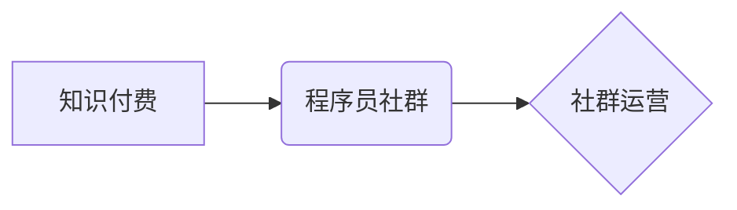

                 

## 知识付费：程序员的社群运营模板

> 关键词：知识付费、程序员社群、运营模板、内容创作、社区建设、技术分享、商业模式

## 1. 背景介绍

在互联网时代，知识成为最宝贵的资源之一。程序员作为技术人才，拥有丰富的技术经验和技能，他们积累的知识和洞察力对于其他程序员和技术爱好者具有极高的价值。知识付费模式的兴起，为程序员提供了将知识变现的平台和机会。

程序员社群运营，是知识付费模式的重要组成部分。通过建立和运营一个活跃的程序员社群，程序员可以分享他们的技术经验，解答其他程序员的问题，建立个人品牌，并最终实现知识付费。

## 2. 核心概念与联系

**2.1 知识付费**

知识付费是指通过提供有价值的知识和技能，向用户收取费用的一种商业模式。它可以采用多种形式，例如在线课程、付费博客、电子书、付费咨询等。

**2.2 程序员社群**

程序员社群是指聚集一群程序员、技术爱好者和相关从业人员的在线或线下组织。它可以是基于特定技术栈、项目或兴趣的，也可以是更广泛的程序员社区。

**2.3 社群运营**

社群运营是指通过一系列活动和策略，维护和发展社群的活跃度、粘性以及用户价值。它包括内容运营、用户管理、活动策划、品牌建设等多个方面。

**2.4 核心概念关系图**



## 3. 核心算法原理 & 具体操作步骤

**3.1 算法原理概述**

程序员社群运营的核心算法原理在于构建一个用户粘性高的平台，并通过持续的价值输出和互动，吸引和留住用户。

**3.2 算法步骤详解**

1. **目标用户定位:** 确定目标用户群体，了解他们的需求、兴趣和痛点。
2. **内容策略制定:** 根据目标用户需求，制定内容创作策略，提供有价值的技术分享、案例分析、工具推荐等内容。
3. **社群平台搭建:** 选择合适的社群平台，例如微信群、QQ群、论坛、Discord等，并进行平台搭建和规则设定。
4. **用户运营:** 通过活动策划、互动引导、用户管理等方式，提高用户活跃度和粘性。
5. **知识付费模式:** 结合社群运营，推出知识付费产品，例如在线课程、付费咨询、电子书等。
6. **数据分析与优化:** 定期分析社群数据，了解用户行为和反馈，不断优化运营策略。

**3.3 算法优缺点**

**优点:**

* 能够有效地将程序员的知识和经验转化为商业价值。
* 能够建立一个活跃的程序员社区，促进技术交流和合作。
* 能够提升程序员的个人品牌和影响力。

**缺点:**

* 需要投入大量的时间和精力进行社群运营。
* 需要不断更新内容，才能保持用户兴趣。
* 需要找到合适的知识付费模式，才能实现盈利。

**3.4 算法应用领域**

* 程序员培训机构
* 技术博客和网站
* 软件开发公司
* 技术咨询公司

## 4. 数学模型和公式 & 详细讲解 & 举例说明

**4.1 数学模型构建**

程序员社群运营可以采用一些数学模型来分析和预测用户行为，例如：

* **用户增长模型:**  描述社群用户数量随时间的增长趋势。
* **用户活跃度模型:**  预测用户在社群中的活跃程度，例如参与讨论、发布内容等。
* **知识付费转化模型:**  分析用户付费意愿和转化率。

**4.2 公式推导过程**

这些模型通常基于一些假设和参数，例如用户增长率、用户活跃度衰减率、付费转化率等。通过对这些参数的估计和分析，可以构建相应的数学模型，并推导出预测公式。

**4.3 案例分析与讲解**

例如，假设一个程序员社群的用户增长率为10% per month，用户活跃度衰减率为20% per month。我们可以使用以下公式来预测社群用户数量和活跃度：

* **用户数量:**  N(t) = N0 * (1 + r)^t
* **活跃用户数量:**  A(t) = A0 * (1 - d)^t

其中：

* N(t) 是t时刻的用户数量
* N0 是初始用户数量
* r 是用户增长率
* t 是时间
* A(t) 是t时刻的活跃用户数量
* A0 是初始活跃用户数量
* d 是用户活跃度衰减率

通过这些公式，我们可以预测社群的用户增长趋势和活跃度变化，并根据预测结果制定相应的运营策略。

## 5. 项目实践：代码实例和详细解释说明

**5.1 开发环境搭建**

* 语言: Python
* 框架: Flask
* 数据库: MySQL

**5.2 源代码详细实现**

```python
from flask import Flask, render_template, request

app = Flask(__name__)

# 数据库连接配置

@app.route('/')
def index():
    return render_template('index.html')

@app.route('/login', methods=['POST'])
def login():
    # 用户名和密码验证逻辑
    return '登录成功'

if __name__ == '__main__':
    app.run(debug=True)
```

**5.3 代码解读与分析**

* 该代码示例是一个简单的Flask web应用，用于搭建程序员社群平台的首页和登录页面。
* `index.html` 文件负责渲染首页内容，例如社群介绍、用户列表、热门话题等。
* `login` 函数负责处理用户登录请求，验证用户名和密码，并返回登录成功或失败信息。

**5.4 运行结果展示**

运行该代码后，可以访问 `http://127.0.0.1:5000/`，查看程序员社群平台的首页。

## 6. 实际应用场景

程序员社群运营的实际应用场景非常广泛，例如：

* **技术交流平台:**  程序员可以分享技术经验、解答问题、讨论技术趋势。
* **项目合作平台:**  程序员可以寻找项目伙伴、组建团队、共同开发项目。
* **职业发展平台:**  程序员可以发布简历、寻找工作机会、提升职业技能。
* **学习资源分享平台:**  程序员可以分享学习资料、推荐课程、帮助其他程序员学习。

**6.4 未来应用展望**

随着人工智能、区块链等技术的不断发展，程序员社群运营将更加智能化、个性化和去中心化。

* **人工智能驱动的社群运营:**  利用人工智能技术，自动分析用户需求，推荐个性化内容，提高用户粘性。
* **区块链技术支持的社群治理:**  利用区块链技术，实现社群成员的权益保护，促进社群的透明度和可信度。
* **元宇宙时代的程序员社群:**  在元宇宙环境中，程序员可以构建虚拟社群空间，进行更沉浸式的交流和合作。

## 7. 工具和资源推荐

**7.1 学习资源推荐**

* **书籍:**  《社群运营实战》、《互联网社区运营》、《用户增长黑客》
* **课程:**  Coursera、Udemy、Udacity 等平台上的社群运营课程
* **博客:**  社群运营相关的博客和网站，例如：社群运营学堂、运营之虎

**7.2 开发工具推荐**

* **社群平台:**  微信群、QQ群、Discord、Slack、論壇
* **内容管理系统:**  WordPress、Ghost、Medium
* **数据分析工具:**  Google Analytics、Matomo

**7.3 相关论文推荐**

* **用户增长模型:**  "The Viral Coefficient" by Brian Balfour
* **用户活跃度模型:**  "User Engagement and Retention in Online Communities" by David J. C. MacKay
* **知识付费模式:**  "The Economics of Knowledge Sharing" by Michael J. Mauboussin

## 8. 总结：未来发展趋势与挑战

**8.1 研究成果总结**

程序员社群运营是一个不断发展和演进的领域。通过构建用户粘性高的平台，提供有价值的内容，并结合数据分析和技术创新，程序员可以有效地将知识变现，建立个人品牌，并促进技术交流和合作。

**8.2 未来发展趋势**

未来，程序员社群运营将更加智能化、个性化和去中心化。人工智能、区块链等技术的应用将推动社群运营的升级，带来更加丰富的体验和价值。

**8.3 面临的挑战**

程序员社群运营也面临一些挑战，例如：

* **内容创作的持续性:**  需要不断更新高质量的内容，才能保持用户兴趣。
* **用户活跃度的维护:**  需要通过各种活动和策略，提高用户参与度和粘性。
* **知识付费模式的探索:**  需要找到合适的知识付费模式，才能实现盈利。

**8.4 研究展望**

未来研究方向可以包括：

* **人工智能驱动的社群运营:**  开发更智能的社群运营工具，例如自动内容推荐、用户画像分析等。
* **区块链技术支持的社群治理:**  探索区块链技术在社群治理中的应用，实现更透明、更公平的社群生态。
* **元宇宙时代的程序员社群:**  研究元宇宙环境下程序员社群的构建和运营模式。


## 9. 附录：常见问题与解答

**9.1 如何吸引用户加入社群？**

* 提供有价值的内容，例如技术分享、案例分析、工具推荐等。
* 举办线上线下活动，例如技术讲座、编程比赛、线下聚会等。
* 利用社交媒体平台推广社群，例如微信公众号、微博、Twitter等。

**9.2 如何提高用户活跃度？**

* 定期发布高质量的内容，保持用户关注度。
* 鼓励用户互动，例如发起讨论、举办投票等。
* 建立社群规则，维护良好的社区氛围。

**9.3 如何实现知识付费？**

* 推出在线课程、付费咨询、电子书等知识付费产品。
* 利用社群平台的流量，推广知识付费产品。
* 提供优质的售后服务，提升用户满意度。


作者：禅与计算机程序设计艺术 / Zen and the Art of Computer Programming 
<end_of_turn>

