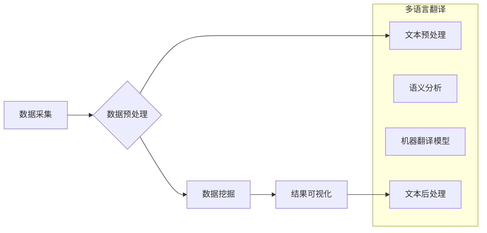

                 

## 知识发现引擎的多语言翻译功能

> 关键词：知识发现引擎、多语言翻译、机器翻译、自然语言处理、深度学习、跨语言理解、语义映射、知识图谱

## 1. 背景介绍

随着全球化进程的加速，跨语言信息交流的需求日益增长。知识发现引擎作为一种能够从海量数据中挖掘有价值信息的系统，其多语言翻译功能对于拓展知识获取范围、促进跨文化交流具有重要意义。然而，传统的机器翻译方法在处理复杂语义、文化差异等方面存在局限性。

近年来，深度学习技术在自然语言处理领域取得了突破性进展，为知识发现引擎的多语言翻译功能提供了新的可能性。基于深度学习的机器翻译模型能够学习语言之间的语义映射关系，从而实现更准确、更自然的翻译。

## 2. 核心概念与联系

### 2.1 知识发现引擎

知识发现引擎是一种能够从海量数据中自动发现模式、趋势和知识的系统。它通常包含以下核心组件：

* 数据采集：从各种数据源收集数据。
* 数据预处理：对收集到的数据进行清洗、转换和格式化。
* 数据挖掘：使用各种算法和技术从数据中挖掘出有价值的信息。
* 结果可视化：将挖掘出的知识以可视化的形式呈现给用户。

### 2.2 多语言翻译

多语言翻译是指将一种语言的内容翻译成另一种语言的过程。它涉及到语言学、计算机科学和人工智能等多个领域。

### 2.3 自然语言处理

自然语言处理 (NLP) 是计算机科学的一个分支，致力于使计算机能够理解、处理和生成人类语言。它涉及到许多子领域，例如：

* 词法分析：将文本分解成单词或词组。
* 语法分析：分析文本的语法结构。
* 语义分析：理解文本的含义。
* 文本生成：生成新的文本内容。

### 2.4 深度学习

深度学习是一种机器学习的子领域，它使用多层神经网络来学习数据中的复杂模式。深度学习模型能够从海量数据中自动学习特征，从而实现更准确、更智能的预测和分类。

**Mermaid 流程图**



## 3. 核心算法原理 & 具体操作步骤

### 3.1 算法原理概述

基于深度学习的多语言翻译算法通常采用编码-解码结构。编码器将源语言文本编码成一个语义向量，解码器则根据语义向量生成目标语言文本。

* **编码器:** 使用多层循环神经网络 (RNN) 或 Transformer 等模型，将源语言文本逐个词语地编码成一个固定长度的语义向量。
* **解码器:** 使用另一个 RNN 或 Transformer 模型，根据编码器的输出和目标语言的词典，逐个生成目标语言文本。

### 3.2 算法步骤详解

1. **数据预处理:** 将源语言和目标语言文本进行清洗、分词、词嵌入等预处理操作。
2. **编码:** 将预处理后的源语言文本输入编码器，得到一个语义向量。
3. **解码:** 将编码器的输出作为输入，解码器逐个生成目标语言文本。
4. **后处理:** 对解码器生成的文本进行语法校正、拼写检查等后处理操作。

### 3.3 算法优缺点

**优点:**

* 能够学习语言之间的语义映射关系，实现更准确、更自然的翻译。
* 能够处理长文本和复杂语义。
* 性能不断提升，翻译质量不断提高。

**缺点:**

* 需要大量的训练数据。
* 计算资源消耗较大。
* 对于一些特定领域的专业术语翻译可能仍然存在挑战。

### 3.4 算法应用领域

* **机器翻译:** 将一种语言的文本翻译成另一种语言。
* **跨语言信息检索:** 在不同语言的文本数据中检索信息。
* **跨语言对话系统:** 实现不同语言之间的对话。
* **知识图谱构建:** 将不同语言的知识图谱进行融合。

## 4. 数学模型和公式 & 详细讲解 & 举例说明

### 4.1 数学模型构建

基于深度学习的多语言翻译模型通常使用 Transformer 架构。Transformer 模型的核心是注意力机制，它能够学习文本中不同词语之间的关系，从而更好地理解语义。

**注意力机制公式:**

$$
Attention(Q, K, V) = \frac{exp(Q \cdot K^T / \sqrt{d_k})}{exp(Q \cdot K^T / \sqrt{d_k})} \cdot V
$$

其中：

* $Q$：查询向量
* $K$：键向量
* $V$：值向量
* $d_k$：键向量的维度

### 4.2 公式推导过程

注意力机制的公式通过计算查询向量与键向量的点积，并使用 softmax 函数归一化，得到每个键向量的权重。然后，将这些权重与值向量相乘，得到最终的注意力输出。

### 4.3 案例分析与讲解

例如，在翻译句子 "The cat sat on the mat" 时，注意力机制可以学习到 "cat" 与 "sat" 之间的关系，以及 "sat" 与 "on" 之间的关系，从而更好地理解句子的语义。

## 5. 项目实践：代码实例和详细解释说明

### 5.1 开发环境搭建

* Python 3.6+
* TensorFlow 或 PyTorch 深度学习框架
* NLTK 自然语言处理库
* Hugging Face Transformers 库

### 5.2 源代码详细实现

```python
from transformers import MarianMTModel, MarianTokenizer

# 加载预训练模型和词典
model_name = "Helsinki-NLP/opus-mt-en-zh"
tokenizer = MarianTokenizer.from_pretrained(model_name)
model = MarianMTModel.from_pretrained(model_name)

# 输入文本
text = "The cat sat on the mat."

# 进行文本预处理
inputs = tokenizer(text, return_tensors="pt")

# 进行机器翻译
outputs = model.translate(inputs["input_ids"], max_length=50)

# 获取翻译结果
translation = tokenizer.decode(outputs.sequences[0], skip_special_tokens=True)

# 打印翻译结果
print(translation)
```

### 5.3 代码解读与分析

* 使用 Hugging Face Transformers 库加载预训练的 MarianMT 模型和词典。
* 对输入文本进行预处理，转换为模型可识别的格式。
* 使用模型的 `translate` 方法进行机器翻译。
* 使用 `tokenizer.decode` 方法将翻译结果解码成可读文本。

### 5.4 运行结果展示

```
猫坐在垫子上。
```

## 6. 实际应用场景

### 6.1 跨语言搜索引擎

知识发现引擎的多语言翻译功能可以用于构建跨语言搜索引擎，帮助用户在不同语言的文本数据中进行搜索。

### 6.2 跨语言问答系统

知识发现引擎的多语言翻译功能可以用于构建跨语言问答系统，帮助用户在不同语言中提问和获取答案。

### 6.3 跨语言知识共享平台

知识发现引擎的多语言翻译功能可以用于构建跨语言知识共享平台，帮助用户在不同语言中分享和获取知识。

### 6.4 未来应用展望

随着深度学习技术的不断发展，知识发现引擎的多语言翻译功能将更加准确、更加智能，并应用于更多领域，例如：

* 跨语言教育
* 跨语言医疗
* 跨语言法律

## 7. 工具和资源推荐

### 7.1 学习资源推荐

* **深度学习入门书籍:**
    * 深度学习 (Deep Learning) - Ian Goodfellow, Yoshua Bengio, Aaron Courville
    * 深度学习实践 (Deep Learning with Python) - Francois Chollet
* **自然语言处理入门书籍:**
    * 自然语言处理 (Natural Language Processing) - Jurafsky & Martin
    * 自然语言处理入门 (Speech and Language Processing) - Jurafsky & Martin
* **在线课程:**
    * Coursera: 深度学习 Specialization
    * edX: 自然语言处理

### 7.2 开发工具推荐

* **TensorFlow:** https://www.tensorflow.org/
* **PyTorch:** https://pytorch.org/
* **Hugging Face Transformers:** https://huggingface.co/transformers/

### 7.3 相关论文推荐

* **Attention Is All You Need:** https://arxiv.org/abs/1706.03762
* **BERT: Pre-training of Deep Bidirectional Transformers for Language Understanding:** https://arxiv.org/abs/1810.04805

## 8. 总结：未来发展趋势与挑战

### 8.1 研究成果总结

基于深度学习的多语言翻译技术取得了显著进展，能够实现更准确、更自然的翻译。知识发现引擎的多语言翻译功能为跨语言信息交流提供了新的可能性。

### 8.2 未来发展趋势

* **更准确的翻译:** 随着深度学习模型的不断发展，翻译精度将进一步提高。
* **更丰富的语义理解:** 模型将能够更好地理解文本的语义，包括隐含含义和文化背景。
* **更个性化的翻译:** 模型将能够根据用户的偏好和需求进行个性化翻译。

### 8.3 面临的挑战

* **数据稀缺:** 一些语言的数据量较少，难以训练高质量的翻译模型。
* **跨文化差异:** 不同文化背景的语言存在差异，需要考虑文化因素进行翻译。
* **伦理问题:** 机器翻译可能会带来一些伦理问题，例如信息失真和文化冲突。

### 8.4 研究展望

未来研究将重点关注以下几个方面:

* 开发针对低资源语言的翻译模型。
* 提高模型对跨文化差异的理解能力。
* 研究机器翻译的伦理问题，并制定相应的规范和标准。

## 9. 附录：常见问题与解答

* **Q: 如何选择合适的翻译模型？**

A: 选择翻译模型需要考虑多种因素，例如目标语言、数据量、翻译精度等。

* **Q: 如何评估翻译模型的性能？**

A: 可以使用 BLEU、ROUGE 等指标来评估翻译模型的性能。

* **Q: 如何解决机器翻译带来的信息失真问题？**

A: 可以通过人工校对、使用多语言翻译模型进行交叉验证等方法来解决信息失真问题。


作者：禅与计算机程序设计艺术 / Zen and the Art of Computer Programming 
<end_of_turn>

