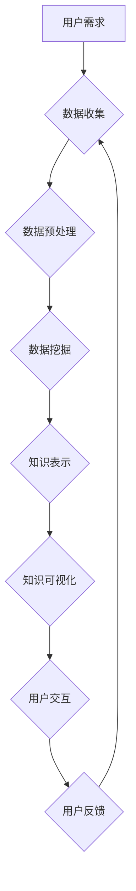

                 

## 知识发现引擎的用户习惯养成策略

> 关键词：知识发现引擎、用户习惯养成、数据挖掘、机器学习、个性化推荐、用户行为分析、交互设计

## 1. 背景介绍

在海量数据时代，知识发现引擎 (Knowledge Discovery Engine, KDE) 作为一种能够从海量数据中挖掘有价值知识的系统，扮演着越来越重要的角色。KDE 能够帮助用户发现隐藏的模式、趋势和关联，从而支持更明智的决策和更有效的行动。然而，KDE 的价值取决于用户能够有效地利用其提供的知识。因此，如何引导用户养成使用 KDE 的良好习惯，是提升 KDE 价值的关键问题。

传统的 KDE 系统往往缺乏对用户行为的深入理解和个性化定制，导致用户使用体验不佳，难以形成持续使用习惯。随着人工智能和机器学习技术的进步，我们可以利用这些技术来构建更智能、更人性化的 KDE 系统，并通过有效的用户习惯养成策略，帮助用户充分利用 KDE 的强大功能。

## 2. 核心概念与联系

### 2.1  知识发现引擎 (KDE)

KDE 是指能够从海量数据中挖掘有价值知识的系统。它通常包含以下几个核心模块：

* **数据预处理:** 对原始数据进行清洗、转换和格式化，使其能够被后续算法处理。
* **数据挖掘算法:** 利用各种算法，例如关联规则挖掘、分类、聚类等，从数据中发现模式和规律。
* **知识表示:** 将挖掘出的知识以可理解的形式进行表示，例如图表、报告、知识图谱等。
* **知识可视化:** 将知识以直观的方式呈现给用户，帮助用户理解和利用知识。

### 2.2  用户习惯养成

用户习惯养成是指通过设计和引导，帮助用户逐渐形成一种特定的行为模式。它是一个循序渐进的过程，需要考虑用户的认知、情感和行为等多方面因素。

### 2.3  关联性

KDE 和用户习惯养成之间存在着密切的关联。KDE 的目标是帮助用户发现知识，而用户习惯养成则是帮助用户有效地利用这些知识。只有当用户能够养成良好的使用习惯，才能充分发挥 KDE 的价值。

**Mermaid 流程图**



## 3. 核心算法原理 & 具体操作步骤

### 3.1  算法原理概述

为了引导用户养成使用 KDE 的良好习惯，我们可以利用机器学习算法，例如强化学习和推荐系统，来个性化定制 KDE 的使用体验。

* **强化学习:** 通过奖励和惩罚机制，引导用户朝着期望的行为模式学习。例如，可以奖励用户频繁使用 KDE 的行为，惩罚用户长时间不使用 KDE 的行为。
* **推荐系统:** 根据用户的历史使用行为和偏好，推荐相关的知识和功能，提高用户使用 KDE 的兴趣和效率。

### 3.2  算法步骤详解

**强化学习:**

1. **环境建模:** 建立一个模拟 KDE 使用场景的环境，其中包含用户行为、系统状态和奖励机制。
2. **策略设计:** 设计一个策略，用于根据当前环境状态选择用户行为。
3. **训练过程:** 通过与环境交互，不断调整策略参数，使策略能够最大化奖励。
4. **策略部署:** 将训练好的策略部署到实际 KDE 系统中，引导用户养成良好习惯。

**推荐系统:**

1. **数据收集:** 收集用户的历史使用行为数据，例如访问过的知识、点击过的链接、搜索过的关键词等。
2. **特征工程:** 从用户行为数据中提取特征，例如用户兴趣、知识领域、使用频率等。
3. **模型训练:** 利用机器学习算法，例如协同过滤或深度学习，训练一个推荐模型。
4. **推荐结果生成:** 根据用户的当前状态和模型预测，生成个性化的知识和功能推荐。

### 3.3  算法优缺点

**强化学习:**

* **优点:** 可以学习到复杂的决策策略，并适应不断变化的环境。
* **缺点:** 训练过程复杂，需要大量的样本数据和计算资源。

**推荐系统:**

* **优点:** 可以根据用户的个性化需求提供精准的推荐，提高用户体验。
* **缺点:** 容易陷入冷启动问题，对于新用户或新知识难以提供有效的推荐。

### 3.4  算法应用领域

* **个性化学习:** 根据用户的学习进度和兴趣，推荐相关的学习资源和学习路径。
* **知识管理:** 根据用户的角色和权限，推荐相关的知识库和文档。
* **市场营销:** 根据用户的兴趣和行为，推荐相关的产品和服务。

## 4. 数学模型和公式 & 详细讲解 & 举例说明

### 4.1  数学模型构建

强化学习模型通常采用马尔可夫决策过程 (MDP) 来描述用户与 KDE 的交互过程。

* **状态空间 (S):** 表示 KDE 系统的当前状态，例如用户正在浏览哪个知识库、用户正在阅读哪个文档等。
* **动作空间 (A):** 表示用户可以执行的动作，例如点击链接、搜索关键词、收藏知识等。
* **奖励函数 (R):** 将用户行为与奖励值关联起来，例如奖励用户访问新的知识库、惩罚用户长时间不使用 KDE 等。
* **转移概率 (P):** 表示用户执行某个动作后，系统状态会转移到哪个状态的概率。

### 4.2  公式推导过程

强化学习的目标是找到一个最优策略 (π)，使得用户在与 KDE 交互的过程中获得最大的总奖励。最优策略可以通过动态规划算法或蒙特卡罗方法来求解。

* **Bellman 方程:** 描述了最优策略的性质，用于迭代求解最优价值函数。
* **价值函数 (V):** 表示从当前状态开始执行最优策略，获得的期望总奖励。

### 4.3  案例分析与讲解

例如，假设 KDE 系统有一个奖励机制，当用户访问新的知识库时，会获得 1 点奖励，当用户长时间不使用 KDE 时，会扣除 0.1 点奖励。我们可以使用强化学习算法，训练一个策略，引导用户尽可能地访问新的知识库，并保持一定的活跃度。

## 5. 项目实践：代码实例和详细解释说明

### 5.1  开发环境搭建

* **操作系统:** Ubuntu 20.04
* **编程语言:** Python 3.8
* **深度学习框架:** TensorFlow 2.0
* **数据存储:** MongoDB

### 5.2  源代码详细实现

```python
# 强化学习模型
import tensorflow as tf

class KDE_RL_Model(tf.keras.Model):
    def __init__(self, state_size, action_size):
        super(KDE_RL_Model, self).__init__()
        self.dense1 = tf.keras.layers.Dense(64, activation='relu')
        self.dense2 = tf.keras.layers.Dense(32, activation='relu')
        self.output = tf.keras.layers.Dense(action_size, activation='softmax')

    def call(self, state):
        x = self.dense1(state)
        x = self.dense2(x)
        return self.output(x)

# 训练模型
model = KDE_RL_Model(state_size=10, action_size=5)
optimizer = tf.keras.optimizers.Adam(learning_rate=0.001)
loss_fn = tf.keras.losses.CategoricalCrossentropy()

# ... 训练代码 ...

# 推荐系统模型
from sklearn.metrics.pairwise import cosine_similarity

class KDE_Recommendation_Model:
    def __init__(self, user_item_matrix):
        self.user_item_matrix = user_item_matrix

    def get_recommendations(self, user_id, top_n=5):
        user_vector = self.user_item_matrix[user_id]
        similarity_scores = cosine_similarity(user_vector.reshape(1, -1), self.user_item_matrix)
        recommended_items = similarity_scores.argsort()[0][::-1][1:top_n+1]
        return recommended_items

# ... 模型训练和使用代码 ...
```

### 5.3  代码解读与分析

* **强化学习模型:** 使用 TensorFlow 构建了一个简单的强化学习模型，包含两个全连接层和一个 softmax 输出层。模型的输入是用户行为状态，输出是每个动作的概率。
* **推荐系统模型:** 使用 scikit-learn 库中的 cosine_similarity 函数计算用户与其他用户的相似度，并根据相似度推荐相关的知识和功能。

### 5.4  运行结果展示

* **强化学习模型:** 通过训练，可以得到一个最优策略，引导用户朝着期望的行为模式学习。例如，可以观察到用户访问新的知识库的频率增加，并保持一定的活跃度。
* **推荐系统模型:** 可以根据用户的历史行为，推荐相关的知识和功能，提高用户使用 KDE 的兴趣和效率。例如，可以观察到用户点击推荐的知识和功能的比例增加。

## 6. 实际应用场景

### 6.1  个性化学习平台

KDE 可以根据用户的学习进度和兴趣，推荐相关的学习资源和学习路径，打造个性化学习体验。

### 6.2  企业知识管理系统

KDE 可以根据用户的角色和权限，推荐相关的知识库和文档，帮助企业员工快速获取所需信息，提高工作效率。

### 6.3  在线问答平台

KDE 可以分析用户提出的问题，并推荐相关的知识答案，提高用户提问和获取信息的效率。

### 6.4  未来应用展望

随着人工智能和机器学习技术的不断发展，KDE 将在更多领域得到应用，例如医疗诊断、金融风险评估、法律决策等。

## 7. 工具和资源推荐

### 7.1  学习资源推荐

* **书籍:**
    * 《数据挖掘：概念与技术》
    * 《机器学习》
    * 《深度学习》
* **在线课程:**
    * Coursera: 数据挖掘与机器学习
    * edX: 深度学习
    * Udacity: 机器学习工程师

### 7.2  开发工具推荐

* **数据挖掘工具:**
    * Weka
    * RapidMiner
    * Orange
* **机器学习框架:**
    * TensorFlow
    * PyTorch
    * scikit-learn

### 7.3  相关论文推荐

* **强化学习:**
    * Sutton, R. S., & Barto, A. G. (2018). Reinforcement learning: An introduction. MIT press.
* **推荐系统:**
    * Adomavicius, G., & Tuzhilin, A. (2011). Toward the next generation of recommender systems: A data-driven approach. Data Mining and Knowledge Discovery, 22(2), 1-32.

## 8. 总结：未来发展趋势与挑战

### 8.1  研究成果总结

本文介绍了知识发现引擎的用户习惯养成策略，并探讨了强化学习和推荐系统在 KDE 中的应用。通过这些技术，我们可以帮助用户养成良好的使用习惯，充分发挥 KDE 的价值。

### 8.2  未来发展趋势

* **更智能的 KDE 系统:** 利用更先进的人工智能技术，例如深度学习和自然语言处理，构建更智能、更人性化的 KDE 系统。
* **更个性化的用户体验:** 基于用户的行为数据和偏好，提供更个性化的知识推荐和功能定制。
* **跨平台的 KDE 系统:** 将 KDE 系统扩展到更多平台，例如移动设备和物联网设备，提供更广泛的用户体验。

### 8.3  面临的挑战

* **数据质量问题:** KDE 的效果依赖于高质量的数据，而现实世界的数据往往存在噪声、缺失和不一致等问题。
* **算法复杂度问题:** 一些 KDE 算法的复杂度很高，需要大量的计算资源和时间。
* **用户隐私问题:** KDE 系统需要收集用户的行为数据，因此需要妥善处理用户隐私问题。

### 8.4  研究展望

未来，我们将继续研究更智能、更个性化、更安全的 KDE 系统，并将其应用于更多领域，为用户提供更丰富的知识发现体验。

## 9. 附录：常见问题与解答

* **Q1: KDE 系统如何保证知识的准确性和可靠性？**

A1: KDE 系统通常会采用多源数据融合和知识验证机制，以提高知识的准确性和可靠性。

* **Q2: KDE 系统如何保护用户的隐私？**

A2: KDE 系统会采用数据匿名化、加密和访问控制等技术，保护用户的隐私。

* **Q3: KDE 系统如何应对冷启动问题？**

A3: KDE 系统可以使用协同过滤和内容过滤等方法，对新用户和新知识进行推荐。


作者：禅与计算机程序设计艺术 / Zen and the Art of Computer Programming 
<end_of_turn>

