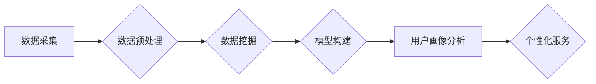

                 

## 知识发现引擎的用户画像分析

> 关键词：知识发现引擎、用户画像、数据挖掘、机器学习、推荐系统、个性化服务、数据分析

## 1. 背景介绍

随着互联网和移动互联网的蓬勃发展，海量数据正在以指数级增长。如何从海量数据中挖掘出有价值的知识，并将其转化为商业价值，成为当今企业和研究机构面临的重大挑战。知识发现引擎 (Knowledge Discovery Engine，KDE) 应运而生，它利用数据挖掘、机器学习等技术，从海量数据中发现隐藏的模式、趋势和关系，为用户提供个性化服务和决策支持。

用户画像分析作为知识发现引擎的核心应用之一，旨在通过对用户行为、偏好、特征等数据的分析，构建用户画像，从而更好地理解用户需求，提供更精准的个性化服务。例如，电商平台可以通过用户画像分析，推荐用户感兴趣的商品；社交媒体平台可以通过用户画像分析，推送用户感兴趣的内容；金融机构可以通过用户画像分析，提供个性化的金融产品和服务。

## 2. 核心概念与联系

### 2.1 用户画像

用户画像是指对用户进行综合描述，包括用户基本信息、行为特征、兴趣爱好、消费习惯等多维度的分析结果，形成的用户画像模型。用户画像可以帮助企业更深入地了解用户，从而提供更精准的个性化服务。

### 2.2 知识发现引擎

知识发现引擎 (KDE) 是一个用于从数据中发现知识的系统。它通常包含以下几个主要模块：

* 数据预处理模块：对原始数据进行清洗、转换、整合等操作，使其适合后续的分析。
* 数据挖掘模块：利用数据挖掘算法，从数据中发现模式、趋势和关系。
* 模型构建模块：根据发现的知识，构建用户画像模型。
* 可视化模块：将用户画像以图表、报告等形式展示出来。

**Mermaid 流程图**



### 2.3 数据挖掘

数据挖掘是指从大规模、复杂的数据集中发现隐藏的模式、趋势和关系。常用的数据挖掘算法包括：

* 关联规则挖掘
* 聚类分析
* 分类预测
* 回归分析

## 3. 核心算法原理 & 具体操作步骤

### 3.1 算法原理概述

用户画像分析通常采用机器学习算法，例如：

* **聚类算法**: 将用户根据相似度进行分组，每个分组代表一个用户画像。常用的聚类算法包括K-means聚类、层次聚类等。
* **分类算法**: 根据用户特征，将用户分类到不同的用户画像类别。常用的分类算法包括决策树、支持向量机、神经网络等。

### 3.2 算法步骤详解

**以K-means聚类为例，用户画像分析的具体步骤如下：**

1. **数据收集**: 收集用户行为、偏好、特征等数据。
2. **数据预处理**: 对数据进行清洗、转换、整合等操作，使其适合聚类分析。
3. **特征选择**: 选择与用户画像相关的特征，例如年龄、性别、兴趣爱好、购买历史等。
4. **聚类**: 使用K-means算法将用户进行聚类，每个聚类代表一个用户画像。
5. **聚类结果分析**: 分析每个聚类的特征，并给每个聚类命名，形成用户画像模型。

### 3.3 算法优缺点

**K-means聚类算法的优点:**

* 算法简单易懂，易于实现。
* 运行速度快，适合处理大规模数据。

**K-means聚类算法的缺点:**

* 需要预先指定聚类数K，如果K值选择不当，可能会导致聚类结果不理想。
* 对数据分布敏感，如果数据分布不均匀，可能会导致聚类结果不准确。

### 3.4 算法应用领域

用户画像分析算法广泛应用于以下领域：

* **电商**: 推送个性化商品推荐、精准营销
* **社交媒体**: 推送个性化内容推荐、精准广告投放
* **金融**: 提供个性化金融产品和服务、风险控制
* **医疗**: 提供个性化医疗服务、疾病预测

## 4. 数学模型和公式 & 详细讲解 & 举例说明

### 4.1 数学模型构建

K-means聚类算法的目标是将数据点划分为K个簇，使得每个数据点到其所属簇中心的距离最小。

**数学模型:**

* **距离度量:** 通常使用欧氏距离作为距离度量。
* **簇中心:** 每个簇的中心点称为簇中心，初始簇中心可以随机选择，也可以使用其他方法进行初始化。
* **目标函数:** K-means算法的目标函数是将所有数据点到其所属簇中心的总距离最小化。

### 4.2 公式推导过程

**目标函数:**

$$
J = \sum_{i=1}^{K} \sum_{x_j \in C_i} ||x_j - \mu_i||^2
$$

其中:

* $J$ 是目标函数
* $K$ 是聚类数
* $C_i$ 是第i个簇
* $x_j$ 是第j个数据点
* $\mu_i$ 是第i个簇的中心点

**算法步骤:**

1. **初始化:** 随机选择K个数据点作为初始簇中心。
2. **分配:** 将每个数据点分配到距离其最近的簇中心。
3. **更新:** 计算每个簇的新的中心点，作为新的簇中心。
4. **重复:** 重复步骤2和步骤3，直到目标函数收敛。

### 4.3 案例分析与讲解

**举例说明:**

假设我们有10个数据点，需要将其聚类成2个簇。

1. **初始化:** 随机选择两个数据点作为初始簇中心。
2. **分配:** 将每个数据点分配到距离其最近的簇中心。
3. **更新:** 计算每个簇的新的中心点，作为新的簇中心。
4. **重复:** 重复步骤2和步骤3，直到目标函数收敛。

最终，我们将得到两个簇，每个簇包含5个数据点。

## 5. 项目实践：代码实例和详细解释说明

### 5.1 开发环境搭建

* **操作系统:** Windows/Linux/macOS
* **编程语言:** Python
* **库:** scikit-learn

### 5.2 源代码详细实现

```python
from sklearn.cluster import KMeans
import numpy as np

# 生成示例数据
data = np.random.rand(100, 2)

# 创建KMeans模型，聚类数为2
kmeans = KMeans(n_clusters=2)

# 训练模型
kmeans.fit(data)

# 获取聚类结果
labels = kmeans.labels_

# 获取簇中心
centroids = kmeans.cluster_centers_

# 打印结果
print("聚类结果:", labels)
print("簇中心:", centroids)
```

### 5.3 代码解读与分析

* **数据生成:** 使用numpy库生成100个随机数据点，每个数据点包含两个特征。
* **模型创建:** 使用scikit-learn库中的KMeans类创建聚类模型，设置聚类数为2。
* **模型训练:** 使用fit()方法训练模型，将数据点聚类到两个簇中。
* **结果获取:** 使用labels_属性获取每个数据点的聚类标签，使用cluster_centers_属性获取每个簇的中心点。
* **结果打印:** 打印聚类结果和簇中心。

### 5.4 运行结果展示

运行代码后，将输出每个数据点的聚类标签和每个簇的中心点。

## 6. 实际应用场景

### 6.1 电商平台

* **个性化商品推荐:** 根据用户的购买历史、浏览记录、评价等数据，构建用户画像，推荐用户感兴趣的商品。
* **精准营销:** 根据用户的兴趣爱好、消费习惯等数据，进行精准的广告投放和促销活动。

### 6.2 社交媒体平台

* **个性化内容推荐:** 根据用户的关注、点赞、评论等数据，构建用户画像，推荐用户感兴趣的内容。
* **精准广告投放:** 根据用户的兴趣爱好、年龄、性别等数据，进行精准的广告投放。

### 6.3 金融机构

* **个性化金融产品推荐:** 根据用户的收入、支出、风险偏好等数据，推荐用户合适的金融产品。
* **风险控制:** 根据用户的信用记录、交易行为等数据，评估用户的风险等级，进行风险控制。

### 6.4 未来应用展望

随着人工智能技术的不断发展，用户画像分析将应用于更多领域，例如：

* **医疗保健:** 提供个性化的医疗服务、疾病预测
* **教育:** 提供个性化的学习方案、学生行为分析
* **城市管理:** 分析城市居民的出行习惯、消费行为，优化城市规划

## 7. 工具和资源推荐

### 7.1 学习资源推荐

* **书籍:**
    * 《数据挖掘：概念与技术》
    * 《机器学习》
* **在线课程:**
    * Coursera: 数据挖掘与机器学习
    * edX: 人工智能导论

### 7.2 开发工具推荐

* **Python:** 广泛应用于数据挖掘和机器学习领域，拥有丰富的库和工具。
* **scikit-learn:** Python机器学习库，提供各种数据挖掘和机器学习算法。
* **TensorFlow:** 深度学习框架，用于构建和训练复杂的神经网络模型。

### 7.3 相关论文推荐

* **K-means聚类算法:**
    * MacQueen, J. (1967). Some methods for classification and analysis of multivariate observations.
* **用户画像分析:**
    * Chen, Y., & Liu, H. (2018). User profiling for personalized recommendations: A survey.

## 8. 总结：未来发展趋势与挑战

### 8.1 研究成果总结

用户画像分析技术在近年来取得了显著的进展，已经广泛应用于各个领域，为企业和研究机构带来了巨大的价值。

### 8.2 未来发展趋势

* **更精准的用户画像:** 利用更丰富的用户数据，构建更精准的用户画像，更好地理解用户的需求和行为。
* **更个性化的服务:** 基于更精准的用户画像，提供更个性化的服务，例如个性化推荐、个性化营销等。
* **更智能的用户画像分析:** 利用人工智能技术，自动学习和发现用户画像，提高分析效率和准确性。

### 8.3 面临的挑战

* **数据隐私保护:** 用户画像分析需要处理大量用户数据，如何保护用户隐私是一个重要的挑战。
* **算法可解释性:** 一些机器学习算法的决策过程难以解释，如何提高算法的可解释性是一个重要的研究方向。
* **数据质量:** 数据质量直接影响用户画像分析的准确性，如何保证数据质量是一个重要的挑战。

### 8.4 研究展望

未来，用户画像分析技术将继续发展，并应用于更多领域。研究者将继续探索更精准、更智能的用户画像分析方法，并解决数据隐私保护、算法可解释性等挑战。

## 9. 附录：常见问题与解答

### 9.1 如何选择合适的聚类算法？

选择合适的聚类算法取决于数据的特点和分析目标。

* **K-means算法:** 适合数据分布较为均匀的情况，需要预先指定聚类数。
* **层次聚类算法:** 不需要预先指定聚类数，可以根据数据层次结构进行聚类。
* **DBSCAN算法:** 适合数据分布不均匀的情况，可以发现任意形状的簇。

### 9.2 如何评估聚类结果？

常用的聚类结果评估指标包括：

* **Silhouette score:** 衡量每个数据点与其所属簇的相似度，以及与其他簇的相似度。
* **Dunn index:** 衡量簇间距离与簇内距离的比例。
* **Calinski-Harabasz index:** 衡量簇内方差与簇间方差的比值。

### 9.3 如何处理缺失数据？

缺失数据会影响聚类结果的准确性，可以采用以下方法处理缺失数据：

* **删除缺失数据:** 如果缺失数据量较少，可以删除缺失数据。
* **用均值填充缺失数据:** 如果缺失数据量较大，可以将缺失数据用该特征的均值填充。
* **使用其他缺失值填充方法:** 例如K-Nearest Neighbors (KNN)插值法。


作者：禅与计算机程序设计艺术 / Zen and the Art of Computer Programming 
<end_of_turn>

