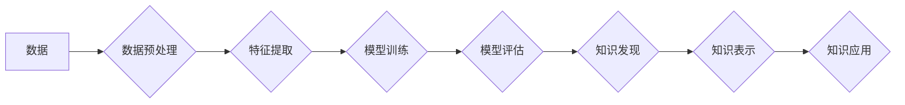

                 

## 知识发现引擎：推动社会进步的隐形推手

> 关键词：知识发现、数据挖掘、机器学习、深度学习、人工智能、数据分析、商业智能

### 1. 背景介绍

在信息爆炸的时代，海量数据无处不在，蕴藏着丰富的知识和价值。然而，这些数据往往是分散、结构化、半结构化甚至无结构的，难以直接理解和利用。如何从海量数据中挖掘出有价值的知识，并将其转化为推动社会进步的行动力，成为当今科技发展的重要课题。

知识发现引擎 (Knowledge Discovery Engine, KDE) 正是应运而生以解决这一问题的智能系统。它通过运用数据挖掘、机器学习、深度学习等人工智能技术，从海量数据中识别模式、发现规律、生成知识，并以可理解的形式呈现给用户。KDE 就像一个隐形的推手，默默地推动着社会进步，为我们提供更精准的决策支持、更深入的洞察力和更有效的解决方案。

### 2. 核心概念与联系

#### 2.1  知识发现

知识发现是指从数据中提取、识别和解释有价值的知识的过程。它是一个跨学科的领域，涉及数据挖掘、机器学习、人工智能、数据库、统计学等多个领域。

#### 2.2  数据挖掘

数据挖掘是指从大型数据库中发现模式、趋势和关系的过程。它利用统计学、机器学习和数据库技术，从海量数据中提取有价值的信息。

#### 2.3  机器学习

机器学习是一种人工智能技术，它使计算机能够从数据中学习，并根据学习到的知识进行预测或决策。机器学习算法可以分为监督学习、无监督学习和强化学习三大类。

#### 2.4  深度学习

深度学习是一种机器学习的子领域，它利用多层神经网络来模拟人类大脑的学习过程。深度学习算法能够处理更复杂的数据，并取得更优异的性能。

**Mermaid 流程图**



### 3. 核心算法原理 & 具体操作步骤

#### 3.1  算法原理概述

知识发现引擎的核心算法通常包括数据预处理、特征提取、模型训练、模型评估、知识表示和知识应用等步骤。

* **数据预处理:** 这是知识发现的第一步，目的是将原始数据清洗、转换和格式化，使其适合后续的分析和挖掘。
* **特征提取:** 这是将原始数据转化为模型可以理解的特征的过程。特征可以是数据的属性、统计量、文本特征等。
* **模型训练:** 利用训练数据，训练机器学习模型，使其能够学习数据中的模式和规律。
* **模型评估:** 对训练好的模型进行评估，验证其性能，并进行必要的调整。
* **知识表示:** 将模型学习到的知识转化为可理解的形式，例如规则、树形结构、网络图等。
* **知识应用:** 将发现的知识应用于实际问题，例如预测、分类、推荐等。

#### 3.2  算法步骤详解

1. **数据收集:** 从各种来源收集相关数据，例如数据库、文件、传感器等。
2. **数据清洗:** 去除数据中的噪声、缺失值和重复数据。
3. **数据转换:** 将数据转换为适合模型输入的格式，例如数值化、编码等。
4. **特征工程:** 选择和提取重要的特征，并进行特征转换和组合。
5. **模型选择:** 根据具体任务选择合适的机器学习模型，例如决策树、支持向量机、神经网络等。
6. **模型训练:** 利用训练数据训练模型，并调整模型参数。
7. **模型评估:** 利用测试数据评估模型性能，例如准确率、召回率、F1-score等。
8. **知识提取:** 利用训练好的模型从数据中提取知识，例如规则、模式、关联等。
9. **知识表示:** 将提取的知识转化为可理解的形式，例如规则、树形结构、网络图等。
10. **知识应用:** 将发现的知识应用于实际问题，例如预测、分类、推荐等。

#### 3.3  算法优缺点

**优点:**

* 可以从海量数据中发现隐藏的模式和规律。
* 可以自动化知识发现过程，提高效率。
* 可以发现人类难以发现的知识。

**缺点:**

* 需要大量的训练数据。
* 模型训练过程可能需要很长时间。
* 知识发现结果可能难以解释。

#### 3.4  算法应用领域

知识发现引擎在各个领域都有广泛的应用，例如：

* **商业智能:** 从销售数据、客户数据等中发现商业趋势，提高决策效率。
* **医疗保健:** 从患者数据、医学文献等中发现疾病模式，辅助诊断和治疗。
* **金融:** 从交易数据、市场数据等中发现风险模式，降低金融风险。
* **教育:** 从学生数据、学习记录等中发现学习模式，个性化教学。
* **科学研究:** 从实验数据、天文观测数据等中发现科学规律，推动科学发展。

### 4. 数学模型和公式 & 详细讲解 & 举例说明

#### 4.1  数学模型构建

知识发现引擎的数学模型通常基于统计学、概率论和机器学习算法。

* **统计学:** 用于描述数据分布、计算特征重要性等。
* **概率论:** 用于建模数据之间的关系、预测未来事件等。
* **机器学习算法:** 用于学习数据中的模式、进行分类、预测等。

#### 4.2  公式推导过程

具体的公式推导过程取决于所使用的机器学习算法。例如，决策树算法的构建基于信息增益或基尼系数的最小化，而神经网络算法的训练基于梯度下降法。

#### 4.3  案例分析与讲解

以决策树算法为例，其信息增益公式如下：

$$
Gain(S,A) = Entropy(S) - \sum_{v \in Values(A)} \frac{|S_v|}{|S|} Entropy(S_v)
$$

其中：

* $S$ 是数据集
* $A$ 是特征
* $Values(A)$ 是特征 $A$ 的所有取值
* $S_v$ 是特征 $A$ 取值为 $v$ 的子集
* $Entropy(S)$ 是数据集 $S$ 的熵
* $Entropy(S_v)$ 是子集 $S_v$ 的熵

信息增益越大，表示特征 $A$ 对数据集 $S$ 的划分越有效，因此决策树算法会选择信息增益最大的特征作为划分节点。

### 5. 项目实践：代码实例和详细解释说明

#### 5.1  开发环境搭建

* **操作系统:** Linux/macOS/Windows
* **编程语言:** Python
* **机器学习库:** scikit-learn, TensorFlow, PyTorch
* **数据处理库:** Pandas, NumPy
* **可视化库:** Matplotlib, Seaborn

#### 5.2  源代码详细实现

以下是一个简单的决策树分类器的代码实例：

```python
from sklearn.tree import DecisionTreeClassifier
from sklearn.datasets import load_iris
from sklearn.model_selection import train_test_split
from sklearn.metrics import accuracy_score

# 加载 iris 数据集
iris = load_iris()
X = iris.data
y = iris.target

# 将数据划分为训练集和测试集
X_train, X_test, y_train, y_test = train_test_split(X, y, test_size=0.2, random_state=42)

# 创建决策树分类器
clf = DecisionTreeClassifier()

# 训练模型
clf.fit(X_train, y_train)

# 预测测试集
y_pred = clf.predict(X_test)

# 计算准确率
accuracy = accuracy_score(y_test, y_pred)
print(f"准确率: {accuracy}")
```

#### 5.3  代码解读与分析

* **加载数据:** 使用 `load_iris()` 函数加载 iris 数据集。
* **数据划分:** 使用 `train_test_split()` 函数将数据划分为训练集和测试集。
* **创建模型:** 使用 `DecisionTreeClassifier()` 函数创建决策树分类器。
* **模型训练:** 使用 `fit()` 函数训练模型。
* **模型预测:** 使用 `predict()` 函数预测测试集。
* **评估模型:** 使用 `accuracy_score()` 函数计算模型的准确率。

#### 5.4  运行结果展示

运行上述代码，可以得到模型的准确率。

### 6. 实际应用场景

#### 6.1  商业智能

* **客户关系管理 (CRM):** 从客户数据中发现客户行为模式，进行精准营销和客户服务。
* **市场分析:** 从市场数据中发现市场趋势，进行产品开发和市场策略制定。
* **风险管理:** 从金融数据中发现风险模式，降低金融风险。

#### 6.2  医疗保健

* **疾病诊断:** 从患者数据中发现疾病模式，辅助医生进行诊断。
* **药物研发:** 从生物数据中发现药物作用机制，加速药物研发。
* **个性化医疗:** 从患者数据中发现个性化医疗方案，提高医疗效果。

#### 6.3  教育

* **学生学习分析:** 从学生数据中发现学习模式，个性化教学。
* **课程优化:** 从学生学习数据中发现课程薄弱环节，进行课程优化。
* **教育资源推荐:** 从学生兴趣数据中推荐合适的教育资源。

#### 6.4  未来应用展望

随着人工智能技术的不断发展，知识发现引擎将有更广泛的应用场景，例如：

* **智能城市:** 从城市数据中发现城市运行模式，提高城市管理效率。
* **智能交通:** 从交通数据中发现交通拥堵模式，优化交通流量。
* **智能制造:** 从生产数据中发现生产缺陷模式，提高生产效率。

### 7. 工具和资源推荐

#### 7.1  学习资源推荐

* **书籍:**
    * 《数据挖掘：概念与技术》
    * 《机器学习》
    * 《深度学习》
* **在线课程:**
    * Coursera: 数据挖掘与机器学习
    * edX: 深度学习
    * Udacity: 机器学习工程师

#### 7.2  开发工具推荐

* **Python:** 
    * scikit-learn: 机器学习库
    * TensorFlow: 深度学习库
    * PyTorch: 深度学习库
* **数据处理工具:**
    * Pandas: 数据分析和处理库
    * NumPy: 数值计算库
* **可视化工具:**
    * Matplotlib: 数据可视化库
    * Seaborn: 数据可视化库

#### 7.3  相关论文推荐

* **数据挖掘:**
    * 《数据挖掘：概念与技术》
* **机器学习:**
    * 《机器学习》
* **深度学习:**
    * 《深度学习》

### 8. 总结：未来发展趋势与挑战

#### 8.1  研究成果总结

知识发现引擎已经取得了显著的成果，在各个领域都有广泛的应用。

#### 8.2  未来发展趋势

* **更强大的算法:** 研究更强大的机器学习算法，例如强化学习、迁移学习等，提高知识发现的效率和准确性。
* **更丰富的知识表示:** 研究更丰富的知识表示形式，例如知识图谱、逻辑推理等，使知识更易于理解和应用。
* **更智能的应用:** 将知识发现引擎与其他人工智能技术结合，例如自然语言处理、计算机视觉等，开发更智能的应用。

#### 8.3  面临的挑战

* **数据质量:** 知识发现引擎依赖于高质量的数据，而现实世界的数据往往是脏乱的，需要进行大量的清洗和预处理。
* **算法解释性:** 许多机器学习算法是黑箱模型，难以解释其决策过程，这限制了知识发现引擎的应用。
* **知识可信度:** 知识发现引擎发现的知识可能存在偏差或错误，需要进行验证和评估。

#### 8.4  研究展望

未来，知识发现引擎将继续朝着更智能、更强大、更可解释的方向发展，为推动社会进步提供更强大的支持。


### 9. 附录：常见问题与解答

* **什么是知识发现引擎？**

知识发现引擎是一种利用人工智能技术从海量数据中发现有价值知识的智能系统。

* **知识发现引擎有哪些应用场景？**

知识发现引擎在各个领域都有广泛的应用，例如商业智能、医疗保健、教育等。

* **如何搭建知识发现引擎？**

搭建知识发现引擎需要准备数据、选择算法、训练模型、评估模型、部署应用等步骤。

* **知识发现引擎有哪些挑战？**

知识发现引擎面临的数据质量、算法解释性和知识可信度等挑战。


作者：禅与计算机程序设计艺术 / Zen and the Art of Computer Programming 
<end_of_turn>

