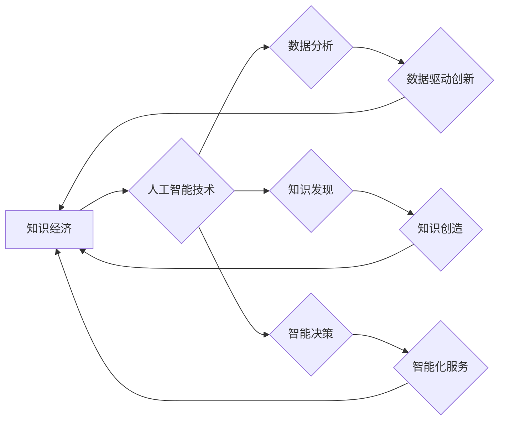

                 

## 知识经济的崛起：人工智能的催化作用

> 关键词：人工智能、知识经济、机器学习、深度学习、自然语言处理、计算机视觉、数据分析、算法

## 1. 背景介绍

人类社会正处于一个前所未有的变革时期，知识经济的崛起正在深刻地改变着我们的生活方式、工作模式和社会结构。知识，作为生产要素中最重要的一部分，正在取代传统资源，成为推动经济发展和社会进步的引擎。在这个背景下，人工智能（Artificial Intelligence，简称AI）作为一种能够模拟人类智能的计算机技术，正以其强大的学习、推理和决策能力，成为知识经济发展的重要催化剂。

传统的经济模式以物质资源和劳动力为基础，而知识经济则以知识、信息和技术为核心。知识经济的特征是：

* **知识密集型：** 知识成为生产和服务的关键要素，知识创造、传播和应用成为经济活动的核心。
* **创新驱动：** 知识经济强调创新，通过技术进步和知识创新来推动经济增长。
* **信息化：** 信息技术成为知识经济的基础设施，信息高速流动和共享成为知识经济的特征。
* **人才驱动：** 高素质人才成为知识经济的稀缺资源，知识经济的发展离不开人才的培养和引进。

人工智能技术的快速发展，为知识经济的构建提供了强大的技术支撑。AI能够自动学习和分析海量数据，从中提取有价值的知识和洞察力，从而提高知识的创造、传播和应用效率。

## 2. 核心概念与联系

### 2.1  知识经济

知识经济是指以知识、信息和技术为主要生产要素，以创新为动力，以知识创造、传播和应用为核心内容的经济模式。

### 2.2  人工智能

人工智能是指模拟和实现人类智能的计算机科学领域。人工智能系统能够通过学习、推理、决策等方式，完成人类智能任务，例如图像识别、自然语言处理、语音识别等。

### 2.3  联系

人工智能技术是知识经济的重要组成部分，它为知识经济的发展提供了强大的技术支撑。

**Mermaid 流程图**



## 3. 核心算法原理 & 具体操作步骤

### 3.1  算法原理概述

人工智能算法的核心是学习和推理。通过学习大量的训练数据，人工智能算法能够识别数据中的模式和规律，并根据这些模式进行预测和决策。常见的AI算法包括：

* **机器学习（Machine Learning）：** 算法通过数据学习，不断调整模型参数，以提高预测准确率。
* **深度学习（Deep Learning）：** 基于多层神经网络的机器学习算法，能够学习更复杂的模式和特征。
* **自然语言处理（Natural Language Processing）：** 处理和理解人类语言的算法，例如文本分类、机器翻译、情感分析等。
* **计算机视觉（Computer Vision）：** 处理和理解图像和视频的算法，例如图像识别、物体检测、场景理解等。

### 3.2  算法步骤详解

以机器学习为例，其基本步骤包括：

1. **数据收集和预处理：** 收集相关数据，并进行清洗、转换、特征提取等预处理工作。
2. **模型选择：** 根据具体任务选择合适的机器学习算法模型。
3. **模型训练：** 使用训练数据训练模型，调整模型参数，使模型能够准确地预测目标变量。
4. **模型评估：** 使用测试数据评估模型的性能，例如准确率、召回率、F1-score等。
5. **模型部署：** 将训练好的模型部署到实际应用场景中，用于预测和决策。

### 3.3  算法优缺点

**优点：**

* **自动化：** AI算法能够自动学习和分析数据，减少人工干预。
* **效率提升：** AI算法能够处理海量数据，提高数据分析和决策效率。
* **精准度提高：** AI算法能够识别数据中的细微模式，提高预测和决策的精准度。

**缺点：**

* **数据依赖：** AI算法需要大量高质量的数据进行训练，否则性能会下降。
* **黑盒问题：** 一些AI算法的决策过程难以解释，难以理解其背后的逻辑。
* **伦理问题：** AI算法的应用可能带来伦理问题，例如算法偏见、隐私泄露等。

### 3.4  算法应用领域

AI算法广泛应用于各个领域，例如：

* **医疗保健：** 疾病诊断、药物研发、个性化医疗等。
* **金融服务：** 风险评估、欺诈检测、投资决策等。
* **制造业：** 自动化生产、质量控制、 predictive maintenance等。
* **零售业：** 商品推荐、个性化营销、库存管理等。
* **教育：** 个性化学习、智能辅导、自动批改等。

## 4. 数学模型和公式 & 详细讲解 & 举例说明

### 4.1  数学模型构建

机器学习算法通常基于数学模型进行构建。这些模型试图用数学公式来描述数据之间的关系，并通过训练参数来优化模型的预测性能。

例如，线性回归模型试图用一条直线来拟合数据点之间的关系，其数学公式如下：

$$y = mx + c$$

其中：

* $y$ 是预测值
* $x$ 是输入特征
* $m$ 是斜率
* $c$ 是截距

### 4.2  公式推导过程

机器学习算法的训练过程通常涉及优化模型参数的过程。常用的优化算法包括梯度下降法、随机梯度下降法等。

梯度下降法是一种迭代优化算法，其核心思想是沿着梯度的负方向更新模型参数，以最小化损失函数。损失函数衡量模型预测值与真实值的差异。

梯度下降法的更新公式如下：

$$\theta = \theta - \alpha \nabla L(\theta)$$

其中：

* $\theta$ 是模型参数
* $\alpha$ 是学习率
* $\nabla L(\theta)$ 是损失函数对参数的梯度

### 4.3  案例分析与讲解

假设我们有一个线性回归模型，用于预测房价。输入特征包括房屋面积、房间数量等，输出特征是房价。

通过训练数据，我们可以得到模型参数 $m$ 和 $c$。然后，我们可以使用这个模型来预测新房子的房价。

例如，如果新房子的面积为 100 平方米，房间数量为 3 个，那么我们可以使用以下公式来预测房价：

$$y = mx + c$$

其中 $x$ 是房屋面积和房间数量的向量，$m$ 和 $c$ 是训练得到的模型参数。

## 5. 项目实践：代码实例和详细解释说明

### 5.1  开发环境搭建

为了实现人工智能项目，我们需要搭建相应的开发环境。常用的开发环境包括：

* **Python:** Python 是一种流行的编程语言，广泛用于人工智能开发。
* **Jupyter Notebook:** Jupyter Notebook 是一个交互式编程环境，方便进行数据分析和模型训练。
* **TensorFlow/PyTorch:** TensorFlow 和 PyTorch 是两种流行的深度学习框架，提供丰富的工具和库用于构建和训练深度学习模型。

### 5.2  源代码详细实现

以下是一个简单的机器学习项目代码实例，用于预测房价：

```python
import pandas as pd
from sklearn.model_selection import train_test_split
from sklearn.linear_model import LinearRegression
from sklearn.metrics import mean_squared_error

# 加载房价数据
data = pd.read_csv('house_price.csv')

# 选择特征和目标变量
features = ['area', 'rooms']
target = 'price'

# 将数据划分为训练集和测试集
X_train, X_test, y_train, y_test = train_test_split(data[features], data[target], test_size=0.2)

# 创建线性回归模型
model = LinearRegression()

# 训练模型
model.fit(X_train, y_train)

# 预测测试集数据
y_pred = model.predict(X_test)

# 计算模型性能
mse = mean_squared_error(y_test, y_pred)
print(f'Mean Squared Error: {mse}')
```

### 5.3  代码解读与分析

这段代码首先加载房价数据，然后选择特征和目标变量。接着，将数据划分为训练集和测试集，用于训练和评估模型。

接下来，创建线性回归模型，并使用训练数据进行模型训练。最后，使用训练好的模型预测测试集数据，并计算模型性能。

### 5.4  运行结果展示

运行这段代码后，会输出模型的均方误差（Mean Squared Error，MSE）值。MSE 值越小，模型的预测性能越好。

## 6. 实际应用场景

### 6.1  医疗保健

* **疾病诊断：** AI 算法可以分析患者的医疗影像、病历和基因信息，辅助医生进行疾病诊断。
* **药物研发：** AI 算法可以加速药物研发过程，例如预测药物的活性、筛选潜在的药物靶点等。
* **个性化医疗：** AI 算法可以根据患者的个体特征，提供个性化的治疗方案和健康建议。

### 6.2  金融服务

* **风险评估：** AI 算法可以分析客户的信用记录、交易行为等数据，评估客户的信用风险。
* **欺诈检测：** AI 算法可以识别异常交易行为，帮助金融机构防范欺诈。
* **投资决策：** AI 算法可以分析市场数据，提供投资建议和风险管理策略。

### 6.3  制造业

* **自动化生产：** AI 算法可以控制机器人和自动化设备，提高生产效率和产品质量。
* **质量控制：** AI 算法可以识别产品缺陷，提高产品质量。
* **预测性维护：** AI 算法可以分析设备运行数据，预测设备故障，避免设备停机。

### 6.4  未来应用展望

人工智能技术的应用场景还在不断扩展，未来将有更多新的应用场景出现。例如：

* **自动驾驶：** AI 算法可以帮助车辆感知周围环境，自动驾驶。
* **智能家居：** AI 算法可以控制家居设备，提供个性化的家居体验。
* **教育机器人：** AI 算法可以赋予机器人学习和交互能力，成为学生的教育伙伴。

## 7. 工具和资源推荐

### 7.1  学习资源推荐

* **在线课程：** Coursera、edX、Udacity 等平台提供丰富的 AI 课程。
* **书籍：** 《深度学习》、《机器学习实战》等书籍是学习 AI 的经典教材。
* **博客和论坛：** AI 相关的博客和论坛，例如 Towards Data Science、Machine Learning Mastery 等，可以获取最新的 AI 资讯和技术分享。

### 7.2  开发工具推荐

* **Python:** Python 是 AI 开发的常用语言，拥有丰富的 AI 库和框架。
* **Jupyter Notebook:** Jupyter Notebook 是交互式编程环境，方便进行数据分析和模型训练。
* **TensorFlow/PyTorch:** TensorFlow 和 PyTorch 是两种流行的深度学习框架。

### 7.3  相关论文推荐

* **《ImageNet Classification with Deep Convolutional Neural Networks》:** 这篇论文介绍了 AlexNet 模型，标志着深度学习在图像识别领域的突破。
* **《Attention Is All You Need》:** 这篇论文介绍了 Transformer 模型，在自然语言处理领域取得了显著成果。

## 8. 总结：未来发展趋势与挑战

### 8.1  研究成果总结

人工智能技术近年来取得了长足发展，在各个领域都取得了显著成果。例如，在图像识别、语音识别、自然语言处理等领域，AI 算法的性能已经超过了人类水平。

### 8.2  未来发展趋势

* **更强大的计算能力：** 随着计算能力的不断提升，AI 算法能够处理更复杂的数据，学习更复杂的模式。
* **更丰富的算法模型：** 研究人员不断开发新的 AI 算法模型，例如生成对抗网络（GAN）、强化学习等，为 AI 赋予更强大的能力。
* **更广泛的应用场景：** AI 技术将应用于更多领域，例如医疗保健、教育、金融等，改变我们的生活方式和工作模式。

### 8.3  面临的挑战

* **数据安全和隐私保护：** AI 算法依赖于大量数据，如何保障数据安全和隐私保护是一个重要的挑战。
* **算法偏见和公平性：** AI 算法可能存在偏见，导致不公平的结果。如何消除算法偏见，确保 AI 的公平性是一个重要的研究课题。
* **伦理问题：** AI 技术的应用可能带来伦理问题，例如算法透明度、责任归属等，需要社会共同探讨和解决。

### 8.4  研究展望

未来，人工智能研究将继续朝着更智能、更安全、更公平的方向发展。我们需要加强基础研究，探索 AI 的本质，并制定相应的政策和规范，引导 AI 技术的健康发展，造福人类社会。

## 9. 附录：常见问题与解答

### 9.1  什么是机器学习？

机器学习是一种人工智能技术，它通过学习数据，不断调整模型参数，以提高预测或决策的准确性。

### 9.2  深度学习和机器学习有什么区别？

深度学习是一种更高级的机器学习方法，它使用多层神经网络来学习数据，能够学习更复杂的模式和特征。

### 9.3  如何选择合适的 AI 算法？

选择合适的 AI 算法取决于具体的应用场景和数据特点。需要根据任务类型、数据规模、数据特征等因素进行选择。

### 9.4  如何评估 AI 模型的性能？

常用的 AI 模型性能评估指标包括准确率、召回率、F1-score、AUC 等。

### 9.5  AI 技术的应用前景如何？

AI 技术的应用前景广阔，将在各个领域带来革命性的变革，改变我们的生活方式和工作模式。


作者：禅与计算机程序设计艺术 / Zen and the Art of Computer Programming 
<end_of_turn>

