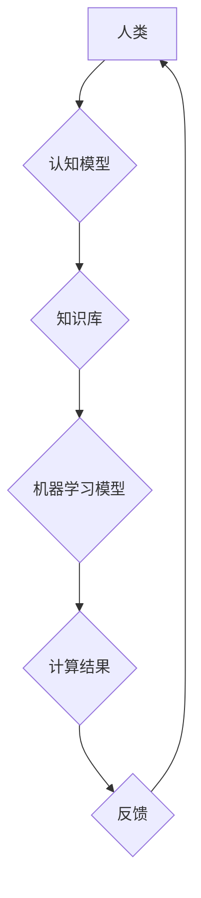

                 

## 科技与人文的融合：人类计算的跨学科性质

> 关键词： 人类计算、跨学科融合、人工智能、自然语言处理、认知科学、伦理学、未来趋势

### 1. 背景介绍

科技的飞速发展，特别是人工智能领域的突破，正在深刻地改变着人类社会。人工智能系统展现出惊人的学习和推理能力，在各个领域取得了显著成就，从医疗诊断到金融预测，从自动驾驶到艺术创作，人工智能的应用范围日益广泛。然而，人工智能的发展也引发了人们对技术伦理、社会影响和未来趋势的深刻思考。

人类计算作为一种新兴的计算范式，旨在将人类的智慧和创造力与人工智能技术相结合，探索科技与人文的融合路径。它强调人类在计算过程中的主动参与和决策，旨在构建更加智能、可解释、可控的人机交互系统。

### 2. 核心概念与联系

**2.1 人类计算的概念**

人类计算是指将人类的认知能力、创造力、情感智能等融入计算系统，以实现超越传统人工智能的更高级的计算能力。它强调人机协同，将人类的智慧和机器的计算能力有机结合，共同解决复杂问题。

**2.2 人类计算与人工智能的关系**

人工智能和人类计算是相辅相成的，但又有所区别。人工智能侧重于构建能够模拟人类智能的机器，而人类计算则更注重将人类的智慧融入计算系统，实现人机协同。

**2.3 人类计算的跨学科性质**

人类计算是一个跨学科的领域，它融合了计算机科学、人工智能、认知科学、心理学、社会学、伦理学等多个学科的知识和方法。

**2.4 人类计算的架构**



### 3. 核心算法原理 & 具体操作步骤

**3.1 算法原理概述**

人类计算的核心算法原理是将人类的认知过程模拟成算法，并将其与机器学习算法相结合。这包括：

* **知识表示:** 将人类的知识和经验以机器可理解的形式表示出来，例如知识图谱、规则库等。
* **推理机制:** 设计算法模拟人类的推理过程，例如逻辑推理、启发式搜索等。
* **学习机制:** 利用机器学习算法，让系统从数据中学习，不断完善知识和推理能力。

**3.2 算法步骤详解**

1. **数据收集和预处理:** 收集与任务相关的各种数据，并进行清洗、转换、标注等预处理工作。
2. **知识表示构建:** 将数据转化为机器可理解的知识表示形式，例如构建知识图谱、规则库等。
3. **模型训练:** 利用机器学习算法，训练模型，使其能够从数据中学习知识和推理规则。
4. **推理和决策:** 将新的输入数据输入到训练好的模型中，进行推理和决策。
5. **反馈和迭代:** 收集用户反馈，并根据反馈进行模型调整和优化，不断提升系统的性能。

**3.3 算法优缺点**

* **优点:**
    * 能够处理复杂、模糊、开放式的任务。
    * 能够学习和适应新的知识和环境。
    * 能够结合人类的智慧和创造力，解决更高级的问题。
* **缺点:**
    * 算法设计和实现难度较高。
    * 需要大量的训练数据和计算资源。
    * 缺乏透明度和可解释性，难以理解模型的决策过程。

**3.4 算法应用领域**

* **医疗诊断:** 利用人类计算技术，辅助医生进行疾病诊断，提高诊断准确率。
* **金融风险管理:** 利用人类计算技术，识别和评估金融风险，降低风险损失。
* **科学研究:** 利用人类计算技术，加速科学发现，解决复杂科学问题。
* **教育教学:** 利用人类计算技术，个性化教学，提高学习效率。

### 4. 数学模型和公式 & 详细讲解 & 举例说明

**4.1 数学模型构建**

人类计算的数学模型通常基于概率论、统计学和信息论等基础理论。例如，知识表示可以采用概率图模型，推理机制可以采用贝叶斯网络，学习机制可以采用深度学习算法。

**4.2 公式推导过程**

例如，在贝叶斯网络中，我们可以用以下公式来计算某个事件发生的概率：

$$P(A|B) = \frac{P(B|A)P(A)}{P(B)}$$

其中：

* $P(A|B)$ 是事件 A 在事件 B 发生的条件概率。
* $P(B|A)$ 是事件 B 在事件 A 发生的条件概率。
* $P(A)$ 是事件 A 的概率。
* $P(B)$ 是事件 B 的概率。

**4.3 案例分析与讲解**

例如，在医疗诊断领域，我们可以构建一个贝叶斯网络模型，将患者的症状、病史、检查结果等信息作为输入，预测患者患某种疾病的概率。

### 5. 项目实践：代码实例和详细解释说明

**5.1 开发环境搭建**

人类计算项目通常需要使用 Python 语言和相关的机器学习库，例如 TensorFlow、PyTorch 等。

**5.2 源代码详细实现**

```python
# 这是一个简单的贝叶斯网络模型示例

import numpy as np

# 定义贝叶斯网络结构
class BayesianNetwork:
    def __init__(self, nodes, edges):
        self.nodes = nodes
        self.edges = edges

    def calculate_probability(self, evidence):
        # 计算给定证据下目标节点的概率
        pass

# 实例化贝叶斯网络模型
network = BayesianNetwork(nodes=['症状', '病史', '检查结果', '疾病'],
                         edges=[('症状', '疾病'), ('病史', '疾病'), ('检查结果', '疾病')])

# 设置证据
evidence = {'症状': True, '病史': False, '检查结果': True}

# 计算疾病概率
disease_probability = network.calculate_probability(evidence)

# 打印结果
print(f"疾病概率: {disease_probability}")
```

**5.3 代码解读与分析**

这段代码展示了一个简单的贝叶斯网络模型的实现。

* `BayesianNetwork` 类定义了贝叶斯网络的结构，包括节点和边。
* `calculate_probability` 方法计算给定证据下目标节点的概率。
* 实例化 `BayesianNetwork` 对象，并设置证据。
* 调用 `calculate_probability` 方法计算疾病概率。

**5.4 运行结果展示**

运行结果将显示给定证据下疾病发生的概率。

### 6. 实际应用场景

**6.1 医疗诊断辅助系统**

人类计算技术可以用于构建医疗诊断辅助系统，帮助医生更快、更准确地诊断疾病。例如，可以利用患者的症状、病史、检查结果等信息，构建一个贝叶斯网络模型，预测患者患某种疾病的概率。

**6.2 金融风险管理系统**

人类计算技术可以用于构建金融风险管理系统，帮助金融机构识别和评估金融风险，降低风险损失。例如，可以利用市场数据、客户信息等数据，构建一个机器学习模型，预测客户违约概率。

**6.3 科学研究辅助工具**

人类计算技术可以用于构建科学研究辅助工具，帮助科学家加速科学发现，解决复杂科学问题。例如，可以利用大量实验数据，构建一个深度学习模型，预测新的物质特性。

**6.4 教育教学平台**

人类计算技术可以用于构建教育教学平台，提供个性化学习体验，提高学习效率。例如，可以利用学生的学习数据，构建一个推荐系统，推荐适合学生的学习资源。

**6.5 未来应用展望**

人类计算技术在未来将有更广泛的应用前景，例如：

* **智能客服:** 利用人类计算技术，构建更智能、更人性化的智能客服系统，能够更好地理解用户的需求，提供更精准的帮助。
* **个性化推荐:** 利用人类计算技术，构建更精准的个性化推荐系统，推荐更符合用户兴趣和需求的内容。
* **自动写作:** 利用人类计算技术，构建能够自动生成高质量文本的写作系统，例如新闻报道、广告文案等。
* **创意设计:** 利用人类计算技术，辅助设计师进行创意设计，例如服装设计、建筑设计等。

### 7. 工具和资源推荐

**7.1 学习资源推荐**

* **书籍:**
    * 《人工智能：一种现代方法》
    * 《深度学习》
    * 《认知计算》
* **在线课程:**
    * Coursera: 人工智能课程
    * edX: 深度学习课程
    * Udacity: 人工智能工程师课程

**7.2 开发工具推荐**

* **Python:** 人工智能开发的常用语言
* **TensorFlow:** 深度学习框架
* **PyTorch:** 深度学习框架
* **Scikit-learn:** 机器学习库

**7.3 相关论文推荐**

* **《人类计算：一种新的计算范式》**
* **《人工智能与人类计算的融合》**
* **《人类计算的伦理挑战》**

### 8. 总结：未来发展趋势与挑战

**8.1 研究成果总结**

人类计算是一个新兴的领域，近年来取得了显著进展。例如，在医疗诊断、金融风险管理、科学研究等领域，人类计算技术已经取得了一些应用成果。

**8.2 未来发展趋势**

未来，人类计算技术将朝着以下几个方向发展：

* **更智能的计算模型:** 开发更智能、更强大的计算模型，能够更好地模拟人类的认知过程。
* **更广泛的应用场景:** 将人类计算技术应用到更多领域，例如教育、娱乐、艺术等。
* **更强的可解释性:** 提高人类计算模型的可解释性，让用户能够更好地理解模型的决策过程。

**8.3 面临的挑战**

人类计算技术也面临一些挑战：

* **算法设计和实现难度:** 设计和实现能够模拟人类认知的算法仍然是一个难题。
* **数据获取和隐私问题:** 人类计算需要大量的训练数据，如何获取高质量的数据，并保护用户隐私是一个重要问题。
* **伦理和社会影响:** 人类计算技术可能会对社会产生一些负面影响，例如失业、算法偏见等，需要认真考虑其伦理和社会影响。

**8.4 研究展望**

未来，人类计算技术将继续发展，并对人类社会产生深远的影响。我们需要加强对人类计算技术的研究，并积极应对其带来的挑战，以确保其健康、可持续发展。

### 9. 附录：常见问题与解答

**9.1 如何构建一个人类计算模型？**

构建一个人类计算模型需要以下步骤：

1. 确定任务目标和数据来源。
2. 设计知识表示和推理机制。
3. 选择合适的机器学习算法。
4. 训练和评估模型。
5. 进行迭代优化。

**9.2 人类计算技术与人工智能有什么区别？**

人工智能侧重于构建能够模拟人类智能的机器，而人类计算则更注重将人类的智慧融入计算系统，实现人机协同。

**9.3 人类计算技术有哪些伦理问题？**

人类计算技术可能会带来一些伦理问题，例如算法偏见、隐私泄露、工作岗位替代等，需要认真考虑其伦理和社会影响。


作者：禅与计算机程序设计艺术 / Zen and the Art of Computer Programming 
<end_of_turn>

