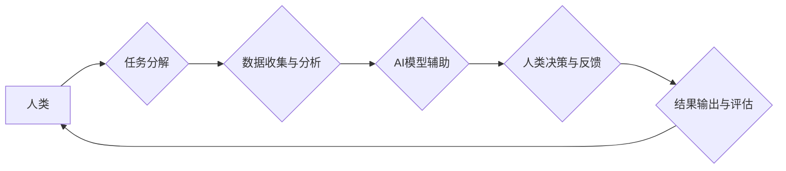

                 

## 科技向善的力量：利用人类计算造福人类

> 关键词： 人类计算、人工智能、协同计算、分布式计算、科技伦理、社会影响、可持续发展

### 1. 背景介绍

科技发展日新月异，人工智能（AI）作为科技发展的重要方向，正在深刻地改变着我们的生活。从自动驾驶到医疗诊断，从个性化教育到科学研究，AI技术的应用前景广阔。然而，AI技术的发展也引发了人们对伦理、社会影响和可持续发展的担忧。

人类计算作为一种新兴的计算模式，将人类的智慧和智能与计算机技术相结合，为解决AI技术面临的挑战提供了新的思路。它强调人机协同，充分利用人类的创造力、批判性思维和情感智能，从而实现更智能、更安全、更可持续的科技发展。

### 2. 核心概念与联系

#### 2.1 人类计算的概念

人类计算是指利用人类的智慧和智能来辅助或替代计算机进行计算和决策的过程。它强调人机协同，将人类的认知能力与计算机的计算能力相结合，从而实现更智能、更灵活、更创新的计算模式。

#### 2.2 人类计算与人工智能的关系

人工智能旨在模拟和超越人类的智能，而人类计算则强调人机协同，将人类的智慧融入到AI系统中。两者并非相互排斥，而是相互补充。AI技术可以提供强大的计算能力和数据处理能力，而人类计算则可以提供人类的创造力、批判性思维和情感智能，从而共同推动AI技术的进步。

#### 2.3 人类计算的架构

**Mermaid 流程图**



### 3. 核心算法原理 & 具体操作步骤

#### 3.1 算法原理概述

人类计算的核心算法原理是基于人机协同的决策机制。它将复杂的任务分解成多个子任务，并利用AI技术辅助人类进行数据收集、分析和决策。

#### 3.2 算法步骤详解

1. **任务分解:** 将复杂的任务分解成多个可管理的子任务，并明确每个子任务的职责和目标。
2. **数据收集与分析:** 利用AI技术收集和分析相关数据，为人类决策提供支持。
3. **AI模型辅助:** 利用AI模型辅助人类进行决策，提供多种方案选择和风险评估。
4. **人类决策与反馈:** 人类根据AI模型的建议和自身经验进行最终决策，并对决策结果进行反馈。
5. **结果输出与评估:** 将决策结果输出并进行评估，并根据评估结果进行调整和优化。

#### 3.3 算法优缺点

**优点:**

* 能够充分利用人类的智慧和智能，提高决策的准确性和有效性。
* 能够处理复杂、模糊和不确定性强的任务。
* 能够促进人机协同，提升人类的创造力和创新能力。

**缺点:**

* 需要建立完善的人机交互机制，确保人类和AI系统能够有效沟通和协作。
* 需要对人类参与者进行培训和指导，提高他们的认知能力和决策能力。
* 需要考虑人类因素的影响，避免算法偏差和伦理问题。

#### 3.4 算法应用领域

* **医疗诊断:** 利用AI技术辅助医生进行诊断，提高诊断的准确性和效率。
* **科学研究:** 利用人类计算进行科学探索，解决复杂科学问题。
* **金融风险管理:** 利用人类计算进行风险评估和控制，降低金融风险。
* **教育教学:** 利用人类计算进行个性化教育，提高学生的学习效率。

### 4. 数学模型和公式 & 详细讲解 & 举例说明

#### 4.1 数学模型构建

人类计算可以抽象为一个多主体决策模型，其中每个主体代表一个参与者，例如人类专家、AI系统、数据源等。每个主体都有自己的知识、能力和目标，通过信息交换和决策协作来实现共同目标。

#### 4.2 公式推导过程

我们可以使用博弈论中的合作博弈模型来描述人类计算过程。假设有N个参与者，每个参与者都有自己的策略空间和效用函数。

* **策略空间:** 每个参与者的可选择策略集合。
* **效用函数:** 每个参与者对不同策略组合的评价函数。

目标是找到一个纳什均衡策略组合，使得每个参与者在给定其他参与者策略的情况下，都无法通过单方面改变策略来提高自己的效用。

#### 4.3 案例分析与讲解

例如，在医疗诊断领域，人类医生和AI系统可以作为两个参与者，共同进行诊断决策。

* **医生策略空间:** 选择不同的诊断方案。
* **AI系统策略空间:** 提供不同的诊断建议和风险评估。
* **医生效用函数:** 考虑诊断的准确性、效率和患者满意度。
* **AI系统效用函数:** 考虑诊断的准确率和效率。

通过合作博弈模型，我们可以分析医生和AI系统在不同策略组合下的效用，找到一个纳什均衡策略组合，使得医生和AI系统都能获得最佳的诊断结果。

### 5. 项目实践：代码实例和详细解释说明

#### 5.1 开发环境搭建

* **操作系统:** Ubuntu 20.04 LTS
* **编程语言:** Python 3.8
* **深度学习框架:** TensorFlow 2.0
* **数据处理库:** Pandas, NumPy
* **可视化库:** Matplotlib, Seaborn

#### 5.2 源代码详细实现

```python
# 人类计算模型示例代码

import tensorflow as tf
from sklearn.model_selection import train_test_split
from sklearn.metrics import accuracy_score

# 加载数据
data = ... # 加载你的数据

# 数据预处理
X = ... # 特征数据
y = ... # 标签数据

# 将数据分成训练集和测试集
X_train, X_test, y_train, y_test = train_test_split(X, y, test_size=0.2)

# 创建AI模型
model = tf.keras.models.Sequential([
    tf.keras.layers.Dense(128, activation='relu', input_shape=(X_train.shape[1],)),
    tf.keras.layers.Dense(64, activation='relu'),
    tf.keras.layers.Dense(1, activation='sigmoid')
])

# 编译模型
model.compile(optimizer='adam', loss='binary_crossentropy', metrics=['accuracy'])

# 训练模型
model.fit(X_train, y_train, epochs=10)

# 评估模型
loss, accuracy = model.evaluate(X_test, y_test)
print('测试集准确率:', accuracy)

# 人类专家进行决策
# ... # 根据AI模型的预测结果和人类专家的经验进行最终决策
```

#### 5.3 代码解读与分析

* 代码首先加载数据并进行预处理。
* 然后创建并编译一个简单的深度学习模型。
* 使用训练集训练模型，并使用测试集评估模型的性能。
* 最后，代码展示了人类专家如何根据AI模型的预测结果进行最终决策。

#### 5.4 运行结果展示

运行代码后，会输出模型在测试集上的准确率。

### 6. 实际应用场景

#### 6.1 医疗诊断辅助

人类计算可以帮助医生更快、更准确地诊断疾病。例如，AI系统可以分析患者的病历、影像数据和基因信息，并提供诊断建议，而医生可以根据AI的建议和自身经验进行最终判断。

#### 6.2 科学研究加速

人类计算可以加速科学研究，帮助科学家解决复杂科学问题。例如，AI系统可以分析海量科研数据，发现潜在的规律和模式，而科学家可以根据AI的发现进行进一步研究和验证。

#### 6.3 决策支持系统

人类计算可以构建决策支持系统，帮助企业和政府做出更明智的决策。例如，AI系统可以分析市场数据、经济指标和社会趋势，并提供决策建议，而决策者可以根据AI的建议和自身情况进行最终决策。

#### 6.4 未来应用展望

随着人工智能技术的不断发展，人类计算将在更多领域得到应用，例如：

* 个性化教育
* 智能制造
* 自动驾驶
* 虚拟现实

### 7. 工具和资源推荐

#### 7.1 学习资源推荐

* **书籍:**
    * 《人机协作计算》
    * 《人工智能与人类计算》
* **在线课程:**
    * Coursera: 人工智能与人类计算
    * edX: 人类计算与协作智能

#### 7.2 开发工具推荐

* **深度学习框架:** TensorFlow, PyTorch
* **数据处理库:** Pandas, NumPy
* **可视化库:** Matplotlib, Seaborn

#### 7.3 相关论文推荐

* **人类计算的定义和分类**
* **人类计算的算法和模型**
* **人类计算的应用案例**

### 8. 总结：未来发展趋势与挑战

#### 8.1 研究成果总结

人类计算作为一种新兴的计算模式，在解决AI技术面临的挑战方面展现出巨大的潜力。它能够充分利用人类的智慧和智能，提高决策的准确性和有效性，并促进人机协同，提升人类的创造力和创新能力。

#### 8.2 未来发展趋势

未来，人类计算将朝着以下方向发展：

* **更智能的人机交互:** 开发更自然、更智能的人机交互方式，例如自然语言处理、语音识别、情感识别等。
* **更强大的AI模型:** 开发更强大的AI模型，能够处理更复杂、更模糊的决策问题。
* **更广泛的应用场景:** 将人类计算应用到更多领域，例如医疗、教育、金融、制造等。

#### 8.3 面临的挑战

人类计算的发展也面临着一些挑战：

* **伦理问题:** 人类计算需要解决伦理问题，例如数据隐私、算法偏见、责任归属等。
* **技术挑战:** 需要开发更先进的人机交互技术、AI模型和计算平台。
* **社会接受度:** 需要提高公众对人类计算的理解和接受度。

#### 8.4 研究展望

未来，我们需要继续深入研究人类计算的原理、算法和应用，并积极探索解决人类计算面临的挑战，推动人类计算技术向更智能、更安全、更可持续的方向发展。

### 9. 附录：常见问题与解答

* **什么是人类计算？**

人类计算是指利用人类的智慧和智能来辅助或替代计算机进行计算和决策的过程。

* **人类计算与人工智能有什么区别？**

人工智能旨在模拟和超越人类的智能，而人类计算则强调人机协同，将人类的智慧融入到AI系统中。

* **人类计算有哪些应用场景？**

人类计算可以应用于医疗诊断、科学研究、决策支持系统等领域。

* **人类计算有哪些挑战？**

人类计算面临着伦理问题、技术挑战和社会接受度等挑战。


作者：禅与计算机程序设计艺术 / Zen and the Art of Computer Programming 
<end_of_turn>

