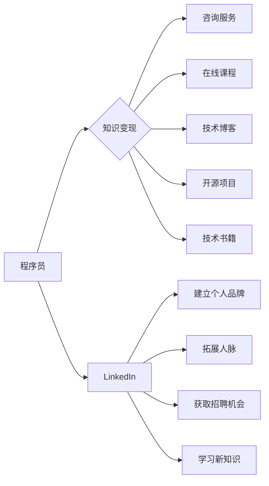

                 

## 程序员如何利用LinkedIn进行知识变现

> 关键词：LinkedIn, 知识变现, 程序员, 技术专家, 社交平台, 个人品牌, 职业发展

## 1. 背景介绍

在当今数字时代，知识是至关重要的资产。对于程序员而言，他们拥有宝贵的技术技能和经验，可以通过多种方式进行知识变现。LinkedIn作为全球最大的职业社交平台，为程序员提供了独特的机遇，帮助他们建立个人品牌、拓展人脉、获取高薪工作机会，甚至开创自己的知识商业模式。

然而，许多程序员并不了解如何充分利用LinkedIn进行知识变现。他们可能只是将LinkedIn作为求职平台，而忽略了其更深层的价值。本文将深入探讨程序员如何利用LinkedIn进行知识变现，并提供具体的策略和步骤。

## 2. 核心概念与联系

**2.1 知识变现的本质**

知识变现是指将个人所拥有的知识、技能和经验转化为经济价值的过程。对于程序员来说，知识变现可以采取多种形式，例如：

* **咨询服务:** 利用专业知识为企业或个人提供技术咨询服务。
* **在线课程:** 创建和销售技术课程，分享自己的编程经验和技能。
* **技术博客:** 通过撰写技术博客文章，建立个人品牌，吸引读者并获得广告收入或赞助。
* **开源项目:** 开发开源软件，积累贡献，提升知名度，并获得赞助或雇佣机会。
* **技术书籍:** 出版技术书籍，将自己的知识体系和经验凝练成书面形式，获得版税收入。

**2.2 LinkedIn的价值**

LinkedIn作为全球最大的职业社交平台，拥有庞大的用户群体，其中包括众多技术专家、企业招聘人员和潜在客户。它为程序员提供了以下优势：

* **建立个人品牌:** 通过完善个人资料、分享技术文章和参与行业讨论，建立专业的技术形象，提升个人知名度。
* **拓展人脉:** 连接行业同行、潜在客户和招聘人员，建立广泛的人脉关系，获得更多合作机会和工作机会。
* **获取招聘机会:** 许多公司会在LinkedIn上发布招聘信息，程序员可以通过搜索职位、申请职位和与招聘人员互动，获得更多工作机会。
* **学习新知识:** 关注行业领袖、阅读技术文章和参与行业讨论，学习最新的技术趋势和最佳实践。

**2.3 核心概念关系图**



## 3. 核心算法原理 & 具体操作步骤

**3.1 算法原理概述**

LinkedIn的知识变现算法本质上是基于用户价值和网络效应的。平台通过分析用户的个人资料、活动记录、连接关系等数据，推荐相关内容和机会，并根据用户的互动行为进行排名和排序。

程序员可以通过优化个人资料、发布高质量内容、积极参与互动等方式，提升自身在平台上的价值，从而获得更多曝光机会和变现机会。

**3.2 算法步骤详解**

1. **个人资料优化:** 完善个人资料，包括头像、简介、技能、工作经历、教育背景等信息。使用关键词优化个人资料，提高搜索排名。
2. **内容创作:** 撰写高质量的技术文章、分享编程经验、发布项目成果等内容，吸引读者关注和互动。
3. **互动参与:** 积极参与行业讨论、评论文章、点赞分享等互动行为，提升个人活跃度和影响力。
4. **人脉拓展:** 连接行业同行、潜在客户和招聘人员，建立广泛的人脉关系，获得更多合作机会和工作机会。
5. **数据分析:** 利用LinkedIn的分析工具，跟踪个人资料的曝光率、内容的阅读量、互动行为等数据，不断优化策略。

**3.3 算法优缺点**

* **优点:** 算法能够有效地推荐相关内容和机会，帮助程序员找到目标用户和合作机会。
* **缺点:** 算法可能会存在偏差，导致一些优质内容或用户被忽略。

**3.4 算法应用领域**

LinkedIn的知识变现算法广泛应用于以下领域:

* **技术咨询:** 帮助技术专家找到潜在客户，提供咨询服务。
* **在线教育:** 帮助程序员创建和销售技术课程。
* **技术写作:** 帮助技术作者推广技术书籍和博客文章。
* **开源软件开发:** 帮助开源项目开发者获得赞助和贡献。

## 4. 数学模型和公式 & 详细讲解 & 举例说明

**4.1 数学模型构建**

LinkedIn的知识变现算法可以抽象为一个基于用户价值和网络效应的数学模型。

其中，用户价值可以表示为：

$$
U = f(P, C, I)
$$

其中：

* $U$ 表示用户价值
* $P$ 表示用户个人资料的质量
* $C$ 表示用户发布的内容质量
* $I$ 表示用户参与互动行为的频率

网络效应可以表示为：

$$
N = g(U, L)
$$

其中：

* $N$ 表示网络效应
* $U$ 表示用户价值
* $L$ 表示用户连接关系的数量

**4.2 公式推导过程**

用户价值和网络效应相互影响，共同决定了用户的知识变现机会。

* 用户价值越高，越容易获得平台推荐和用户关注，从而提升网络效应。
* 网络效应越高，用户更容易获得更多曝光机会和合作机会，从而提升用户价值。

**4.3 案例分析与讲解**

假设有两个程序员，A和B。A拥有丰富的技术经验和优质的个人资料，经常发布高质量的技术文章，并积极参与行业讨论。B则缺乏技术经验，个人资料不完善，很少发布内容，也不参与互动。

根据上述数学模型，A的用户价值远高于B，因此更容易获得平台推荐和用户关注，从而获得更高的网络效应。反之，B的用户价值较低，网络效应也较弱，难以获得知识变现的机会。

## 5. 项目实践：代码实例和详细解释说明

**5.1 开发环境搭建**

* 操作系统: Windows/macOS/Linux
* 编程语言: Python
* 必要的库: requests, beautifulsoup4, lxml

**5.2 源代码详细实现**

```python
import requests
from bs4 import BeautifulSoup
from lxml import etree

def get_linkedin_profile(url):
    """
    获取LinkedIn个人资料信息
    """
    response = requests.get(url)
    response.raise_for_status()  # 检查请求是否成功
    soup = BeautifulSoup(response.content, 'html.parser')
    # 使用BeautifulSoup解析HTML内容，提取个人资料信息
    # ...
    return profile_data

def analyze_profile(profile_data):
    """
    分析个人资料信息，评估用户价值
    """
    # 根据个人资料信息，计算用户价值
    # ...
    return user_value

def main():
    # 获取目标用户的LinkedIn个人资料URL
    target_url = 'https://www.linkedin.com/in/target_user'
    # 获取个人资料信息
    profile_data = get_linkedin_profile(target_url)
    # 分析个人资料信息，评估用户价值
    user_value = analyze_profile(profile_data)
    # 打印用户价值
    print(f'用户价值: {user_value}')

if __name__ == '__main__':
    main()
```

**5.3 代码解读与分析**

* 该代码示例展示了如何使用Python爬取LinkedIn个人资料信息，并进行初步分析。
* `get_linkedin_profile()`函数负责获取目标用户的个人资料页面内容，并使用BeautifulSoup解析HTML结构，提取相关信息。
* `analyze_profile()`函数负责根据提取的信息，计算用户的价值。
* `main()`函数演示了如何使用上述函数，获取目标用户的个人资料信息并打印用户价值。

**5.4 运行结果展示**

运行该代码后，将输出目标用户的LinkedIn个人资料信息和评估的用户价值。

## 6. 实际应用场景

**6.1 技术咨询**

程序员可以通过LinkedIn建立个人品牌，展示自己的技术专长，并吸引潜在客户咨询。

**6.2 在线课程**

程序员可以利用LinkedIn发布自己的技术课程，吸引学员报名学习。

**6.3 技术博客**

程序员可以通过LinkedIn分享自己的技术博客文章，吸引读者关注，并获得广告收入或赞助。

**6.4 未来应用展望**

随着人工智能和机器学习技术的不断发展，LinkedIn的知识变现算法将会更加智能化和个性化。

程序员可以利用这些技术，更精准地定位目标用户，提供更个性化的服务，从而获得更高的知识变现收益。

## 7. 工具和资源推荐

**7.1 学习资源推荐**

* **LinkedIn Learning:** 提供丰富的技术课程，帮助程序员提升技能。
* **Coursera:** 提供来自世界知名大学的在线课程，涵盖各种技术领域。
* **Udacity:** 提供以项目为中心的在线课程，帮助程序员获得实战经验。

**7.2 开发工具推荐**

* **Python:** 强大的编程语言，广泛应用于数据分析、机器学习等领域。
* **BeautifulSoup:** 用于解析HTML和XML文档的Python库。
* **requests:** 用于发送HTTP请求的Python库。

**7.3 相关论文推荐**

* **"Recommender Systems: A Survey"** by Ricci et al.
* **"Social Network Analysis: Methods and Applications"** by Wasserman and Faust

## 8. 总结：未来发展趋势与挑战

**8.1 研究成果总结**

本文探讨了程序员如何利用LinkedIn进行知识变现，并介绍了相关的算法原理、实践案例和工具资源。

**8.2 未来发展趋势**

* **人工智能和机器学习:** 将进一步提升LinkedIn的知识变现算法智能化和个性化水平。
* **虚拟现实和增强现实:** 将为程序员提供更沉浸式的学习和交流体验。
* **区块链技术:** 将为知识产权保护和知识交易提供新的解决方案。

**8.3 面临的挑战**

* **数据隐私和安全:** 确保用户数据安全和隐私保护。
* **算法公平性和透明度:** 避免算法偏差，确保公平公正的知识变现机会。
* **知识产权保护:** 构建有效的知识产权保护机制，防止知识盗窃。

**8.4 研究展望**

未来研究可以进一步探讨以下问题:

* 如何利用人工智能和机器学习技术，更精准地匹配程序员和潜在客户的需求？
* 如何构建更公平、透明和可解释的知识变现算法？
* 如何利用区块链技术，构建更安全、高效的知识交易平台？


## 9. 附录：常见问题与解答

**9.1 如何优化LinkedIn个人资料？**

* 使用高质量的头像，展现专业形象。
* 撰写简洁、清晰、吸引人的个人简介，突出自己的技术专长和经验。
* 添加丰富的技能和工作经历，并使用关键词优化。
* 积极参与行业讨论，分享技术文章，提升个人活跃度。

**9.2 如何利用LinkedIn进行知识变现？**

* 提供技术咨询服务，帮助企业或个人解决技术难题。
* 创建和销售技术课程，分享自己的编程经验和技能。
* 撰写技术博客文章，吸引读者关注，并获得广告收入或赞助。
* 开发开源软件，积累贡献，提升知名度，并获得赞助或雇佣机会。
* 出版技术书籍，将自己的知识体系和经验凝练成书面形式，获得版税收入。

**9.3 LinkedIn的知识变现机会有哪些？**

* **咨询服务:** 利用专业知识为企业或个人提供技术咨询服务。
* **在线课程:** 创建和销售技术课程，分享自己的编程经验和技能。
* **技术博客:** 通过撰写技术博客文章，建立个人品牌，吸引读者并获得广告收入或赞助。
* **开源项目:** 开发开源软件，积累贡献，提升知名度，并获得赞助或雇佣机会。
* **技术书籍:** 出版技术书籍，将自己的知识体系和经验凝练成书面形式，获得版税收入。


作者：禅与计算机程序设计艺术 / Zen and the Art of Computer Programming 
<end_of_turn>

