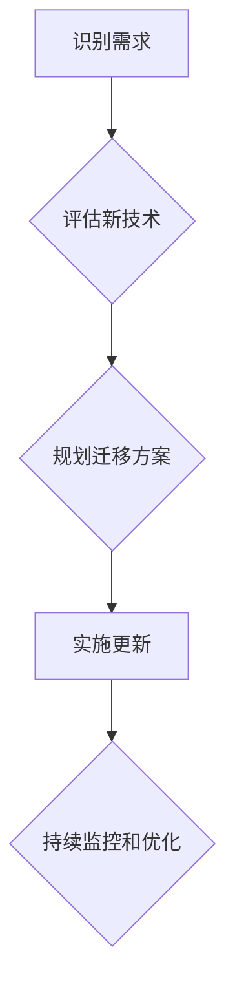

                 

## 程序员如何应对技术栈快速更新

> 关键词：技术栈、持续学习、编程技能、职业发展、适应能力、新技术、编程语言、框架、工具

## 1. 背景介绍

在当今科技日新月异的时代，技术栈的更新速度令人眼花缭乱。作为程序员，我们必须不断学习新知识、掌握新技能，才能跟上时代的步伐，保持竞争力。然而，面对如此快速的更新迭代，许多程序员感到焦虑和迷茫，不知道如何应对。

技术栈的快速更新源于以下几个方面：

* **科技发展加速:**  人工智能、云计算、大数据等新兴技术不断涌现，催生出新的编程语言、框架和工具。
* **市场需求变化:**  用户需求不断变化，市场对软件功能和性能的要求也越来越高，这促使开发人员采用更先进的技术来满足需求。
* **开源社区活跃:**  开源社区的蓬勃发展，使得新的技术和工具能够快速传播和迭代，加速技术栈的更新。

## 2. 核心概念与联系

技术栈的更新是一个复杂的过程，涉及到多个层次的概念和联系。

**2.1 技术栈构成**

技术栈通常由以下几个层次组成：

* **基础语言:**  如 Java、Python、C++ 等，是构建软件的基础。
* **框架和库:**  如 Spring、React、TensorFlow 等，提供预先构建的组件和功能，提高开发效率。
* **数据库:**  如 MySQL、MongoDB、Redis 等，用于存储和管理数据。
* **云平台:**  如 AWS、Azure、GCP 等，提供计算、存储、网络等基础设施服务。
* **工具和平台:**  如 Git、Docker、Jenkins 等，用于代码管理、部署和持续集成。

**2.2 技术栈更新的驱动因素**

技术栈的更新主要由以下因素驱动：

* **性能提升:**  新技术往往能够提供更高的性能和效率。
* **功能扩展:**  新技术能够带来新的功能和应用场景。
* **安全增强:**  新技术能够提供更完善的安全保障。
* **成本降低:**  新技术能够降低开发和维护成本。

**2.3 技术栈更新的流程**

技术栈的更新是一个循序渐进的过程，通常包括以下几个阶段：

* **识别需求:**  首先需要识别出需要更新的技术栈，并明确更新的目标。
* **评估新技术:**  评估新技术的性能、功能、安全性、成本等因素，选择最合适的技术。
* **规划迁移方案:**  制定详细的迁移方案，包括技术选择、代码转换、测试验证等步骤。
* **实施更新:**  逐步实施技术更新，并进行持续监控和优化。

**2.4 Mermaid 流程图**

## 3. 核心算法原理 & 具体操作步骤

面对技术栈的快速更新，程序员需要掌握一些核心算法原理和操作步骤，才能快速学习新技术并将其应用于实际开发中。

### 3.1 算法原理概述

算法是解决特定问题的一系列步骤，是程序员的思维工具和编程基础。掌握一些核心算法原理，可以帮助程序员理解新技术的本质，并将其应用于不同的场景。

一些常见的核心算法包括：

* **排序算法:**  如冒泡排序、插入排序、快速排序等，用于对数据进行排序。
* **搜索算法:**  如线性搜索、二分搜索等，用于在数据中查找特定元素。
* **图算法:**  如深度优先搜索、广度优先搜索等，用于处理图结构的数据。
* **动态规划算法:**  用于解决具有重叠子问题的优化问题。

### 3.2 算法步骤详解

每个算法都有其特定的步骤和实现方式。程序员需要学习和理解这些步骤，才能正确地应用算法解决问题。

例如，快速排序算法的步骤如下：

1. 选择一个基准元素。
2. 将小于基准元素的元素放在基准元素的左边，大于基准元素的元素放在基准元素的右边。
3. 对基准元素左边和右边的子数组重复步骤1和2，直到子数组只有一个元素。

### 3.3 算法优缺点

每个算法都有其自身的优缺点，程序员需要根据实际情况选择合适的算法。

例如，快速排序算法的优点是时间复杂度较低，缺点是空间复杂度较高。

### 3.4 算法应用领域

算法广泛应用于各个领域，例如：

* **计算机科学:**  数据结构、算法分析、人工智能等。
* **软件工程:**  代码优化、软件测试、代码生成等。
* **金融领域:**  风险管理、投资策略、欺诈检测等。
* **生物信息学:**  基因序列分析、蛋白质结构预测等。

## 4. 数学模型和公式 & 详细讲解 & 举例说明

数学模型和公式是描述算法和技术原理的重要工具。程序员需要了解一些基本的数学模型和公式，才能更好地理解和应用新技术。

### 4.1 数学模型构建

数学模型是利用数学语言和符号来描述现实世界现象的抽象表示。

例如，线性回归模型可以用来描述两个变量之间的线性关系。

### 4.2 公式推导过程

公式推导过程是利用数学原理和逻辑推理，从已知条件出发推导出未知结论的过程。

例如，线性回归模型的损失函数可以推导如下：

$$
L(\theta) = \frac{1}{2m} \sum_{i=1}^{m} (h_\theta(x^{(i)}) - y^{(i)})^2
$$

其中：

* $L(\theta)$ 是损失函数。
* $\theta$ 是模型参数。
* $m$ 是训练样本数量。
* $h_\theta(x^{(i)})$ 是模型预测值。
* $y^{(i)}$ 是真实值。

### 4.3 案例分析与讲解

通过对实际案例的分析和讲解，可以更好地理解数学模型和公式的应用。

例如，我们可以使用线性回归模型来预测房价，并分析模型的预测结果。

## 5. 项目实践：代码实例和详细解释说明

为了更好地理解技术栈的更新和应用，我们可以通过项目实践来加深理解。

### 5.1 开发环境搭建

首先需要搭建一个合适的开发环境，包括安装必要的软件和配置开发工具。

例如，我们可以使用 Python 语言和 Django 框架来开发一个简单的网站。

### 5.2 源代码详细实现

然后，我们可以编写源代码来实现网站的功能，并进行测试和调试。

例如，我们可以编写代码来实现用户注册、登录、发布文章等功能。

### 5.3 代码解读与分析

我们需要对代码进行解读和分析，理解代码的逻辑和结构，并找出代码中的潜在问题。

例如，我们可以分析代码的性能、安全性、可维护性等方面。

### 5.4 运行结果展示

最后，我们可以运行代码并展示网站的效果，并进行用户测试和反馈收集。

## 6. 实际应用场景

技术栈的更新不仅影响到程序员的学习和工作，也影响到各个行业的应用场景。

### 6.1 医疗保健

人工智能技术在医疗保健领域得到广泛应用，例如：

* **疾病诊断:**  利用机器学习算法分析患者的病历和影像数据，辅助医生进行疾病诊断。
* **药物研发:**  利用人工智能加速药物研发过程，降低研发成本和时间。

### 6.2 金融服务

云计算技术在金融服务领域得到广泛应用，例如：

* **风险管理:**  利用云计算平台进行大数据分析，识别和评估金融风险。
* **个性化服务:**  利用云计算平台提供个性化的金融服务，例如理财建议、贷款审批等。

### 6.3 教育

大数据技术在教育领域得到广泛应用，例如：

* **个性化学习:**  利用大数据分析学生的学习行为和成绩，提供个性化的学习方案。
* **教学质量评估:**  利用大数据分析教学数据，评估教学质量并改进教学方法。

### 6.4 未来应用展望

随着技术的不断发展，技术栈的更新速度将会更快，应用场景将会更加广泛。

例如：

* **量子计算:**  量子计算技术将颠覆传统计算，为解决复杂问题提供新的解决方案。
* **区块链技术:**  区块链技术将改变数据存储和管理方式，为构建更加安全和透明的系统提供基础。

## 7. 工具和资源推荐

### 7.1 学习资源推荐

* **在线课程平台:**  Coursera、edX、Udemy 等平台提供丰富的编程和技术课程。
* **技术博客和论坛:**  Stack Overflow、Medium、GitHub 等平台提供技术相关的博客文章、讨论论坛和开源项目。
* **书籍:**  选择一些经典的编程书籍和技术书籍进行学习。

### 7.2 开发工具推荐

* **代码编辑器:**  VS Code、Sublime Text、Atom 等代码编辑器提供丰富的功能和插件，提高开发效率。
* **版本控制系统:**  Git 是常用的版本控制系统，用于管理代码版本和协同开发。
* **持续集成平台:**  Jenkins、Travis CI 等平台用于自动化代码构建、测试和部署。

### 7.3 相关论文推荐

* **论文数据库:**  arXiv、IEEE Xplore、ACM Digital Library 等数据库提供大量的技术论文。
* **学术期刊:**  选择一些权威的学术期刊进行阅读，了解最新的技术研究成果。

## 8. 总结：未来发展趋势与挑战

### 8.1 研究成果总结

技术栈的快速更新是科技发展进步的必然结果。程序员需要不断学习和适应新的技术，才能保持竞争力。

### 8.2 未来发展趋势

未来，技术栈的更新速度将会更快，应用场景将会更加广泛。

例如：

* **人工智能:**  人工智能技术将继续发展，并应用于更多领域。
* **云计算:**  云计算技术将更加成熟，并提供更加丰富的服务。
* **区块链:**  区块链技术将得到更广泛的应用，改变数据存储和管理方式。

### 8.3 面临的挑战

技术栈的快速更新也带来了一些挑战，例如：

* **学习成本:**  程序员需要不断学习新的技术，学习成本较高。
* **技能贬值:**  旧的技术可能会被淘汰，程序员需要不断更新技能，避免技能贬值。
* **职业发展:**  技术栈的快速更新也对程序员的职业发展带来挑战，需要不断适应新的技术和市场需求。

### 8.4 研究展望

未来，我们需要更加重视技术栈的更新和管理，并探索新的学习和发展模式。

例如：

* **微服务架构:**  微服务架构可以帮助程序员更灵活地管理和更新技术栈。
* **持续学习平台:**  建立持续学习平台，帮助程序员不断学习和更新技能。
* **职业发展规划:**  制定合理的职业发展规划，帮助程序员适应技术栈的快速更新。

## 9. 附录：常见问题与解答

### 9.1 如何应对技术栈的快速更新？

* **保持学习的热情:**  持续学习新技术，关注行业趋势。
* **掌握核心算法和原理:**  理解算法和技术原理，才能快速学习新技术。
* **关注开源社区:**  参与开源项目，学习和实践新技术。
* **建立学习和实践的习惯:**  定期学习新技术，并将其应用于实际项目中。

### 9.2 如何选择合适的技术栈？

* **了解项目需求:**  明确项目的功能、性能、安全性等需求。
* **评估技术优劣:**  比较不同技术的性能、功能、成本等因素。
* **考虑团队经验:**  选择团队成员熟悉和擅长的技术栈。
* **关注技术发展趋势:**  选择未来发展潜力大的技术栈。

### 9.3 如何保持技术竞争力？

* **持续学习:**  不断学习新技术，更新技能。
* **实践应用:**  将新技术应用于实际项目中，积累经验。
* **参与社区:**  参与开源项目和技术社区，与其他程序员交流学习。
* **保持好奇心:**  对新技术保持好奇心，不断探索和尝试。

作者：禅与计算机程序设计艺术 / Zen and the Art of Computer Programming 
<end_of_turn>

