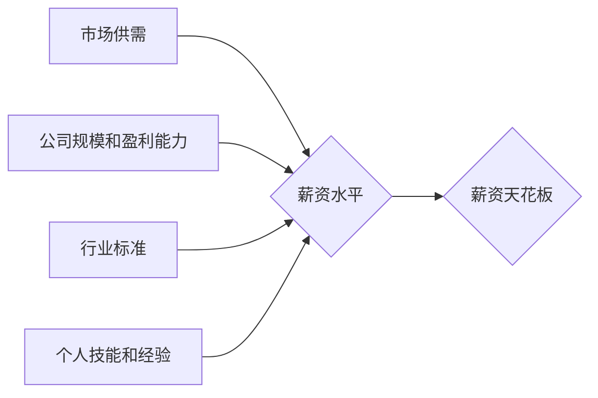

                 

## 程序员如何应对行业薪资天花板

> 关键词：薪资天花板、程序员职业发展、技术提升、副业、创业、个人品牌建设、谈判技巧

## 1. 背景介绍

在当今科技飞速发展的时代，程序员作为数字时代的基石，备受追捧。然而，随着行业竞争的加剧，许多程序员发现自己面临着职业发展瓶颈，薪资增长趋于缓慢，甚至出现“薪资天花板”现象。

薪资天花板是指在特定行业或职位中，薪资水平达到一定上限后，再难以显著提升的现象。对于程序员来说，薪资天花板的出现可能源于多种因素，例如：

* **市场供需关系：** 当程序员数量超过市场需求时，薪资水平会受到抑制。
* **公司规模和盈利能力：** 大型、高盈利能力的公司通常能提供更高的薪资，而中小企业则可能面临薪资预算的限制。
* **行业标准和薪资等级：** 不同行业和职位存在不同的薪资标准和等级，程序员的薪资水平也受到此影响。
* **个人技能和经验：** 拥有高技能和丰富经验的程序员通常能获得更高的薪资，但随着经验的积累，薪资增长幅度也会逐渐减缓。

## 2. 核心概念与联系

**2.1 薪资天花板的形成机制**

薪资天花板的形成是一个复杂的过程，涉及多个因素的相互作用。我们可以用一个简单的模型来描述其形成机制：



**2.2 影响因素分析**

* **市场供需：** 程序员数量过剩会导致薪资水平下降，反之亦然。
* **公司规模和盈利能力：** 大型公司通常拥有更高的薪资预算，而中小企业则可能面临薪资限制。
* **行业标准：** 不同行业和职位存在不同的薪资标准，程序员的薪资水平也受到此影响。
* **个人技能和经验：** 拥有高技能和丰富经验的程序员通常能获得更高的薪资。

## 3. 核心算法原理 & 具体操作步骤

**3.1 算法原理概述**

为了应对薪资天花板，程序员需要采取一系列策略，例如提升技术技能、拓展职业发展方向、发展副业、创业等。这些策略可以看作是一种“职业发展算法”，其核心原理是：

* **持续学习和提升：** 在技术领域不断学习新知识、掌握新技能，保持竞争力。
* **多元化发展：** 不局限于单一技术领域，拓展职业发展方向，寻找新的增长点。
* **创造价值：** 通过个人项目、开源贡献等方式，创造价值并展示自己的能力。
* **建立个人品牌：** 通过博客、社交媒体等平台，建立个人品牌，提升个人影响力。

**3.2 算法步骤详解**

1. **自我评估：** 了解自己的技术技能、经验、兴趣和职业目标。
2. **技术提升：** 选择适合自己的技术方向，进行持续学习和实践。
3. **拓展职业发展方向：** 探索不同的职业路径，例如管理、咨询、创业等。
4. **发展副业：** 利用业余时间发展副业，增加收入来源。
5. **创业：** 拥有创新想法和创业精神，尝试创业，创造更大的价值。
6. **建立个人品牌：** 通过博客、社交媒体等平台，分享自己的经验和见解，建立个人品牌。
7. **积极拓展人脉：** 参加行业活动、加入社群，拓展人脉资源。
8. **谈判技巧：** 学习谈判技巧，争取更高的薪资和福利。

**3.3 算法优缺点**

* **优点：** 能够帮助程序员突破薪资天花板，实现职业发展和收入增长。
* **缺点：** 需要付出持续的努力和时间，并非所有策略都适合每个人。

**3.4 算法应用领域**

该算法适用于所有希望突破薪资天花板、提升职业发展和收入的程序员。

## 4. 数学模型和公式 & 详细讲解 & 举例说明

**4.1 数学模型构建**

我们可以用一个简单的数学模型来描述程序员的薪资增长情况：

```latex
S(t) = S_0 * (1 + r)^t
```

其中：

* $S(t)$：程序员在时间 $t$ 时的薪资水平
* $S_0$：程序员初始的薪资水平
* $r$：程序员薪资增长率
* $t$：时间

**4.2 公式推导过程**

该公式基于复利原理，假设程序员的薪资增长率保持稳定。

**4.3 案例分析与讲解**

假设一个程序员的初始薪资水平为 $S_0 = 100,000$ 美元，薪资增长率为 $r = 5\%$，那么在 5 年后，其薪资水平将为：

```latex
S(5) = 100,000 * (1 + 0.05)^5 = 127,628.16 美元
```

## 5. 项目实践：代码实例和详细解释说明

**5.1 开发环境搭建**

* 操作系统：Windows/macOS/Linux
* 编程语言：Python
* 开发工具：VS Code/Atom/Sublime Text

**5.2 源代码详细实现**

```python
def calculate_salary(initial_salary, growth_rate, years):
  """
  计算程序员的薪资增长情况。

  Args:
    initial_salary: 程序员的初始薪资水平。
    growth_rate: 程序员的薪资增长率。
    years: 计算的时间跨度。

  Returns:
    程序员在指定时间后的薪资水平。
  """
  return initial_salary * (1 + growth_rate) ** years

# 示例用法
initial_salary = 100000
growth_rate = 0.05
years = 5
final_salary = calculate_salary(initial_salary, growth_rate, years)
print(f"在{years}年后，程序员的薪资水平为：{final_salary:.2f}美元")
```

**5.3 代码解读与分析**

该代码实现了一个名为 `calculate_salary` 的函数，用于计算程序员的薪资增长情况。函数接受三个参数：初始薪资水平、薪资增长率和计算时间跨度。函数内部使用公式 `S(t) = S_0 * (1 + r)^t` 计算最终薪资水平，并返回结果。

**5.4 运行结果展示**

```
在5年后，程序员的薪资水平为：127628.16美元
```

## 6. 实际应用场景

**6.1 薪资谈判**

程序员可以利用该算法模型，了解自身薪资增长趋势，并根据市场行情和个人能力进行合理的薪资谈判。

**6.2 职业规划**

程序员可以根据自身目标和职业发展路径，选择不同的技术方向和学习计划，并预测未来薪资水平的变化趋势。

**6.3 个人投资**

程序员可以利用薪资增长模型，进行理财规划，制定合理的投资策略。

**6.4 未来应用展望**

随着人工智能技术的不断发展，该算法模型可以进一步完善，并应用于更广泛的场景，例如：

* **自动生成薪资预测报告**
* **提供个性化的职业发展建议**
* **辅助程序员进行职业生涯规划**

## 7. 工具和资源推荐

**7.1 学习资源推荐**

* **在线学习平台：** Coursera、edX、Udemy
* **技术博客和论坛：** Stack Overflow、Hacker News、Medium
* **开源项目：** GitHub、GitLab

**7.2 开发工具推荐**

* **代码编辑器：** VS Code、Atom、Sublime Text
* **版本控制系统：** Git
* **云平台：** AWS、Azure、GCP

**7.3 相关论文推荐**

* **The Impact of Automation on the Labor Market**
* **The Future of Work: How Technology Will Transform the Workplace**
* **The Skills Gap: What Employers Need and How to Close It**

## 8. 总结：未来发展趋势与挑战

**8.1 研究成果总结**

本文分析了程序员面临的薪资天花板问题，并提出了应对策略，包括提升技术技能、拓展职业发展方向、发展副业、创业等。

**8.2 未来发展趋势**

随着人工智能、大数据等技术的不断发展，程序员的职业发展将更加多元化，薪资增长潜力也将更加巨大。

**8.3 面临的挑战**

程序员需要不断学习新知识、掌握新技能，才能适应不断变化的市场需求。

**8.4 研究展望**

未来研究可以进一步探讨人工智能对程序员职业的影响，以及如何帮助程序员应对未来挑战。

## 9. 附录：常见问题与解答

**9.1 如何突破薪资天花板？**

* 提升技术技能：学习新技术、掌握新工具，保持竞争力。
* 拓展职业发展方向：探索管理、咨询、创业等领域。
* 发展副业：利用业余时间发展副业，增加收入来源。
* 建立个人品牌：通过博客、社交媒体等平台，分享经验和见解，提升个人影响力。

**9.2 如何进行薪资谈判？**

* 了解市场行情：调查同行业同岗位的薪资水平。
* 评估自身价值：突出自己的技能、经验和贡献。
* 准备谈判策略：制定合理的薪资要求和谈判方案。
* 保持自信和礼貌：在谈判过程中保持自信和礼貌的态度。


作者：禅与计算机程序设计艺术 / Zen and the Art of Computer Programming 
<end_of_turn>

