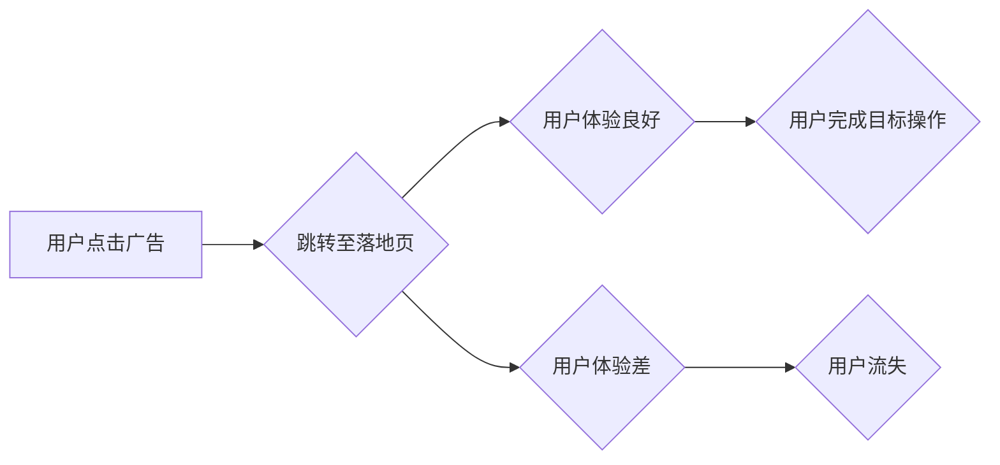

                 

## 程序员如何打造高转化率的落地页

> 关键词：落地页、转化率、用户体验、A/B测试、数据分析、心理学、设计原则、程序员

## 1. 背景介绍

在互联网时代，一个优秀的落地页是引流转化成功的关键。它承载着用户从广告点击到最终行动的整个旅程，直接影响着企业的营销效果和商业目标达成。然而，许多程序员在设计和开发落地页时，往往过于注重技术实现，而忽略了用户体验、转化率优化等关键因素。

本文将从程序员的角度出发，深入探讨如何打造高转化率的落地页，涵盖用户体验设计、转化率优化策略、数据分析与迭代、以及相关工具和资源推荐等方面，帮助程序员提升落地页的转化能力，为企业带来更大的商业价值。

## 2. 核心概念与联系

### 2.1  落地页是什么？

落地页，也称为目标页，是用户点击广告链接后跳转到的特定页面。其主要目的是引导用户完成预设的目标，例如注册账号、订阅服务、购买商品等。

### 2.2  转化率的定义

转化率是指访问落地页的用户中，完成目标操作的用户比例。例如，如果100个用户访问了落地页，其中20个用户注册了账号，那么转化率为20%。

### 2.3  用户体验与转化率的关系

用户体验（UX）是指用户使用产品或服务时的感受和感知。良好的用户体验可以提升用户满意度，增加用户粘性，最终提高转化率。

**Mermaid 流程图：**



## 3. 核心算法原理 & 具体操作步骤

### 3.1  算法原理概述

打造高转化率的落地页并非依靠特定的算法，而是需要综合运用心理学、用户体验设计、数据分析等多方面知识，通过不断优化页面结构、内容、设计等元素，提升用户体验，引导用户完成目标操作。

### 3.2  算法步骤详解

1. **明确目标用户和目标行为:** 首先要明确目标用户群体，了解他们的需求、痛点和行为习惯，并设定明确的目标行为，例如注册、购买、下载等。

2. **设计简洁明了的页面结构:** 页面结构要清晰易懂，信息层次分明，引导用户快速找到所需信息并完成目标操作。

3. **突出核心价值主张:** 页面要突出产品的核心价值主张，用简洁明了的语言描述产品的优势和用户价值，吸引用户关注。

4. **使用高质量的视觉元素:** 页面要使用高质量的图片、视频、图标等视觉元素，提升页面美观度和吸引力，增强用户体验。

5. **优化用户交互体验:** 页面要设计流畅的用户交互体验，例如按钮位置、表单填写等，减少用户操作难度，提高用户完成目标操作的意愿。

6. **进行A/B测试和数据分析:** 通过A/B测试，对比不同页面设计方案的效果，收集用户行为数据，分析用户偏好，不断优化页面，提升转化率。

### 3.3  算法优缺点

* **优点:** 

    * 针对性强，可以根据目标用户和目标行为进行个性化优化。
    * 数据驱动，通过数据分析不断优化页面，提升转化率。
    * 可持续改进，可以不断迭代优化页面，保持竞争力。

* **缺点:** 

    * 需要投入时间和精力进行页面设计、测试和分析。
    * 需要一定的专业知识和技能，例如用户体验设计、数据分析等。

### 3.4  算法应用领域

* **电商:** 提高商品转化率，促进销售。
* **科技:** 提升软件注册、下载、付费转化率。
* **教育:** 提高在线课程报名、付费转化率。
* **金融:** 提升金融产品申请、投资转化率。

## 4. 数学模型和公式 & 详细讲解 & 举例说明

### 4.1  数学模型构建

转化率可以看作是一个概率模型，可以用以下公式表示：

$$
转化率 = \frac{目标操作完成的用户数}{访问落地页的用户数}
$$

其中：

* 目标操作完成的用户数：完成预设目标操作的用户数量。
* 访问落地页的用户数：访问落地页的用户总数量。

### 4.2  公式推导过程

该公式的推导过程非常简单，就是将目标操作完成的用户数除以访问落地页的用户数，得到一个比例，表示用户完成目标操作的概率，即转化率。

### 4.3  案例分析与讲解

假设一个电商平台的落地页访问量为1000人，其中200人完成了购买操作，那么该落地页的转化率为：

$$
转化率 = \frac{200}{1000} = 0.2 = 20\%
$$

## 5. 项目实践：代码实例和详细解释说明

### 5.1  开发环境搭建

* 操作系统：Windows/macOS/Linux
* 编程语言：Python
* Web框架：Flask/Django
* 数据库：MySQL/PostgreSQL

### 5.2  源代码详细实现

以下是一个使用Python Flask框架实现简单落地页的代码示例：

```python
from flask import Flask, render_template

app = Flask(__name__)

@app.route('/')
def index():
    return render_template('index.html')

if __name__ == '__main__':
    app.run(debug=True)
```

**index.html:**

```html
<!DOCTYPE html>
<html>
<head>
    <title>落地页示例</title>
</head>
<body>
    <h1>欢迎来到我们的落地页！</h1>
    <p>这里是我们的产品介绍和价值主张。</p>
    <button>立即注册</button>
</body>
</html>
```

### 5.3  代码解读与分析

* 代码首先定义了一个Flask应用实例。
* `@app.route('/')`装饰器定义了根路径的路由规则，当访问根路径时，会调用`index()`函数。
* `index()`函数渲染`index.html`模板文件。
* `index.html`是一个简单的HTML页面，包含标题、产品介绍和注册按钮。

### 5.4  运行结果展示

运行上述代码，访问`http://127.0.0.1:5000/`，即可看到简单的落地页。

## 6. 实际应用场景

### 6.1  电商平台

电商平台可以利用落地页引导用户完成购买操作，例如：

* 产品详情页：展示产品信息、图片、评价等，引导用户点击购买按钮。
* 促销活动页：宣传促销活动，引导用户领取优惠券、参与抽奖等。
* 会员注册页：引导用户注册会员，享受会员专属优惠。

### 6.2  科技公司

科技公司可以利用落地页提升软件注册、下载、付费转化率，例如：

* 软件下载页：展示软件功能、截图、用户评价等，引导用户下载安装。
* 试用版页面：提供试用版体验，引导用户升级付费版。
* 在线文档页：提供软件使用文档、教程等，引导用户深入了解软件功能。

### 6.3  教育机构

教育机构可以利用落地页提升在线课程报名、付费转化率，例如：

* 课程介绍页：展示课程内容、讲师介绍、学习成果等，引导用户报名学习。
* 优惠活动页：宣传课程优惠活动，引导用户报名学习。
* 课程评论页：展示学员对课程的评价，提升用户信任度。

### 6.4  未来应用展望

随着人工智能、大数据等技术的不断发展，落地页将更加智能化、个性化。未来，落地页将能够根据用户的行为、偏好、需求等信息，动态调整页面内容和设计，提供更精准的营销服务，提升转化率。

## 7. 工具和资源推荐

### 7.1  学习资源推荐

* **书籍:**

    * 《Don't Make Me Think》 by Steve Krug
    * 《The Design of Everyday Things》 by Don Norman
    * 《Hooked》 by Nir Eyal

* **网站:**

    * Nielsen Norman Group: https://www.nngroup.com/
    * UX Collective: https://uxdesign.cc/
    * Smashing Magazine: https://www.smashingmagazine.com/

### 7.2  开发工具推荐

* **页面设计工具:**

    * Figma: https://www.figma.com/
    * Adobe XD: https://www.adobe.com/products/xd.html
    * Sketch: https://www.sketch.com/

* **A/B测试工具:**

    * Optimizely: https://www.optimizely.com/
    * Google Optimize: https://optimize.google.com/
    * VWO: https://vwo.com/

### 7.3  相关论文推荐

* **《The Psychology of Persuasion》 by Robert Cialdini**
* **《Designing for Emotion》 by Aarron Walter**
* **《Lean UX》 by Jeff Gothelf and Josh Seiden**

## 8. 总结：未来发展趋势与挑战

### 8.1  研究成果总结

本文探讨了程序员如何打造高转化率的落地页，涵盖了用户体验设计、转化率优化策略、数据分析与迭代、以及相关工具和资源推荐等方面。

### 8.2  未来发展趋势

* **人工智能驱动的个性化落地页:** 利用人工智能技术，根据用户的行为、偏好、需求等信息，动态调整页面内容和设计，提供更精准的营销服务。
* **沉浸式体验的落地页:** 利用VR/AR等技术，打造更沉浸式的落地页体验，提升用户参与度和转化率。
* **跨平台的落地页:** 

落地页将不再局限于网页，而是跨平台呈现，例如移动端、微信小程序、社交媒体平台等。

### 8.3  面临的挑战

* **数据隐私保护:** 在收集和使用用户数据时，需要严格遵守数据隐私保护法规，保障用户权益。
* **技术复杂性:** 实现人工智能驱动的个性化落地页、沉浸式体验的落地页等，需要克服技术上的挑战。
* **用户体验的衡量:** 如何准确衡量用户体验，并将其与转化率进行关联，仍然是一个挑战。

### 8.4  研究展望

未来，我们将继续深入研究落地页的设计、开发和优化，探索更先进的技术和方法，打造更智能化、个性化、沉浸式的落地页体验，为企业带来更大的商业价值。

## 9. 附录：常见问题与解答

### 9.1  如何提高落地页的转化率？

* **明确目标用户和目标行为:** 

了解目标用户群体，设定明确的目标行为。
* **设计简洁明了的页面结构:** 页面结构要清晰易懂，信息层次分明。
* **突出核心价值主张:** 页面要突出产品的核心价值主张，用简洁明了的语言描述产品的优势和用户价值。
* **使用高质量的视觉元素:** 页面要使用高质量的图片、视频、图标等视觉元素，提升页面美观度和吸引力。
* **优化用户交互体验:** 页面要设计流畅的用户交互体验，例如按钮位置、表单填写等，减少用户操作难度。
* **进行A/B测试和数据分析:** 通过A/B测试，对比不同页面设计方案的效果，收集用户行为数据，分析用户偏好，不断优化页面，提升转化率。

### 9.2  如何进行A/B测试？

A/B测试是指将页面设计方案分成两组，分别展示给不同的用户群体，比较两组用户的转化率，从而确定哪个方案效果更好。

常用的A/B测试工具包括Optimizely、Google Optimize、VWO等。

### 9.3  如何分析用户行为数据？

用户行为数据可以帮助我们了解用户在页面上的行为，例如点击率、停留时间、转化率等。

常用的数据分析工具包括Google Analytics、Mixpanel等。

作者：禅与计算机程序设计艺术 / Zen and the Art of Computer Programming


<end_of_turn>

