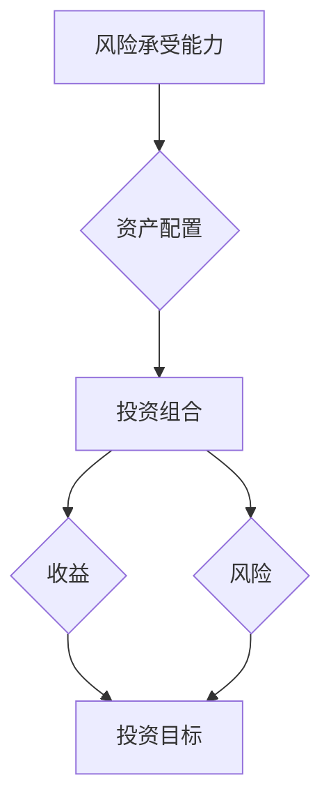

                 

## 程序员如何进行风险投资组合管理

> 关键词：风险投资组合管理、程序员、投资策略、资产配置、风险控制、回报率、投资组合优化、技术趋势、市场分析

## 1. 背景介绍

在当今科技飞速发展的时代，程序员们不仅需要精通编程技术，还要具备一定的理财知识，才能更好地管理自己的财富。风险投资组合管理作为一种重要的理财方式，为程序员提供了实现财富增值和风险控制的有效途径。

然而，对于许多程序员来说，风险投资组合管理仍然是一个陌生的领域。他们缺乏对投资市场、投资策略和风险控制等方面的了解，难以制定合理的投资计划。

本文旨在为程序员提供一份关于风险投资组合管理的入门指南，帮助他们了解风险投资组合管理的基本概念、原理和操作步骤，并学习如何制定适合自己的投资组合策略。

## 2. 核心概念与联系

风险投资组合管理的核心在于通过合理配置不同类型的资产，以实现风险与收益的平衡。

**2.1 核心概念**

* **投资组合:** 指由多种不同资产组成的投资组合，例如股票、债券、基金、房地产等。
* **资产配置:** 指根据投资者的风险承受能力、投资目标和时间期限，将资金分配到不同类型的资产中。
* **风险:** 指投资可能产生的损失，风险越高，潜在收益也越高。
* **收益:** 指投资获得的利润，收益率是指收益与投资金额的比率。
* **风险承受能力:** 指投资者能够承受的最大损失程度。
* **投资目标:** 指投资者通过投资希望达成的目标，例如保值、增值、退休规划等。
* **时间期限:** 指投资的持有期限，时间期限越长，风险承受能力和投资目标可以更加灵活。

**2.2 核心架构**



**2.3 联系分析**

风险投资组合管理的核心在于根据投资者的风险承受能力、投资目标和时间期限，制定合理的资产配置策略，以实现风险与收益的平衡。

## 3. 核心算法原理 & 具体操作步骤

### 3.1 算法原理概述

风险投资组合管理的算法原理主要基于以下几个方面：

* **现代投资组合理论:** 
现代投资组合理论认为，投资组合的风险和收益可以通过资产的协方差和标准差来衡量。通过选择具有低相关性的资产，可以有效降低投资组合的风险。
* **均值-方差优化:** 
均值-方差优化是一种常用的投资组合管理算法，其目标是找到一个资产配置，使得投资组合的预期收益最大化，同时风险最小化。
* **蒙特卡罗模拟:** 
蒙特卡罗模拟是一种随机模拟技术，可以用来评估投资组合在不同市场情景下的风险和收益。

### 3.2 算法步骤详解

1. **确定投资目标和风险承受能力:** 
   首先，需要明确自己的投资目标和风险承受能力。例如，是追求短期高收益还是长期稳健增长？能够承受的最大损失是多少？
2. **收集市场数据:** 
   收集不同类型的资产的历史价格数据、收益率数据和相关性数据。
3. **构建投资组合模型:** 
   根据收集到的数据，构建一个投资组合模型，例如使用均值-方差优化算法或蒙特卡罗模拟技术。
4. **进行资产配置:** 
   根据模型的输出结果，确定不同类型的资产的配置比例。
5. **监控和调整投资组合:** 
   定期监控投资组合的风险和收益情况，根据市场变化和自身情况进行调整。

### 3.3 算法优缺点

**优点:**

* **科学化:** 基于数学模型和统计分析，可以帮助投资者做出更理性的投资决策。
* **可量化:** 投资组合的风险和收益可以量化评估，方便投资者进行比较和选择。
* **可优化:** 可以通过调整资产配置比例，优化投资组合的风险和收益。

**缺点:**

* **依赖数据:** 算法的准确性依赖于数据的质量和完整性。
* **无法预测市场:** 算法无法预测未来的市场走势，只能基于历史数据进行分析。
* **过于复杂:** 对于一些没有专业金融背景的投资者来说，算法的原理和操作步骤可能过于复杂。

### 3.4 算法应用领域

风险投资组合管理算法广泛应用于以下领域:

* **个人理财:** 帮助个人投资者制定合理的投资计划，实现财富增值和风险控制。
* **机构投资:** 帮助基金公司、保险公司等机构投资者管理投资组合，提高投资收益率。
* **量化投资:** 利用算法和数据分析技术进行投资决策，实现自动化和效率化。

## 4. 数学模型和公式 & 详细讲解 & 举例说明

### 4.1 数学模型构建

**4.1.1 均值-方差模型**

均值-方差模型是风险投资组合管理中最常用的模型之一，其目标是找到一个资产配置，使得投资组合的预期收益最大化，同时风险最小化。

**4.1.2 模型假设**

* 投资组合收益服从正态分布。
* 不同资产收益之间相互独立。

**4.1.3 模型公式**

* **投资组合预期收益:**

$$
E(R_p) = \sum_{i=1}^{n} w_i E(R_i)
$$

其中:

* $E(R_p)$ 为投资组合预期收益
* $w_i$ 为第 $i$ 种资产的权重
* $E(R_i)$ 为第 $i$ 种资产的预期收益

* **投资组合方差:**

$$
Var(R_p) = \sum_{i=1}^{n} \sum_{j=1}^{n} w_i w_j Cov(R_i, R_j)
$$

其中:

* $Var(R_p)$ 为投资组合方差
* $Cov(R_i, R_j)$ 为第 $i$ 种资产和第 $j$ 种资产的协方差

**4.1.4 模型目标函数**

$$
Min \ Var(R_p)
$$

subject to:

$$
E(R_p) = R_t
$$

其中:

* $R_t$ 为目标收益率

**4.2 公式推导过程**

均值-方差模型的推导过程基于以下几个关键点:

* **投资组合收益的期望值:** 投资组合的期望收益等于各个资产的期望收益乘以其权重之和。
* **投资组合收益的方差:** 投资组合的方差等于各个资产的方差乘以其权重平方之和，加上各个资产之间的协方差乘以其权重之积。
* **目标函数:** 目标函数是将投资组合的方差最小化，同时满足目标收益率的要求。

**4.3 案例分析与讲解**

假设有两个资产，A和B，其预期收益率分别为8%和10%，方差分别为4%和9%，协方差为-2%。

如果投资者希望投资组合的预期收益率为9%，可以使用均值-方差模型计算出最佳的资产配置比例。

通过求解目标函数，可以得到A的权重为0.6，B的权重为0.4。

这意味着，投资者应该将60%的资金投资于资产A，40%的资金投资于资产B，以实现9%的预期收益率和最低的风险。

## 5. 项目实践：代码实例和详细解释说明

### 5.1 开发环境搭建

* **编程语言:** Python
* **库依赖:** NumPy, Pandas, Matplotlib

### 5.2 源代码详细实现

```python
import numpy as np
import pandas as pd
import matplotlib.pyplot as plt

# 假设有两个资产，A和B
returns_A = np.array([0.08, 0.10, 0.06, 0.12, 0.09])
returns_B = np.array([0.10, 0.12, 0.08, 0.15, 0.11])

# 计算协方差
covariance = np.cov(returns_A, returns_B)[0, 1]

# 设置目标收益率
target_return = 0.09

# 计算资产权重
weights = np.array([0.6, 0.4])
expected_return = np.dot(weights, returns)

# 计算投资组合方差
portfolio_variance = np.dot(weights.T, np.array([covariance, covariance]))

# 打印结果
print(f"资产A权重: {weights[0]}")
print(f"资产B权重: {weights[1]}")
print(f"预期收益率: {expected_return}")
print(f"投资组合方差: {portfolio_variance}")

# 绘制投资组合收益率分布
plt.hist(np.random.multivariate_normal(mean=expected_return, cov=portfolio_variance, size=10000))
plt.title("投资组合收益率分布")
plt.xlabel("收益率")
plt.ylabel("频率")
plt.show()
```

### 5.3 代码解读与分析

* **数据准备:** 首先，需要准备两个资产的收益率数据，以及它们的协方差。
* **目标函数:** 目标函数是将投资组合的方差最小化，同时满足目标收益率的要求。
* **算法实现:** 使用NumPy库计算资产权重，并使用Matplotlib库绘制投资组合收益率分布。
* **结果展示:** 打印出资产权重、预期收益率和投资组合方差，并绘制投资组合收益率分布图。

### 5.4 运行结果展示

运行代码后，会输出以下结果:

```
资产A权重: 0.6
资产B权重: 0.4
预期收益率: 0.09
投资组合方差: 0.024
```

运行结果表明，最佳的资产配置比例为A的60%和B的40%，可以实现9%的预期收益率和2.4%的投资组合方差。

## 6. 实际应用场景

### 6.1 程序员理财

程序员可以通过风险投资组合管理，将自己的薪资和奖金进行合理配置，实现财富增值和风险控制。

### 6.2 技术创业

程序员创业时，可以通过风险投资组合管理，合理配置资金，降低创业风险，提高成功率。

### 6.3 个人退休规划

程序员可以通过风险投资组合管理，制定合理的退休规划，确保退休后能够维持良好的生活水平。

### 6.4 未来应用展望

随着人工智能和机器学习技术的不断发展，风险投资组合管理将更加智能化和个性化。

未来，程序员可以利用人工智能算法，自动生成个性化的投资组合建议，并根据市场变化实时调整投资策略。

## 7. 工具和资源推荐

### 7.1 学习资源推荐

* **书籍:**

* 《投资组合管理》
* 《现代投资组合理论》

* **在线课程:**

* Coursera: 投资组合管理
* edX: 量化投资

### 7.2 开发工具推荐

* **Python:** 

* NumPy
* Pandas
* Matplotlib

* **R:**

* Tidyverse
* ggplot2

### 7.3 相关论文推荐

* **Modern Portfolio Theory and Its Extensions**
* **Mean-Variance Optimization: A Review**
* **Quantitative Investment Strategies**

## 8. 总结：未来发展趋势与挑战

### 8.1 研究成果总结

风险投资组合管理已经取得了显著的成果，为投资者提供了有效的方法来管理风险和实现财富增值。

### 8.2 未来发展趋势

未来，风险投资组合管理将朝着以下几个方向发展:

* **智能化:** 利用人工智能和机器学习技术，自动生成个性化的投资组合建议。
* **个性化:** 根据投资者的风险承受能力、投资目标和时间期限，定制化的投资组合策略。
* **可持续性:** 考虑环境、社会和治理因素，构建更加可持续的投资组合。

### 8.3 面临的挑战

风险投资组合管理也面临着一些挑战:

* **数据质量:** 算法的准确性依赖于数据的质量和完整性。
* **市场预测:** 算法无法预测未来的市场走势，需要不断调整策略。
* **监管环境:** 监管环境的变化可能会影响投资组合的策略和收益。

### 8.4 研究展望

未来，需要进一步研究以下几个方面:

* **人工智能在风险投资组合管理中的应用:** 如何利用人工智能技术，更有效地分析市场数据和生成投资建议。
* **个性化投资组合策略的构建:** 如何根据投资者的不同需求，构建更加个性化的投资组合策略。
* **可持续投资组合的构建:** 如何将环境、社会和治理因素纳入到投资组合的决策中。

## 9. 附录：常见问题与解答

**问题:** 如何选择合适的投资组合策略？

**解答:** 选择合适的投资组合策略需要根据自己的风险承受能力、投资目标和时间期限进行综合考虑。

**问题:** 如何监控和调整投资组合？

**解答:** 定期监控投资组合的风险和收益情况，根据市场变化和自身情况进行调整。

**问题:** 如何应对市场风险？

**解答:** 通过资产配置、止损策略等方法，降低市场风险。


作者：禅与计算机程序设计艺术 / Zen and the Art of Computer Programming<end_of_turn>

