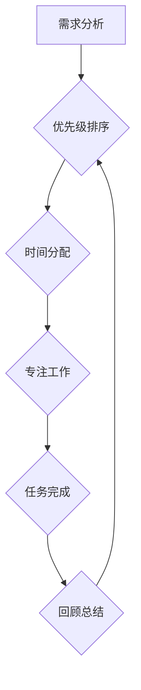

                 

## 程序员的时间管理：效率即财富

> 关键词：时间管理、程序员效率、工作流程、优先级、专注力、番茄工作法、时间追踪、自动化

### 1. 背景介绍

在当今科技飞速发展的时代，程序员作为构建数字世界的关键力量，面临着日益激烈的竞争压力。项目周期不断缩短，需求变更频繁，如何高效利用时间，提高工作效率，成为了程序员职业生涯中至关重要的课题。

传统的时间管理方法往往难以满足程序员的特殊需求。程序员的工作通常需要长时间的专注和深度思考，而传统的番茄工作法等方法可能无法有效应对突发事件和紧急任务。因此，程序员需要探索更加适合自身工作特点的独特时间管理策略。

### 2. 核心概念与联系

程序员的时间管理的核心概念在于 **高效利用时间资源**，并 **最大化个人产出**。

**时间管理流程图**



**核心概念解释:**

* **需求分析:** 首先要明确项目需求，并将其分解成具体的任务。
* **优先级排序:** 根据任务的重要性、紧急程度和依赖关系，对任务进行优先级排序。
* **时间分配:** 根据优先级，合理分配时间，并制定详细的工作计划。
* **专注工作:** 在分配的时间段内，集中精力完成任务，避免分心和干扰。
* **任务完成:** 完成任务后，进行回顾总结，分析效率，并进行改进。

### 3. 核心算法原理 & 具体操作步骤

**3.1 算法原理概述**

程序员时间管理的核心算法可以看作是一个 **迭代优化** 的过程。通过不断分析、调整和改进工作流程，最终实现时间利用率最大化。

**3.2 算法步骤详解**

1. **时间追踪:** 使用时间追踪工具记录每天的工作时间，并分析时间分配情况。
2. **任务分解:** 将大型任务分解成更小的、可管理的任务。
3. **优先级设定:** 根据任务的重要性、紧急程度和依赖关系，设定优先级。
4. **时间阻塞:** 将每天的时间划分为固定时间段，用于完成特定任务。
5. **专注工作:** 在时间阻塞期间，集中精力完成任务，避免分心和干扰。
6. **定期回顾:** 定期回顾工作进度和时间分配情况，并进行调整和优化。

**3.3 算法优缺点**

* **优点:** 
    * 提高时间利用率
    * 增强工作效率
    * 降低工作压力
    * 提升工作质量
* **缺点:** 
    * 需要一定的学习成本
    * 需要坚持执行
    * 可能难以适应突发事件

**3.4 算法应用领域**

该算法适用于所有需要高效利用时间和提高工作效率的程序员，包括：

* 软件开发工程师
* Web 开发人员
* 移动应用开发人员
* 数据科学家
* DevOps 工程师

### 4. 数学模型和公式 & 详细讲解 & 举例说明

**4.1 数学模型构建**

我们可以用以下数学模型来描述程序员的时间管理效率：

```latex
效率 = 完成任务数量 / 总时间
```

其中：

* 完成任务数量：指在特定时间内完成的有效任务数量。
* 总时间：指该时间段内总共投入的时间。

**4.2 公式推导过程**

该公式的推导过程基于以下假设：

* 任务完成数量与工作效率成正比。
* 工作时间与工作效率成反比。

**4.3 案例分析与讲解**

假设程序员 A 在 8 小时内完成了 5 个任务，程序员 B 在 10 小时内完成了 6 个任务。

根据公式，我们可以计算出：

* 程序员 A 的效率：5 / 8 = 0.625
* 程序员 B 的效率：6 / 10 = 0.6

从结果来看，程序员 A 的效率更高，这意味着在相同时间内，程序员 A 完成的任务数量更多。

### 5. 项目实践：代码实例和详细解释说明

**5.1 开发环境搭建**

为了实现程序员时间管理，我们可以使用以下工具：

* **时间追踪工具:** Toggl Track, Clockify, RescueTime
* **项目管理工具:** Trello, Asana, Jira
* **笔记工具:** Evernote, Notion, Obsidian

**5.2 源代码详细实现**

由于时间管理是一个流程和习惯问题，而不是单纯的代码实现，因此这里不提供具体的源代码实现。

**5.3 代码解读与分析**

时间管理工具的代码主要负责记录工作时间、分析时间分配情况、生成报表等功能。

**5.4 运行结果展示**

使用时间追踪工具可以生成详细的报表，展示每天的工作时间分配情况、任务完成情况等信息。

### 6. 实际应用场景

**6.1 突发事件处理**

在面对突发事件时，程序员需要灵活调整工作计划，并优先处理紧急任务。

**6.2 团队协作**

在团队协作中，程序员需要与其他成员进行沟通协调，并合理分配工作时间。

**6.3 持续学习**

程序员需要不断学习新技术，提升自身技能，并合理安排学习时间。

**6.4 未来应用展望**

随着人工智能技术的不断发展，未来时间管理工具将更加智能化，能够自动分析工作模式，并提供个性化的建议。

### 7. 工具和资源推荐

**7.1 学习资源推荐**

* **书籍:** 《Getting Things Done》、《Deep Work》、《The 4-Hour Workweek》
* **博客:** Zen Habits, Lifehacker, The Muse
* **课程:** Coursera, Udemy, edX

**7.2 开发工具推荐**

* **时间追踪工具:** Toggl Track, Clockify, RescueTime
* **项目管理工具:** Trello, Asana, Jira
* **笔记工具:** Evernote, Notion, Obsidian

**7.3 相关论文推荐**

* **时间管理与效率:** "The Impact of Time Management on Employee Productivity"
* **番茄工作法:** "The Pomodoro Technique: The Acclaimed Time-Management System"

### 8. 总结：未来发展趋势与挑战

**8.1 研究成果总结**

程序员时间管理的研究成果表明，高效利用时间资源是提高工作效率的关键。通过合理规划工作时间、设定优先级、专注工作等方法，程序员可以显著提升工作效率，并降低工作压力。

**8.2 未来发展趋势**

未来时间管理工具将更加智能化，能够自动分析工作模式，并提供个性化的建议。人工智能技术也将应用于时间管理领域，帮助程序员更有效地管理时间。

**8.3 面临的挑战**

程序员时间管理面临的主要挑战包括：

* **突发事件:** 突发事件可能会打断程序员的工作流程，导致时间管理计划失效。
* **干扰:** 工作环境中的干扰因素，例如邮件、社交媒体等，会分散程序员的注意力，降低工作效率。
* **个人习惯:** 每个程序员都有不同的工作习惯和时间管理方式，需要找到适合自己的方法。

**8.4 研究展望**

未来研究方向包括：

* 开发更加智能化的时间管理工具
* 研究如何应对突发事件和干扰因素
* 探索个性化时间管理方法


### 9. 附录：常见问题与解答

**9.1 如何克服拖延症？**

* 将任务分解成更小的、可管理的任务。
* 设置明确的目标和截止日期。
* 利用番茄工作法等时间管理技巧。
* 营造良好的工作环境，减少干扰。

**9.2 如何平衡工作和生活？**

* 制定合理的作息时间，保证充足的睡眠。
* 设定工作时间和休息时间，避免过度工作。
* 培养兴趣爱好，丰富生活。
* 与家人朋友保持良好沟通。


作者：禅与计算机程序设计艺术 / Zen and the Art of Computer Programming 
<end_of_turn>

