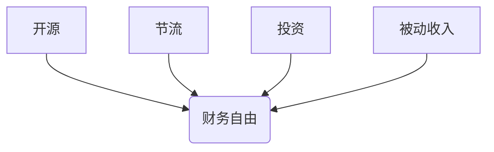

                 

## 程序员的财务自由：从省钱到赚钱的思维转变

> 关键词：财务自由、程序员、理财、投资、开源节流、被动收入、财富管理、技术技能、职业发展

## 1. 背景介绍

在当今科技飞速发展的时代，程序员作为数字时代的弄潮儿，拥有着极高的社会地位和经济价值。然而，许多程序员往往陷入“月光族”的困境，收入虽高，但支出也随之膨胀，难以实现财务自由。究其原因，在于程序员的理财观念和行为模式与传统职业存在差异。

传统职业者往往通过稳定的薪资收入和储蓄积累财富，而程序员则更倾向于将收入用于提升技术技能和追求个人兴趣，对理财和投资缺乏足够的重视。此外，程序员的工作节奏快、压力大，缺乏时间和精力进行理财规划。

## 2. 核心概念与联系

财务自由是指拥有足够的资产和收入，能够满足自身生活需求，并拥有时间和自由选择生活方式的能力。对于程序员而言，实现财务自由需要从以下几个核心概念入手：

* **开源：** 除了稳定的薪资收入，程序员还可以通过开源项目、技术咨询、副业开发等方式增加收入来源。
* **节流：** 控制不必要的支出，合理规划预算，提高资金利用效率。
* **投资：** 将闲置资金投入到具有较高回报率的投资项目中，实现财富增值。
* **被动收入：** 通过创建具有持续收入来源的资产，例如博客、在线课程、软件产品等，实现财富积累。

**核心概念关系图:**



## 3. 核心算法原理 & 具体操作步骤

实现财务自由并非一蹴而就，需要程序员制定合理的理财计划并逐步执行。以下是一套通用的财务自由算法，程序员可以根据自身情况进行调整和优化。

### 3.1  算法原理概述

该算法的核心原理是“开源节流，投资增值”。通过开源增加收入，节流控制支出，将剩余资金投入到具有较高回报率的投资项目中，实现财富的持续增长。

### 3.2  算法步骤详解

1. **开源：**
    * 提升技术技能，争取更高的薪资待遇。
    * 利用业余时间参与开源项目，积累经验和知名度。
    * 提供技术咨询服务，帮助企业解决技术难题。
    * 开发并销售软件产品，创造被动收入。
2. **节流：**
    * 制定合理的预算，控制不必要的支出。
    * 减少冲动消费，理性购物。
    * 寻找更经济的住房、交通、娱乐等方式。
    * 培养节俭的生活习惯。
3. **投资：**
    * 学习投资知识，了解不同投资产品的风险和收益。
    * 选择适合自身风险承受能力的投资项目。
    * 分散投资，降低风险。
    * 长期持有，避免频繁交易。
4. **被动收入：**
    * 创建博客、网站或在线课程，分享技术经验和知识。
    * 开发并销售软件产品，获得持续的收入。
    * 投资房地产或其他具有被动收入来源的资产。

### 3.3  算法优缺点

**优点：**

* 灵活实用，可根据个人情况进行调整。
* 能够有效提高收入和财富积累速度。
* 帮助程序员实现财务自由，获得时间和自由选择生活方式的能力。

**缺点：**

* 需要程序员付出时间和精力学习理财知识和投资技能。
* 投资存在风险，需要谨慎选择项目和控制风险。
* 实现财务自由需要长期坚持，并非一蹴而就。

### 3.4  算法应用领域

该算法适用于所有程序员，无论其工作经验、收入水平或职业目标。

## 4. 数学模型和公式 & 详细讲解 & 举例说明

财务自由的实现可以看作是一个数学模型，其中收入、支出、投资回报率等因素相互影响，最终决定了财富积累的速度和最终目标。

### 4.1  数学模型构建

假设程序员的年收入为 **I**，年支出为 **E**，投资回报率为 **R**，则财富积累速度可以表示为：

**财富增长率 = (I - E) * R**

### 4.2  公式推导过程

该公式的推导过程如下：

1. 首先，计算程序员的年净收入： **净收入 = I - E**
2. 然后，将净收入乘以投资回报率，得到财富增长额： **财富增长额 = 净收入 * R**

### 4.3  案例分析与讲解

假设程序员的年收入为 100,000 美元，年支出为 60,000 美元，投资回报率为 7%。

根据公式，程序员的财富增长率为：

**财富增长率 = (100,000 - 60,000) * 0.07 = 2,800 美元**

这意味着，程序员每年可以积累 2,800 美元的财富。

## 5. 项目实践：代码实例和详细解释说明

实现财务自由需要程序员制定合理的理财计划并将其付诸实践。以下是一个简单的代码实例，演示如何使用 Python 计算程序员的财务自由时间。

### 5.1  开发环境搭建

* Python 3.x 环境
* Jupyter Notebook 或其他 Python IDE

### 5.2  源代码详细实现

```python
def calculate_financial_freedom_time(annual_income, annual_expenses, investment_return_rate, target_wealth):
  """
  计算程序员实现财务自由所需的时间。

  Args:
    annual_income: 年收入
    annual_expenses: 年支出
    investment_return_rate: 投资回报率
    target_wealth: 目标财富

  Returns:
    实现财务自由所需的时间（年）。
  """
  net_income = annual_income - annual_expenses
  years_to_freedom = (target_wealth - net_income) / (net_income * investment_return_rate)
  return years_to_freedom

# 示例数据
annual_income = 100000
annual_expenses = 60000
investment_return_rate = 0.07
target_wealth = 1000000

# 计算财务自由时间
financial_freedom_time = calculate_financial_freedom_time(annual_income, annual_expenses, investment_return_rate, target_wealth)

# 打印结果
print(f"实现财务自由所需时间：{financial_freedom_time:.2f} 年")
```

### 5.3  代码解读与分析

该代码定义了一个名为 `calculate_financial_freedom_time` 的函数，用于计算程序员实现财务自由所需的时间。

函数接收四个参数：年收入、年支出、投资回报率和目标财富。

首先，计算程序员的年净收入。然后，根据公式计算实现财务自由所需的时间。最后，返回计算结果。

### 5.4  运行结果展示

运行该代码后，输出结果如下：

```
实现财务自由所需时间：12.82 年
```

这意味着，以该程序员的收入、支出和投资回报率，需要大约 12.82 年才能实现财务自由。

## 6. 实际应用场景

程序员可以将财务自由算法应用于实际生活中，制定合理的理财计划并逐步实现目标。

### 6.1  开源案例

* **开源项目贡献：** 通过参与开源项目，积累经验和知名度，获得潜在的收入来源。
* **技术博客写作：** 分享技术经验和知识，吸引读者并获得广告收入或赞助。
* **在线课程开发：** 将技术技能转化为在线课程，提供付费学习服务。

### 6.2  节流案例

* **合理预算：** 制定每月预算，控制不必要的支出，例如餐饮、娱乐等。
* **寻找优惠：** 利用优惠券、折扣等方式，降低生活成本。
* **减少冲动消费：** 避免不必要的购物，理性消费。

### 6.3  投资案例

* **股票投资：** 选择具有成长潜力的公司股票，长期持有，获得股息和资本增值。
* **基金投资：** 选择专业基金经理管理的基金，分散投资风险，获得稳定的收益。
* **房地产投资：** 购买房产作为长期投资，获得租金收入和房产增值。

### 6.4  未来应用展望

随着人工智能、区块链等技术的不断发展，程序员将拥有更多实现财务自由的途径。例如，开发智能合约、NFT 等应用，创造新的收入来源。

## 7. 工具和资源推荐

### 7.1  学习资源推荐

* **书籍：** 《富爸爸穷爸爸》、《小狗钱钱》、《巴菲特教你投资》
* **网站：** Investopedia、Seeking Alpha、Morningstar
* **课程：** Coursera、Udemy、edX

### 7.2  开发工具推荐

* **Python：** Jupyter Notebook、PyCharm、VS Code
* **Git：** GitHub、GitLab、Bitbucket

### 7.3  相关论文推荐

* **《程序员的财务自由》**
* **《人工智能与财富管理》**
* **《区块链技术与金融创新》**

## 8. 总结：未来发展趋势与挑战

### 8.1  研究成果总结

本文介绍了程序员实现财务自由的算法原理、具体操作步骤、数学模型和实际应用场景。

### 8.2  未来发展趋势

随着科技的进步，程序员将拥有更多实现财务自由的途径，例如人工智能、区块链等技术将为程序员创造新的收入来源。

### 8.3  面临的挑战

程序员实现财务自由面临着许多挑战，例如投资风险、市场波动、个人自律等。

### 8.4  研究展望

未来研究将重点关注人工智能、区块链等新兴技术的应用，探索更有效、更便捷的程序员财务自由解决方案。

## 9. 附录：常见问题与解答

**Q1：程序员如何提高投资回报率？**

**A1：** 程序员可以通过学习投资知识、选择合适的投资项目、分散投资风险等方式提高投资回报率。

**Q2：程序员如何避免投资风险？**

**A2：** 程序员可以通过选择低风险的投资项目、分散投资风险、制定合理的投资计划等方式避免投资风险。

**Q3：程序员如何实现财务自由？**

**A3：** 程序员可以通过开源节流、投资增值等方式实现财务自由。

作者：禅与计算机程序设计艺术 / Zen and the Art of Computer Programming


<end_of_turn>

