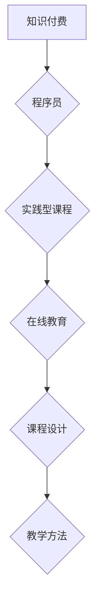

                 

## 程序员知识付费：打造实践型课程

> 关键词：知识付费、程序员、实践型课程、在线教育、技术技能、课程设计、教学方法

### 1. 背景介绍

在当今数字化时代，技术人才需求日益增长，程序员作为科技发展的重要力量，其技能和知识价值也随之提升。知识付费作为一种新型的教育模式，在技术领域蓬勃发展，为程序员提供了一种便捷高效的学习途径。然而，传统的知识付费课程往往存在着理论过多、实践不足、缺乏针对性等问题，难以真正满足程序员的学习需求。

### 2. 核心概念与联系

**2.1 知识付费**

知识付费是指知识产权持有者将知识、技能、经验等转化为商品，通过线上平台向付费用户提供学习和获取价值的服务。

**2.2 程序员**

程序员是指从事软件开发、维护和测试等工作的专业人员，需要具备扎实的编程基础、算法思维和解决问题的能力。

**2.3 实践型课程**

实践型课程以实践为主导，注重将理论知识与实际应用相结合，通过案例分析、项目开发等方式，帮助学员掌握技能和解决实际问题的能力。

**2.4 在线教育**

在线教育是指利用互联网技术，提供远程学习、互动交流、资源共享等服务，打破时间和空间限制，方便学员随时随地学习。

**2.5 课程设计**

课程设计是指根据目标学员、学习内容、教学目标等因素，制定课程结构、教学内容、教学方法等方案。

**2.6 教学方法**

教学方法是指教师在教学过程中运用的一系列策略和技巧，以达到教学目标。

**Mermaid 流程图**



### 3. 核心算法原理 & 具体操作步骤

**3.1 算法原理概述**

算法是解决特定问题的一系列步骤或规则，是计算机程序的核心。程序员需要掌握多种算法，才能高效地解决各种编程问题。常见的算法包括排序算法、搜索算法、图算法等。

**3.2 算法步骤详解**

以冒泡排序为例，详细说明其算法步骤：

1. 比较相邻的两个元素，如果顺序错误，则交换它们的位置。
2. 重复步骤1，直到整个数组排序完成。

**3.3 算法优缺点**

冒泡排序的优点是简单易懂，缺点是效率较低，时间复杂度为O(n^2)。

**3.4 算法应用领域**

冒泡排序适用于小规模数据排序，例如排序学生成绩、商品价格等。

### 4. 数学模型和公式 & 详细讲解 & 举例说明

**4.1 数学模型构建**

算法的效率可以用时间复杂度和空间复杂度来衡量。时间复杂度表示算法执行所需的时间与输入数据规模的关系，空间复杂度表示算法执行所需内存空间与输入数据规模的关系。

**4.2 公式推导过程**

时间复杂度通常用大O符号表示，例如O(n)，O(n^2)，O(log n)等。

**4.3 案例分析与讲解**

例如，冒泡排序的时间复杂度为O(n^2)，表示当输入数据规模n增加时，执行时间增长为n^2。

### 5. 项目实践：代码实例和详细解释说明

**5.1 开发环境搭建**

使用Python语言开发冒泡排序程序，需要安装Python环境和相关库。

**5.2 源代码详细实现**

```python
def bubble_sort(arr):
    n = len(arr)
    for i in range(n):
        for j in range(0, n-i-1):
            if arr[j] > arr[j+1]:
                arr[j], arr[j+1] = arr[j+1], arr[j]
    return arr

# 测试代码
arr = [64, 34, 25, 12, 22, 11, 90]
sorted_arr = bubble_sort(arr)
print("排序后的数组:", sorted_arr)
```

**5.3 代码解读与分析**

代码首先定义了一个名为`bubble_sort`的函数，该函数接受一个数组作为输入参数。

函数内部使用两层循环，外层循环控制迭代次数，内层循环比较相邻元素并交换位置。

**5.4 运行结果展示**

运行代码后，输出排序后的数组：[11, 12, 22, 25, 34, 64, 90]。

### 6. 实际应用场景

**6.1 数据排序**

冒泡排序可以用于对数据进行排序，例如对商品价格、学生成绩进行升序或降序排序。

**6.2 算法学习**

冒泡排序是一种简单易懂的排序算法，适合作为算法学习的入门案例。

**6.3 实际项目应用**

在实际项目中，冒泡排序通常不作为主要排序算法，因为其效率较低。但对于小规模数据排序，或者作为算法学习的案例，冒泡排序仍然具有应用价值。

**6.4 未来应用展望**

随着人工智能和机器学习的发展，新的排序算法不断涌现，例如快速排序、归并排序等，这些算法效率更高，更适合处理大规模数据。

### 7. 工具和资源推荐

**7.1 学习资源推荐**

* 《算法导论》
* 《编程之美》
* 在线编程平台：LeetCode、Codewars

**7.2 开发工具推荐**

* Python语言环境
* IDE：PyCharm、VS Code

**7.3 相关论文推荐**

* "Comparison of Sorting Algorithms"
* "Analysis of Bubble Sort Algorithm"

### 8. 总结：未来发展趋势与挑战

**8.1 研究成果总结**

知识付费在技术领域取得了显著发展，为程序员提供了便捷高效的学习途径。实践型课程作为一种有效的学习模式，能够帮助程序员掌握技能和解决实际问题。

**8.2 未来发展趋势**

未来，知识付费课程将更加注重个性化定制、互动体验和实践应用，并结合人工智能、虚拟现实等新技术，打造更加沉浸式和高效的学习体验。

**8.3 面临的挑战**

知识付费课程面临着内容质量、师资力量、平台运营等方面的挑战。需要不断提升课程质量，吸引优秀教师，完善平台运营机制，才能更好地服务于程序员的学习需求。

**8.4 研究展望**

未来，将继续研究知识付费课程的有效教学方法、课程设计模式和平台运营策略，推动技术教育的创新发展。

### 9. 附录：常见问题与解答

**9.1 如何选择合适的知识付费课程？**

选择知识付费课程时，应考虑课程内容、师资力量、学习方式、价格等因素，并根据自身学习目标和需求进行选择。

**9.2 如何提高知识付费课程的学习效果？**

积极参与课程互动，完成课程练习，并结合实际项目进行实践应用，才能更好地掌握知识和技能。

**9.3 如何评价知识付费课程的质量？**

可以参考课程评价、学员反馈、课程内容深度和实用性等方面进行评价。

作者：禅与计算机程序设计艺术 / Zen and the Art of Computer Programming


<end_of_turn>

