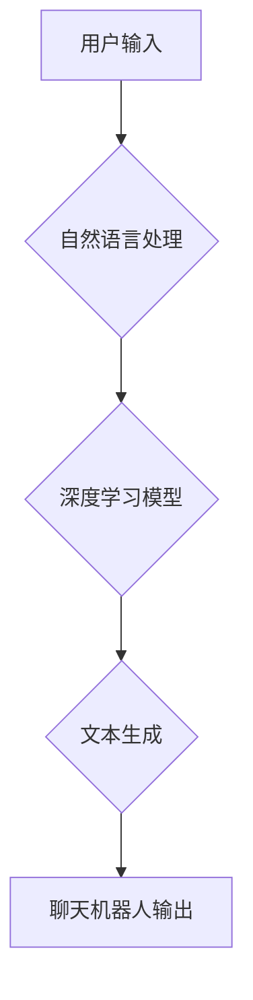

                 

## 第一章：理解聊天机器人的基础

> 关键词：聊天机器人、自然语言处理、深度学习、Transformer、对话系统、文本生成、人工智能

### 1. 背景介绍

聊天机器人，也称为对话机器人，是一种能够与人类进行自然语言交互的计算机程序。近年来，随着人工智能技术的飞速发展，聊天机器人已经从简单的问答系统演变为能够理解复杂语义、进行上下文对话、甚至创作文本的智能实体。它们在各个领域都展现出巨大的应用潜力，例如客服服务、教育培训、娱乐休闲等。

### 2. 核心概念与联系

#### 2.1 自然语言处理 (NLP)

自然语言处理是人工智能领域的一个重要分支，致力于使计算机能够理解、处理和生成人类语言。聊天机器人离不开NLP技术的支撑，它负责将用户输入的文本转换为计算机可理解的格式，并生成相应的文本输出。

#### 2.2 深度学习 (Deep Learning)

深度学习是机器学习的一种高级形式，它利用多层神经网络来学习复杂的模式和关系。深度学习在NLP领域取得了突破性的进展，例如语言模型、文本分类、机器翻译等，为聊天机器人的智能化提供了强大的技术基础。

#### 2.3 Transformer

Transformer是一种新型的深度学习架构，它能够有效地处理长距离依赖关系，并具有强大的文本理解和生成能力。Transformer模型在聊天机器人领域得到了广泛应用，例如GPT-3、LaMDA等，它们能够进行更流畅、更自然的对话。

**核心概念与架构流程图**



### 3. 核心算法原理 & 具体操作步骤

#### 3.1 算法原理概述

聊天机器人的核心算法通常基于统计语言模型和深度学习模型。统计语言模型通过统计语言数据，学习单词之间的概率关系，从而预测下一个单词。深度学习模型则通过训练大量的文本数据，学习更复杂的语言表示，能够理解语义和上下文关系。

#### 3.2 算法步骤详解

1. **数据预处理:** 收集和清洗聊天数据，将其转换为计算机可理解的格式。
2. **特征提取:** 从文本数据中提取特征，例如单词、词性、语法结构等。
3. **模型训练:** 使用统计语言模型或深度学习模型，训练聊天机器人。
4. **对话生成:** 当用户输入文本时，聊天机器人会根据训练好的模型，预测最合适的回复文本。
5. **文本输出:** 将生成的回复文本输出给用户。

#### 3.3 算法优缺点

**优点:**

* 可以进行自动化的对话，节省人工成本。
* 可以提供24/7的客户服务，提高客户满意度。
* 可以根据用户需求进行个性化定制。

**缺点:**

* 难以理解复杂的语义和上下文关系。
* 容易陷入循环对话或产生不合理回复。
* 需要大量的训练数据，训练成本较高。

#### 3.4 算法应用领域

* **客服服务:** 自动回答常见问题，提供快速响应。
* **教育培训:** 提供个性化的学习辅导，解答学生疑问。
* **娱乐休闲:** 提供聊天陪伴、游戏互动等娱乐体验。
* **医疗保健:** 提供医疗咨询、预约挂号等服务。

### 4. 数学模型和公式 & 详细讲解 & 举例说明

#### 4.1 数学模型构建

聊天机器人的核心数学模型通常是基于概率统计的语言模型，例如n-gram模型和隐马尔可夫模型。

**n-gram模型:**

n-gram模型是一种统计语言模型，它基于单词之间的概率关系来预测下一个单词。例如，一个二元语法模型(bigram)可以根据前一个单词预测下一个单词的概率。

**公式:**

$$P(w_i|w_{i-1}) = \frac{C(w_{i-1}, w_i)}{C(w_{i-1})}$$

其中:

* $P(w_i|w_{i-1})$ 是给定前一个单词 $w_{i-1}$ 时，下一个单词 $w_i$ 的概率。
* $C(w_{i-1}, w_i)$ 是单词 $w_{i-1}$ 和 $w_i$ 同时出现的次数。
* $C(w_{i-1})$ 是单词 $w_{i-1}$ 出现的次数。

**隐马尔可夫模型 (HMM):**

隐马尔可夫模型是一种概率模型，它可以用来表示时间序列数据，例如语音识别和机器翻译。在聊天机器人领域，HMM可以用来建模对话的上下文关系。

#### 4.2 公式推导过程

HMM的推导过程比较复杂，涉及到概率论和统计学等知识。

#### 4.3 案例分析与讲解

我们可以用一个简单的例子来理解n-gram模型。假设我们有一个训练语料库，包含以下句子:

* "今天天气很好"
* "明天天气更热"

如果我们想要预测句子 "今天天气" 后面的单词，我们可以使用二元语法模型。根据语料库，我们可以计算出:

* $P("很好"| "今天天气") = 1$
* $P("更热"| "明天天气") = 1$

因此，根据n-gram模型，我们预测 "今天天气" 后面的单词是 "很好"。

### 5. 项目实践：代码实例和详细解释说明

#### 5.1 开发环境搭建

* Python 3.x
* TensorFlow 或 PyTorch
* NLTK 或 spaCy

#### 5.2 源代码详细实现

```python
import nltk
from nltk.chat.util import Chat, reflections

pairs = [
    [
        r"我的名字是什么？",
        ["我的名字是ChatBot。",]
    ],
    [
        r"你好",
        ["你好！", "嗨！", "元気？"]
    ],
    [
        r"再见",
        ["再见！", "再会！", "下次见！"]
    ],
]

chatbot = Chat(pairs, reflections)
chatbot.converse()
```

#### 5.3 代码解读与分析

这段代码实现了一个简单的聊天机器人。

* `nltk` 是一个自然语言处理工具包。
* `Chat` 类是 `nltk` 中用于构建聊天机器人的类。
* `pairs` 是一个列表，包含了聊天机器人可以理解的输入和输出。
* `reflections` 是一个字典，用于处理用户输入中的代词，例如 "我"、"你" 等。
* `chatbot.converse()` 方法启动了聊天机器人，并等待用户输入。

#### 5.4 运行结果展示

当运行这段代码时，用户可以与聊天机器人进行简单的对话。例如:

```
用户: 你好
聊天机器人: 嗨！
用户: 我的名字是什么？
聊天机器人: 我的名字是ChatBot。
用户: 再见
聊天机器人: 再见！
```

### 6. 实际应用场景

#### 6.1 客服服务

聊天机器人可以自动回答常见问题，例如订单查询、退换货政策等，从而减轻客服人员的工作压力，提高客户服务效率。

#### 6.2 教育培训

聊天机器人可以提供个性化的学习辅导，例如解答学生疑问、提供练习题等，从而提高学生的学习效率和兴趣。

#### 6.3 娱乐休闲

聊天机器人可以提供聊天陪伴、游戏互动等娱乐体验，例如扮演不同的角色、进行角色扮演游戏等。

#### 6.4 未来应用展望

随着人工智能技术的不断发展，聊天机器人的应用场景将会更加广泛。例如，未来聊天机器人可以用于医疗诊断、法律咨询、金融理财等领域。

### 7. 工具和资源推荐

#### 7.1 学习资源推荐

* **书籍:**
    * 《深度学习》 by Ian Goodfellow, Yoshua Bengio, and Aaron Courville
    * 《自然语言处理入门》 by Jacob Eisenstein
* **在线课程:**
    * Coursera: Natural Language Processing Specialization
    * edX: Artificial Intelligence

#### 7.2 开发工具推荐

* **Python:** 
    * TensorFlow
    * PyTorch
    * NLTK
    * spaCy
* **框架:**
    * Rasa
    * Dialogflow
    * Botpress

#### 7.3 相关论文推荐

* **Attention Is All You Need:** https://arxiv.org/abs/1706.03762
* **BERT: Pre-training of Deep Bidirectional Transformers for Language Understanding:** https://arxiv.org/abs/1810.04805

### 8. 总结：未来发展趋势与挑战

#### 8.1 研究成果总结

近年来，聊天机器人领域取得了显著的进展，例如Transformer模型的出现、对话系统的复杂度提升、应用场景的拓展等。

#### 8.2 未来发展趋势

* **更智能的对话系统:** 未来聊天机器人将更加智能，能够理解更复杂的语义和上下文关系，进行更自然流畅的对话。
* **个性化定制:** 聊天机器人将更加个性化，能够根据用户的喜好和需求进行定制。
* **多模态交互:** 聊天机器人将支持多模态交互，例如文本、语音、图像等，从而提供更丰富的用户体验。

#### 8.3 面临的挑战

* **数据获取和标注:** 训练高性能的聊天机器人需要大量的文本数据，而数据获取和标注成本较高。
* **模型解释性和可控性:** 深度学习模型的内部机制复杂，难以解释和控制，这对于聊天机器人的安全性和可靠性提出了挑战。
* **伦理问题:** 聊天机器人可能会被用于传播虚假信息、进行欺诈等恶意行为，因此需要关注其伦理问题。

#### 8.4 研究展望

未来，聊天机器人研究将继续朝着更智能、更安全、更可控的方向发展。


### 9. 附录：常见问题与解答

#### 9.1 如何训练一个聊天机器人？

训练一个聊天机器人需要以下步骤:

1. 收集和清洗聊天数据。
2. 使用自然语言处理工具对数据进行预处理。
3. 选择合适的机器学习模型，例如n-gram模型或深度学习模型。
4. 使用训练数据训练模型。
5. 对模型进行评估和调优。

#### 9.2 聊天机器人的应用场景有哪些？

聊天机器人的应用场景非常广泛，例如:

* 客服服务
* 教育培训
* 娱乐休闲
* 医疗保健
* 金融理财

#### 9.3 聊天机器人的未来发展趋势是什么？

未来聊天机器人的发展趋势包括:

* 更智能的对话系统
* 个性化定制
* 多模态交互

作者：禅与计算机程序设计艺术 / Zen and the Art of Computer Programming 


<end_of_turn>

