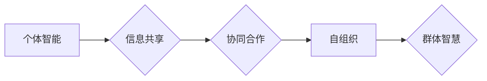

                 

## 群体智慧：人类计算的基石

> 关键词：群体智慧、人类计算、协同计算、分布式算法、机器学习、数据分析、决策支持、网络效应

## 1. 背景介绍

在信息时代，数据爆炸和计算能力的飞速发展为人类社会带来了前所未有的机遇和挑战。传统中心化计算模式已难以应对海量数据处理和复杂问题解决的需求。而群体智慧，作为一种新型的计算模式，以其独特的协同性和自组织能力，为我们提供了一种全新的思考方式和解决问题的途径。

群体智慧是指由众多个体协同合作，通过信息共享和相互学习，最终实现超越单个个体能力的智能化决策和问题解决能力。这种现象在自然界中随处可见，例如蜂群的集体决策、鸟群的群体飞行、鱼群的集体觅食等。

人类计算则是群体智慧在人类社会中的应用，它利用人类的智慧、经验和创造力，通过网络平台和协作工具，共同解决复杂问题。

## 2. 核心概念与联系

群体智慧的核心概念包括：

* **个体智能:** 每个个体都拥有有限的知识和能力，但可以通过学习和交流不断提升。
* **信息共享:** 个体之间通过信息交换和反馈，共同构建知识体系和解决方案。
* **协同合作:** 个体之间相互合作，分工协作，共同完成任务。
* **自组织:** 群体能够自发地组织和协调，形成高效的决策机制和行动模式。

**核心概念原理和架构的 Mermaid 流程图:**



## 3. 核心算法原理 & 具体操作步骤

### 3.1  算法原理概述

群体智慧算法通常基于以下原理：

* **启发式搜索:** 利用个体经验和局部信息，逐步逼近全局最优解。
* **模拟退火:** 通过随机扰动和接受概率机制，逃离局部最优解，探索更广阔的搜索空间。
* **遗传算法:** 通过模拟自然选择和遗传机制，不断优化个体特征，最终产生更优解。

### 3.2  算法步骤详解

以粒子群优化算法为例，其具体操作步骤如下：

1. **初始化粒子群:** 随机生成多个粒子，每个粒子代表一个候选解。
2. **评估粒子适应度:** 根据目标函数，评估每个粒子的适应度，即其解的优劣程度。
3. **更新粒子速度和位置:** 根据粒子的当前速度、最佳位置和全局最佳位置，更新粒子的速度和位置。
4. **重复步骤2-3:** 迭代执行步骤2-3，直到达到终止条件，例如最大迭代次数或目标适应度达到预设值。

### 3.3  算法优缺点

**优点:**

* **并行性:** 能够并行处理多个解，提高计算效率。
* **全局搜索能力:** 能够探索更广阔的搜索空间，找到更优解。
* **鲁棒性:** 对噪声和随机性具有较强的鲁棒性。

**缺点:**

* **收敛速度:** 收敛速度可能较慢，需要较多的迭代次数。
* **参数设置:** 需要根据具体问题进行参数设置，参数选择对算法性能影响较大。

### 3.4  算法应用领域

群体智慧算法广泛应用于以下领域：

* **优化问题:** 例如调度问题、路径规划、资源分配等。
* **机器学习:** 例如分类、回归、聚类等。
* **图像处理:** 例如图像识别、目标检测等。
* **金融预测:** 例如股票价格预测、风险管理等。

## 4. 数学模型和公式 & 详细讲解 & 举例说明

### 4.1  数学模型构建

群体智慧算法的数学模型通常基于以下几个方面：

* **个体状态:**  每个个体可以用一个向量表示，包含其特征、位置、速度等信息。
* **适应度函数:**  用于评估个体解的优劣程度，通常是一个目标函数。
* **更新规则:**  用于更新个体状态，例如速度和位置更新规则。

### 4.2  公式推导过程

以粒子群优化算法为例，其速度和位置更新规则如下：

* **速度更新:**  v<sub>i</sub>(t+1) = w * v<sub>i</sub>(t) + c<sub>1</sub> * r<sub>1</sub> * (p<sub>best</sub> - x<sub>i</sub>(t)) + c<sub>2</sub> * r<sub>2</sub> * (g<sub>best</sub> - x<sub>i</sub>(t))

* **位置更新:** x<sub>i</sub>(t+1) = x<sub>i</sub>(t) + v<sub>i</sub>(t+1)

其中:

* v<sub>i</sub>(t) 表示第i个粒子的速度在第t代
* x<sub>i</sub>(t) 表示第i个粒子的位置在第t代
* w 表示惯性权重
* c<sub>1</sub> 和 c<sub>2</sub> 表示学习因子
* r<sub>1</sub> 和 r<sub>2</sub> 表示随机数
* p<sub>best</sub> 表示第i个粒子找到的最佳位置
* g<sub>best</sub> 表示全局最佳位置

### 4.3  案例分析与讲解

假设我们要用粒子群优化算法求解一个简单的函数极值问题，目标函数为 f(x) = x<sup>2</sup>，我们设定粒子数量为10，迭代次数为100，其他参数根据经验设定。

通过运行算法，我们可以观察到粒子群在迭代过程中不断靠近函数极值点，最终收敛到一个接近全局最优解的点。

## 5. 项目实践：代码实例和详细解释说明

### 5.1  开发环境搭建

本项目使用Python语言进行开发，需要安装以下软件：

* Python 3.x
* NumPy
* Matplotlib

### 5.2  源代码详细实现

```python
import numpy as np
import matplotlib.pyplot as plt

# 定义目标函数
def f(x):
    return x**2

# 定义粒子群优化算法
def particle_swarm_optimization(func, bounds, num_particles, max_iter):
    # 初始化粒子群
    particles = np.random.uniform(bounds[0], bounds[1], size=(num_particles, 1))
    velocities = np.zeros((num_particles, 1))
    p_best = particles.copy()
    g_best = particles[0]
    best_fitness = func(g_best)

    # 迭代优化
    for i in range(max_iter):
        for j in range(num_particles):
            # 计算适应度
            fitness = func(particles[j])

            # 更新粒子最佳位置
            if fitness < func(p_best[j]):
                p_best[j] = particles[j]

            # 更新全局最佳位置
            if fitness < best_fitness:
                best_fitness = fitness
                g_best = particles[j]

            # 更新粒子速度和位置
            velocities[j] = 0.7 * velocities[j] + 1.5 * np.random.rand() * (p_best[j] - particles[j]) + 1.5 * np.random.rand() * (g_best - particles[j])
            particles[j] = particles[j] + velocities[j]

        # 更新粒子位置
        particles = np.clip(particles, bounds[0], bounds[1])

    return g_best, best_fitness

# 设置优化参数
bounds = (-5, 5)
num_particles = 10
max_iter = 100

# 调用粒子群优化算法
g_best, best_fitness = particle_swarm_optimization(f, bounds, num_particles, max_iter)

# 打印结果
print("最佳解:", g_best)
print("最佳适应度:", best_fitness)

# 绘制结果图
plt.plot(g_best, f(g_best), 'ro')
plt.xlabel('x')
plt.ylabel('f(x)')
plt.title('粒子群优化算法结果')
plt.show()
```

### 5.3  代码解读与分析

* **目标函数定义:**  `f(x)` 函数定义了需要优化的目标函数。
* **粒子群优化算法:**  `particle_swarm_optimization()` 函数实现粒子群优化算法的核心逻辑，包括粒子初始化、适应度计算、粒子更新等步骤。
* **参数设置:**  `bounds` 设置了搜索空间的范围，`num_particles` 设置了粒子数量，`max_iter` 设置了迭代次数。
* **结果打印和可视化:**  代码打印了最佳解和最佳适应度，并绘制了结果图，直观展示了算法的优化过程。

### 5.4  运行结果展示

运行代码后，会输出最佳解和最佳适应度，并生成一个结果图，展示粒子群在迭代过程中不断靠近函数极值点的过程。

## 6. 实际应用场景

群体智慧在各个领域都有着广泛的应用，例如：

* **科学研究:**  利用群体智慧算法解决复杂科学问题，例如蛋白质折叠预测、药物研发等。
* **金融市场:**  利用群体智慧算法进行股票预测、风险管理、投资决策等。
* **交通运输:**  利用群体智慧算法进行交通流量预测、路径规划、车辆调度等。
* **社会决策:**  利用群体智慧算法进行舆情分析、政策制定、资源分配等。

### 6.4  未来应用展望

随着人工智能和计算能力的不断发展，群体智慧的应用场景将更加广泛，例如：

* **智能医疗:**  利用群体智慧算法辅助医生诊断疾病、制定治疗方案。
* **个性化教育:**  利用群体智慧算法根据学生的学习情况提供个性化的学习方案。
* **自动驾驶:**  利用群体智慧算法提高自动驾驶系统的决策能力和安全性。

## 7. 工具和资源推荐

### 7.1  学习资源推荐

* **书籍:**
    * 《群体智慧》
    * 《人工智能：现代方法》
    * 《机器学习》
* **在线课程:**
    * Coursera: 人工智能
    * edX: 机器学习
    * Udacity: 深度学习

### 7.2  开发工具推荐

* **Python:**  广泛应用于群体智慧算法开发，拥有丰富的库和工具。
* **NumPy:**  用于数值计算和数组操作。
* **Scikit-learn:**  用于机器学习算法实现。
* **TensorFlow:**  用于深度学习算法实现。

### 7.3  相关论文推荐

* **Particle Swarm Optimization: A Review**
* **Ant Colony Optimization: A Metaheuristic Approach to Problem Solving**
* **Genetic Algorithms in Search, Optimization, and Machine Learning**

## 8. 总结：未来发展趋势与挑战

### 8.1  研究成果总结

群体智慧算法在解决复杂问题方面取得了显著的成果，为人工智能和计算科学的发展提供了新的思路和方法。

### 8.2  未来发展趋势

* **算法改进:**  研究更有效的群体智慧算法，提高算法的效率和鲁棒性。
* **应用扩展:**  将群体智慧算法应用于更多领域，例如智能医疗、个性化教育、自动驾驶等。
* **理论研究:**  深入研究群体智慧的理论基础，探索群体智慧的本质和机制。

### 8.3  面临的挑战

* **算法复杂度:**  一些群体智慧算法的复杂度较高，难以在实际应用中实现。
* **参数设置:**  群体智慧算法的参数设置对算法性能影响较大，需要根据具体问题进行调整。
* **数据依赖:**  群体智慧算法通常依赖于大量数据，数据质量和可用性对算法性能至关重要。

### 8.4  研究展望

未来，群体智慧研究将继续朝着更智能、更高效、更普适的方向发展，为人类社会带来更多福祉。

## 9. 附录：常见问题与解答

* **什么是群体智慧？**

群体智慧是指由众多个体协同合作，通过信息共享和相互学习，最终实现超越单个个体能力的智能化决策和问题解决能力。

* **群体智慧算法有哪些？**

常见的群体智慧算法包括粒子群优化算法、蚁群算法、遗传算法等。

* **群体智慧算法的应用领域有哪些？**

群体智慧算法广泛应用于优化问题、机器学习、图像处理、金融预测等领域。


作者：禅与计算机程序设计艺术 / Zen and the Art of Computer Programming<end_of_turn>

