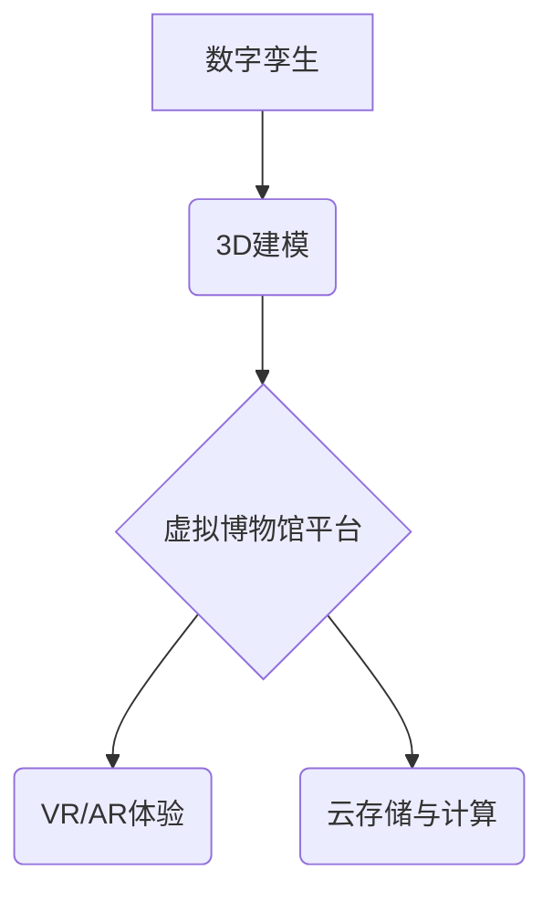

                 

## 虚拟博物馆策展:全球文化遗产的数字化展示

> 关键词：虚拟现实、增强现实、数字孪生、文化遗产、博物馆数字化、人工智能、3D建模、云计算

## 1. 背景介绍

随着科技的飞速发展，虚拟现实 (VR)、增强现实 (AR) 和数字孪生技术日益成熟，为文化遗产的数字化展示提供了前所未有的机遇。传统博物馆的物理空间限制了参观者的体验，而虚拟博物馆则能够突破地域限制，提供沉浸式、互动式的参观体验，让更多人能够便捷地接触和了解世界各地的文化遗产。

近年来，许多博物馆开始探索虚拟博物馆的建设，利用数字技术对文物进行数字化采集、建模和展示。例如，英国大英博物馆的“虚拟博物馆”项目，利用3D扫描技术对馆藏文物进行数字化重建，并通过VR技术，让用户身临其境地探索博物馆馆藏。

## 2. 核心概念与联系

虚拟博物馆的建设涉及多个核心概念，包括：

* **数字孪生:**  指利用数字技术构建与真实世界物体或系统完全一致的虚拟模型，能够实时反映真实世界的状态和变化。
* **3D建模:**  利用计算机软件创建三维模型，可以精确地捕捉文物的外形、结构和细节。
* **虚拟现实 (VR):**  利用头戴式设备和传感器，创造沉浸式的虚拟环境，让用户能够身临其境地体验虚拟世界。
* **增强现实 (AR):**  利用摄像头和移动设备，将虚拟内容叠加到现实世界中，增强用户的现实世界体验。
* **云计算:**  提供强大的计算和存储资源，支持虚拟博物馆的建设和运行。

这些核心概念相互关联，共同构成了虚拟博物馆的架构。



## 3. 核心算法原理 & 具体操作步骤

### 3.1  算法原理概述

虚拟博物馆的建设需要利用多种算法，包括：

* **3D建模算法:**  用于生成文物的三维模型，常见的算法包括扫描匹配、多视图重建和深度学习等。
* **纹理贴图算法:**  用于将图像或视频贴图到3D模型上，使模型更加逼真。
* **光照计算算法:**  用于模拟光线照射到模型上的效果，使模型更加生动。
* **场景渲染算法:**  用于将虚拟场景渲染成图像或视频，呈现给用户。

### 3.2  算法步骤详解

**3D建模算法步骤:**

1. **数据采集:**  利用3D扫描仪、相机或其他传感器采集文物的数据。
2. **数据预处理:**  对采集到的数据进行滤波、去噪和配准等处理，去除噪声和误差。
3. **模型重建:**  利用3D建模算法，将预处理后的数据重建成三维模型。
4. **模型优化:**  对重建的模型进行优化，例如简化模型、添加细节等。

**纹理贴图算法步骤:**

1. **图像采集:**  对文物进行拍照或拍摄视频，获取纹理图像。
2. **图像预处理:**  对纹理图像进行滤波、去噪和色彩校正等处理。
3. **纹理映射:**  将预处理后的纹理图像映射到3D模型上。

### 3.3  算法优缺点

**3D建模算法:**

* **优点:**  能够精确地捕捉文物的外形、结构和细节，重建逼真的虚拟模型。
* **缺点:**  需要专业的设备和技术，建模过程复杂，耗时较长。

**纹理贴图算法:**

* **优点:**  能够使虚拟模型更加逼真，增强用户的视觉体验。
* **缺点:**  需要高质量的纹理图像，否则会影响模型的真实度。

### 3.4  算法应用领域

3D建模和纹理贴图算法广泛应用于虚拟博物馆、游戏开发、影视制作、建筑设计等领域。

## 4. 数学模型和公式 & 详细讲解 & 举例说明

### 4.1  数学模型构建

虚拟博物馆的建设需要构建多个数学模型，例如：

* **3D模型的数学表示:**  可以使用坐标系、向量和矩阵来表示3D模型的几何形状。
* **光照模型:**  可以使用菲涅尔定律、朗伯反射定律等物理模型来模拟光线照射到模型上的效果。
* **纹理贴图模型:**  可以使用纹理坐标系和插值算法来将纹理图像映射到3D模型上。

### 4.2  公式推导过程

**菲涅尔定律:**

$$
R(\theta) = \frac{(n_1 \cos \theta_i - n_2 \cos \theta_t)^2}{(n_1 \cos \theta_i + n_2 \cos \theta_t)^2}
$$

其中：

* $R(\theta)$ 是反射率
* $n_1$ 是入射介质的折射率
* $n_2$ 是反射介质的折射率
* $\theta_i$ 是入射角
* $\theta_t$ 是折射角

**朗伯反射定律:**

$$
I = \frac{k \cdot L \cdot \cos \theta_i}{ \pi}
$$

其中：

* $I$ 是反射光强
* $k$ 是漫反射系数
* $L$ 是入射光强
* $\theta_i$ 是入射角

### 4.3  案例分析与讲解

**案例:**  假设我们想要模拟阳光照射到一个金字塔模型上的效果。

* 可以利用菲涅尔定律计算出不同角度的反射率，模拟金字塔表面的光滑反射。
* 利用朗伯反射定律计算出不同角度的漫反射光强，模拟金字塔表面的微小凹凸和纹理。
* 通过调整光源的位置、强度和颜色，可以模拟不同的光照效果，例如阳光直射、阴影、夕阳等。

## 5. 项目实践：代码实例和详细解释说明

### 5.1  开发环境搭建

虚拟博物馆的开发环境通常包括：

* **操作系统:**  Windows、Linux 或 macOS
* **编程语言:**  C++、Python 或 JavaScript
* **3D建模软件:**  Blender、Maya 或 3ds Max
* **游戏引擎:**  Unity 或 Unreal Engine
* **云计算平台:**  AWS、Azure 或 Google Cloud

### 5.2  源代码详细实现

以下是一个简单的Python代码示例，演示如何使用Pygame库绘制一个简单的3D模型：

```python
import pygame

# 初始化 Pygame
pygame.init()

# 设置窗口大小
width = 640
height = 480
screen = pygame.display.set_mode((width, height))

# 设置标题
pygame.display.set_caption("虚拟博物馆")

# 定义颜色
black = (0, 0, 0)
white = (255, 255, 255)

# 定义3D模型的顶点坐标
vertices = [
    (0, 0, 0),
    (100, 0, 0),
    (0, 100, 0),
    (100, 100, 0),
]

# 游戏循环
running = True
while running:
    # 处理事件
    for event in pygame.event.get():
        if event.type == pygame.QUIT:
            running = False

    # 清空屏幕
    screen.fill(black)

    # 绘制3D模型
    for i in range(len(vertices) - 1):
        pygame.draw.line(screen, white, vertices[i], vertices[i + 1], 2)

    # 更新显示
    pygame.display.flip()

# 退出 Pygame
pygame.quit()
```

### 5.3  代码解读与分析

这段代码演示了如何使用Pygame库绘制一个简单的3D模型。

* 首先，初始化Pygame并设置窗口大小和标题。
* 然后，定义颜色和3D模型的顶点坐标。
* 在游戏循环中，处理事件，清空屏幕，绘制3D模型，并更新显示。

### 5.4  运行结果展示

运行这段代码后，将显示一个黑色的窗口，其中绘制了一个简单的白色三角形，代表了3D模型。

## 6. 实际应用场景

虚拟博物馆的应用场景非常广泛，例如：

* **文物保护与展示:**  对文物进行数字化采集和建模，可以帮助保护文物，并将其展示给更多人。
* **教育与科研:**  虚拟博物馆可以为学生和研究人员提供沉浸式的学习和研究环境。
* **旅游与文化交流:**  虚拟博物馆可以帮助人们了解不同国家的文化遗产，促进文化交流。

### 6.4  未来应用展望

未来，虚拟博物馆将更加智能化、交互化和个性化。例如：

* 利用人工智能技术，实现虚拟导游、文物识别和个性化推荐等功能。
* 利用增强现实技术，将虚拟文物叠加到现实世界中，增强用户的体验。
* 利用云计算技术，实现虚拟博物馆的跨平台访问和共享。

## 7. 工具和资源推荐

### 7.1  学习资源推荐

* **书籍:**  《3D建模与动画》
* **网站:**  Blender官方网站、Unity官方网站、Unreal Engine官方网站
* **课程:**  Coursera、edX 等在线学习平台上的3D建模和游戏开发课程

### 7.2  开发工具推荐

* **3D建模软件:**  Blender、Maya、3ds Max
* **游戏引擎:**  Unity、Unreal Engine
* **编程语言:**  C++、Python、JavaScript

### 7.3  相关论文推荐

* **3D建模:**  "A Survey of 3D Reconstruction Techniques"
* **虚拟现实:**  "Virtual Reality: Principles and Applications"
* **增强现实:**  "Augmented Reality: A Survey"

## 8. 总结：未来发展趋势与挑战

### 8.1  研究成果总结

虚拟博物馆的建设取得了显著的成果，为文化遗产的数字化展示提供了新的途径。

### 8.2  未来发展趋势

未来，虚拟博物馆将更加智能化、交互化和个性化，并与其他新兴技术，例如人工智能、区块链和物联网等融合发展。

### 8.3  面临的挑战

虚拟博物馆的建设还面临着一些挑战，例如：

* **数据采集和建模技术:**  需要更高精度、更高效率的数据采集和建模技术。
* **交互体验:**  需要更加沉浸式、更加交互式的体验，才能吸引用户。
* **技术标准和兼容性:**  需要建立统一的技术标准和接口，保证不同平台的虚拟博物馆能够互联互通。

### 8.4  研究展望

未来，需要继续加强虚拟博物馆的研发，探索新的技术和应用场景，推动虚拟博物馆的发展。

## 9. 附录：常见问题与解答

* **Q1:  虚拟博物馆和传统博物馆有什么区别？**

* **A1:**  虚拟博物馆不受地域限制，可以随时随地访问，并且可以提供更加沉浸式的体验。传统博物馆则需要用户 physically 到场，并且只能展示有限数量的文物。

* **Q2:  如何创建虚拟博物馆？**

* **A2:**  创建虚拟博物馆需要多个步骤，包括数据采集、3D建模、场景设计、交互开发等。

* **Q3:  虚拟博物馆的未来发展趋势是什么？**

* **A3:**  未来，虚拟博物馆将更加智能化、交互化和个性化，并与其他新兴技术融合发展。


作者：禅与计算机程序设计艺术 / Zen and the Art of Computer Programming 
<end_of_turn>

