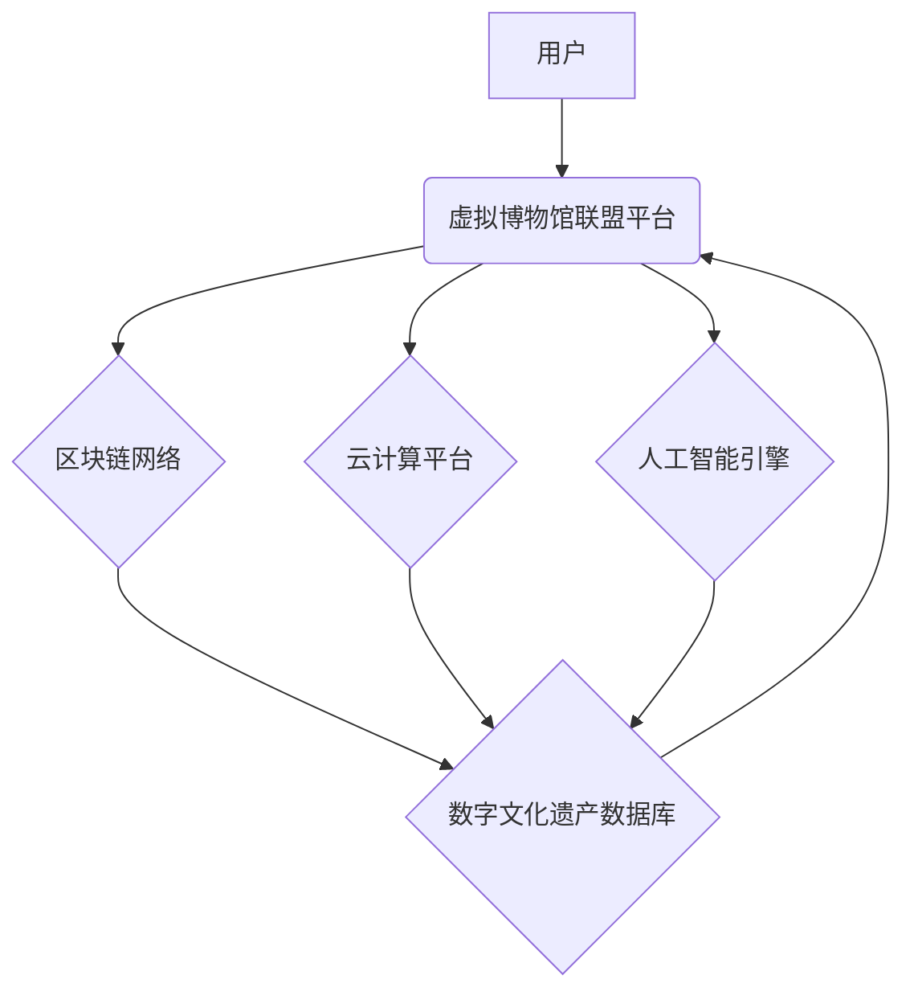

                 

## 虚拟博物馆联盟:全球文化资源的共享平台

> 关键词：虚拟博物馆、数字文化遗产、区块链、人工智能、云计算、大数据、Web3.0

## 1. 背景介绍

随着科技的飞速发展，数字技术正在深刻地改变着文化遗产的保存、展示和传播方式。传统博物馆面临着空间限制、资源不足、参观体验单一等问题。而虚拟博物馆作为一种新兴的文化展示形式，凭借其沉浸式体验、跨地域访问、个性化定制等优势，逐渐成为文化遗产保护和传承的重要平台。

然而，现有的虚拟博物馆大多局限于单一机构或国家，缺乏资源共享和协作机制。为了更好地促进全球文化资源的共享和交流，构建一个开放、可持续、具有全球影响力的虚拟博物馆联盟势在必行。

## 2. 核心概念与联系

虚拟博物馆联盟是一个基于Web3.0技术的全球文化资源共享平台，旨在通过区块链、人工智能、云计算等先进技术，实现文化遗产的数字化保存、展示、研究和传播。

**2.1 核心概念**

* **虚拟博物馆:** 利用数字技术构建的虚拟空间，通过3D模型、虚拟现实、增强现实等手段，模拟真实博物馆的展示环境，提供沉浸式体验。
* **数字文化遗产:** 指以数字形式保存和传播的文化遗产，包括文物、文献、艺术作品、传统知识等。
* **区块链:** 一种分布式账本技术，能够确保数据安全、透明和不可篡改，为文化遗产的版权保护和交易提供保障。
* **人工智能:** 可以用于文物识别、文物修复、虚拟导游、个性化推荐等方面，提升虚拟博物馆的智能化水平。
* **云计算:** 提供强大的计算和存储资源，支持虚拟博物馆的大规模数据处理和资源共享。

**2.2 架构图**



## 3. 核心算法原理 & 具体操作步骤

**3.1 算法原理概述**

虚拟博物馆联盟的核心算法主要包括：

* **数字文化遗产数字化处理算法:** 用于将文物、文献、艺术作品等传统文化遗产数字化，包括图像采集、三维建模、文本识别、音频处理等。
* **区块链数据存储和管理算法:** 用于将数字文化遗产数据安全可靠地存储在区块链网络中，确保数据的完整性和不可篡改性。
* **人工智能知识图谱构建算法:** 用于构建数字文化遗产的知识图谱，将不同类型的文化遗产数据进行关联和分析，挖掘文化遗产之间的内在联系。
* **个性化推荐算法:** 用于根据用户的兴趣爱好和浏览历史，推荐相关的数字文化遗产资源。

**3.2 算法步骤详解**

* **数字文化遗产数字化处理:**
    1. 选择合适的数字化技术，根据不同类型的文化遗产进行采集和处理。
    2. 对采集到的数据进行预处理，例如图像去噪、文本校对等。
    3. 利用三维建模技术构建文物的三维模型，并进行纹理贴图和材质渲染。
    4. 将处理后的数据进行压缩和格式转换，以便于存储和传输。
* **区块链数据存储和管理:**
    1. 将数字文化遗产数据打包成区块，并进行加密和签名。
    2. 将区块添加到区块链网络中，并进行验证和确认。
    3. 利用智能合约机制，实现数字文化遗产的版权保护和交易。
* **人工智能知识图谱构建:**
    1. 收集数字文化遗产的数据，包括文本、图像、音频等。
    2. 利用自然语言处理技术，提取数据中的实体和关系。
    3. 将实体和关系构建成知识图谱，并进行推理和分析。
* **个性化推荐:**
    1. 收集用户的浏览历史、兴趣爱好等数据。
    2. 利用机器学习算法，构建用户画像和推荐模型。
    3. 根据用户的画像，推荐相关的数字文化遗产资源。

**3.3 算法优缺点**

* **优点:**
    * 数据安全可靠：区块链技术确保数据的完整性和不可篡改性。
    * 资源共享协作：虚拟博物馆联盟平台促进全球文化资源的共享和交流。
    * 智能化体验：人工智能技术提升虚拟博物馆的智能化水平，提供个性化服务。
* **缺点:**
    * 技术复杂性：虚拟博物馆联盟的建设需要整合多种先进技术，技术难度较高。
    * 数据标准化问题：不同机构的数字文化遗产数据格式不统一，需要进行标准化处理。
    * 伦理道德问题：人工智能技术应用需要考虑伦理道德问题，例如数据隐私保护和算法偏见。

**3.4 算法应用领域**

虚拟博物馆联盟的算法可以应用于以下领域：

* **文化遗产保护和传承:** 数字化保存和展示文化遗产，促进文化遗产的传承和弘扬。
* **教育和科研:** 提供丰富的数字文化资源，支持教育教学和科研研究。
* **旅游和娱乐:** 打造沉浸式文化体验，提升旅游和娱乐业的竞争力。
* **文化交流和合作:** 促进不同国家和地区的文化交流和合作。

## 4. 数学模型和公式 & 详细讲解 & 举例说明

**4.1 数学模型构建**

虚拟博物馆联盟的知识图谱构建可以采用图论模型，其中节点代表文化遗产实体，边代表实体之间的关系。

**4.2 公式推导过程**

* **节点度:** 节点的度是指该节点连接的边的数量，可以用来衡量实体的重要性。
* **节点中心性:** 节点的中心性是指该节点在图中的重要性，可以采用不同的算法计算，例如介数中心性、接近中心性和枢纽中心性。
* **边权重:** 边权重可以用来表示实体之间关系的强度，例如文物之间的年代关系、文献之间的引用关系等。

**4.3 案例分析与讲解**

假设我们构建一个关于古代中国历史的知识图谱，其中节点包括皇帝、朝代、事件、人物等，边代表着这些实体之间的关系，例如“皇帝属于朝代”、“事件发生在某个朝代”等。

通过计算节点度、中心性和边权重，我们可以发现一些重要的历史规律，例如：

* 某个皇帝的度值较高，说明该皇帝在历史上的影响力较大。
* 某个朝代的中心性较高，说明该朝代在历史上的地位重要。
* 某个事件的边权重较高，说明该事件对历史发展的影响较大。

## 5. 项目实践：代码实例和详细解释说明

**5.1 开发环境搭建**

虚拟博物馆联盟的开发环境需要包括以下软件：

* **区块链平台:** 比如Ethereum、Hyperledger Fabric等。
* **云计算平台:** 比如AWS、Azure、阿里云等。
* **人工智能框架:** 比如TensorFlow、PyTorch等。
* **数据库:** 比如MongoDB、PostgreSQL等。

**5.2 源代码详细实现**

由于篇幅限制，这里只提供部分代码示例，具体实现细节请参考开源项目或相关文档。

```python
# 使用TensorFlow构建个性化推荐模型
import tensorflow as tf

# 定义模型结构
model = tf.keras.Sequential([
    tf.keras.layers.Dense(64, activation='relu'),
    tf.keras.layers.Dense(32, activation='relu'),
    tf.keras.layers.Dense(10, activation='softmax')
])

# 训练模型
model.compile(optimizer='adam',
              loss='sparse_categorical_crossentropy',
              metrics=['accuracy'])

# 加载数据并训练模型
model.fit(X_train, y_train, epochs=10)

# 使用模型进行预测
predictions = model.predict(X_test)
```

**5.3 代码解读与分析**

这段代码使用TensorFlow构建了一个简单的个性化推荐模型。

* `tf.keras.Sequential`定义了一个顺序模型，将不同的神经网络层依次连接起来。
* `tf.keras.layers.Dense`定义了一个全连接层，每个神经元都连接到上一层的每个神经元。
* `activation='relu'`指定了激活函数为ReLU，可以提高模型的表达能力。
* `loss='sparse_categorical_crossentropy'`指定了损失函数为稀疏类别交叉熵，用于多分类问题。
* `metrics=['accuracy']`指定了评估指标为准确率。
* `model.fit()`函数用于训练模型，将训练数据输入模型，并根据损失函数进行参数更新。
* `model.predict()`函数用于使用训练好的模型进行预测，将测试数据输入模型，得到预测结果。

**5.4 运行结果展示**

训练完成后，可以使用测试数据评估模型的性能，例如计算准确率、召回率等指标。

## 6. 实际应用场景

虚拟博物馆联盟可以应用于以下实际场景：

* **博物馆数字化展示:** 将博物馆的文物和展览数字化，并通过虚拟现实、增强现实等技术，打造沉浸式体验。
* **文物修复和保护:** 利用人工智能技术，对文物进行修复和保护，延长文物寿命。
* **文化遗产教育:** 提供丰富的数字文化资源，支持教育教学和科研研究。
* **跨地域文化交流:** 促进不同国家和地区的文化交流和合作。

**6.4 未来应用展望**

随着科技的不断发展，虚拟博物馆联盟的应用场景将更加广泛，例如：

* **元宇宙文化体验:** 将虚拟博物馆融入元宇宙，打造沉浸式文化体验空间。
* **数字孪生博物馆:** 利用数字孪生技术，构建虚拟博物馆的数字模型，实现博物馆的实时监控和管理。
* **人工智能导游:** 利用人工智能技术，开发虚拟导游，为用户提供个性化服务。

## 7. 工具和资源推荐

**7.1 学习资源推荐**

* **区块链技术:** Ethereum官方文档、Hyperledger Fabric官方文档
* **人工智能技术:** TensorFlow官方文档、PyTorch官方文档
* **云计算平台:** AWS官方文档、Azure官方文档、阿里云官方文档

**7.2 开发工具推荐**

* **区块链开发工具:** Truffle Suite、Remix IDE
* **人工智能开发工具:** TensorFlow Playground、Keras Tuner
* **云计算开发工具:** AWS SDK、Azure SDK、阿里云SDK

**7.3 相关论文推荐**

* **区块链在文化遗产保护中的应用:** Blockchain for Cultural Heritage Preservation
* **人工智能在博物馆中的应用:** Artificial Intelligence in Museums
* **虚拟博物馆的未来发展趋势:** The Future of Virtual Museums

## 8. 总结：未来发展趋势与挑战

**8.1 研究成果总结**

虚拟博物馆联盟的建设是一个复杂的系统工程，需要整合多种先进技术，并解决一系列技术和社会问题。

**8.2 未来发展趋势**

未来，虚拟博物馆联盟将朝着以下方向发展：

* **更加沉浸式和交互式的体验:** 利用虚拟现实、增强现实等技术，打造更加沉浸式和交互式的文化体验。
* **更加智能化和个性化的服务:** 利用人工智能技术，提供更加智能化和个性化的服务，例如虚拟导游、个性化推荐等。
* **更加开放和共享的平台:** 鼓励更多机构和个人参与到虚拟博物馆联盟的建设和运营中，促进全球文化资源的共享和交流。

**8.3 面临的挑战**

虚拟博物馆联盟的建设还面临着一些挑战：

* **技术挑战:** 如何实现数字文化遗产的精准数字化处理、区块链技术的安全性和可扩展性、人工智能技术的可靠性和可解释性等。
* **数据挑战:** 如何解决不同机构的数字文化遗产数据格式不统一、数据标准化问题、数据隐私保护问题等。
* **社会挑战:** 如何平衡文化遗产的保护和传承与科技发展的需求、如何解决虚拟博物馆的公平性和可访问性问题等。

**8.4 研究展望**

未来，我们将继续致力于虚拟博物馆联盟的建设和发展，探索新的技术和应用场景，为全球文化遗产的保护和传承做出更大的贡献。

## 9. 附录：常见问题与解答

**9.1 如何参与虚拟博物馆联盟？**

您可以通过以下方式参与虚拟博物馆联盟：

* **捐赠数字文化遗产数据:** 将您的数字文化遗产数据捐赠给虚拟博物馆联盟，为平台建设提供数据支持。
* **开发应用程序:** 开发基于虚拟博物馆联盟平台的应用程序，为用户提供更加丰富的文化体验。
* **参与社区讨论:** 加入虚拟博物馆联盟的社区，与其他开发者和爱好者交流学习。

**9.2 虚拟博物馆联盟的安全性如何保障？**

虚拟博物馆联盟平台采用区块链技术，确保数据的安全性和不可篡改性。

**9.3 虚拟博物馆联盟的费用如何？**

虚拟博物馆联盟平台提供免费和付费两种服务模式。免费服务包括基本的功能，例如浏览数字文化遗产、参与社区讨论等。付费服务包括更高级的功能，例如数据存储、应用程序开发等。

作者：禅与计算机程序设计艺术 / Zen and the Art of Computer Programming


<end_of_turn>

