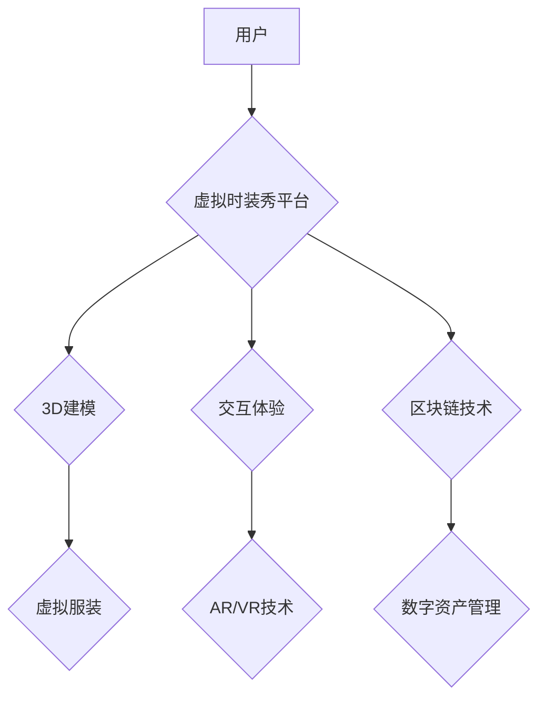

                 

## 虚拟时装秀创业：数字时尚的展示平台

> 关键词：虚拟时装秀、数字时尚、3D建模、区块链、元宇宙、交互体验、人工智能

## 1. 背景介绍

时尚产业正在经历一场数字化革命。随着虚拟现实 (VR)、增强现实 (AR) 和人工智能 (AI) 技术的快速发展，数字时尚正逐渐成为主流。虚拟时装秀作为数字时尚展示的全新形式，正在改变传统时装秀的模式，为设计师、品牌和消费者提供更具互动性和沉浸性的体验。

传统时装秀受限于时间、地点和物理空间，参与者数量有限，且难以实现个性化定制。而虚拟时装秀则突破了这些限制，可以无限扩展参与者规模，提供多视角的观看体验，并通过 AR/VR 技术实现虚拟试衣等互动功能，为用户带来更具沉浸性和个性化的体验。

## 2. 核心概念与联系

**2.1 数字时尚**

数字时尚是指利用数字技术创造和销售的虚拟服装、配饰和鞋履等时尚产品。这些产品通常以 3D 模型的形式存在，可以穿戴在虚拟形象上，并在虚拟世界中展示。

**2.2 虚拟时装秀**

虚拟时装秀是指利用数字技术搭建的虚拟舞台，设计师通过 3D 模型展示虚拟服装，并通过 AR/VR 技术为观众提供沉浸式的观看体验。

**2.3 元宇宙**

元宇宙是一个由虚拟世界、增强现实和区块链技术构成的虚拟空间，用户可以在其中创建虚拟形象、进行社交互动、参与游戏和体验数字经济。虚拟时装秀可以作为元宇宙中的一部分，为用户提供更丰富的虚拟体验。

**2.4 核心架构**



**2.5 核心概念联系**

数字时尚作为虚拟时装秀的核心内容，通过 3D 建模技术呈现虚拟服装，并利用 AR/VR 技术为观众提供沉浸式的交互体验。区块链技术可以保障数字资产的唯一性和可追溯性，为虚拟服装的交易和管理提供安全保障。元宇宙作为虚拟时装秀的应用场景，为用户提供更广阔的虚拟体验空间。

## 3. 核心算法原理 & 具体操作步骤

**3.1 算法原理概述**

虚拟时装秀的核心算法主要涉及 3D 建模、动画渲染、交互逻辑和区块链技术。

* **3D 建模:** 利用 3D 建模软件，根据设计师的设计稿或手绘草图，创建虚拟服装的 3D 模型。
* **动画渲染:** 利用渲染引擎，将 3D 模型渲染成逼真的图像或视频，并添加动画效果，使虚拟服装在虚拟舞台上展现动态效果。
* **交互逻辑:** 设计交互逻辑，使观众可以通过鼠标、键盘或手柄等设备与虚拟服装进行互动，例如旋转、放大、缩小、试穿等。
* **区块链技术:** 利用区块链技术，记录虚拟服装的版权信息、交易记录和所有权，保障数字资产的安全性和可追溯性。

**3.2 算法步骤详解**

1. **设计阶段:** 设计师根据市场趋势和品牌定位，设计虚拟服装的款式、颜色、材质等。
2. **建模阶段:** 利用 3D 建模软件，根据设计稿或手绘草图，创建虚拟服装的 3D 模型。
3. **材质贴图:** 为 3D 模型添加材质贴图，使其具有真实的光泽、纹理和质感。
4. **动画制作:** 利用动画软件，为虚拟服装添加动画效果，例如飘动、摆动、变换等。
5. **渲染阶段:** 利用渲染引擎，将 3D 模型渲染成逼真的图像或视频。
6. **交互逻辑设计:** 设计交互逻辑，使观众可以通过鼠标、键盘或手柄等设备与虚拟服装进行互动。
7. **平台搭建:** 利用云计算平台或服务器搭建虚拟时装秀平台，并集成 3D 模型、动画渲染、交互逻辑和区块链技术。
8. **发布推广:** 将虚拟时装秀发布到平台上，并进行推广宣传，吸引观众参与。

**3.3 算法优缺点**

**优点:**

* **沉浸式体验:** AR/VR 技术可以为观众提供更具沉浸性和互动性的体验。
* **无限扩展:** 虚拟时装秀不受时间、地点和物理空间的限制，可以无限扩展参与者规模。
* **个性化定制:** 观众可以根据自己的喜好进行虚拟试穿，并定制虚拟服装。
* **环保可持续:** 虚拟时装秀可以减少服装生产和运输过程中的碳排放，促进环保可持续发展。

**缺点:**

* **技术门槛高:** 虚拟时装秀的开发和运营需要较高的技术门槛。
* **硬件设备限制:** AR/VR 技术需要相应的硬件设备支持，部分观众可能无法体验到最佳效果。
* **市场接受度:** 虚拟时装秀仍然是一个新兴市场，需要时间来提高市场接受度。

**3.4 算法应用领域**

虚拟时装秀的应用领域非常广泛，包括：

* **时尚品牌:** 展示新款服装，提升品牌知名度和影响力。
* **设计师:** 展示设计作品，获得更多曝光机会。
* **游戏开发:** 为游戏角色提供虚拟服装，丰富游戏体验。
* **虚拟社交平台:** 为用户提供虚拟试衣和社交互动功能。
* **教育培训:** 用于服装设计、3D 建模和虚拟现实技术培训。

## 4. 数学模型和公式 & 详细讲解 & 举例说明

**4.1 数学模型构建**

虚拟时装秀的数学模型可以从以下几个方面进行构建：

* **3D 模型建模:** 利用数学公式和算法，描述虚拟服装的几何形状、材质属性和纹理信息。
* **动画渲染:** 利用数学公式和算法，计算虚拟服装在虚拟空间中的运动轨迹、光照效果和阴影效果。
* **交互逻辑:** 利用数学公式和算法，实现观众与虚拟服装的交互行为，例如虚拟试穿、旋转、放大、缩小等。

**4.2 公式推导过程**

由于虚拟时装秀涉及多个领域的数学模型，这里只举例说明 3D 模型建模中的一个公式：

**表面积公式:**

对于一个简单的立方体，其表面积可以由以下公式计算:

$$S = 6s^2$$

其中:

* $S$ 表示立方体的表面积
* $s$ 表示立方体的边长

**4.3 案例分析与讲解**

假设我们想要创建一个虚拟服装，其形状是一个圆柱体，其高度为 10 厘米，直径为 5 厘米。我们可以利用圆柱体的表面积公式计算其表面积:

$$S = 2\pi rh + 2\pi r^2$$

其中:

* $S$ 表示圆柱体的表面积
* $r$ 表示圆柱体的半径 (直径 / 2 = 5 / 2 = 2.5 厘米)
* $h$ 表示圆柱体的高度 (10 厘米)

将数值代入公式:

$$S = 2\pi * 2.5 * 10 + 2\pi * 2.5^2$$

$$S = 50\pi + 12.5\pi$$

$$S = 62.5\pi$$

$$S \approx 196.35 cm^2$$

因此，该虚拟服装的表面积约为 196.35 平方厘米。

## 5. 项目实践：代码实例和详细解释说明

**5.1 开发环境搭建**

虚拟时装秀的开发环境可以根据项目需求选择不同的技术栈。

* **3D 建模软件:** Blender, Maya, 3ds Max
* **渲染引擎:** Unity, Unreal Engine
* **交互框架:** Three.js, A-Frame
* **区块链平台:** Ethereum, Hyperledger Fabric

**5.2 源代码详细实现**

由于虚拟时装秀的代码实现非常复杂，这里只提供一个简单的 3D 模型加载示例代码 (使用 Three.js):

```javascript
// 创建场景
const scene = new THREE.Scene();

// 创建相机
const camera = new THREE.PerspectiveCamera(75, window.innerWidth / window.innerHeight, 0.1, 1000);

// 创建渲染器
const renderer = new THREE.WebGLRenderer();
renderer.setSize(window.innerWidth, window.innerHeight);
document.body.appendChild(renderer.domElement);

// 加载 3D 模型
const loader = new THREE.GLTFLoader();
loader.load('model.gltf', function (gltf) {
  scene.add(gltf.scene);
});

// 设置相机位置
camera.position.z = 5;

// 渲染循环
function animate() {
  requestAnimationFrame(animate);
  renderer.render(scene, camera);
}
animate();
```

**5.3 代码解读与分析**

这段代码首先创建了场景、相机和渲染器，然后使用 GLTFLoader 加载 3D 模型。最后，设置相机位置并启动渲染循环，使 3D 模型在浏览器窗口中显示。

**5.4 运行结果展示**

运行这段代码后，浏览器窗口中将显示一个加载的 3D 模型。

## 6. 实际应用场景

**6.1 时尚品牌推广**

虚拟时装秀可以为时尚品牌提供一个全新的展示平台，展示新款服装、提升品牌知名度和影响力。例如，Gucci 在 2021 年举办了一场虚拟时装秀，展示了其最新的秋冬系列，吸引了全球观众的关注。

**6.2 设计师作品展示**

虚拟时装秀为设计师提供了一个展示设计作品的平台，可以获得更多曝光机会和合作机会。例如，设计师 Iris van Herpen 利用虚拟现实技术，创作了一系列充满未来感的虚拟服装，并在虚拟时装秀中进行展示。

**6.3 游戏虚拟服装**

虚拟时装秀可以为游戏角色提供虚拟服装，丰富游戏体验。例如，游戏 Fortnite 和 Roblox 都提供虚拟服装的购买和定制功能，玩家可以根据自己的喜好为角色更换虚拟服装。

**6.4 元宇宙虚拟体验**

虚拟时装秀可以作为元宇宙中的一部分，为用户提供更丰富的虚拟体验空间。例如，用户可以在元宇宙中创建虚拟形象，并通过虚拟时装秀体验虚拟购物、社交互动和娱乐活动。

**6.5 未来应用展望**

随着虚拟现实、增强现实和人工智能技术的不断发展，虚拟时装秀的应用场景将更加广泛，例如：

* **虚拟试衣:** 用户可以通过虚拟试衣功能，在虚拟环境中试穿虚拟服装，并根据自己的喜好进行定制。
* **虚拟时尚秀直播:** 用户可以实时观看虚拟时装秀直播，并与设计师和其他观众进行互动。
* **虚拟时尚电商:** 用户可以在虚拟时装秀平台上购买虚拟服装，并将其穿戴在虚拟形象上。
* **虚拟时尚教育:** 利用虚拟时装秀平台，进行服装设计、3D 建模和虚拟现实技术培训。

## 7. 工具和资源推荐

**7.1 学习资源推荐**

* **书籍:**
    * 《3D建模入门》
    * 《Unity游戏开发入门》
    * 《区块链技术入门》
* **在线课程:**
    * Coursera: 3D Modeling and Animation
    * Udemy: Unity Game Development
    * edX: Blockchain Fundamentals

**7.2 开发工具推荐**

* **3D 建模软件:** Blender, Maya, 3ds Max
* **渲染引擎:** Unity, Unreal Engine
* **交互框架:** Three.js, A-Frame
* **区块链平台:** Ethereum, Hyperledger Fabric

**7.3 相关论文推荐**

* **数字时尚的未来趋势:** https://www.researchgate.net/publication/350877488_The_Future_of_Digital_Fashion
* **虚拟时装秀的交互体验设计:** https://dl.acm.org/doi/10.1145/3442188.3445928

## 8. 总结：未来发展趋势与挑战

**8.1 研究成果总结**

虚拟时装秀作为数字时尚的展示平台，已经取得了一定的发展成果，为时尚产业带来了新的可能性。

**8.2 未来发展趋势**

* **更沉浸式的交互体验:** 利用 VR/AR 技术，为观众提供更逼真的虚拟体验，例如虚拟试衣、虚拟走秀等。
* **更个性化的定制服务:** 利用 AI 技术，为用户提供个性化的虚拟服装定制服务，满足用户的个性化需求。
* **更广泛的应用场景:** 将虚拟时装秀应用到更多领域，例如游戏、教育、社交等。

**8.3 面临的挑战**

* **技术门槛高:** 虚拟时装秀的开发和运营需要较高的技术门槛，需要吸引更多技术人才加入。
* **市场接受度:** 虚拟时装秀仍然是一个新兴市场，需要时间来提高市场接受度。
* **版权保护:** 虚拟服装的版权保护是一个新的挑战，需要制定相应的法律法规和技术手段。

**8.4 研究展望**

未来，虚拟时装秀的研究方向将更加注重沉浸式交互体验、个性化定制服务和跨界应用，并探索虚拟服装的商业模式和社会影响。

## 9. 附录：常见问题与解答

**9.1 如何参与虚拟时装秀？**

用户可以通过虚拟时装秀平台的官网或 App 进行注册，并选择观看或参与虚拟时装秀。

**9.2 如何购买虚拟服装？**

用户可以在虚拟时装秀平台上购买虚拟服装，并将其穿戴在虚拟形象上。

**9.3 虚拟服装的版权如何保护？**

虚拟服装的版权可以通过区块链技术进行记录和管理，确保虚拟服装的唯一性和可追溯性。

**9.4 虚拟时装秀的未来发展趋势是什么？**

虚拟时装秀的未来发展趋势将更加注重沉浸式交互体验、个性化定制服务和跨界应用。


作者：禅与计算机程序设计艺术 / Zen and the Art of Computer Programming<end_of_turn>

