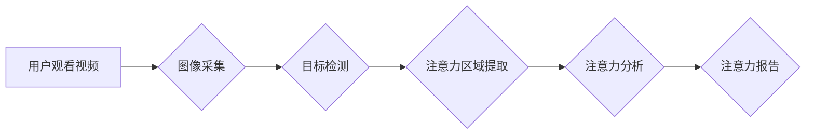

                 

## 计算机视觉技术在注意力追踪中的应用

> 关键词：计算机视觉、注意力追踪、眼动追踪、深度学习、目标检测、图像处理、人机交互

## 1. 背景介绍

注意力是认知过程的核心，它指我们对特定信息或刺激的集中和选择性关注。注意力追踪技术旨在记录和分析个体对视觉信息的关注模式，从而揭示其认知过程、行为模式和潜在的心理状态。传统的注意力追踪方法主要依赖于眼动追踪技术，但眼动追踪设备昂贵、易受干扰，且无法捕捉脑电信号等更深层的认知信息。近年来，随着计算机视觉技术的飞速发展，基于计算机视觉的注意力追踪方法逐渐成为研究热点。

## 2. 核心概念与联系

### 2.1  注意力追踪

注意力追踪是指记录和分析个体对视觉信息的关注模式，包括：

* **眼动追踪:** 记录眼球运动轨迹，分析注视点、停留时间、扫视路径等信息。
* **热力图:** 通过统计用户注视点分布，生成热力图，直观地展示用户关注区域。
* **眼球动能分析:** 分析眼球运动的速率、方向和幅度，识别用户对特定信息的兴趣程度。

### 2.2  计算机视觉

计算机视觉是赋予计算机“看”的能力，它利用图像处理、模式识别和机器学习等技术，使计算机能够理解和解释图像信息。

### 2.3  注意力追踪与计算机视觉的结合

计算机视觉技术为注意力追踪提供了新的可能性，可以利用图像分析、目标检测、深度学习等方法，从图像中提取用户关注信息，并进行更深入的分析。

**Mermaid 流程图:**



## 3. 核心算法原理 & 具体操作步骤

### 3.1  算法原理概述

基于计算机视觉的注意力追踪算法主要分为以下几类：

* **基于热力图的算法:** 通过统计用户注视点分布，生成热力图，分析用户关注区域。
* **基于眼动轨迹的算法:** 利用眼动追踪数据，分析用户注视点、停留时间、扫视路径等信息，识别用户对特定信息的兴趣程度。
* **基于深度学习的算法:** 利用深度学习模型，从图像中提取用户关注特征，并进行注意力预测。

### 3.2  算法步骤详解

以基于深度学习的注意力追踪算法为例，其具体操作步骤如下：

1. **数据采集:** 收集用户观看视频或图像时的眼动追踪数据和相应的图像数据。
2. **数据预处理:** 对眼动追踪数据进行去噪处理，并将其转换为与图像数据相匹配的格式。
3. **模型训练:** 利用深度学习模型，训练一个注意力预测模型。模型输入图像数据，输出用户注意力分布图。
4. **模型评估:** 使用测试数据评估模型的性能，并进行参数调优。
5. **注意力追踪:** 将训练好的模型应用于新的图像数据，预测用户注意力分布图。

### 3.3  算法优缺点

**优点:**

* **精度高:** 深度学习模型能够学习到更复杂的注意力特征，提高注意力预测精度。
* **实时性强:** 基于深度学习的算法可以实现实时注意力追踪。
* **非侵入性:** 不需要佩戴特殊的设备，可以更方便地收集用户注意力数据。

**缺点:**

* **数据需求量大:** 深度学习模型需要大量的训练数据，数据采集成本较高。
* **计算资源消耗大:** 训练深度学习模型需要大量的计算资源。
* **模型解释性差:** 深度学习模型的内部机制较为复杂，难以解释其注意力预测结果。

### 3.4  算法应用领域

基于计算机视觉的注意力追踪算法在以下领域具有广泛的应用前景：

* **用户体验优化:** 分析用户对网站、应用程序和产品的注意力模式，优化用户界面设计和交互体验。
* **教育领域:** 评估学生对学习内容的理解程度，提供个性化学习建议。
* **医疗诊断:** 分析患者对医学图像的注意力模式，辅助医生进行诊断和治疗。
* **广告营销:** 了解用户对广告的注意力模式，优化广告投放策略。

## 4. 数学模型和公式 & 详细讲解 & 举例说明

### 4.1  数学模型构建

基于深度学习的注意力追踪算法通常采用卷积神经网络 (CNN) 和注意力机制相结合的模型架构。

**CNN:** 用于提取图像特征，例如边缘、纹理和形状。

**注意力机制:** 用于学习用户对图像不同区域的关注程度，并赋予不同区域不同的权重。

### 4.2  公式推导过程

注意力机制的核心是计算每个像素点对最终输出的贡献度。常用的注意力机制包括：

* **Soft Attention:** 使用 softmax 函数将每个像素点的特征向量映射到一个概率分布，表示用户对该像素点的关注程度。

$$
\alpha_i = \frac{exp(e_i^T * w_a)}{\sum_{j=1}^{N} exp(e_j^T * w_a)}
$$

其中：

* $\alpha_i$ 是第 i 个像素点的注意力权重。
* $e_i$ 是第 i 个像素点的特征向量。
* $w_a$ 是注意力权重矩阵。
* $N$ 是图像中像素点的总数。

* **Hard Attention:** 选择一个或多个像素点作为用户关注的中心点，忽略其他像素点的信息。

### 4.3  案例分析与讲解

假设我们有一个图像，其中包含一个红色的苹果。使用 Soft Attention 机制，模型会学习到苹果区域的特征向量更显著，因此苹果区域的注意力权重会更高。

## 5. 项目实践：代码实例和详细解释说明

### 5.1  开发环境搭建

* Python 3.x
* TensorFlow 或 PyTorch 深度学习框架
* OpenCV 图像处理库

### 5.2  源代码详细实现

```python
import tensorflow as tf
from tensorflow.keras.models import Model
from tensorflow.keras.layers import Input, Conv2D, MaxPooling2D, Flatten, Dense, Reshape

# 定义注意力模型
def build_attention_model():
    input_tensor = Input(shape=(image_height, image_width, 3))
    x = Conv2D(32, (3, 3), activation='relu')(input_tensor)
    x = MaxPooling2D((2, 2))(x)
    x = Conv2D(64, (3, 3), activation='relu')(x)
    x = MaxPooling2D((2, 2))(x)
    x = Flatten()(x)
    x = Dense(128, activation='relu')(x)
    output_tensor = Dense(image_height * image_width, activation='softmax')(x)
    model = Model(inputs=input_tensor, outputs=output_tensor)
    return model

# 训练模型
model = build_attention_model()
model.compile(optimizer='adam', loss='categorical_crossentropy', metrics=['accuracy'])
model.fit(train_images, train_labels, epochs=10)

# 使用模型进行注意力追踪
attention_map = model.predict(test_image)
```

### 5.3  代码解读与分析

* 该代码首先定义了一个注意力模型，使用 CNN 和 Soft Attention 机制。
* 模型输入图像数据，输出每个像素点的注意力权重。
* 然后，代码训练模型，并使用训练好的模型进行注意力追踪。

### 5.4  运行结果展示

运行结果将生成一个注意力热力图，直观地展示用户对图像的关注区域。

## 6. 实际应用场景

### 6.1  用户体验优化

* 网站设计: 分析用户对网站不同区域的关注模式，优化布局和导航设计，提高用户体验。
* 应用程序设计: 分析用户对应用程序不同功能的关注模式，优化功能设计和交互流程，提高用户满意度。

### 6.2  教育领域

* 学习内容评估: 分析学生对学习内容的理解程度，识别学生对哪些内容感兴趣或困惑，提供个性化学习建议。
* 在线教育平台: 利用注意力追踪技术，开发更具互动性和吸引力的在线教育课程，提高学生学习兴趣和效率。

### 6.3  医疗诊断

* 医学图像分析: 分析医生对医学图像的关注模式，识别医生关注的关键区域，辅助医生进行诊断和治疗。
* 疾病早期诊断: 通过分析患者对健康信息和疾病症状的注意力模式，识别潜在的疾病风险，进行早期干预。

### 6.4  未来应用展望

* **增强现实 (AR) 和虚拟现实 (VR):** 利用注意力追踪技术，增强 AR 和 VR 体验，提供更个性化和沉浸式的交互体验。
* **自动驾驶:** 分析驾驶员对道路和交通状况的注意力模式，提高自动驾驶系统的安全性。
* **人机交互:** 开发更智能和人性化的交互系统，例如，根据用户的注意力模式，自动调整系统界面和内容。

## 7. 工具和资源推荐

### 7.1  学习资源推荐

* **书籍:**
    * Deep Learning by Ian Goodfellow, Yoshua Bengio, and Aaron Courville
    * Computer Vision: Algorithms and Applications by Richard Szeliski
* **在线课程:**
    * Coursera: Deep Learning Specialization
    * Udacity: Computer Vision Nanodegree

### 7.2  开发工具推荐

* **TensorFlow:** 开源深度学习框架，提供丰富的工具和资源。
* **PyTorch:** 开源深度学习框架，以其灵活性和易用性而闻名。
* **OpenCV:** 开源图像处理库，提供各种图像分析和处理功能。

### 7.3  相关论文推荐

* **Attention Is All You Need** (Vaswani et al., 2017)
* **Deep Learning for Computer Vision** (Krizhevsky et al., 2012)
* **A Survey on Attention Mechanisms** (Wang et al., 2018)

## 8. 总结：未来发展趋势与挑战

### 8.1  研究成果总结

基于计算机视觉的注意力追踪技术取得了显著进展，能够准确地识别用户对视觉信息的关注模式，并应用于多个领域。

### 8.2  未来发展趋势

* **更准确的注意力预测:** 研究更先进的深度学习模型和注意力机制，提高注意力预测精度。
* **更细粒度的注意力分析:** 分析用户对图像不同区域的细粒度关注模式，例如，识别用户对特定对象的关注程度。
* **多模态注意力追踪:** 将计算机视觉与其他模态信息，例如音频和文本，相结合，进行更全面的注意力分析。

### 8.3  面临的挑战

* **数据标注成本高:** 深度学习模型需要大量的标注数据，数据标注成本较高。
* **模型解释性差:** 深度学习模型的内部机制较为复杂，难以解释其注意力预测结果。
* **隐私保护问题:** 注意力追踪技术可能会收集到用户的敏感信息，需要考虑隐私保护问题。

### 8.4  研究展望

未来，基于计算机视觉的注意力追踪技术将继续发展，并应用于更多领域，例如，个性化教育、医疗诊断、自动驾驶等。


## 9. 附录：常见问题与解答

**Q1: 基于计算机视觉的注意力追踪技术与眼动追踪技术相比，有哪些优势？**

**A1:** 基于计算机视觉的注意力追踪技术无需佩戴特殊的设备，更加方便、非侵入性强。同时，它可以分析图像信息，并进行更深入的分析，例如，识别用户对特定对象的关注程度。

**Q2: 如何解决深度学习模型需要大量标注数据的难题？**

**A2:** 可以利用数据增强技术，例如图像旋转、缩放、翻转等，生成更多训练数据。此外，也可以探索无监督学习和迁移学习等方法，减少对标注数据的依赖。

**Q3: 如何解决模型解释性差的问题？**

**A3:** 可以利用可解释机器学习 (XAI) 技术，例如，注意力可视化、特征重要性分析等，解释模型的决策过程。

**作者：禅与计算机程序设计艺术 / Zen and the Art of Computer Programming**<end_of_turn>

